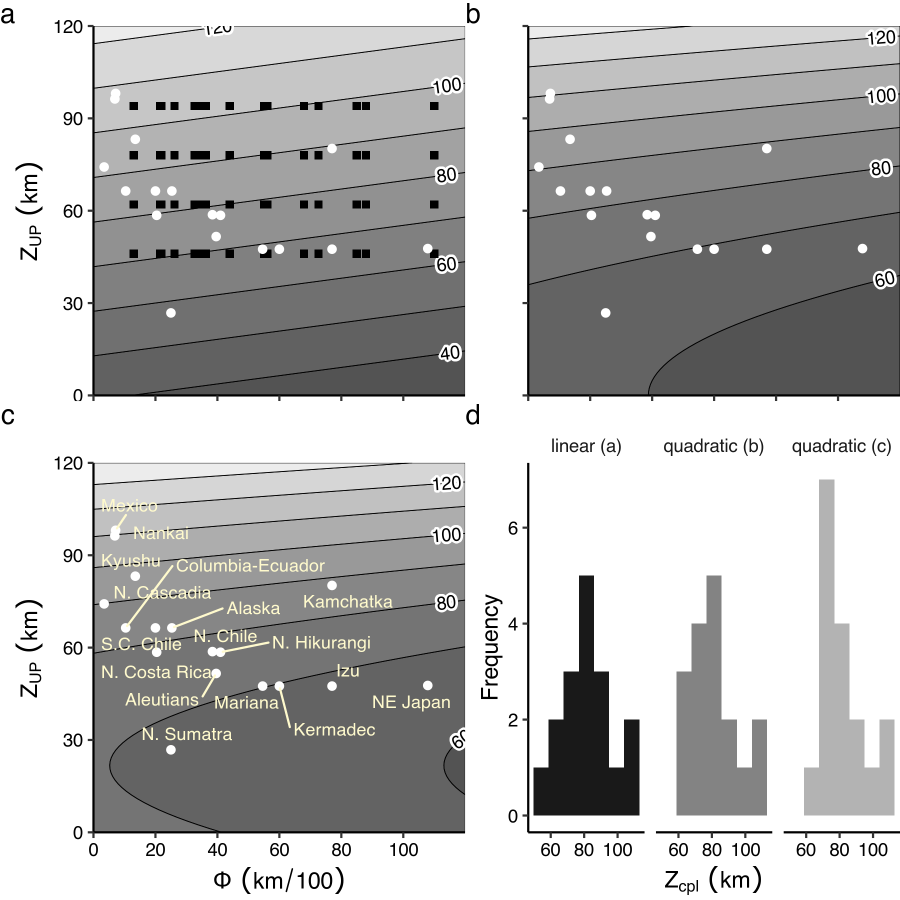
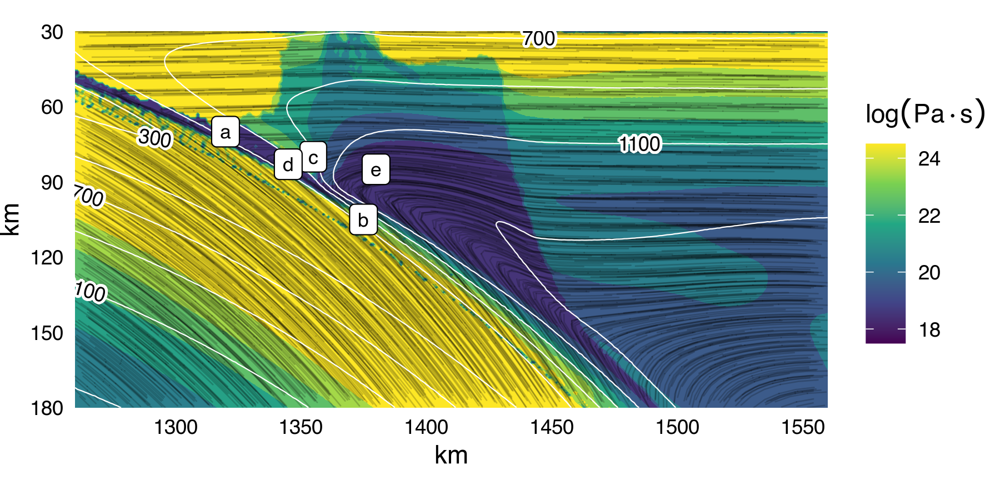
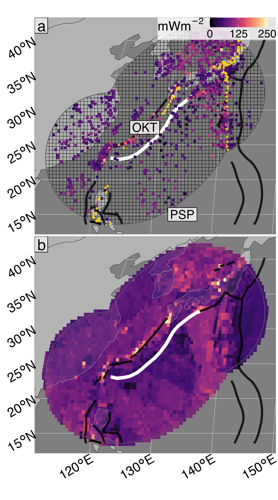
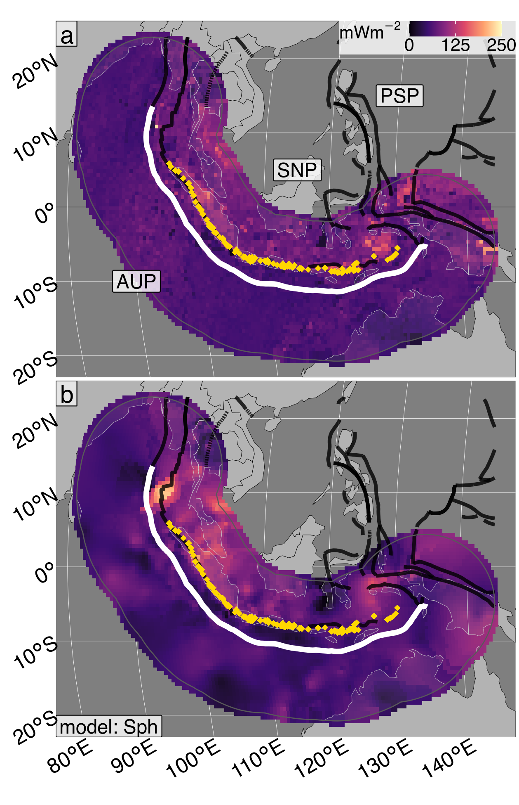

```{r settings, echo=FALSE, include=FALSE}
# Use system's latexmk
options(tinytex.latexmk.emulation = FALSE)
options(knitr.kable.NA = '')
# Some recommended settings
knitr::opts_chunk$set(
  echo = F,
  message = F,
  warning = F,
  fig.pos = 'htbp',
  out.extra = '',
  fig.align = 'center',
  out.width = '100%'
)
suppressMessages({
  library(dplyr)
  library(tibble)
  library(purrr)
  library(knitr)
  library(kableExtra)
  library(scales)
})
```

# Introduction {#chpt1}

\markboth{Chapter 1: Introduction}{Chapter 1: Introduction}

> **Keypoints:**
>
> - Proxy datasets are key for inference about geodynamics deep in \glspl{sz}
>
> - Computation leverages large data to infer, build, and test geodynamic models

\cleardoublepage


# Effects of Thermo-kinematic Boundary Conditions on Plate Coupling in Subduction Zones {#chpt2}

\markboth{Chapter 2: Coupling Depths}{Chapter 2: Coupling Depths}

```{r loadChpt2, echo=FALSE}
suppressMessages({
  load('assets/r/chpt2/chpt2_data.RData')
  load('assets/r/chpt2/chpt2_regressions.RData')
})
```

> **Keypoints:**
>
> - Mechanical coupling responds strongly to \gls{upt}
>
> - Inverting \glsfirst{shf} allows \glsfirst{cd} estimation
>
> - Globally consistent \gls{shf} implies consistent \gls{upt}, and thus uniform \glspl{cd}

## Abstract {#chpt2Abstract}

Deep mechanical coupling between converging plates is implicated in plate motions, crustal deformation, seismic cycles, arc magmatism, detachment of subducting material, and is considered a key feature of \glsfirst{sz} geodynamics. This study uses two-dimensional numerical models of oceanic-continental convergent margins to investigate effects of \glsfirst{tkbc} on coupling---specifically focusing on thermal parameter ($\Phi$) and \glsfirst{upt}. Numerical experiments implement coupling by including the metamorphic (de)hydration reaction $antigorite \allowbreak \Leftrightarrow olivine + orthopyroxene + H_{2}O$ in the upper-plate mantle. Visualizing \glsfirst{pts} fields show thermal feedbacks regulating \glsfirst{cd} dynamically with strong responses to \gls{upt} and weak responses to $\Phi$. The results imply estimation of \gls{cd} is possible by inverting \gls{upt} from \glsfirst{shf}. Moreover, \gls{shf} sampled from the backarc region near 17 active \glspl{sz} imply consistent \gls{upt}, and thus uniform \glspl{cd} among \glspl{sz}.

## Introduction {#chpt2Intro}

Subduction geodynamics are largely defined by plate motions and mechanical behaviour along the plate interface. For example, a transition from mechanically decoupled (moving differentially with respect to each other) to coupled plates (moving with the same local velocity) dramatically increases temperature by inducing mantle circulation in the upper plate [@peacock1994; @peacock1996]. Observations from numerical experiments and forearc \gls{shf} imply coupling transitions occurring globally within a narrow range of depths in modern \glspl{sz} (70-80 $km$). Further, coupling appears essentially unresponsive to important \gls{tkbc}, including oceanic-plate age, convergence velocity, and subduction geometry [@furukawa1993; @wada2008; @wada2009]. While uniform \glspl{cd} among \glspl{sz} are inferred from different datasets, this phenomenon remains curious and unconfirmed to a large extent. To understand \gls{sz} geodynamics, it is essential to understand why modern \glspl{sz} appear to achieve similar \glspl{cd} despite differences in their physical characteristics.

Notwithstanding, many numerical geodynamic models use \glspl{cd} of 70-80 $km$ as a boundary condition [@abers2017; @currie2004; @syracuse2010; @vankeken2011; @vankeken2018; @wada2012; @gao2014; @wilson2014], although not exclusively [e.g. 40-56 $km$, @england2010; @peacock1996]. Similar \glspl{cd} among \glspl{sz} is an attractive hypothesis for at least two reasons. First, it helps explain a relatively narrow range of depths to subducting oceanic-plates beneath volcanic arcs [@england2004; @syracuse2006] as mechanical coupling is expected to be closely associated with the onset of flux melting. Second, mechanical coupling is required to detach crustal fragments from the subducting plate [@agard2016], so uniform \glspl{cd} may also help explain why maximum pressures recorded by subducted oceanic material worldwide is $\leq$ 2.3-2.5 $GPa$ [roughly 80 $km$, @agard2009; @agard2018].

The location and extent of mechanical coupling along the plate interface is implicated in myriad geodynamic phenomena, including seismicity, metamorphism, volatile flux, volcanism, plate motions, and crustal deformation [@cizkova2013; @gonzalez2016; @hirauchi2010; @peacock1990; @peacock1991; @peacock1993; @peacock1996; @peacock1999a; @hacker2003; @vankeken2011; @grove2012; @gao2017]. Consequently, the mechanics of coupling have been extensively studied and discussed. Coupling fundamentally depends on the strength (viscosity) of materials above, within, and below the plate interface. Water flux from compaction and dehydration of hydrous minerals with increasing \glsfirst{pt} forms layers of low viscosity sheet silicates near the plate interface. Transmission of shear stress between plates is inhibited by formation of talc and serpentine in the shallow upper-plate mantle [@peacock1999a]. Lack of traction along the interface, combined with cooling from the subducting plate surface, ensures a positive feedback between hydrous mineral formation and mechanical decoupling. Experimentally determined flow laws, petrologic observations, and geophysical observations all support the plausibility of this conceptual model of subduction interface behaviour [e.g., @agard2016; @agard2018; @gao2014; @peacock1999a].

Experimental control over important \gls{tkbc} makes numerical modelling essential for investigating such complex geodynamic environments. @wada2009 previously investigated the effects of $\Phi$ on \glspl{cd} by numerically simulating 17 active \glspl{sz}. Among other \gls{tkbc}, their models specify convergence rate, subduction geometry, thermal structure of oceanic- and overriding-plates, and degree of coupling along the subduction interface. Notably, their experiments control for interface rheology and discriminate best-fit \glspl{cd} based on observed forearc \gls{shf}.

This study similarly specifies \gls{tkbc} to numerically simulate the range of modern \gls{sz} systems, but regulates interface rheology dynamically by implementing metamorphic reactions that respond to evolving \gls{pts} fields. Subduction geometry and \gls{cd} are not fully determined features, in other words, but rather spontaneous model outcomes within the range of specified boundary conditions discussed in section \@ref(numMethods). As in previous studies [e.g., @ruh2015], rheological effects of the dehydration reaction $antigorite \allowbreak \Leftrightarrow olivine + orthopyroxene + H_{2}O$ are implemented to drive mechanical coupling. An abrupt viscosity increase accompanies antigorite (serpentine) destabilization, thereby inducing mechanical coupling, as defined by empirically-determined flow laws used in the experiments (Table \@ref(tab:materials)).

This chapter focuses on two fundamental questions. How does \gls{cd} respond to $\Phi$ *and* \gls{upt}? And how stable is \gls{cd} through time? First, 64 convergent margins with variable \gls{upt} and $\Phi$ are numerically simulated and mechanical plate coupling is observed. Thermal feedbacks within the system are visualized in terms of mantle temperature, viscosity, and velocity fields and \gls{cd} responses to a range of $\Phi$ and \gls{upt} are quantified using multi-variate linear regression. Three different regression models are then used to estimate \glspl{cd} for 17 active \glspl{sz}. \gls{cd} estimates fall within similarly narrow ranges, regardless of regression model form. Implications and questions about \gls{upt} and \gls{cd} uniformity among \glspl{sz} are finally discussed before further investigation into \gls{shf} in Chapter \@ref(chpt3).

## Numerical modelling methods {#numMethods}

This study simulates converging oceanic-continental plates, where an ocean basin is being consumed by subduction at a continental margin (Figure \@ref(fig:init)). Initial conditions are modified from previous numerical experiments of active margins [@sizova2010; @gorczyk2007] using the code `I2VIS` [@gerya2003], although plate coupling was not the focus of their studies. Identical rheologic model, material properties (Table\@ref(tab:materials)), and hydration/melt model (Table \@ref(tab:melts) & Appendix \@ref(deHydration)) as @sizova2010 are used. However, the version of `I2VIS` in this study differs from @sizova2010 in its initial setup, overall dimension, resolution, continental geotherm, dehydration model, and left boundary condition (origin of new oceanic lithosphere). Differences are outlined in this section and in Appendix \@ref(deHydration). Sixty-four `I2VIS` models constructed with varying convergence rates ($\vec{v}_{conv}$), oceanic-plate ages ($t_{OP}$), and \glspl{upt} (Figure \@ref(fig:params)) were ran on the [Euler cluster](https://scicomp.ethz.ch/wiki/Euler) at ETH, Zürich until achieving at least 10 $Ma$ of subduction.


\begin{landscape}


```{r init, fig.cap='Initial model configuration and boundary conditions. (a) A free sedimentation/erosion boundary at the surface is maintained by implementing a layer of "sticky" air and water, and an infinite-like open boundary at the bottom allows for spontaneous oceanic-plate descent and subduction angle. Left and right boundaries are free slip and thermally insulating. Initial material distribution includes 7 $km$ of oceanic crust (2 $km$ basalt, 5 $km$ gabbro), 1 $km$ of oceanic sediments, and 35 $km$ of continental crust, thinning ocean-ward. (b) Oceanic lithosphere is continually created at the left boundary. The oceanic geotherm is calculated using a half-space cooling model and the continental geotherm is calculated using a one-dimensional steady-state conductive cooling model to 1300 $^{\\circ}C$. The base of the upper plate lithosphere ($Z_{UP}$) is defined by visualizing viscosity and generally coincides with the 1100 $^{\\circ}C$ isotherm. (c) Oceanic crust is bent under loading from passive margin sediments, and a weak zone extends through the lithosphere to help induce subduction. Convergence velocities are imposed at stationary, high-viscosity regions far from the trench. Rock type colors are: [1] air, [2] water, [4,5] sediments, [6,7] felsic crust, [8] basalt, [9] gabbro, [10,11] dry mantle, [12] hydrated mantle, [14] serpentinized mantle.', fig.scap='Initial model configuration and boundary conditions'}

include_graphics('assets/figs/chpt2/fig1.png')

```


\end{landscape}


### Initial setup and boundary conditions {#numBCs}

Simulations are 2000 $km$ wide and 300 $km$ deep (Figure \@ref(fig:init)). In the model domain, three governing equations of heat transport, momentum, and continuity are discretized and solved with a conservative finite-difference marker-in-cell approach on a fully staggered grid as outlined in @gerya2003. Numerical resolution is non-uniform with higher resolution (1 $km$ x 1 $km$) in a 600 $km$ wide area surrounding the contact between the oceanic-plate and continental margin, then gradually changing to lower resolution towards the model boundaries (5 $km$ x 1 $km$, x- and z-directions, respectively). The left and right boundaries are free-slip and thermally insulating (Figure \@ref(fig:init)a, b). Implementation of "sticky" air and water allows for a free topographical surface with a simple linear sedimentation and erosion model. The lower boundary is open to allow for oceanic-plate descent with a spontaneous subduction angle [@burg2005].

A horizontal convergence force is applied to both plates in a rectangular region far from the continental margin (Figure \@ref(fig:init)c). An initial weak layer cutting the lithosphere permits subduction to initiate. The high-viscosity ($\eta = 10^{25}~Pa\cdot s$) rectangular convergence regions apply constant horizontal velocities without deforming the lithosphere. Subduction angle is governed by free-motion of the subducting plate. Similarly, subduction velocity varies with time in response to extension or shortening of the overriding plate. $\Phi$ is thus calculated as the product of the horizontal convergence velocity and the oceanic-plate age [c.f. @mckenzie1969]. For convenience and consistency with the literature, this study presents $\Phi$ in units of $km$/100 (Figure \@ref(fig:params)a).

```{r params, fig.cap='Range of thermo-kinematic boundary conditions used in numerical experiments. (a) Thermal parameters (grayscale) range from 13 to 110 $km/100$ and broadly reflect the distribution of oceanic-plate ages and convergence velocities in modern \\glspl{sz}. Model names include the prefix "cd" for "coupling depth" with increasing alphabetic suffixes. Note that neither axes are continuous. (b) Upper plate thickness ($Z_{UP}$) is defined by a range of continental geotherms. Geotherms were constructed using a one-dimensional steady-state conductive cooling model with $T(z=0)$ = 0 $^{\\circ}C$, $\\vec{q}(z=0)$ = 59, 63, 69, 79 $mW/m^2$, and constant radiogenic heating of 1.0 $\\mu W/m^3$ for a 35 $km$-thick crust and 0.022 $\\mu W/m^3$ for the mantle. Continental geotherms are calculated up to 1300 $^{\\circ}$C with a constant 0.5 $^{\\circ}C/km$ gradient (the mantle adiabat) extending to the base of the model domain.', fig.scap='Range of boundary conditions used in numerical experiments'}

include_graphics('assets/figs/chpt2/fig2.png')

```

### Calculating geotherms and defining lithospheric thickness {#numGeotherms}

Oceanic crust is modeled as 1 $km$ of sediment cover overlying 2 $km$ of basalt and 5 $km$ of gabbro (Figure \@ref(fig:init)a). Oceanic lithosphere is continually made at a pseudo-mid-ocean ridge at the left boundary of the model (Figure \@ref(fig:init)b). An enhanced vertical cooling condition applied at 200 $km$ from left boundary adjusts for the proper oceanic-plate age, and therefore its lithospheric thickness as it enters the trench [@agrusta2013]. Oceanic-plate ages range from 32.6 to 110 $Ma$ and convergence velocities from 40 to 100 $km/Ma$ (Figure \@ref(fig:params)a). This range of parameters broadly reflects the middle-range of modern global subduction systems [@syracuse2006].

Initial continental geotherms are determined by solving the heat flow equation in one-dimension to 1300 $^{\circ}C$ (Figure \@ref(fig:params)b). This study assumes a fixed temperature of 0 $^{\circ}C$ at the surface, constant radiogenic heating of 1 $\mu W/m^{3}$ in the 35 $km$-thick continental crust, 0.022 $\mu W/m^{3}$ in the mantle, with thermal conductivities of 2.3 $W/mK$ and 3.0 $W/mK$ for the continental crust and mantle, respectively. Above, 1300 $^{\circ}C$, temperature is assumed to constantly increase by 0.5 $^{\circ}C/km$ (the mantle adiabat) to the base of the model domain.

Many studies define the base of the continental lithosphere at the 1300 $^{\circ}C$ isotherm, but it can be determined directly by visualizing viscosity and strain rate as the model progresses. The mechanical base of the lithosphere ($Z_{UP}$) in the models generally occurs near the 1100 $^{\circ}C$ isotherm---characterized by a rapid decrease in viscosity and increase in strain rate (Figures \@ref(fig:cdfStep1), \@ref(fig:cdfStep2), \@ref(fig:cdfStep3)). As such, this study considers oceanic and continental lithospheres as mechanical layers defined by viscosity, rather than defined merely by temperature. $Z_{UP}$ corresponding to backarc surface heat flow of 59, 63, 69, and 79 $mW/m^{2}$ are used in this study (Figure \@ref(fig:params)b).

### Metamorphic (de)hydration reactions {#numHydration}

Using Lagrangian markers [@harlow1962; @harlow1964] to store and update material properties and \gls{pts} fields allows for straight-forward numerical implementation of metamorphic reactions. This approach is key to regulating mechanical coupling dynamically in \gls{sz} simulations. For example, dehydration (eclogitization) of the oceanic-plate and (de)stabilization of serpentine in the upper-plate mantle may be effectively modelled by tracing marker \gls{ptt} paths while changing marker properties according to thermodynamically-stable mineral assemblages [e.g., @connolly2005]. For computational efficiency, however, water contents in this study are not computed by iteratively solving thermodynamic systems of equations. Instead, gradual eclogitization of oceanic crust is computed as a linear function of lithostatic pressure to a maximum depth of 150 $km$, or temperature of 1427 $^\circ C$, while including garnet-in and plagioclase-out reactions defined by @ito1971. Mantle (de)hydration is computed according reactions boundaries defined by @schmidt1998 with a maximum water content of 2 $wt.\%$ (explained below). This approach effectively simulates continuous influx of water to the upper-plate mantle with relatively low computational cost, beginning with compaction and release of connate water at shallow depths, followed by a sequence of reactions consuming major hydrous phases (chlorite, lawsonite, zoisite, chloritoid, talc, amphibole, and phengite) in different parts of the hydrated basaltic crust [@schmidt1998; @vankeken2011].

The extent of metamorphic reaction effects on mechanical coupling, and the exact (de)hydration reaction(s) likely responsible, are unknown. However, formation of brucite and serpentine from dry olivine near the plate interface are inferred to strongly regulate mechanical behaviour [@hyndman2003; @peacock1999a; @agard2016]. Brucite notably breaks down at much lower temperatures than serpentine [@schmidt1998], so serpentine (de)stabilization arguably represents the key transition from a weak-to-strong upper-plate mantle deep in \glspl{sz}. This study elects an implementation of serpentine (de)hydration for this reason. The reaction is assumed to be abrupt and discontinuous, which is a fine approximation for near-endmember compositions like (Mg-rich) peridotites. The \gls{pt} conditions of the reaction $antigorite \Leftrightarrow olivine + orthopyroxene + H_{2}O$ were numerically implemented by the following equation [after @schmidt1998]:

\begin{equation}
  T_{atg-out}(z)=
  \begin{cases}
    751.50+6.008\times10^{-3}z-3.469\times10^{-8}z^2,& \text{for } z < 63000m \\
    1013.2-6.039\times10^{-5}z-4.289\times10{-9}z^2,& \text{for } z>63000m
  \end{cases}
  (\#eq:antstab)
\end{equation}

where $z$ is the depth of a marker from the surface in meters and $T$ is temperature in Kelvins. This reaction boundary is consistent to within 25 $^{\circ}C$ of more recent experiments by @shen2015. Markers with internal temperature exceeding $T_{atg-out}(z)$ spontaneously form $olivine + orthopyroxene + H_{2}O$ and release their crystal-bound water. This implementation tacitly assumes thermodynamic equilibrium and is common to many versions of `I2VIS`.

Oceanic-plates of different ages are also tacitly assumed to dehydrate similarly with the above implementation. However, older (colder) oceanic-plates are expected to carry water to greater depths than younger (warmer) plates because of relatively delayed water-releasing reactions [@peacock1996]. Abrupt water release with serpentine dehydration (Equation \@ref(eq:antstab)) was tested to model deep water retention in cold oceanic-plates. Mechanical coupling behaviour was indistinguishable from gradual water release models. This implies rates of water release are less important than the depth of serpentine stability. Explicitly modelling other major dehydration reactions are thus unlikely to significantly affect mechanical coupling behaviour, yet likely to introduce numerical artifacts at great computational cost. A simplified gradual water release model for all oceanic-plates is therefore preferred.

Water released by rock forms discrete fluid particles that migrate with relative velocities defined by local deviatoric (non-lithostatic) pressure gradients [see Appendix \@ref(deHydration), @faccenda2009]. Fluid velocities are scaled by a 10 $cm/yr$ vertical percolation velocity to account for purely lithostatic pressure gradients in the mantle [@gorczyk2007]. Fluid particles migrate until encountering rock that can consume additional water by equilibrium hydration or melting reactions, (Equation \@ref(tab:melts)).

The shallow upper-plate mantle can theoretically store large amounts of water as serpentine may contain up to 13 $wt.\%$ water [@reynard2013] and is generally stable at shallow mantle conditions. Thermodynamic models predict 8 $wt.\%$ water in the shallow upper-plate mantle [@connolly2005]. However, seismic studies suggest most shallow upper-plate mantles are only partially serpentinized (< 20-40%), equating to water contents of approximately 3-6 $wt.\%$ [@abers2017; @carlson2003]. Many modes of mantle hydration are documented or inferred, including evidence for channelized fluid flow within ophiolites exhumed from \glspl{sz} [@angiboust2012a; @angiboust2014; @zack2007; @plumper2017]. This study limits mantle wedge hydration to $\leq$ 2 $wt.\%~H_{2}O$ and assumes any excess $H_{2}O$ exits the system through channelized fluid flow during plastic or brittle deformation [@davies1999].

```{r materials}
readr::read_csv('assets/r/chpt2/materials.csv', show_col_types=F) %>%
dplyr::mutate(thermalConductivityConstant3=scientific(thermalConductivityConstant3)) %>%
kable(
  col.names = c(
    'Material',
    '$\\rho$',
    '$H_2O$',
    'Flow Law',
    '$log_{10}A$',
    '$E$',
    '$V$',
    '$n$',
    '$\\phi$',
    '$\\sigma_{crit}$',
    '$k_1$',
    '$k_2$',
    '$k_3$',
    '$H$'
  ),
  caption = 'Material properties used in numerical experiments',
  escape = F,
  booktabs = T,
  format = 'latex'
) %>%
kable_styling(latex_options = c('scale_down', 'striped')) %>%
kable_classic() %>%
footnote(
  general_title = '',
  general = c(
    '\\\\uline{\\\\textit{key}}: $\\\\rho$: density $[kg/m^3]$, $H_2O$: water content $[wt.\\\\%]$, $A$: material constant, $E$: activation energy $[kJ/mol]$, $V$: activation volume $[J/MPa\\\\cdot mol]$, $n$: power law exponent, $\\\\phi$: internal friction angle, $\\\\sigma_{crit}$: critical stress $[MPa]$, $H$: heat production $[\\\\mu W/m^3]$',
    '\\\\uline{\\\\textit{constants}}: $C_p$: heat capacity = $1~[kJ/kg]$, $\\\\alpha$: expansivity = $2\\\\times 10^{-5}~[1/K]$, $\\\\beta$: compressibility = $0.045~[1/MPa]$',
    '\\\\uline{\\\\textit{thermal conductivity}}: $k$ $[W/m \\\\cdot K]=(k_1+\\\\frac{k_2}{T+77})\\\\times exp(k_3 \\\\cdot P)$ with $P$ in $[MPa]$ and $T$ in $[K]$',
    '\\\\uline{\\\\textit{references}}: Turcotte \\\\& Schubert (2002), Ranalli (1995), Hilairet et al. (2007), Karato \\\\& Wu (1993)'
  ),
  escape = F,
  threeparttable = T
)
```

### Rheologic model {#rheologicModel}

Contributions from dislocation and diffusion creep are accounted for by computing a composite rheology for ductile rocks, $\eta_{effective}$:

\begin{equation}
  \begin{aligned}
    \frac{1}{\eta_{effective}} = \frac{1}{\eta_{diff}} + \frac{1}{\eta_{disl}}
  \end{aligned} 
  (\#eq:ductile)
\end{equation}

where $\eta_{diff}$ and $\eta_{disl}$ are effective viscosities for diffusion and dislocation creep.

For the crust and serpentinized mantle, $\eta_{diff}$ and $\eta_{disl}$ are computed as:

\begin{equation}
  \begin{aligned}
    \eta_{diff} &= \frac{1}{2} \ A \ \sigma_{crit}^{1-n} \ \exp\left[\frac{E+PV}{RT}\right] \\
    \eta_{disl} &= \frac{1}{2} \ A^{1/n} \ \dot{\varepsilon}_{II}^{(1-n)/n} \ \exp\left[\frac{E+PV}{nRT}\right]
  (\#eq:crust)
  \end{aligned}
\end{equation}

where $R$ is the gas constant, $P$ is pressure, $T$ is temperature in $K$, ${\dot{\varepsilon}}_{II} = \sqrt{\frac{1}{2}{{\dot{\varepsilon}}_{ij}}^{2}}$ is the square root of the second invariant of the strain rate tensor, $\sigma_{crit}$ is an assumed diffusion-dislocation transition stress, and $A$, $E$, $V$ and $n$ are the material constant, activation energy, activation volume, and stress exponent, respectively [Table \@ref(tab:materials), @hilairet2007; @ranalli1995].

For the mantle, $\eta_{diff}$ and $\eta_{disl}$ are computed as [@karato1993]:

\begin{equation}
  \begin{aligned}
    \eta_{diff} &= \frac{1}{2} \ A^{-1} \ G \ \left[\frac{h}{b}\right]^{m/n} \ \exp\left[\frac{E+PV}{RT}\right] \\
    \eta_{disl} &= \frac{1}{2} \ A^{-1/n} \ G \ \dot{\varepsilon}_{II}^{(1-n)/n} \ \exp\left[\frac{E+PV}{nRT}\right]
  \end{aligned}
  (\#eq:mantle)
\end{equation}

where $b$=$5\times10^{-10}$ $m$ is Burgers vector, $G$=$8\times10^{10}$ $Pa$ is shear modulus, $h$=$1\times10^{-3}$ $m$ is the assumed grain size, $m=2.5$ is the grain size exponent, and the other flow law parameters are given in Table \@ref(tab:materials). Our models limited viscosity for all rocks at $\eta_{min} = 10^{17}\ Pa \cdot s$ and $\eta_{max} = 10^{25}\ Pa \cdot s$.

An effective visco-plastic rheology is achieved by limiting $\eta_{effective}$ with a brittle (plastic) yield criterion:

\begin{equation}
  \eta_{effective} \leq \frac{C + \phi \ P}{2 \ \dot{\varepsilon}_{II}}
  (\#eq:plastic)
\end{equation}

where $\phi$ is the internal friction coefficient, $C$ cohesive strength at $P$ = 0, and ${\dot{\varepsilon}}_{ij}$ is the strain rate tensor (Table \@ref(tab:materials)).

### Visualization and determination of coupling depth

The rheologic model and \gls{tkbc} described in the previous sections always results in plate motions towards the left boundary (slab-rollback). Relatively high dip angles and extreme subduction velocities in some high-$\Phi$ experiments cause chaotic behaviour by 10 $Ma$ as the upper-plate is stretched thin and mechanical interference occurs between trench sediments and the high-viscosity convergence region 200 $km$ from the left boundary. Numerical solutions are stable for most experiments, however, reaching quasi-steady state by 5 $Ma$. An additional 5 $Ma$ is allowed to ensure stable geodynamics before observing \gls{cd}. Surface heat flow, rock type, temperature, viscosity, strain rate, shear heating, and velocity fields are visualized at approximately 10 $Ma$ (e.g., Figure \@ref(fig:comp)) for all 64 experiments to assess geodynamics and solution stability (Figure \@ref(fig:antDepth)).

```{r comp, fig.cap='Visualizing model cdf with a 78 $km$ upper-plate lithosphere at approximately 10 $Ma$. (a) Rock type shows a thin serpentine layer (pink) lubricating the plate interface. Note that low melt volumes are inconspicuous and quickly extracted. (b) Viscosity shows high contrast between the oceanic-plate and serpentinized upper-plate mantle at shallow levels. Viscosity contrast disappears where serpentine becomes unstable. (c) Streamlines show focused mantle flow towards the interface, coinciding with the lower limit of serpentine stability. Note the converging isotherms that imply a feedback between heat transfer, serpentine destabilization, and mechanical coupling. (d) Strain rate shows localized deformation in the serpentine layer along the plate interface. Note that deformation in the upper-plate mantle is restricted to viscous flow beneath the lithosphere and along narrow, subvertical melt conduits. Rock type colors are the same as Figure 1.', fig.scap='Numerical experiment visualization'}

knitr::include_graphics('assets/figs/chpt2/fig3.png')

```

After approximately 10 $Ma$ of subduction \gls{cd} is determined directly from viscosity by finding the approximate area where strength contrasts between serpentinized- and non-serpentinized upper-plate mantle diminishes to $<$ 10$^2$ $Pa \cdot s$. The node nearest to this region is assigned as the \gls{cd}. This study assumes mechanical coupling occurs instantaneously and at a single node. Mechanical coupling in reality must be dispersed across a finite length along the plate interface, however. At the numerical resolution the experiments, coupling-like viscosity contrasts are similar within a small area (approximately 5 $\times$ 5 $km$ or 5 $\times$ 5 nodes), giving a qualitative uncertainty \gls{cd} on the order of 2.5 $km$.

## Results {#chpt2Results}

### Coupling depth estimators {#cdEstimators}

\gls{cd} ($Z_{cpl}$) correlates strongly with \gls{upt} ($Z_{UP}$) and weakly with $\Phi$ across all 64 numerical models (Table \@ref(tab:zcResults), Figures \@ref(fig:results) & \@ref(fig:biv)). The responsiveness of \gls{cd} to $Z_{UP}$ but not to $\Phi$ is a key result of our experiments. The following equation minimizes standard least squares while optimizing the number of parameters, *p value*, and $R^2$ for all possible permutations of the variables $Z_{UP}$ and $\Phi$ in linear and quadratic forms:

\begin{equation}
  Z_{cpl} = 4.95\times 10^{-3}\ Z_{UP}^{2}\ -\ 9.27\times 10^{-2}\ \Phi\ +\ 63.6
  (\#eq:zCpl)
\end{equation}

where $Z_{cpl}$ is coupling depth in $km$ and $\Phi$ is the thermal parameter in $km/100$. Regression summaries show both linear and quadratic models of $Z_{cpl}$ vs. $Z_{UP}$ and $\Phi$ fit experimental results well (Tables \@ref(tab:anova) & \@ref(tab:regSummary)). Equation \@ref(eq:zCpl) represents a statistical model formulated with observations from physics-based simulations of subduction. Equation \@ref(eq:zCpl) is useful for estimating \glspl{cd} in active \glspl{sz} where $\Phi$ is known and $Z_{UP}$ can be inverted from \gls{shf}.

```{r segs}
segs %>%
select(segment, qs, z1100, phi, zc.lin, zc.quad1, zc.quad2) %>%
mutate(
  'phi' = round(phi, 1),
  'zc.lin' = round(zc.lin),
  'zc.quad1' = round(zc.quad1),
  'zc.quad2' = round(zc.quad2)
) %>%
kbl(
  col.names = c(
  'Segment',
  '$\\vec{q}$',
  '$Z_{UP}$',
  '$\\Phi$',
  '$Z_{cpl}^a$',
  '$Z_{cpl}^b$',
  '$Z_{cpl}^c$'
  ),
  caption = 'Estimated coupling depths for active subduction zones',
  escape = F,
  booktabs = T,
  format = 'latex'
) %>%
kable_styling(latex_options = c('striped')) %>%
kable_classic() %>%
footnote(
  general_title = '',
  general = c(
    '\\\\uline{\\\\textit{key}}: $\\\\vec{q}$: average backarc surface heat flow $[mWm^{-2}]$, $Z_{UP}$: upper-pate thickness $[km]$, $\\\\Phi$: thermal parameter = $[km/100]$, $Z_{cpl}$: coupling depth $[km]$',
    '\\\\uline{\\\\textit{estimators}}: a: $[Z_{cpl}=Z_{UP}+\\\\Phi]$, b: $[Z_{cpl}=Z_{UP}^2+\\\\Phi]$, c: $[Z_{cpl}=Z_{UP}+Z_{UP}^2+\\\\Phi]$',
    '\\\\uline{\\\\textit{references}}: Currie \\\\& Hyndman (2006), Wada \\\\& Wang (2009)'),
  threeparttable = T,
  escape = F
)
```

Sensitivity of \gls{cd} to \gls{upt} and $\Phi$ is apparent when visualizing Equation \@ref(eq:zCpl) and other regression models across $Z_{UP}$ and $\Phi$ space \@ref(fig:multiv). Applying Equation \@ref(eq:zCpl) to 17 active \gls{sz} segments (Table \@ref(tab:segs)) gives a wide range of estimated \glspl{cd}, similar to our model simulations. The distribution of estimated \glspl{cd}, however, is relatively narrow and quasi-normal, with a mean of $\sim$ 82 $km$ and standard deviation of 7 $km$ (Figure \@ref(fig:multiv)d).

```{r multiv, fig.cap='Multivariate regressions and estimated coupling depth ($Z_{cpl}$) for 17 active \\gls{sz} segments. Contoured plots show estimated $Z_{cpl}$ (contours) as a function of thermal parameter ($\\Phi$) and upper-plate thickness ($Z_{UP}$) for linear (a) and quadratic (b, c) regressions. The best fit regression is panel b (Equation \\ref{eq:zCpl}, see Tables \\ref{tab:anova} and \\ref{tab:regSummary}). Black squares represent numerical experiments used to fit the contours. White points represent active \\glspl{sz} (Table \\ref{tab:segs}). Contours imply $Z_{cpl}$ depends strongly on $Z_{UP}$, regardless of the regression equation form. Estimated $Z_{cpl}$ for \\glspl{sz} with similar $\\Phi$ are quite different (e.g., Alaska vs. N. Sumatra). Estimated $Z_{cpl}$ are also quite similar for \\glspl{sz} with very different $\\Phi$ (e.g., Kamchatka vs. N. Cascadia). (d) Distributions of estimated $Z_{cpl}$ for 17 active \\glspl{sz} shown in (a), (b), and (c). These 17 segments span a large range of $\\Phi$ but are expected to have a relatively narrow distribution of $Z_{cpl}$ (82 $\\pm$ 14 $km$) according to the regressions in (a), (b), and (c).', fig.scap='Estimated coupling depths for 17 active \\gls{sz} segments'}



```

### Surface heat flow

Upper-plate \gls{shf} remains relatively stable and reflects initial upper-plate geotherms in the backarc region for experiments with low to moderate $\Phi$ (Figure \@ref(fig:hf)). However, high-amplitude and high-frequency positive \gls{shf} deviations in the upper-plate are common in all experiments, especially for high-$\Phi$ experiments. These deviations correspond to extensional deformation and heat transport via lithospheric thinning and melt migration. These features are apparent as subvertical low viscosity, high strain rate columns originating from the plate interface (Figure \@ref(fig:comp)b, d) and point to potential sources of error when inverting \gls{shf} in active \glspl{sz}. Notably, the backarc is relatively unaffected by fluid and melt migration compared to the forearc. Estimating \gls{upt} by inverting \gls{shf} in the backarc is therefore preferable to forearc \gls{shf}.

```{r hf78, fig.cap='Surface heat flow ($\\vec{q}$) vs. normalized distance for model cdf with upper-plate thickness ($Z_{UP}$) ranging from 46 to 94 $km$. The distribution of $\\vec{q}$ in the forearc (normalized distance between 0.0 and 1.0) is narrow and shows little variance until near the arc (normalized distance between 0.75 and 1.0). The broad distribution of $\\vec{q}$ behind the arc (normalized distance $>$ 1.0) reflects the broad distribution of initial continental geotherms ($Z_{UP}$). Any simple relationship between $\\vec{q}$ and $Z_{UP}$ may be obscured by heating from extension or vertical migration of fluids, especially within the arc-region (high-amplitude fluctuations).', fig.scap='Surface heat flow calculated from numerical experiments'}

knitr::include_graphics('assets/figs/chpt2/fig5.png')

```

\gls{shf} across all numerical experiments is similar in the forearc region (normalized distance $\leq$ 0.75, Figure \@ref(fig:hf78)). In contrast, \gls{shf} extending behind the arc region (normalized distance $>$ 0.75, Figure \@ref(fig:hf78)) increases systematically, then levels off at values reflecting initial continental geotherms (i.e. reflecting initial \gls{upt}). In reality, \gls{shf} depend on fault slip rates and rates of volcanic outputs. However, heat flow in the behind the arc may remain in steady-state if rates of volcanism and crustal thinning by extension are low [@currie2004; @currie2006].

## Discussion {#chpt2Discussion}

### Dynamic feedbacks regulating plate coupling

A clear association between plate coupling and the reaction $antigorite \allowbreak \Leftrightarrow olivine + orthopyroxene + H_{2}O$ is observed in all experiments. A relatively narrow serpentine channel quickly forms above the dehydrating oceanic-plate, localizing strain, lubricating the plate interface, and inhibiting transfer of shear stress between plates [e.g., @agard2016; @ruh2015]. This mechanical behaviour is a direct consequence of a sharp rheologic change dependent on the location of serpentine dehydration reaction described in Section \@ref(numHydration) and its effect on the rheologic model described in Section \@ref(rheologicModel). Interactions among viscosity changes, serpentine dehydration, and heat transfer are regulated by competing dynamic feedbacks acting in the upper plate. In summary, cooling and hydration of the shallow upper-plate mantle (serpentine stabilization) and heating from circulating asthenospheric mantle beneath the upper-plate lithosphere (driven by mechanical coupling) compete to stabilize \gls{cd} (Figure \@ref(fig:flow)).

The entire process can be conceptualized with Figure \@ref(fig:flow) as follows. The upper-plate mantle cools via diffusive heat loss to the oceanic-plate along the entire length of the plate interface (Figure \@ref(fig:flow)a). At shallow depths, water released from the oceanic-plate stabilizes serpentine in the overriding upper-plate mantle, effectively decoupling the two plates (Figure \@ref(fig:flow)b, point a). A positive feedback stabilizes serpentine to greater depths as decoupled plates stagnate the upper-plate mantle, promoting further cooling and formation of serpentine. Numerical experiments imply only a thin layer of serpentine is sufficient to trigger this feedback.

Deeper along the plate interface, beyond the stability of serpentine, diffusive heat loss from the upper-plate mantle to the slab forms a thickening layer of high-viscosity mantle atop the oceanic-plate (Figure \@ref(fig:flow)b, point b). Downward motion of the oceanic-plate, plus accreted high-viscosity mantle (Figure \@ref(fig:flow)b, point b) relative to the deepest extent of the stiff upper-plate mantle (Figure \@ref(fig:flow)b, point c) creates a pressure gradient that attracts flow of the weakest materials---serpentine from the up-dip direction (Figure \@ref(fig:flow)b, point d)---and hot mantle from below (Figure \@ref(fig:flow)b, point e). Flow of hot mantle into the necking region between points b and c in Figure \@ref(fig:flow) is analogous to passive asthenospheric upwelling toward a mid-ocean ridge where two strong cooling lithospheric plates diverge. Highly efficient heat advection from the warm upper-plate asthenospheric mantle (Figure \@ref(fig:flow)a) prevents formation of sperentine---thus regulating and stabilizing the \gls{cd}.

Coupling mechanics apparent from numerical experiments can be described in terms of competing positive and negative feedbacks. The positive feedback involves addition of water into a diffusively cooling, shallow mantle to produce serpentine. The negative feedback involves serpentine destabilization by advection of heat from the deeper upper-plate asthenospheric mantle. Such thermal-petrologic-mechanical feedbacks drive \gls{cd} towards steady-state. Our results imply a finely-tuned balance of serpentine stability can maintain \glspl{cd} in \glspl{sz} for potentially 10's of Ma.

### Coupling responses to $Z_{UP}$ and $\Phi$ {#cplResponses}

How does \gls{upt} influence \gls{cd}? Numerical experiments point to the upper-plate lithosphere-asthenosphere boundary as an important feature constraining coupling mechanics as it defines the permissible flow field in the upper-plate (Figure \@ref(fig:streams)a-d). Thin upper-plate lithospheres (Figure \@ref(fig:streams)a, b) permit shallow mantle flow and advection of heat farther up the plate interface. Thin upper-plate lithospheres thereby raise coupling depths by raising serpentine stability up the plate interface. Thick upper-plate lithospheres (Figure \@ref(fig:streams)c, d) restrict mantle wedge flow to deeper levels, deepening serpentine stability and mechanical coupling.

The thermal state of the slab, as represented by $\Phi$, has almost no effect on \gls{cd} by comparison. Relative insensitivity of \gls{cd} to $\Phi$ is consistent with previous studies of active \glspl{sz} [@furukawa1993; @wada2009]. The irresponsiveness of \gls{cd} to changes in $\Phi$ is perhaps  due to competing cooling and heating effects driven by the subducting oceanic-plate. For example, high-$\Phi$ oceanic-plates (older plates with higher velocities) cool the upper-plate mantle more effectively, but also effectively heat the interface by driving stronger mantle circulation. In contrast, low-$\Phi$ oceanic-plates (younger plates with lower velocities) are less effective in cooling the upper-plate mantle, but also ineffectively heat the interface by ineffectively driving mantle circulation. That is, the shallow vs. deep dynamic effects of $\Phi$ tend to cancel each other, explaining the lack of correlation between \gls{cd} and $\Phi$.

```{r flow, fig.cap='Visualizing viscosity and mantle flow near the coupling region at approximately 10 $Ma$ for model cdf with upper-plate thickness of 78 $km$. Strong mantle flow beneath the lithospheric base (1100$^{\\circ}C$) transfers heat towards the coupling region. Viscosity indicates coupling at the point where the viscosity contrast between the slab and mantle approaches zero (between points b \\& d). Reference points a-e are used for discussing coupling dynamics and thermal feedbacks (see Section \\ref{cplResponses}).', fig.scap='Visualizing viscosity and mantle flow'}



```

### Estimating coupling depths in subduction zones

Theoretically, \gls{cd} can be estimated directly by fitting forearc \gls{shf} data using forward modelling approaches [e.g., @wada2009]. However, forward approaches typically adjust \gls{cd} independently from \gls{upt}, which is inconsistent with an inherent link between \gls{cd} and \gls{upt} discussed in Section \@ref(chpt2Discussion) (e.g., Figures \@ref(fig:hf78) & \@ref(fig:streams)). Moreover, many additional heat sources [e.g., shear heating and crustal plutonism, @gao2014; @reesjones2018] may contribute to forearc \gls{shf}---increasing uncertainty when inverting \gls{upt} from \gls{shf}.

Assuming low degrees of backarc extension, estimating \gls{cd} in active \glspl{sz} using Equation \@ref(eq:zCpl) with $Z_{UP}$ inverted from backarc \gls{shf} is preferable to avoid additional uncertainties stemming from seismic and volcanic activity in the forearc. However, while $\Phi$ is inventoried for most active \glspl{sz} [@syracuse2006], a corresponding dataset of $Z_{UP}$ does not exist. Several geophysical and petrologic methods might be considered for independent estimates of $Z_{UP}$ (e.g., seismic velocities, flexure, heat flow, mantle xenoliths). Backarc \gls{shf} is still a good choice, however, because of its direct correspondence with $Z_{UP}$. For example, $Z_{UP}$ may be estimated using simple one-dimensional heat transport models assuming values for radiogenic heat production in the crust [@rudnick1998]. Special attention must be paid to crustal processes, including extension and magmatism, because additional heating will underestimate $Z_{UP}$ and, consequently, underestimate \gls{cd}.

```{r streams, fig.cap='Visualizing mantle flow at approximately 10 $Ma$ for model cdf with upper-plate thickness of (a) 46, (b) 62, (c) 78, and (d) 94 $km$. All experiments are plotted on the same scale and location within the model domain. The flow of warm mantle is restricted to below the 1100$^{\\circ}C$ isotherm, which corresponds to the base of the upper-plate lithosphere ($Z_{UP}$). A minimum coupling depth ($Z_{cpl}$) appears to exist as models with extremely thin lithospheres (a) exhibit coupling at $\\sim$ 70-80 $km$ depth. $Z_{cpl}$ generally increases with increasing $Z_{UP}$ as mantle flow and advective heat transport are restricted to greater depths.', fig.scap='Visualizing mantle flow and coupling by upper-plate thickness'}

knitr::include_graphics('assets/figs/chpt2/fig7.png')

```

### Globally similar coupling depths?

A $Z_{cpl}$ distribution of 82 $\pm$ 14 $km$ (2$\sigma$) estimated for active \glspl{sz} in this study (Figure \@ref(fig:multiv)d) roughly match the preferred $Z_{cpl}$ inferred from forearc \gls{shf} for Cascadia and NE Japan [75-80 $km$, @syracuse2010; @wada2009] $km$. The range of $Z_{cpl}$ estimated for active \glspl{sz} in this study (Figure \@ref(fig:multiv)d) is relatively broad, however. For example, omitting Mexico and Nankai because their $\Phi$ values fall outside our modeling domain, estimated \glspl{cd} range from almost 100 $km$ (Kyushu) to approximately 65 $km$ (Sumatra and NE Japan, Table \@ref(tab:segs)).

\gls{cd} in active \glspl{sz} are commonly assumed to be narrowly distributed around 70-80 $km$ [@wada2009; @syracuse2010]. The strong correlation between $Z_{UP}$ and $Z_{cpl}$ found from numerical experiments imply uniform \glspl{cd} are possible if \gls{upt} are globally uniform. The \gls{shf} dataset compiled by @wada2009 (Table \@ref(tab:segs)) shows average backarc \gls{shf} are indeed similar among active \glspl{sz}---implying a narrow distribution of \glspl{cd} (Figure \@ref(fig:multiv)d). Much of their dataset is based on @currie2006, who estimate \gls{upt} for 10 circum-Pacific subduction zones of 50-60 $km$ (defined by the 1200 $^{\circ}C$ isotherm). Uniformly thin \gls{upt} are corroborated by uniformly high heat flow ($>$ 70 $mW/m^{2}$), thermobarometric constraints on mantle xenoliths, and P-wave velocities [@currie2006]. An attempt is made to further corroborate the uniformity of \gls{upt} in Chapter \@ref(chpt3) by interpolating \gls{shf} near active \glspl{sz}.

Although it still curious why upper-plates among \glspl{sz} may have similar thicknesses, one can assume it is likely related to some processes of lithospheric erosion proposed for subarc lithosphere. These include: lithospheric delamination induced by lower crust eclogitization [@sobolev2005], small-scale convection caused by hydration-induced mantle wedge weakening [@arcay2006], thermal erosion [@england2010], mechanical weakening by percolating melts [@gerya2011], and subarc foundering of magmatic cumulates [@jull2001]. Most of these mechanisms are thus strongly related to mantle wedge hydration, melting, and melt transport toward volcanic arcs.

The metamorphic rock record may also imply consistency among \glspl{cd} in \glspl{sz}. For example, the demise of a serpentine channel and onset of coupling may provide a natural barrier such that rocks are more likely to be exhumed from within the channel than from below it. The relative abundance of blueschists and eclogites should then be greater for pressures below estimated \glspl{cd} (approximately 2.4 $GPa$ or 70-80 $km$) than above them. This hypothesis will be explicitly explored in Chapter \@ref(chpt4). 

## Conclusions

Three important results are highlighted in this study:

1. \gls{cd} is stabilized near the base of the upper-plate lithosphere by competing dynamic feedbacks regulating heat transport, serpentine dehydration, and mechanical coupling in the upper-plate mantle.

2. A simple expression fitted to \glspl{cd} observed in numerical experiments allows the \glspl{cd} to be estimated for active \glspl{sz} by inverting \gls{upt} from \gls{shf}.

3. Uniform \gls{shf} in circum-Pacific subduction zones [@currie2006; @wada2009] may indicate uniform \glspl{cd} at approximately 80 $km$.

Questions remain, however, including: how do warm (thin) upper-plates persist over 100's of kilometers behind arcs and throughout the lifespan of subduction zones? How abruptly are dehydration reaction occurring along the subduction interface? How can expressions like Equation \@ref(eq:zCpl) be improved using natural datasets? Each of these questions may be good candidates for future research.

\cleardoublepage


```{r loadChpt3, include=FALSE}
# Load extra libraries and functions
source('assets/r/chpt3/functions.R')
# Load data
load('assets/r/chpt3/hf.RData')
load('assets/r/chpt3/opt.RData')
```

# A Comparison of Heat Flow Interpolations Near Subduction Zones {#chpt3}

\markboth{Chapter 3: Heat Flow Interpolations}{Chapter 3: Heat Flow Interpolations}

> **Keypoints:**
>
> - Inconsistent spatial patterns of \glsfirst{shf} characterize \glspl{sz} 
>
> - Quantitative inference from 2D \gls{shf} interpolations is uncertain
>
> - New interpolation schema and dataset scaling will improve uncertainty

## Abstract {#chpt3Abstract}

Heat fluxing through the Earth's surface provides indirect observations of \glsfirst{pts} fields deep in \glspl{sz}. Global heat flow databases, therefore, are invaluable for generating and testing hypotheses about \gls{sz} geodynamics. However, analyzing sparse \glsfirst{shf} observations across large tectonic features requires careful projection and interpolation of discrete observations. This study investigates the viability of extracting geologic information from simple ordinary Kriging methods applied to \gls{shf} near \gls{sz} segments. Kriging interpolations, based on the First Law of Geography (spatial continuity), are directly compared to an approach based on the Third Law of Geography (Similarity). Both methods are generally comparable and present inconsistent spatial patterns of \gls{shf} near \glspl{sz}. The results highlight challenges in inferring \gls{sz} geodynamics from \gls{shf} datasets without significant assumptions. For example, assuming near-surface \gls{shf} perturbations are insignificant, the interpolations may imply discontinuous \gls{pts} fields at depth--- dissuading hypotheses of uniformly thin upper plate lithospheres and mechanical coupling depths among \glspl{sz} discussed in Chapter \@ref(chpt2). Strategic scaling of \gls{shf} datasets will improve interpolation precision and uncertainty, promising better tools for distinguishing geodynamic variability among \glspl{sz}. New data acquisition and composite interpolation schema are thus proposed as avenues for future \gls{sz} research.

## Introduction {#chpt3Intro}

Heat escaping the solid Earth's surface indicates a dynamically cooling planet. Surface heat flow databases [@pollack1993; @hasterok2008; @lucazeau2019; @jennings2021] enable geodynamic investigations by relating the amount of heat escaping Earth's surface to heat-transferring and heat-generating subsurface processes like hydrothermal circulation, radioactive decay, fault motion, subduction dynamics, and mantle convection [@fourier1827; @kelvin1863; @parsons1977; @pollack1977; @stein1992; @hasterok2013; @stein1994; @rudnick1998; @furlong2013; @gao2014; @furukawa1993; @wada2009; @kerswell2020; @currie2004; @currie2006]. \Glsfirst{shf} observations have motivated research in many scientific and industrial fields as evident by more than 1,393 publications compiled in the largest and most recent \gls{shf} database [`ThermoGlobe`, @jennings2021; @lucazeau2019].

While `ThermoGlobe` currently contains `r format(nrow(hf), big.mark = ',')` observations, the irregularly-spaced data only cover a small fraction of the Earth's surface [510,065,800 $km^2$, @archinal2018] with an average spatial density of only `r format(nrow(hf)/510065800*1e6, digits = 3)` $obs/M\,km^2$. Estimating global or regional \gls{shf} rates thus requires careful interpolation of sparse observations across relatively large distances, even in the most densely sampled regions. Previous work approaches this problem by integrating geographic, geologic, geochronologic, and geophysical information into interpolation methods. Estimates for unknown target locations are selected from a \gls{shf} distributions constructed from global observation sites that have similar characteristics [e.g. sites have similar bathymetry, elevation, proximity to active or ancient orogens, seafloor age, upper mantle shear wave velocities, etc., @chapman1975; @lee1965; @sclater1970; @davies2013; @shapiro2004; @goutorbe2011; @lucazeau2019]. These methods are called *Similarity* methods (Figure \@ref(fig:similarityBuffer)) and follow assumptions embedded in the Third Law of Geography: *the more similar the geographic configuration of two points, the more similar their values* [@zhu2018]. Global scale problems are particularly suited for this approach as it does not rely on the spatial density of observations. On the other hand, assumed interactions among many independent geologic proxies used to construct \gls{shf} distributions, each with its own assumptions and uncertainties, makes Similarity a complex combinatorial problem vulnerable to decisions about the number of proxies, proxy dataset quality, and simplified geologic models used to compute observable classes [see @goutorbe2011 for method details].

(ref:similarityBufferCap) Global Similarity interpolation of \gls{shf} cropped within 1000 $km$ circular buffers around 13 active \gls{sz} segments. \gls{shf} above 250 $mWm^{-2}$ is colored white. `ThermoGlobe` data and Similarity interpolation from @lucazeau2019. \gls{sz} boundaries as defined by @syracuse2006. Segments: AA [Alaska Aleutians], AN [Andes], CA [Central America], KM [Kamchatka Marianas], KR [Kyushu Ryukyu], LA [Lesser Antilles], NP [N Philippines], NBS [New Britain Solomon], SP [S Philippines], SC [Scotia], SBS [Sumatra Banda Sea], TNZ [Tonga New Zealand], VN [Vanuatu].

```{r similarityBuffer, fig.cap='(ref:similarityBufferCap)', fig.scap='Global Similarity interpolation of \\gls{shf} near 13 active \\glspl{sz}'}

knitr::include_graphics('assets/figs/chpt3/similarityBuffer.png')

```

Similarity methods generally ignore any notion of spatial dependence, or continuity, of \gls{shf}. Measures of proximity to orogens and active volcanic areas may be considered in Similarity methods [@goutorbe2011; @lucazeau2019], but these measures roughly reference spatial dependence to tectonic features and not to other nearby \gls{shf} observations. Generally speaking, spatial (dis)continuity of \gls{shf} reflects the (dis)continuity of subsurface geodynamics (assuming insignificant near-surface perturbations). For example, broad low-\gls{shf} regions on continents outline cratons and uniform \gls{shf} near \glspl{sz} are interpreted to reflect uniform lithospheric thickness [@currie2004; @currie2006; @hyndman2005] and mechanical coupling depths [@furukawa1993; @wada2009; @kerswell2020]. This phenomenon is encapsulated in the First Law of Geography: *everything is related, but nearer things are more related* [@krige1951; @matheron1963]. It is crucial for regional geodynamic investigations to characterize the spatial continuity of \gls{shf} observations whenever possible.

In contrast to Similarity methods, ordinary Kriging [@krige1951] approaches interpolation by only considering the locations of nearby observations and their values. Kriging conserves spatial dependence and ideally presents the *on-the-ground* reality given enough observations. However, accurate Kriging interpolations are challenging in geodynamically diverse settings because the method assumes second order weak stationarity (the relationship among \gls{shf} observations is constant and only depends on the distance between points), which is likely violated in regions encompassing many interacting tectonic features. However, stationarity need only apply over the local Kriging domain, so this problem is overcome by careful choice of Kriging parameters. Although not applied in this study, modifications to Kriging may be considered, including relaxing assumptions of stationarity or applying techniques that respect the Second Law of Geography [*spatial phenomena are inherently heterogeneous*, @goodchild2004], such as directional Kriging or Markov-Bayes techniques [@bardossy1997].

This Chapter focuses on assessing the confidence and reliability of extracting geodynamic information from \gls{shf} near active \glspl{sz}. The following questions are considered: 1) At what resolution can spatial \gls{shf} patterns be confidently resolved with the current global database? 2) Are Kriging and Similarity methods comparable when applied to \gls{shf} near \glspl{sz}? 3) What do the differences (if any) imply about geodynamic variability among active \glspl{sz}, especially with respect to uniform upper plate thickness discussed in Chapter \@ref(chpt2)?

First, ordinary Kriging is applied to the `ThermoGlobe` database [@lucazeau2019; @jennings2021] cropped within 1000 $km$ buffers around 13 active \glspl{sz} defined by @syracuse2006. Kriging estimates and uncertainties are then directly compared (point-by-point) to Similarity interpolations from @lucazeau2019. The results show Kriging and Similarity methods are generally comparable for most subduction segments but considerable uncertainty exists at the \gls{sz} segment scale. This study highlights challenges in inferring \gls{sz} geodynamics quantitatively from \gls{shf} datasets without significant assumptions. Strategically scaling global datasets and inventing composite interpolation schema promise better tools for distinguishing geodynamic variability near active \glspl{sz}.

## Methods

### The `ThermoGlobe` database

The `ThermoGlobe` database is available from the supplementary material of @lucazeau2019 and is accessible online at \url{http://heatflow.org} [@jennings2021]. It currently contains `r format(nrow(hf), big.mark=',')` data points, their locations in latitude/longitude, and important metadata---including a data quality rank (`Code 6`) from A (high-quality) to D (low-quality). The reader is referred to @lucazeau2019 and \url{http://heatflow.org} for details on compilation, references, historical perspective on `ThermoGlobe`, and previous compilations. `ThermoGlobe` is the most recent database available, has been carefully compiled, and is open-access.

Like @lucazeau2019, `r format(sum(hf$code6 == 'D', na.rm = T), big.mark = ',')` poor quality observations (`Code 6` = D), `r sum(is.na(hf['hf']), na.rm = T)` data points without heat flow observations, and `r sum(is.na(hf$longitude), na.rm = T)+sum(is.na(hf$latitude), na.rm = T)` without geographic information are excluded from the analysis. Note that quality control of such a large dataset is an ongoing endeavor and `r format(sum(hf$code6=='Z', na.rm = T), big.mark=',')` observations currently have an undetermined quality (`Code 6` = Z). Duplicate observations at the same location are parsed (to avoid singular covariance matrices during Kriging) by selecting only the best quality measurement. If duplicate measurements are of equal quality, one is randomly chosen. Finally, only \gls{shf} values in the range [0 - 250] $mWm^{-2}$ are included in Kriging. \gls{shf} observations outside of the range [0 - 250] $mWm^{-2}$ are considered anomalous [e.g. collected near geothermal systems, @lucazeau2019] and constitute a small fraction of measurements (`r format(nrow(hf[hf$hf < 0 | hf$hf > 250,]), big.mark = ',')` out of `r format(nrow(hf[hf$hf > 0 & hf$hf <= 250,]), big.mark = ',')`) forming long tails on either side of \gls{shf} distributions. The final dataset used for Kriging contains `r format(nrow(hf.crop), big.mark=',')` observations after filtering for quality, missing values, and heat flow range, parsing `r format(n.dup,big.mark=',')` duplicate pairs, and cropping within \gls{sz} buffers (Table \@ref(tab:hfSummaryTable) & Figure \@ref(fig:hfSummaryPlot)).

(ref:hfSummaryPlotCap) Distribution of `ThermoGlobe` observations cropped within 1000 $km$ circular buffers around 13 active \gls{sz} segments. Heat flow distributions are centered between `r min(hf.summary$median)` and `r max(hf.summary$median)` $mWm^{-2}$ and highly skewed right. Skewness represents near-surface perturbations from geothermal systems and tectonic regions with high thermal activity. Diverse interactions between tectonic and near-surface processes are apparent from the broad, irregular \gls{shf} distributions. Data from @lucazeau2019.

```{r hfSummaryPlot, fig.cap='(ref:hfSummaryPlotCap)', fig.scap='Distribution of \\texttt{ThermoGlobe} observations near \\gls{sz} segments'}

knitr::include_graphics('assets/figs/chpt3/hfSummary.png')

```

```{r hfSummaryTable}
hf.summary %>%
kable(
  caption = '\\texttt{ThermoGlobe} heat flow summary by segment',
  col.names = c('Segment', 'n', 'Min', 'Max', 'Median', 'IQR', 'Mean', '$\\sigma$'),
  escape = F,
  booktabs = T,
  format = 'latex') %>%
kable_styling(latex_options = c('striped')) %>%
kable_classic() %>%
footnote(
  general_title = '',
  general = c('\\\\uline{\\\\textit{key}}: n: [\\\\# of observations], all other units are in $mWm^{-2}$', '\\\\uline{\\\\textit{note}}: Data are filtered and cropped within 1000 $km$ of segment boundaries'),
  threeparttable = T,
  escape = F
)
```

### Kriging

Kriging is derived from the theory of *regionalized variables* [@matheron1963; @matheron2019], which formally defines a probabilistic framework for spatial interpolation of natural phenomena. In simple terms, Kriging approximates an unknown quantity as a linear combination of all nearby known quantities. Kriging is a three-step process that involves: 1) estimating an experimental variogram, $\hat{\gamma}(h)$, which characterizes the (dis)similarity of some quantity within the Kriging domain, 2) fitting one of many variogram models, $\gamma(h)$, to the experimental variogram, and 3) directly solving a linear system of Kriging equations to estimate unknown quantities at arbitrary target locations [@krige1951; @cressie2015]. The general-purpose functions defined in the `R` package `gstat` [@graler2016; @pebesma2004] are used to perform all three Kriging steps. The first step is computing experimental variograms as defined by @bardossy1997:

\begin{equation}
  \begin{aligned}
    \hat{\gamma}(h) &= \frac{1}{2N(h)}\sum_{N(h)}^{}[Z(u_i) - Z(u_j)]^2 \\
    N(h) &= \#\{h \  \in \  [h - \delta,\  h + \delta)\} \\
    h &= |u_i - u_j| \\
    \delta &= \frac{\max(h)}{n\ c}
  \end{aligned}
  (\#eq:variogram)
\end{equation}

where $Z(u_i)$ and $Z(u_j)$ are pairs of observations located at $u_i$ and $u_j$, $N(h)$ is the number of pairs of points separated by a lag distance, $h$, and $\delta$ is a binwidth used to evaluate $\hat{\gamma}(h)$ with irregularly spaced data. The binwidth is defined by computing the maximum lag distance among all point-pairs, $\max(h)$, divided by the number of lags, $n$, and a lag cutoff proportionality constant, $c$. The binwidth, $\delta$, is then multiplied by the sum of the number of lags, $n$, and a horizontal lag shift constant, $l$ to effectively shift $\hat{\gamma}(h)$ to the left proportionally to $l$. This is necessary to avoid negative ranges when fitting experimental variograms with anomalously high variances at small lag distances.

This study applies ordinary Kriging with isotropic variogram models to \gls{shf} data projected onto a smooth sphere (neglecting elevation). Kriging is applied locally across larger domains (to avoid violating stationarity assumptions) by evaluating only the nearest $n_{max}$ point-pairs at each target location. Several variogram parameters influence the Kriging result, including the choice of variogram model (Equation \@ref(eq:varMods)), the scope of local Kriging, $n_{max}$, and decisions for experimental variogram parameters in Equation \@ref(eq:variogram). A constrained non-linear optimization scheme is used to find optimum values for $\{model,\ n,\ c,\ n_{max},\ l\}$. A weighted sum of \glspl{rmse} evaluated during variogram model fitting (\gls{rmse}: weighted ordinary-least-squares) and Kriging (\gls{rmse}: k-fold cross-validation) is used as a cost function to simultaneously minimize variogram and interpolation uncertainties [after @li2018]. A full derivation of the Kriging system of equations, underlying assumptions, and optimization scheme is presented in Appendix \@ref(krigeOpt). 

### Map projection and interpolation grid

`ThermoGlobe` data and Similarity interpolations from @lucazeau2019 are transformed into a Pacific-centered Robinson \gls{crs} defined using the `proj4` string "`+proj=robin +lon_0=-155 +lon_wrap=-155 +x_0=0 +y_0=0 +ellps=WGS84 +datum=WGS84 +units=m +no_defs`" [@proj2021]. All geographic operations, including transformation, cropping, Kriging, and comparing interpolations, are performed in the above \gls{crs} using general-purpose functions in the `R` package `sf` [@pebesma2018]. The Kriging domains (Figure \@ref(fig:domainConstruct)) are defined by drawing 1000 $km$ circular buffers around each \gls{sz} segment defined by @syracuse2006. Target locations for Kriging are defined by the same grid used by @lucazeau2019 to compute point-by-point differences with their Similarity interpolation.

(ref:domainConstructCap) Example of a interpolation domain constructed around Kyushu Ryukyu. Interpolation domains are defined by drawing a 1000 $km$ circular buffer (thin black line) around the segment boundary (bold black line). `ThermoGlobe` data is cropped within the buffered region by intersection (left). Note that Kyushu Ryukyu is one of the most densely sampled regions, yet still has considerable gaps. Similarity interpolation (right) fills in the gaps and presents a textured distribution by combining many underlying geologic proxy datasets. \gls{shf} above 250 $mWm^{-2}$ is colored white. Data and interpolations from @lucazeau2019. Segment boundary defined by @syracuse2006.


```{r domainConstruct, fig.cap='(ref:domainConstructCap)', fig.scap='Example of an interpolation domain constructed around Kyushu Ryukyu'}



```

## Results

### Variogram models

Variogram models optimized by `nloptr` using non-linear constrained search methods across the parameters $\{model,\ n,\ c,\ n_{max},\ l\}$ are given in Table \@ref(tab:vgrmSummaryTable). Please refer to Appendix \@ref(krigeOpt) for details the optimization procedure. Gaussian models are intentionally excluded from selection because they all produced spurious results (see Appendix \@ref(!!!)). Variogram ranges and sills vary substantially from segment to segment but do not correlate with cost (Figure \@ref(fig:vgrmSummaryPlot)). Despite a range of domain sizes, observation densities, and diverse tectonic environments, all variogram models converge on solutions with comparable cost (errors) within 15-20 iterations (Figure \@ref(fig:optTrace)). The variogram optimization methods are thus successfully generalizable across \gls{sz} segments without a need for case-by-case data manipulation or anisotropic variogram models.

```{r vgrmSummaryTable}
vgrm.summary %>%
group_by(segment) %>%
filter(v.mod != 'Gau') %>%
slice_min(cost) %>%
mutate(
  'cutoff.prop' = round(cutoff.prop, 1),
  'n.lags' = round(n.lags, 1),
  'lag.start' = round(lag.start, 1),
  'n.max' = round(n.max, 1),
  'sill' = round(sill),
  'range' = round(range/1000),
  'cost' = round(cost, 3),
) %>% 
kable(
  col.names = c('Segment', 'Model', 'Cutoff', 'Lags', 'Shift', '$n_{max}$', 'Sill', 'Range', 'Itr', 'Cost'),
  caption = 'Optimum variogram models by segment',
  escape = F,
  booktabs = T,
  format = 'latex'
) %>%
kable_styling(latex_options = c('striped')) %>%
kable_classic() %>%
footnote(
  general_title = '',
  general = c('\\\\uline{\\\\textit{note}}: Optimum model selected by minimum cost (excluding Gau models)', '\\\\uline{\\\\textit{key}}: $n_{max}$: max point-pairs for local Kriging, Sill $[(mWm^{-2})^2]$, Range $[km]$, Cost $[mWm^{-2}]$'),
  threeparttable = T,
  escape = F
)
```

```{r vgrmSummaryPlot, fig.cap='Summary of optimized variogram models. Differences in cost (error) is small among fitted variograms espite a diverse set of Kriging domains, initial search parameters, and variogram models. Cost does not correlate with variogram range, sill, or initial search parameters, indicating the optimization procedure is successfully generalizeable across \\gls{sz} segments.', fig.scap='Summary of optimized variogram models'}

knitr::include_graphics('assets/figs/chpt3/vgrmSummary.png')

```

### Interpolation comparison

Summary statistics for the interpolation differences are given in Table \@ref(tab:diffSummaryTable) and Figure \@ref(fig:diffSummaryPlot). Note that the difference is taken at the exact same locations for every prediction. Differences between the Similarity method and Kriging are small for most segments with the exception of Central America, which shows a broader distribution of differences than the other segments. The median differences range from `r min(interp.diff.summary$median)` to `r max(interp.diff.summary$median)` $mWm^{-2}$ with inter quartile ranges from `r min(interp.diff.summary$IQR)` to `r max(interp.diff.summary$IQR)` $mWm^{-2}$. Similar to the distribution of heat flow in these areas, the minimum and maximum difference in predicted heat flow are extreme and represent the failure of one method to predict extreme outliers of the other.

```{r diffSummaryTable}
interp.diff.summary %>%
group_by(segment) %>%
filter(v.mod != 'Gau') %>%
slice_min(cost) %>%
mutate('cost' = round(cost, 3)) %>%
kable(
  col.names = c('Segment', 'Model', 'Cost', 'n', 'Min', 'Max', 'Median', 'IQR', 'Mean', '$\\sigma$'),
  caption = 'Similarity $-$ Krige interpolation differences by segment',
  escape = F,
  digits = 3,
  booktabs = T,
  format = 'latex'
) %>%
kable_styling(latex_options = c('striped')) %>%
kable_classic() %>%
footnote(
  general_title = '',
  general = c('\\\\uline{\\\\textit{note}}: Difference is calculated as Similarity $-$ Krige', 'Cost: [$mWm^{-2}$], n: number of target locations to estimate \\\\gls{shf} (grid size), all other units are $mWm^{-2}$'),
  threeparttable = T,
  escape = F
)
```

Prediction differences are either approximately normally distributed, or skewed right. Right skew and a tendency of medians to deviate positively from zero both reflect a systematic overprediction of heat flow by the Similarity method compared to Kriging Figure \@ref(fig:diffSummaryPlot)). However, Alaska Aleutians, Scotia, and Tonga New Zealand have negative median differences. While there is a tendency for the Similarity method to overpredict heat flow compared to Kriging, it is not true in every case.

```{r diffSummaryPlot, fig.cap='Point-by-point differences of predicted heat flow between Similarity and Kriging interpolations (Similarity $-$ Krige). The differences for most subduction zone segments are median-centered at or near-zero with IQRs from `r min(interp.diff.summary$IQR)` to `r max(interp.diff.summary$IQR)` $mWm^{-2}$. Outliers (shadowy dots) extend to extreme positive and negative differences.', fig.scap='diffsummaryplot!!!'}

knitr::include_graphics('assets/figs/chpt3/interpDiffSummary.png')

```

Notable sources of prediction differences include 1) tectonic features predicted by Similarity that are absent from Kriging or 2) general discordance between the spatial continuity of heat flow observations and Similarity predictions. For example, high heat flow representing Galápagos triple junction is predicted by Similarity to the SW of the Central America segment (Figure \@ref(fig:centralAmericaDiff)a). However, none of the triple junction arms, nor the Galápagos hot spot, are well defined in the Kriged prediction (Figure \@ref(fig:centralAmericaDiff)b). The interpolation comparison for Central America highlights two distinct regions---bright differences along the arms of the triple junction and muted agreement to the E and NE of the Cocos Plate (Figure \@ref(fig:centralAmericaDiff)c). Note the moderate differences within the Cocos Plate in Figure \@ref(fig:centralAmericaDiff)a where Similarity predicts high heat flow by proximity to the nearby spreading centers, but heat flow in the region is, in fact, relatively low (compare Figure \@ref(fig:centralAmericaDiff)a, b, c). Similar discordance between high Similarity predictions and low heat flow observations are observed in many subduction zone segments, especially near spreading centers predicted by Similarity.

(ref:centralAmericaDiffCap) Similarity vs. Kriging predictions for Central America. The Galápagos triple junction (GTJ), East Pacific Rise (EPR), and Cocos Ridge (CR) are predicted by Similarity (a), but not by Kriging (b). Note the moderate difference between predictions within the Cocos Plate (CP) where Similarity predicts high heat flow but observations are low (c). Bold and thin white lines represent the subduction zone segment boundary and plate depth, respectively, as defined by @syracuse2006. Heat flow data and Similarity prediction from @lucazeau2019.

```{r centralAmericaDiff, fig.cap='(ref:centralAmericaDiffCap)', fig.scap='centralamericadiff!!!'}

knitr::include_graphics('assets/figs/chpt3/CentralAmericaDiffComp.png')

```

On the other side of the Caribbean Plate, near the Lesser Antilles segment, Similarity and Kriging predictions show good agreement. The Mid-Atlantic Ridge to the E appears in both predictions (Figure \@ref(fig:lesserAntillesDiff)a, b). The spreading center is better defined with Kriging in this case, as compared to the Galápagos triple junction, because the observational density and spatial coverage near the Lesser Antilles segment are sufficiently high and continuous near the Mid-Atlantic Ridge. However, the comparison still highlight spreading centers as Similarity tends to predict higher heat flow than observations.


(ref:lesserAntillesDiffCap) Similarity vs. Kriging predictions for the Lesser Antilles. The Mid-Atlantic Ridge (MAR) predicted by Similarity (a) is also defined by Kriging (b) because of adequate observational density and spatial coverage near the spreading center. Good agreement between Similarity and Kriging exist for the entire domain (c). CBP = Caribbean Plate, SA = South America. Bold and thin white lines represent the subduction zone segment boundary and plate depth, respectively, as defined by @syracuse2006. Heat flow data and Similarity prediction from @lucazeau2019.

```{r lesserAntillesDiff, fig.cap='(ref:lesserAntillesDiffCap)', fig.scap='lesserantillesdiff!!!'}

knitr::include_graphics('assets/figs/chpt3/LesserAntillesDiffComp.png')

```

Another example of good agreement between Similarity and Kriging are interpolations near the Sumatra Banda Sea segment (Figure \@ref(fig:sumatraBandaSeaDiff)). Note the textural and structural complexity predicted by Similarity (Figure \@ref(fig:sumatraBandaSeaDiff)a) compared to the smooth featureless Kriging predictions (Figure \@ref(fig:sumatraBandaSeaDiff)b). Despite the textural and structural differences, the difference between Similarity and Kriging within the Sunda Plate, Australian Plate, and W Philippine Sea Plate is small (Figure \@ref(fig:sumatraBandaSeaDiff)c).

(ref:sumatraBandaSeaDiffCap) Similarity vs. Kriging predictions for Sumatra Banda Sea. Similarity predictions are texutrally and structurally complex (a), while Kriging is smooth and featureless (b). Despite the textural and structural difference, the interpolations are similar, especially within the Sunda Plate (SNP), Australian Plate (AUP) and W Philippine Sea Plate (PSP). Bold and thin white lines represent the subduction zone segment boundary and plate depth, respectively, as defined by @syracuse2006. Heat flow data and Similarity prediction from @lucazeau2019.

```{r sumatraBandaSeaDiff, fig.cap='(ref:sumatraBandaSeaDiffCap)', fig.scap='sumatrabandaseadiff!!!'}



```

Heat flow predictions near the Scotia segment illustrate a case where heat flow observations are incredibly sparse. Similarity predicts high heat flow from the East Scotia Ridge (ESR) and the WSW-ENE trending transform boundary separating the Scotia and Sandwich Plates from the Antartic Plate (Figure \@ref(fig:scotiaDiff)a). Figure \@ref(fig:scotiaDiff)b appears featureless because very few heat flow observations (n = 72) define a flat experimental variogram for all lag distances greater than four kilometers (no spatial dependence beyond 4 km, Table \@ref(tab:vgrmSummaryTable). Kriging predicts the expected (mean) heat flow value for the entire domain (Figure \@ref(fig:scotiaDiff)b), in this case, according to Equation \@ref(eq:linEstimate). Interestingly, the expected heat flow is a fine predictor for most of the ocean basin, except near the spreading center and transform fault (Figure \@ref(fig:scotiaDiff)c). The New Britain Solomon segment shows a similar comparison with good agreement between Similarity and Kriging despite very few heat flow observations, little spatial dependence (small variogram range), and a featureless Kriged interpolation.

(ref:scotiaDiffCap) Similarity vs. Kriging predictions for Scotia. (a) Similarity predicts high heat flow for two tectonic features, the East Scotia Ridge (ESR) and a transform fault (TF) separating the Scotia and Sandwich Plates (SP, SAN) from the Antartic Plate (AP). Kriging (b) is featureless because of incredibly sparse data. Despite few heat flow observations. Kriging predictions are only significantly different than Similarity predictions near the ESR and transform fault (c). Bold and thin white lines represent the subduction zone segment boundary and plate depth, respectively, as defined by @syracuse2006. Heat flow data and Similarity prediction from @lucazeau2019.

```{r scotiaDiff, fig.cap='(ref:scotiaDiffCap)', fig.scap='scotiadiff!!!'}

knitr::include_graphics('assets/figs/chpt3/ScotiaDiffComp.png')

```

While Similarity tends to define tectonic features and Kriging tends to smooth out tectonic features, we find the opposite pattern within the tectonically-complex region near Vanuatu. Similarity predicts the N-S trending spreading center separating the New Hebrides plate from the Balmoral Reef and Conway Reef microplates (Figure \@ref(fig:vanuatuDiff)a). However, heat flow observations are sufficiently dense and continuous to partially resolve the short ridge segments and transform faults outlining the microplates between Vanuatu and the Tonga New Zealand segments by Kriging (Figure \@ref(fig:vanuatuDiff)b). The differences (Figure \@ref(fig:vanuatuDiff)c) are difficult to interpret because of the somewhat random discordance between interpolation methods.

(ref:vanuatuDiffCap) Similarity vs. Kriging predictions for Vanuatu. (a) Similarity resolved the spreading center separating the New Hebrides Plate (NHP) from the Balmoral Reef (BR) and Conway Reef (CR) microplates. Sufficient heat flow observations allow Kriging to resolve additional ridge segments and transform faults outlining BR and CR (b). The difference between Similarity and Kriging (c) is discordant and difficult to interpret. Bold and thin white lines represent the subduction zone segment boundary and plate depth, respectively, as defined by @syracuse2006. Heat flow data and Similarity prediction from @lucazeau2019.

```{r vanuatuDiff, fig.cap='(ref:vanuatuDiffCap)', fig.scap='vanuatudiff!!!'}

knitr::include_graphics('assets/figs/chpt3/VanuatuDiffComp.png')

```

## Discussion

### The First and Third Laws of Geography

The Third Law of Geography states that *two points with similar geographic configurations should have similar values*. In the context of heat flow near subduction systems and associated spreading centers, the Third Law of Geography produces interpolations that highlight discrete tectonic features (spreading centers and large fault systems) with complex regional texture. At first glance the textural complexity may be misconstrued as realistic interpolations, but is merely an artifact of the Similarity method. The texture predicted by Similarity is artificial insofar as it does not represent spatial changes in surface heat flow. Rather each prediction location represents an independent assignment of heat flow by association to all other locations with similar geographic configurations [@goutorbe2011; @lucazeau2019; @zhu2018]. The extent to which Similarity predictions represent real changes of heat flow in space is entirely dependent on the reliability of the Third Law of Geography, the quality of the physical proxies, and the selected combination of proxies used for interpolation.

We note a few inconsistencies with @lucazeau2019's Similarity predictions in the domains considered in this study. First, @lucazeau2019's predictions systematically overpredict heat flow near spreading centers, justifying an adjustment to their algorithm. Second, known tectonic features within the tectonically-complex region near Vanuatu may be better resolved by Kriging than @lucazeau2019's predictions. It is important to note, however, that Vanuatu is the only case where Kriging resolves tectonic features that Similarity does not; the trend is otherwise opposite. Moreover, the inconsistencies near Vanuatu do not imply algorithmic issues and can likely be resolved by Similarity using a finer-scale grid.

The more important inconsistencies are general discordance between Similarity predictions and observations. Disagreements with observations imply failures of the Third Law of Geography, which are not easily correctable algorithmically. Cross-validation statistics given by @lucazeau2019 demonstrate good agreement with observations in general. The cross-validation error may be sufficiently small for calculating global heat flux and probing other relevant questions on the global scale. However, testing hypotheses which require sampling heat flow on the subduction zone segment scale should carefully consider where predictions and observations differ, regardless of the interpolation method (discussed further below).

Unlike the Third Law of Geography, the First Law of Geography by definition does not allow discordance between predictions and observations. This fact can be colloquially stated as *everything is related, but nearer things are more related (and points at the exact same location are perfectly related)*. More formally, the covariance of two points at the same location must be zero. Comparing the First and Third Law of Geography reveals further asymmetry in the sources of errors. Sources of interpolation error include: 1) quality of heat flow observations (First & Third Law of Geography), 2) variance of predictions at unknown locations (First & Third Law of Geography), 3) residuals of predictions at known locations (Third Law of Geography), 4) Kriging weights (variogram model; First Law of Geography), 5) variances of physical proxies (Third Law of Geography), 6) combinations of physical proxies (Third Law of Geography), 7) Similarity weights (Similarity model; Third Law of Geography). Interpolation uncertainty is easier to conceptualize and quantify for First Law of Geography interpolations than Third Law of Geography interpolations.

Arguments in favour of First or Third Law of Geography interpolations, however, are not easily generalized. Third Law of Geography interpolations are justified in cases with inadequate heat flow observations (e.g. Scotia and New Britain Solomon). First Law of Geography interpolations are arguably more favourable in all cases with adequate heat flow observations because 1) enough observations will resolve important features, 2) spatial dependency is respected, and 3) there are fewer sources of uncertainty. However, it is difficult to know what "adequate" observational density and spatial coverage are *a priori*. In any case, it may not be feasible to achieve adequate observational density and spatial coverage due to time and budget constraints. Therefore, hypotheses and sampling strategies should be constructed with careful consideration of whether First or Third Law of Geography interpolations are more appropriate on a case-by-case basis.

Regardless of the methodology, the present interpolations show inconsistent patterns of heat flow and spatial variance, implying either 1) disorganized subsurface thermal structure, 2) spatially heterogeneous dynamics, or 3) broad obfuscation of subsurface thermal structure and dynamics by near-surface processes. Therefore we encourage a more antireductionist view of subduction zone dynamics. We point out that while testing of many important subduction-related questions may not be feasible with the current global database, the idea of broad dynamic commonality among subduction systems does not hold up to scrutiny from the heat flow interpolations presented here.

### Hypothesis testing

Testing hypotheses relating to subduction dynamics require sampling of heat flow in order to apply statistical models. Sampling in previous work commonly uses a three-part strategy: 1) draw a cross-section line perpendicular to the trench, 2) draw a rectangle with arbitrary width bisected by the section line, 3) gather all heat flow observations within the rectangle and project them onto the section line [e.g., @currie2004; @currie2006; @hyndman2005; @wada2009]. This sampling strategy is simple and most effective if measurements along section lines are equally spaced with high spatial density. Observations along straight transects perpendicular to trenches, however, are rare in the `ThermoGlobe` except for a few studies [e.g. near the Lesser Antilles and Sumatra Banda Sea segments, @lucazeau2019]. There are additional limitations to this method, including: 1) the method increasingly violates the First Law of Geography as the size of the sampling rectangle increases---projecting more disparate points onto the section line---and 2) sampling must be repeated many times along strike to fully characterize the spatial distribution of heat flow near subduction zone segments. Despite these limitations, previous work use single transects to characterize whole subduction zones, which are then compared to make broad claims about global subduction dynamics [e.g., @currie2004; @currie2006; @hyndman2005; @wada2009; @kerswell2020].

Hypotheses such as common depths of slab-mantle mechanical coupling and commonly thin backarc lithospheres [@currie2004; @currie2006; @furukawa1993; @kerswell2020; @wada2009] cannot be adequately tested using the single-transect method described above. First and Third Law of Geography interpolations show that spatial variance in heat flow near subduction zone segments is simply too high to support any claim that subduction dynamics are operating on vastly similar spatiotemporal scales either within or among subduction zone segments. For example, sampling along section lines offset at 50 $km$ from previously published section lines [@currie2004; @currie2006; @furukawa1993; @wada2009] is unlikely to reproduce results. Insofar as heat flow can reliably answer questions about subduction zone dynamics in space and time, hypothesis must be qualified with sampling techniques that consider the appropriate number of dimensions for the question being asked. Sampling and projection onto a one-dimensional section line is insufficient for testing hypotheses about the two-dimensional distribution of dynamic processes.

### Heat flow sampling strategies

With a comparison of two approaches and interpolations, important questions may be considered:

1. Is collecting more heat flow data necessary for future subduction zone research?
2. Where should data collection efforts be focused?
3. Should First or Third Law of Geography interpolations be favoured when prioritizing data collection targets?

More data collection is unequivocally conducive to deeper understanding of subduction zone dynamics. Assuming inexpensive and rapid raster acquisition of marine and terrestrial heat flow is far in the future, discrete data collection from probes and boreholes remain the primary methods of collection. Below we discuss reasonable strategies for data collection without making concrete recommendations. We hope the reader is convinced by now that two-dimensional interpolations of heat flow are preferred for testing hypotheses regarding geodynamics near subduction zones. Therefore, the focus of future data collection efforts should be production of high-quality interpolations in these regions. Strategies for producing higher-quality and higher-resolution interpolations depends on the method, so a decision must first be made to use Kriging (First Law of Geography), Similarity (Third Law of Geography), or another method (e.g. Second Law of Geography).

Kriging interpolation quality scales with spatial density of observations. High-density, grid-like surveys across the forearc and backarc regions are likely to yield good results. Regularly-spaced grids are preferred overs single transects because an infinite number of transects can be sampled from a high-quality interpolation. Grid spacing should not exceed the ranges given in Table \@ref(tab:vgrmSummaryTable). Careful avoidance of potential near-surface perturbations should be prioritized over regular spacing if possible.

Surveying heat flow is temporally, energetically, and monetarily expensive. We suggest prioritizing small segments like Scotia, the Lesser Antilles, and New Britain Solomon as Kriging targets because they currently have few observations and their relatively lengths allow for denser surveying. An alternative strategy is to choose a segment with existing high-density coverage and survey within observational gaps. Regular spacing is less important in the latter case.

Similarity interpolation quality depends on the combination of physical proxies and their associated heat flow distributions used in the Similarity algorithm [@goutorbe2011; @lucazeau2019]. Therefore, the quality of Similarity interpolations scale with the quality of the proxy datasets. A decision must first be made on the best combination of proxy datasets, followed by careful scrutiny of the quality of the dataset. @goutorbe2011 provides relevant datasets with measures of each dataset's effect on a global heat flow interpolation. Datasets with the strongest degradation effects (removing them from the interpolation algorithm leads to less accurate results), such as topography, lithospheric thickness, and velocity structure [@goutorbe2011], should be used in future algorithms and prioritized for quality control and improvement. The cost-benefit of improving proxy datasets varies among datasets. Some datasets, like topography, are relatively easy to improve through quality control and remote acquisition, whereas improving other datasets, like lithospheric heat production or lithospheric thickness, are more involved. Contending with numerous datasets and sources of uncertainty (discussed above) make improvements to Third Law of Geography interpolations challenging.

Simple Kriging methods are comparable to Similarity methods for interpolating heat flow near subduction zone systems according to Figure \@ref(fig:diffSummaryPlot) and Table \@ref(tab:diffSummaryTable). Improvements to Kriging interpolations will likely outpace Similarity methods with focused surveying of specific segments because high-density surveying, although costly, is more straightforward than simultaneously improving many proxy datasets. Coincidentally, high-density sampling improves Similarity interpolations because any addition of high-quality measurements incrementally improves existing proxy datasets. Therefore, we suggest strategies for future heat flow acquisitions favour First Law of Geography interpolations and focus on high-density surveying of one priority segment at a time. In principle this strategy generates reliable First Law of Geography interpolations while making incremental improvements to Third Law of Geography interpolations.

## Conclusions

This study uses Kriging to interpolate the New Global Heat Flow database [@lucazeau2019] and makes a direct comparison between Kriging and Similarity [@lucazeau2019] interpolations near subduction zone segments. The differences between interpolations highlight four important points of consideration:

1. Inconsistent patterns of heat flow and spatial variance characterize most subduction zone segments, countering hypotheses of common thermal structure or geodynamics (e.g. coupling depths)
2. Kriging and Similarity interpolation methods produce similar results near subduction zone segments
3. For testing hypotheses regarding thermal structure and geodynamics, sampling from two-dimensional interpolations is favoured over gathering and projecting discrete observations onto single-transects
4. Focused improvements to heat flow interpolations is encouraged to test current hypotheses and advance subduction zone research
5. Improving Kriging (First Law of Geography) interpolations through focused surveys within priority subduction zone segments is a favourable strategy for future data acquisition


\cleardoublepage


# Chapter 4 {#chpt4}

\markboth{Chapter 4: }{Chapter 4: }

> **Keypoints:**
>
> - 
>
> - 

\cleardoublepage


# Conclusions {#chpt5}

\markboth{Chapter 5: Conclusions}{Chapter 5: Conclusions}

> **Keypoints:**
>
> - 
>
> - 

\cleardoublepage


# References {-}

\markboth{References}{References}

<div id="refs"></div>

\cleardoublepage

# `ThermoGlobe` References {- #tglobe}

\markboth{\texttt{ThermoGlobe} References}{\texttt{ThermoGlobe} References}

<div id="refs_tglobe"></div>

\cleardoublepage

# (APPENDIX) Appendix {-}

\markboth{Appendix: Chapter 2}{Appendix: Chapter 2}

# Chapter 2

## Serpentine stability depth through time {#antDepth}

Stability of serpentine progressively increases with depth along the plate interface as the subducting oceanic plate continuously cools and hydrates the shallow upper-plate mantle. However, this phenomenon ceases after approximately 5 $Ma$ and dynamics change. From approximately 5 $Ma$ to tens of $Ma$ afterwards, the lower limit of serpentine dehydration stabilizes (Figure \@ref(fig:antDepth)). In theory, serpentine dehydration should continue to increase as long as water continues to flux from the oceanic-plate and the shallow upper-plate remains stagnant and cooling. Stability of serpentine dehydration through tens of $Ma$ is direct result of the correspondence between mechanical coupling and absence of serpentine along the plate interface. Notably, using Lagrangian frameworks to implement metamorphic reactions is an advantageous numerical feature allowing for such behaviour.

```{r antDepth, fig.cap='Serpentine stability depth at the plate interface vs. time for models cda, cdf, and cdp with $Z_{UP}$ = 46, 62, 78, and 94 $km$. Serpentine stabilization deepens for approximately 5 $Ma$ of subduction and then remains roughly constant for $\\leq$ 10 $Ma$. The exceptions are models with very thin $Z_{UP}$, which exhibit transient behavior for at least 15 $Ma$. Overall serpentine stability depth after approximately 5 $Ma$ depends on \\gls{upt}.', fig.scap='Serpentine stability depth vs. time'}

knitr::include_graphics('assets/figs/chpt2/figA1.png')

```

Numerical experiments in this chapter suggest a negative dynamic feedback regulating coupling and serpentine dehydration can help explain how similar configurations, in terms of depths to subducting plates beneath arcs [@england2004] and thin \glspl{upt} [@currie2006], may occur in \glspl{sz} with different \gls{tkbc} and subduction durations. The results indicate that \glspl{sz} quickly ($<$ 5 $Ma$) develop and stabilize quasi-permanent, generalized configurations with glspl{cd} dependent on \gls{upt}.

Notable exceptions occur in models with the thinnest \glspl{upt} ($Z_{UP}$ = 46 $km$). Rapid extension due to thin \glspl{upt} form spreading centers in the upper-plate within 5 $Ma$. Passive asthenospheric upwelling near spreading centers diverts heat from deep within the upper-plate mantle. Enough heat is apparently diverted to disrupt thermal feedbacks regulating coupling and serpentine stability near the plate interface. In principle, diversion of heat from the plate interface could lead to cooler conditions, deeper serpentine stability, and thus deeper coupling. Further testing to confirm this behaviour may artificially increase upper-plate strength in thin \gls{upt} experiments to prevent high rates of spreading.

```{r cdfStep1, fig.cap='Visualizing model cdf with $Z_{UP}$ = 78 $km$ at 1.64 $Ma$. (a) Rock type. (b) Temperature. (c) Viscosity. (d) Streamlines. Early subduction is facilitated by the prescribed initial weak layer cutting the lithosphere. Strain is localized in the weak serpentine layer along the plate interface. The shallow upper-plate mantle is stagnant and loses heat to the subducting plate, promoting serpentine stabiliization to greater depths. Rock type colors are the same as Figure \\ref{fig:init}.', fig.scap='Results for model cdf with $Z_{UP}$ = 78 $km$ at 1.64 $Ma$'}

knitr::include_graphics('assets/figs/chpt2/figA2.png')

```

```{r cdfStep2, fig.cap='Visualizing model cdf with $Z_{UP}$ = 78 $km$ at 5.05 $Ma$. (a) Rock type. (b) Temperature. (c) Viscosity. (d) Streamlines. By 5 $Ma$ balance is achieved between cooling and heating in the shallow and deep upper-plate mantle, respectively. A feedback regulating heat transfer, serpentine destabilization, and mechanical coupling is already stabilizing \\gls{cd}. Rock type colors are the same as Figure \\ref{fig:init}.', fig.scap='Results for model cdf with $Z_{UP}$ = 78 $km$ at 5.05 $Ma$'}

knitr::include_graphics('assets/figs/chpt2/figA3.png')

```

```{r cdfStep3, fig.cap='Visualizing standard model cdf with $Z_{UP}$ = 78 $km$ at 9.93 $Ma$. (a) Rock type. (b) Temperature. (c) Viscosity. (d) Streamlines. Geodynamics remain approximately constant from 5 $Ma$ (cf. Figure \\ref{fig:cdfStep2}). The system remains in steady state for as long water fluxes to the upper-plate mantle and serpentine is stable. Rock type colors are the same as Figure \\ref{fig:init}.', fig.scap='Results for model cdf with $Z_{UP}$ = 78 $km$ at 9.93 $Ma$'}

knitr::include_graphics('assets/figs/chpt2/figA4.png')

```

\clearpage

## Regression summaries {#regSummary}

The form of the preferred quadratic regression model in Section \@ref(cdEstimators) (Figure \@ref(fig:results) & Table \@ref(tab:zcResults)) implies a lower limit to \gls{cd} of approximately 60 $km$, even for thin \gls{upt} and, presumably, under warm conditions during nascent subduction. In principle, thin \glspl{upt} could allow effective heat transfer in a flowing shallow asthenospheric mantle---hindering deep stabilization of serpentine. Olivine and pyroxene would be the stable mantle minerals, and strong, shallow coupling between plates would be expected @gerya2008. However, even the warmest numerical experiments (low-$\Phi$ & thin \gls{upt}) in Chapter \@ref(chpt2) eventually stabilize serpentine in the shallow upper-plate mantle. This is evident by increasing depth of mechanical coupling with time for the first 5 $Ma$ of subduction (Figure \@ref(fig:antDepth)).

```{r results, fig.cap='Coupling depths ($Z_{cpl}$, grayscale) determined from numerical experiments. Model names are listed along the top axis and correspond to the range of thermal parameter $\\Phi$ values along the bottom axis. Note that the ($\\Phi$) axis is not linear. $Z_{cpl}$ increases systematically with increasing $Z_{UP}$ (change in grayscale down columns) for all models. Trends in $Z_{cpl}$ with respect to $\\Phi$ (change in grayscale across rows) are less apparent.', fig.scap='Coupling depths determined from numerical experiments'}

knitr::include_graphics('assets/figs/chpt2/figA5.png')

```

Summary statistics for the regression models presented in Section \@ref(cdEstimators) are given in Tables \@ref(tab:anova) and \@ref(tab:regSummary).

```{r zcResults}
d <- mods %>%
select(model, z1100, phi, zc) %>%
mutate('model' = model %>% stringr::str_extract('cd.'))
kable(
  list(
    d[1:16,],
    d[17:32,],
    d[33:48,],
    d[49:64,]
  ),
  col.names = c('Model', '$Z_{UP}$', '$\\Phi$', '$Z_{cpl}$'),
  caption = 'Coupling depth results',
  escape = F,
  booktabs = T,
  format = 'latex'
) %>%
kable_styling(latex_options = c('striped')) %>%
kable_classic()
```

```{r anova}
bvm.z1100.lin$anova %>%
select(-null.value, -term) %>%
mutate(
  'estimate' = round(estimate, 1),
  'conf.low' = round(conf.low, 1),
  'conf.high' = round(conf.high, 1),
  'adj.p.value' = scientific(adj.p.value, digits = 3)
) %>%
kbl(
  col.names = c('', '$[km]$', '$[km]$', '$[km]$', ''),
  booktabs = T,
  caption = 'Summary of ANOVA test',
  format = 'latex',
  escape = F
) %>%
row_spec(0, align = 'c') %>%
add_header_above(
  c('$Z_{UP}$ Groups', '$Z_{cpl}$ Estimate', 'Upper Bound', 'Lower Bound', 'p value'),
  escape = F,
  line = F
) %>%
kable_classic() %>%
kable_styling(latex_options = c('striped')) %>%
footnote(
  general_title = '',
  general = c('Pair-wise Tukey\'s test comparing means between groups. Estimates are differences between means. Null hypothesis is that means are not different'),
  threeparttable = T,
  escape = F
)
```

```{r regSummary}
map_df(list(
  bvm.phi.lin,
  bvm.z1100.lin,
  bvm.z1100.quad1,
  bvm.z1100.quad2,
  mvm.lin,
  mvm.quad1,
  mvm.quad2
  ),
  ~.x$model, .id = 'reg'
) %>%
select(-statistic) %>%
mutate(
  'estimate' = round(estimate, 1),
  'std.error' = round(std.error, 1),
  'p.value' = scientific(p.value, digits = 3),
  'term' = ifelse(
    term == 'phi',
    '$\\phi$',
    ifelse(term == 'z1100', '$Z_{UP}$', ifelse(term == 'z1100^2', '$Z_{UP}^2$', term))
  )
) %>%
kbl(
  col.names = c('Model', 'Term', 'Estimate', 'Std. Error', 'p value'),
  booktabs = T,
  caption = 'Summary of regression models',
  format = 'latex',
  escape = F
) %>%
kable_styling(latex_options = c('striped')) %>%
kable_classic() %>%
footnote(
  general_title = '',
  general = c('\\\\uline{\\\\textit{models}}: 1: $[z_c=\\\\phi]$, 2: $[z_c=Z_{UP}]$, 3: $[z_c=Z_{UP}^2]$, 4: $[z_c=Z_{UP}+Z_{UP}^2]$, 5: $[z_c=Z_{UP}+\\\\phi]$, 6: [$z_c=Z_{UP}^2+\\\\phi]$, 7: $[z_c=Z_{UP}+Z_{UP}^2+\\\\phi]$'),
  threeparttable = T,
  escape = F
)
```

```{r biv, fig.cap='Bivariate regressions. (a) Coupling depth ($Z_{cpl}$) vs. upper-plate thickness ($Z_{UP}$) shows $Z_{cpl}$ increasing approximately quadratically with increasing $Z_{UP}$. The correlation is highly significant (see Tables \\ref{tab:anova} and \\ref{tab:regSummary}) and explains more than 80\\% of the variance in $Z_{cpl}$. $Z_{UP}$ alone estimates $Z_{cpl}$ well. (b) $Z_{cpl}$ vs. thermal parameter ($\\Phi$) shows no significant correlation (no line fits with a slope significantly different from zero). $\\Phi$ has little effect on $Z_{cpl}$ and cannot be used as a standalone estimator.', fig.scap='Bivariate regressions of coupling results'}

knitr::include_graphics('assets/figs/chpt2/figA6.png')

```

\clearpage

## (De)hydration model {#deHydration}

The material properties used in our experiments are listed in Table \@ref(tab:materials) and Table \@ref(tab:melts). For details about the sedimentation and erosion, melting and extraction, and rheological models, please refer to @sizova2010. Here we discuss only the hydrodynamic model, because it is the most relevant aspect of our results.

The hydrodynamics in our models controls the timing and magnitude of mantle wedge hydration. The main sources of water delivered to the mantle are altered basaltic crust and seafloor sediments, which we assumed to contain up to 5 $wt.\% H_{2}O$. We assumed a gradual expulsion of water from pore space and through quasi-continuous dehydration reactions occurring within the slab. Water content is computed using the following equation:

\begin{equation}
  \chi_{H_{2}O} = \chi_{H_{2}O_{init}}\times\left(1-\frac{\Delta z}{150\times 10^{3}}\right)
\end{equation}

where $\chi_{H_{2}O_{init}}$ = 5 $wt.\%$ and $\Delta z$ is a marker's depth below the topographical surface.

If a rock marker dehydrates, an independent water particle is instantaneously generated at the same location with the respective $H_{2}O$ content. The new water particle is moved in accordance to the local velocity field, described by the following equation:

\begin{equation}
  \begin{aligned}
    \vec{v}_{\text{water}} & = (\vec{v}_x,\ \vec{v}_z) \\
    \vec{v}_z & = \vec{v}_z - \vec{v}_{z(\text{percolation})} \\
  \end{aligned}
\end{equation}

where $\vec{v}_{water}$ is the velocity vector of the water particle, $\vec{v}_{x}$ and $\vec{v}_{z}$ are the local velocity vectors of the solid state mantle or crust, and $\vec{v}_{z(percolation)}$ is a imposed constant upward percolation velocity (10 $cm/year$). We implicitly neglect kinetics of reactions, as material properties of markers change instantaneously at equilibrium reactions.

```{r melts}
readr::read_csv('assets/r/chpt2/melt_curves.csv', show_col_types = F) %>%
dplyr::rename(Material = material) %>%
dplyr::mutate(
  c = scientific(c),
  e = scientific(e),
  g = scientific(g),
  h = scientific(h)
) %>%
kable(
  caption = 'Melting curves used in numerical experiments',
  escape = F,
  booktabs = T,
  format = 'latex'
) %>%
kable_styling(latex_options = c('scale_down', 'striped')) %>%
kable_classic() %>%
footnote(
  general_title = '',
  general = c(
    '\\\\uline{\\\\textit{solidus curve}}: $T(P)=[b+\\\\frac{c}{(P+d)}+\\\\frac{e}{(P+d)^2}]$ at $P<a$ and $[f+gP+hP^2]$ at $P\\\\geq a$',
    '\\\\uline{\\\\textit{liquidus curve}}: $T(P) = i+jP$ with $T$ in $[K]$ and $P$ in $[MPa]$',
    '\\\\uline{\\\\textit{reference}}: Schmidt \\\\& Poli (1998)'
  ),
  escape = F,
  threeparttable = T
)
```

## Rheologic sensitivity tests on plate coupling {#rheologicSensitivity}

Numerical modelling practitioners simulating \glspl{sz} approach mechanical coupling between plates differently. A simple, but highly effective approach, is prescribing a layer of arbitrary strength extending from the surface to an arbitrary depth or temperature along the plate interface. This approach effectively inhibits transfer of shear stress between plates and is analogous to controlling a no-slip condition at the interface (plates move with the same velocity vector beyond the coupling point). Numerous models use this method [e.g., @peacock1996; @peacock1999b; @wada2009; @syracuse2010] in part because it allows fine-tuning to specific \gls{sz} configurations. Serpentine-or talc-rich horizons are typically invoked to justify implementing such a condition at shallow interface depths.

The experiments outlined in Section \@ref(numMethods) do not explicitly define coupling, but rather use a rheologic model that explicitly follows experimentally determined flow laws and mineral stability fields. This approach conceptually follows and extends petrologic explanations for a weak interface [@hyndman2003; @peacock1999a]. As a corollary, dehydration of serpentine, or possibly talc, at higher temperatures must strengthen the interface [@agard2016]. Noting that talc is unstable at P $>$ 2.0 $GPa$ in an ultramafic rock [@schmidt1998], a serpentine rheology is arguably the most relevant candidate responsible for a strength increase, and thus coupling, at \gls{pt} conditions inferred for coupling in active \glspl{sz} [@wada2009; @syracuse2010].

Sensitivity tests of the rheologic model presented in Section \@ref(rheologicModel) were run using diverse experiments adjusting the rheology of serpentine (compared to Table \@ref(tab:materials)), the shape and position of the antigorite-out reaction (compared to \@ref(eq:antstab)), and certain hydrodynamic parameters. For brevity, these results are not presented here. The experiments included:

1. antigorite $\leftarrow$ wet olivine flow law
2. antigorite and wet olivine $\leftarrow$ dry olivine flow law
3. isothermal antigorite reaction at 690 $^{\circ}C$
4. antigorite reaction isothermal Clapeyron slope at 715 $^{\circ}C$
5. antigorite reaction with positive linear Clapeyron slope
6. linear release of $H_{2}O$ with depth
7. no fluid-induced weakening

Only experiments 5 and 7 listed above were inconsistent with the results presented Section \@ref(chpt2Results). Experiment 5 results in transient \glspl{cd} and discontinuous antigorite stability in the upper-plate mantle, whereas experiment 7 results in two-sided subduction [e.g., @gerya2008]. These sensitivity experiments imply numerical coupling mechanisms are mostly contingent on fluid flux to the upper-plate mantle and the implementation of serpentine stability. The experiments also show coupling is relatively insensitive to the exact flow law parameters.

## Surface heat flow

Below is \gls{shf} calculated at 2 $km$ beneath the topographic surface at approximately 10 $Ma$ for all numerical experiments presented in Chapter \@ref(chpt2).

```{r hf, fig.cap='Surface heat flow calculated at approximately 10 $Ma$ for all numerical experiments. Normalized distance is the distance from the left boundary to the trench, divided by the distance between the trench and arc. Grayscale corresponds to $\\Phi$. High amplitude fluctuations near the arc region (normalized distance = 1.0) correspond to vertical migration of fluids and melts. In the backarc region (normalized distance $\\geq$ 1.0), these fluctuations correspond to lithospheric extension. Backarc extension is most apparent for high-$\\Phi$ experiments (lighter gray lines). Experiments with no extension show a tight distribution of \\gls{shf} in the backarc region (darker gray lines).', fig.scap='Surface heat flow for all numerical experiments'}

knitr::include_graphics('assets/figs/chpt2/figA7.png')

```

#

## Kriging system and optimization {#krigeOpt}

### Ordinary Kriging

This study applies isotropic ordinary Kriging methods under the following general assumptions:

- $\hat{\gamma}(h)$ is directionally invariant (isotropic)
- $\hat{\gamma}(h)$ is evaluated in two-dimensions and neglects elevation
- The first and second moments of $Z(u)$ are assumed to follow the conditions:

\begin{equation}
  \begin{aligned}
    &E[Z(u)] = \hat{Z}(u) = constant \\
    &E[(Z(u + h) - \hat{Z}(u))(Z(u) - \hat{Z}(u))] = C(h)
  \end{aligned}
  (\#eq:krigeAssumptions)
\end{equation}

where $h$ is the lag distance, $C(h)$ is the covariance function, $E[Z(u)]$ is the expected value of the random variable $Z(u)$, and $\hat{Z}(u)$ is the arithmetic mean of $Z(u)$.

Equation \@ref(eq:krigeAssumptions) is known as "weak second-order stationarity". It assumes the underlying probability distribution of the observations, $Z(u)$, does not change in space and the covariance, $C(h)$, only depends on the distance, $h$, between two observations. These assumptions are expected to be valid in cases where the underlying natural process is stochastic, spatially continuous, and has the property of additivity such that $\frac{1}{n}\sum_{i=1}^n Z(u_i)$ has the same meaning as $Z(u)$ [@bardossy1997].

The following are two illustrative cases where Equation \@ref(eq:krigeAssumptions) is likely valid:

> The thickness of a sedimentary unit with a homogeneous concentration of radioactive elements can be approximated by $q_s = q_b + \int A \,dz$, where $q_b$ is a constant heat flux entering the bottom of the layer and $A$ is the heat production within the layer with thickness $z$ [@furlong2013]. If one has two samples, $Z(u_1) = 31~mW/m^2$ and $Z(u_2) = 30.5~mW/m^2$, their corresponding thicknesses would be $Z'(u_1) = 1000~m$ and $Z'(u_2) = 500~m$ for $A = 0.001~mW/m^3$ and $q_b = 30~mW/m^2$. The variable, $Z(u)$, in this case is additive because the arithmetic mean of the samples is a good approximation of the average sedimentary layer thickness, $(Z(u_1) + Z(u_2)) / 2 = 750~m$.

> The age of young oceanic lithosphere can be approximated by $q_s(t) = kT_b(\pi\kappa t)^{-1/2}$, where $q_s(t)$ is the surface heat flow of a plate with age, $t$, $T_b$ is the temperature at the base of the plate, $k$ is thermal conductivity, and $\kappa = k/\rho C_p$ is thermal diffusivity [@stein1992]. Using reasonable values for $k = 3.138~W/mK$, $\rho = 3330~kg/m^3$, $C_p = 1171~J/kgK$, $T_b = 1350^{\circ}C$, two samples, $Z(u_1) = 180~mW/m^2$ and $Z(u_2) = 190~mW/m^2$, would correspond to plates with ages of $Z'(u_1) = 10~Ma$, and $Z'(u_2) = 9~Ma$, respectively. Since $Z(u_1) + Z(u_2) / 2 = 185~mW/m^2$ and $Z'(185~mW/m^2) = 9.5~Ma = Z'(u_1) + Z'(u_2) / 2$, the variable $Z(u)$ in this case is also additive.

Equation \@ref(eq:krigeAssumptions) is likely invalid in regions that transition among two or more tectonic regimes, however. For example, the expected (mean) heat flow $E[Z(u)]$ will change when moving from a spreading center to a subduction zone and thus $E[Z(u)] \neq constant$ over the region of interest. In other words, stationarity is violated and Kriging estimates will become spurious.

The second step is fitting a variogram model, $\gamma(h)$, to the experimental variogram. This study fits six popular variogram models with sills (or theoretical sills) to the experimental variogram. The models are defined as [@pebesma2004]:

\begin{equation}
  \begin{aligned}
    Bes &\leftarrow \gamma(h) = 1 - \frac{h}{a}\ K_1\left(\frac{h}{a}\right) \quad \text{for } \  h \geq 0 \\
    Cir &\leftarrow \gamma(h) =
    \begin{cases}
      \frac{2}{\pi}\frac{h}{a}\ \sqrt{1-\left(\frac{h}{a}\right)^2} + \frac{2}{\pi}\ arcsin\left(\frac{h}{a}\right) \quad \text{for } \  0 \leq h \leq a \\
      n + s \quad \text{for } \  h > a
    \end{cases} \\
    Exp &\leftarrow \gamma(h) = 1 - exp\left(\frac{-h}{a}\right) \quad \text{for } \  h \geq 0 \\
    Gau &\leftarrow \gamma(h) = 1 - exp\left(\left[\frac{-h}{a}\right]^2\right) \quad \text{for } \  h \geq 0 \\
    Lin &\leftarrow \gamma(h) =
    \begin{cases}
      \frac{h}{a} \quad \text{for } \  0 \leq h \leq a \\
      n + s \quad \text{for } \  h > a
    \end{cases} \\
    Sph &\leftarrow \gamma(h) =
    \begin{cases}
      \frac{3}{2}\frac{h}{a} - \frac{1}{2}\left(\frac{h}{a}\right)^3 \quad \text{for } \  0 \leq h \leq a \\
      n + s \quad \text{for } \  h > a
    \end{cases} \\
  \end{aligned}
  (\#eq:varMods)
\end{equation}

where $n$ is the nugget, $s$ is the sill, $a$ is the effective range, $K_1$ is a modified Bessel function. The models are Bessel, Circular, Exponential, Gaussian, Linear, and Spherical. For models without explicit sills (Bes, Exp, Gau), the effective range, $a$, is the distance where the variogram reaches 95% of its maximum defined as 4$a$, 3$a$, and $\sqrt{3}a$ for Bes, Exp, and Gau, respectively [@graler2016; @pebesma2004]. The function `fit.variogram` in `gstat` is used to try all variogram models. The best model is selected by the minimum weighted least squares [@pebesma2004] error with weights proportional to the number of points in each lag divided by the squared lag distance $wt = N(h)_k/h_k^2)$.

Ordinary Kriging is used for interpolation, which estimates unknown observations, $\hat{Z}(u)$, as a linear combination of all known observations [@bardossy1997]:

\begin{equation}
  \hat{Z}(u) = \sum_{i=1}^n \lambda_i Z(u_i)
  (\#eq:linEstimate)
\end{equation}

The conditions in Equation \@ref(eq:krigeAssumptions) set up a constrained minimization problem that can be solved with a system of linear equations. The expected value of $Z(u)$ is assumed to be the mean according to \@ref(eq:krigeAssumptions), so the weights must be:

\begin{equation}
  \begin{aligned}
    E[\hat{Z}(u)] &= \sum_{i=1}^n \lambda_i E[Z(u_i)] \\
    \sum_{i=1}^n \lambda_i &= 1
  \end{aligned}
  (\#eq:unbiased)
\end{equation}

This constraint is known as the unbiased condition, which states that the sum of the weights must equal one. However, there is an infinite set of real numbers one could use for the weights, $\lambda_i$. The goal is to find the set of weights in Equation \@ref(eq:linEstimate) that minimizes the estimation variance. This can be solved by minimizing the covariance function, $C(h)$ from Equation \@ref(eq:krigeAssumptions):

\begin{equation}
  \begin{aligned}
    & \sigma^2(u) = Var[Z(u) - \hat{Z}(u)] = \\
    & E\left[(Z(u) - \sum_{i=1}^n \lambda_i Z(u_i))^2\right] = \\
    & E\left[Z(u)^2 + \sum_{j=1}^n \sum_{i=1}^n \lambda_j \lambda_i Z(u_j)Z(u_i) - 2 \sum_{i=1}^n \lambda_i Z(u_i)Z(u)\right] = \\
    & C(0) + \sum_{j=1}^n \sum_{i=1}^n \lambda_j \lambda_i C(u_i - u_j) - 2 \sum_{i=1}^n \lambda_i C(u_i - u)
  \end{aligned}
  (\#eq:minVar)
\end{equation}

Minimizing Equation \@ref(eq:minVar) with respect to the unbiased condition (Equation \@ref(eq:unbiased)), yields the best linear unbiased estimator [BLUE, @bardossy1997] for Equation \@ref(eq:linEstimate) and together comprise the Kriging system of equations. The functions `krige` and `krige.cv` in `gstat` are used for \gls{shf} interpolation and error estimation by k-fold cross-validation [@pebesma2004].

### Optimization with `nloptr` {#nloptr}

Achieving accurate Kriging results depends on one's choice of many Kriging parameters ($\Theta$). In this study, we investigate a set of parameters, $\Theta$:

\begin{equation} 
  \Theta = \{model,\ n,\ c,\ n_{max},\ l\}
  (\#eq:params)
\end{equation}

where $model$ is the variogram model (see Equation \@ref(eq:varMods)), $n$ is the number of lags, $c$ is a lag cutoff proportionality constant, $n_{max}$ is the maximum point-pairs for local Kriging, and $l$ is a horizontal lag shift constant. The lag cutoff is the maximum separation distance between pairs of points used in the experimental variogram (i.e. the x-axis range or "width" of the experimental variogram). The horizontal lag shift constant, $l$, shifts the lags where the variogram is evaluated by removing the lags from the left and adding lags to the right side of the variogram proportionally by $l$. This is necessary to avoid negative ranges when fitting experimental variograms with anomalously high variances at small lag distances.

The goal is to find $\Theta$ such that the interpolation, $f(x_i; \Theta)$, gives the minimum error defined by a cost function, $C(\Theta)$. $C(\Theta)$ represents the error between the set of real observations, $Z(u_i)$ and predictions, $\hat{Z}(u)$. This study defines a cost function that simultaneously considers the errors between the experimental and modelled variogram and between the Kriging predictions and \gls{shf} observations [after @li2018]:

\begin{equation}
  C(\Theta) = (1-w)C_F(\Theta) + wC_I(\Theta)
  (\#eq:cost)
\end{equation}

where $C_F(\Theta)$ is the \glsfirst{rmse} of the modelled variogram fit calculated by weighted ordinary least squares (with $wt = N(h)_k/h_k^2$) and $C_I(\Theta)$ is the \gls{rmse} of the Kriging estimates calculated by cross-validation. The weight, $w$, was varied between 0 and 1 to test the effect on the cost function to varying degrees. A preferred value of 0.5 was selected to balance the effects of $C_F(\Theta)$ and $C_I(\Theta)$ on the cost function. The final expression to minimize becomes:

\begin{equation}
  \begin{aligned}
    C(\Theta) =
    \frac{1-w}{\sigma_E}&\sqrt{\frac{1}{N(h)}\sum_{k=1}^{N}w(h_k)[\hat{\gamma}(h_k)-\gamma(h_k;\Theta)]^2} \quad + \\
    \frac{w}{\sigma_S}&\sqrt{\frac{1}{M}\sum_{i=1}^{M}[Z(u_i)-\hat{Z}(u_i;\Theta)]^2}
  \end{aligned}
  (\#eq:costExp)
\end{equation}

where N(h) is the number of pairs of points used to calculate the experimental variogram, $\hat{\gamma}(h_k)$, $\sigma_E$ is the standard deviation of the experimental variogram, $\hat{\gamma}(h)$, $w(h_k) = N(h)_k/h_k^2$ and defines the importance of the $kth$ lag in the error estimate.  $Z(u_i)$ and $\hat{Z}(u_i; \Theta)$ are the measured and estimated values, respectively, $\sigma_s$ is the standard deviation of the estimated values, $\hat{Z}(u_i)$, and M is the number of measurements in $Z(u_i)$. K-fold cross-validation is used to estimate $C_I(\Theta)$, which splits the dataset, $|Z(u_i)|$ into $k$ equal intervals and estimates the observations in one interval by fitting a variogram model to data in the remaining $k-1$ intervals. This process is repeated over all $k-1$ intervals so that the whole dataset has been cross-validated.

```{r nloptrBounds}
bounds<-
  tibble(
    cutoff.prop = c(1, 20),
    n.lags = c(15, 50),
    lag.start = c(1, 10),
    n.max = c(10, 50)
  ) %>%
  rename(
    'Lag cutoff (c)' = cutoff.prop,
    'Lag number (n)' = n.lags,
    'Lag shift (l)' = lag.start,
    'Max local pairs ($n_{max}$)' = n.max
  )
as_tibble(cbind(Parameter = names(bounds), t(bounds))) %>%
rename(Lower = V2, Upper = V3) %>%
kable(
  caption = '\\texttt{nloptr} minimization search',
  escape = F,
  booktabs = T,
  format = 'latex'
) %>%
kable_styling(latex_options = c('striped')) %>%
kable_classic()
```

Minimization of $C(\Theta)$ is achieved by non-linear constrained optimization using algorithms defined in the `R` package `nloptr` [@ypma2014] with bounds in Table \@ref(tab:nloptrBounds). Both global and local search methods were applied with similar success. Please see [the official documentation](https://nlopt.readthedocs.io/en/latest/NLopt_Introduction/) for more information on `nloptr` and available optimization algorithms. The run used to produce the visualizations in Chapter \@ref(chpt3) uses the `NLOPT_LN_BOBYQA` option with 50 max iterations, cross-validation with k-folds equal to half of the number of observations for each segment, and a cost function weight of 0.5 (Figure \@ref(fig:optTrace)).

(ref:optTraceCap) Cost function minimization for Kriging interpolations presented in Chapter \@ref(chpt3). Most variogram models (panels) converge on a local optimum for most segments after 15-20 iterations. See text for bound constraints and other options.

```{r optTrace, fig.cap='(ref:optTraceCap)', fig.scap='Cost function minimization for Kriging interpolations'}

include_graphics('assets/figs/chpt3/optTrace.png')

```

