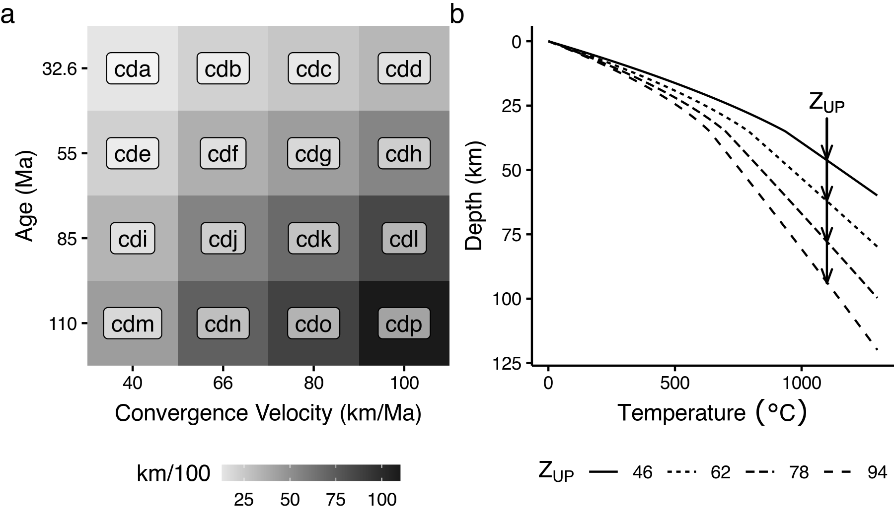

```{r settings, echo=FALSE}
# To keep intermediate .tex files like .log
# options(tinytex.latexmk.clean = FALSE)
options(tinytex.latexmk.emulation = FALSE)
options(knitr.kable.NA = '')
options(scipen=8)
# Some recommended settings
knitr::opts_chunk$set(
  echo = FALSE,
  message = F,
  fig.pos = 'htbp',
  out.extra = '',
  fig.align = 'center',
  out.width = '100%'
)
suppressMessages({
  library(dplyr)
  library(tibble)
  library(purrr)
  library(knitr)
  library(kableExtra)
  library(scales)
})
```

# Introduction

\markboth{Chapter 1: Introduction}{Chapter 1: Introduction}

> **Keypoints:**
>
> - Proxy datasets are key for inference about geodynamics deep in \glspl{sz}
>
> - Computation leverages large data to infer, build, and test geodynamic models

\cleardoublepage

# Effects of Thermo-kinetic Boundary Conditions on Mechanical Plate Coupling in Subduction Zones

\markboth{Chapter 2: Coupling Depths}{Chapter 2: Coupling Depths}

```{r load_chpt2, echo=FALSE}
suppressMessages({
  load('assets/r/chpt2_data.RData')
  load('assets/r/chpt2_regressions.RData')
})
```

> **Keypoints:**
>
> - Mechanical coupling responds strongly to \gls{upt}
>
> - Inverting \glsfirst{shf} allows \glsfirst{cd} estimation
>
> - Globally consistent \gls{upt} would imply globally uniform \glspl{cd}

## Abstract

Deep mechanical coupling between converging plates is implicated in seismic cycles, arc magmatism, and considered a key feature of \glsfirst{sz} geodynamics. This study uses two-dimensional numerical models of oceanic-continental convergent margins to investigate effects of \glsfirst{tkbc} on coupling---specifically focusing on thermal parameter ($\Phi$) and \glsfirst{upt}. The numerical experiments implement coupling by including antigorite (de)stabilization in the mantle wedge. Experiments show thermal feedbacks regulating \glsfirst{cd} self-consistently with strong responses to \gls{upt} and weak responses to $\Phi$. The results imply estimation of \gls{cd} is possible by inverting \gls{upt} from \glsfirst{shf}. \gls{shf} sampled from 13 modern \glspl{sz} suggest uniform \gls{upt} and therefore consistent \glspl{cd} among \glspl{sz}.

## Introduction

Subduction geodynamics strongly depend on the depth where a subducting plate and overlying mantle wedge transition from mechanically decoupled (moving differentially with respect to each other) to mechanically coupled [moving with the same local velocity, @Furukawa1993; @Peacock1994; @Wada2008]. For example, traction forces driving mantle wedge circulation at the (de)coupling transition define a rapid increase in temperature along the top of the subducting plate [@Peacock1996]. Many observations from numerical experiments and \gls{shf} infer \glspl{cd} occurring globally at 70-80 $km$ in modern \glspl{sz}, essentially independent of other \gls{tkbc} including oceanic-plate age ($t_{OP}$), convergence velocity ($\vec{v}_{conv}$), and subduction geometry [@Furukawa1993; @Wada2008; @Wada2009]. To understand \gls{sz} geodynamics, it is important to understand why modern subduction zones appear to achieve similar depths of coupling despite differences in physical characteristics.

Notwithstanding, many numerical geodynamic models use \glspl{cd} of 70-80 $km$ as a boundary condition [e.g., @Abers2017; @Currie2004; @Syracuse2010; @VanKeken2011; @VanKeken2018; @Wada2012; @Gao2014; @Wilson2014], although not exclusively [e.g. 40-56 $km$, @England2010; @Peacock1996]. Similar \glspl{cd} among \glspl{sz} is an attractive hypothesis for at least two reasons. First, it helps explain a relatively narrow range of depths to subducting oceanic-plates beneath volcanic arcs [@England2004; @Syracuse2006] because mechanical coupling is expected to be closely associated with the onset of flux melting. Second, mechanical coupling is required to detach and recover rocks from the subducting plate [@Agard2016], so a common depth of coupling may also help explain why maximum pressures recorded by subducted oceanic material worldwide is $\leq$ 2.3-2.5 $GPa$ [roughly 80 $km$, @Agard2009; @Agard2018].

The location and extent of mechanical coupling along the plate interface is implicated in myriad geodynamic phenomena [seismicity, metamorphism, volatile fluxes into the mantle wedge, volcanism, and plate motions, e.g., @Cizkova2013; @Gonzalez2016; @Peacock1990; @Peacock1991; @Peacock1993; @Peacock1996; @Peacock1999a; @Hacker2003; @VanKeken2011; @Grove2012; @Gao2017]. Consequently, the mechanics of coupling have been extensively studied and discussed. Coupling fundamentally depends on the strength ($\eta$; viscosity) of materials above, within, and below the plate interface. Increasing \gls{pt} and high water fluxes from compaction and dehydration of hydrous minerals form layers of low viscosity sheet silicates in the shallow forearc mantle wedge---especially talc and serpentine---inhibiting transmission of shear stress between plates [@Peacock1999a]. The lack of traction along the interface, combined with cooling from the subducting plate surface, ensures a cold and rigid forearc mantle. Experimentally determined flow laws, petrologic observations, and geophysical observations all support the plausibility of this conceptual model of subduction interface behaviour [e.g., @Agard2016; @Agard2018; @Gao2014; @Peacock1999a].

Two-dimensional numerical geodynamic models of subduction are key to investigating potential correlations between \gls{cd}, \gls{upt} (inverted from backarc heat flow), and $\Phi$. @Wada2009 previously investigated steady-state \glspl{cd} by numerically modelling 17 active subduction zones. Among other \gls{tkbc}, their models specify convergence rate, subduction geometry, thermal structure of oceanic- and overriding-plates, and degree of coupling along the subduction interface. Their experiments control for interface rheology and discriminate the best-fit depth based on observed fore-arc heat flow.

In the present study, similar \gls{tkbc} are specified to simulate the range of modern \gls{sz} systems. However, subduction dip angle and, most importantly, interface rheology are regulated self-consistently by evolving \gls{pts} fields in a deforming mantle wedge. In other words, \gls{cd} is not a fully determined feature, but rather a spontaneous model outcome within the range of specified boundary conditions discussed later. As in other previous studies [e.g., @Ruh2015], rheological effects of the dehydration reaction $antigorite \allowbreak \Leftrightarrow olivine + orthopyroxene + H_{2}O$ are included to drive mechanical coupling by an abrupt viscosity increase with antigorite destabilization. The position of this reaction along the subduction interface determines the \gls{cd}.

This chapter focuses on two fundamental questions. How does \gls{cd} respond to \gls{tkbc} (specifically $\Phi$ and \gls{upt})? And how stable is \gls{cd} through time? First, 64 convergent margins with variable \gls{upt} and $\Phi$ are numerically simulated and mechanical plate coupling is observed. Thermal feedbacks within the system are visualized in terms of mantle temperature, viscosity, and velocity fields. Most importantly, \gls{cd} responses to a range of $\Phi$ and \gls{upt} are quantified using multi-variate linear regression. \glspl{cd} are then predicted for 13 modern \glspl{sz} using regressed models of three different forms. Implications and questions about \gls{upt} and \gls{cd} uniformity among \glspl{sz} are finally discussed before further investigation into \gls{shf} in Chapter \@ref(chpt3).

## Numerical modelling methods

The numerical experiments in this study simulate converging oceanic-continental plates, where an ocean basin is being consumed by subduction at a continental margin (Figure \@ref(fig:init)). The initial conditions are modified from previous numerical experiments of active margins [code: `I2VIS`, @Sizova2010; @Gorczyk2007], although plate coupling was not the focus of their studies. Identical material properties (Tables \@ref(tab:materials) & \@ref(tab:melts)), rheologic model, and hydration/melt model (see !!!Appendix) as @Sizova2010 are used. However, the version of `I2VIS` in this study differs from @Sizova2010 in its initial setup, overall dimension, resolution, continental geotherm, dehydration model, and left boundary condition (origin of new oceanic lithosphere). These differences are outlined below. Sixty-four models were constructed with varying convergence rate ($\vec{v}_{conv}$), oceanic-plate age ($t_{OP}$), and the \gls{upt} (Figure \@ref(fig:params)).

### Initial setup and boundary conditions

The two-dimensional model is 2000 $km$ wide and 300 $km$ deep (Figure \@ref(fig:init)). In the model domain, three governing equations of heat transport, motion, and continuity are discretized and solved using a conservative finite-difference with marker-in-cell approach on a fully staggered grid as outlined in @Gerya2003. The model resolution is non-uniform with higher resolution (1 $km$ x 1 $km$) in a 600 $km$ wide area surrounding the contact between the ocean basin and continental margin, then gradually changing to lower resolution towards the model boundaries (5 $km$ x 1 $km$, x- and z-directions, respectively). The left and right boundaries are free-slip and thermally insulating (Figure \@ref(fig:init)a, b). The implementation of "sticky" air and water allows for a free topographical surface with a simple linear sedimentation and erosion model. The lower boundary is open to allow for spontaneous oceanic-plate descent and subduction angle [@Burg2005].

\begin{landscape}

```{r init, fig.cap='Initial model configuration and boundary conditions. (a) A free sedimentation/erosion boundary at the surface is maintained by implementing a layer of "sticky" air and water, and an infinite-like open boundary at the bottom allows for spontaneous oceanic-plate descent and subduction angle. The left and right boundaries are free slip and insulating. The initial material distribution includes 7 $km$ of oceanic crust (2 $km$ basalt, 5 $km$ gabbro), 1 $km$ of oceanic sediments, and 35 $km$ of continental crust, thinning ocean-ward. (b) Oceanic lithosphere is continually created at the left boundary. The oceanic geotherm is calculated using a half-space cooling model and the continental geotherm is calculated using a one-dimensional steady-state conductive cooling model to 1300 $^{\\circ}C$. The base of the mechanical lithosphere ($Z_{UP}$) is defined by visualizing viscosity and generally coincides with the 1100 $^{\\circ}C$ isotherm. (c) The oceanic crust is bent under loading from passive margin sediments, and a weak zone extends from the deflected oceanic crust, through the lithosphere, to help induce subduction. Convergence velocities are imposed at stationary, high-viscosity regions far from the trench. Rock type colors are: [1] air, [2] water, [4,5] sediments, [6,7] felsic crust, [8] basalt, [9] gabbro, [10,11] dry mantle, [12] hydrated mantle, [14] serpentinized mantle.', fig.scap='Initial model configuration and boundary conditions'}

include_graphics('assets/figs/chpt2/fig1.png')

```

```{r materials}
tibble(
  material = c(
    'Felsic sediments',
    'Felsic crust',
    'Oceanic crust',
    'Dry mantle',
    'Hydrated mantle',
    'Serpentinized mantle'
  ),
  fl.law = c(
    'Wet quartzite',
    'Wet quartzite',
    'Plag An$_{75}$',
    'Dry olivine',
    'Wet olivine',
    'Serpentine'
  ),
  h = c(NA, NA, NA, 0.001, 0.001, NA),
  m = c(NA, NA, NA, 2.5, 2.5, NA),
  n = c(2.3, 2.3, 3.2, 3.5, 3, 3.8),
  A = c(1.97e17, 1.97e17, 4.8e22, NA, NA, 3.21e36),
  A.diff = c(NA, NA, NA, 8.7e15, 5.3e15, NA),
  A.disl = c(NA, NA, NA, 3.5e22, 2.0e18, NA),
  V = c(3e-6, 3e-6, 8e-6, NA, NA, 3.2e-6),
  V.diff = c(NA, NA, NA, 4e-6, 4e-6, NA),
  V.disl = c(NA, NA, NA, 20e-6, 10e-6, NA),
  E = c(1.54e5, 1.54e5, 2.38e5, NA, NA, 8.9e3),
  E.diff = c(NA, NA, NA, 3.0e5, 2.4e5, NA),
  E.disl = c(NA, NA, NA, 5.4e5, 4.3e5, NA),
  sigma.cr = c(3e4, 3e4, 3e4, NA, NA, 3e6),
  C = c(1e6, 1e6, 0.3e6, 1e6, 1e6, 1e6),
  mu0 = c(0.2, 0.6, 0.6, 0.6, 0.6, 0.2),
  mu1 = c(0.1, 0.3, 0.2, 0.3, 0.3, 0.1),
  ) %>%
  rbind(c(
    'Reference$^1$',
    'b, c, d',
    'd',
    'd',
    'b, c, d',
    'b, c',
    'd',
    'd',
    'b, c',
    'd',
    'd',
    'b, c',
    'd',
    'd',
    'b, c',
    'a',
    '',
    ''
    )
  ) %>%
  kable(
    col.names = c(
      '',
      '',
      '$[m]$',
      '',
      '',
      '$[Pa^n s]$',
      '$[s^{-1}]$',
      '$[s^{-1}]$',
      '$[\\frac{J}{Pa\\cdot mol}]$',
      '$[\\frac{J}{Pa\\cdot mol}]$',
      '$[\\frac{J}{Pa\\cdot mol}]$',
      '$[\\frac{J}{mol}]$',
      '$[\\frac{J}{mol}]$',
      '$[\\frac{J}{mol}]$',
      '$[Pa]$',
      '$[Pa]$',
      '',
      ''
      ),
      caption = 'Rheologic parameters used in numerical experiments',
      digits = 8,
      escape = F,
      booktabs = T,
      format = 'latex'
  ) %>%
  add_header_above(c(
    'Material',
    'Flow Law',
    '$h$',
    '$m$',
    '$n$',
    '$A$',
    '$A_{diff}$',
    '$A_{disl}$',
    '$V$',
    '$V_{diff}$',
    '$V_{disl}$',
    '$E$',
    '$E_{diff}$',
    '$E_{disl}$',
    '$\\\\sigma_{cr}$',
    '$C$',
    '$\\\\mu_0$',
    '$\\\\mu_1$'
    ),
    line = T,
    escape = F
  ) %>%
  kable_styling(latex_options = c('scale_down')) %>%
  kable_classic() %>%
  row_spec(6, hline_after = T) %>%
  footnote(
      general = '$h$=grain size, $m$=grain size exponent, $n$=stress exponent, $A$=material constant, $V$=activation volume, $E$=activation energy, $\\\\sigma_{cr}$=critical stress for dislocation creep, $C$=compressive strength at $P$=0, $\\\\mu_{0,1}$=initial and final internal friction coefficient, $\\\\mu_0=\\\\mu_1=0$ for melt-bearing rocks',
      number = c(
        'a=Turcotte \\\\& Schubert (2002),
        b=Ranalli (1995),
        c=Hilairet et al. (2007),
        d=Karato \\\\& Wu (1993)'
      ),
      escape = F,
      threeparttable = T,
      general_title = ''
  )
```

```{r melts}
tibble(
  material = c(
    'Felsic sediments',
    'Felsic crust',
    'Oceanic Crust',
    'Dry mantle',
    'Hydrated mantle',
    'Serpentinized mantle'
  ),
  a = c(1200, 1200, 1600, NA, 2400, 2400),
  b = c(889, 889, 973, NA, 1240, 1240),
  c = c(1.79e4, 1.79e4, 7.04e5, NA, 4.98e4, 4.98e4),
  d = c(54, 54, 354, NA, 323, 323),
  e = c(2.02e4, 2.02e4, 7.78e7, NA, NA, NA),
  f = c(831, 831, 935, 1394, NA, NA),
  g = c(0.06, 0.06, 0.0035, 0.133, 127000.0, 127000.0),
  h = c(NA, NA, 0.000062, -0.000051, 0.000035, 0.000035),
  i = c(1262, 1262, 1423, 2073, 2073, 2073),
  j = c(0.009, 0.009, 0.105, 0.114, 0.114, 0.114)
  ) %>%
  kable(
      col.names = c(
        '',
        '$[MPa]$',
        '$[K]$',
        '$[MPa]$',
        '$[MPa]$',
        '$[MPa]^2$',
        '$[K]$',
        '$[MPa]^{-1}$',
        '$[MPa]^{-2}$',
        '$[K]$',
        '$[MPa]^{-1}$'
      ),
      caption = 'Melting curve constants used in numerical experiments',
      digits = 8,
      escape = F,
      booktabs = T,
      format = 'latex'
      ) %>%
  add_header_above(
    c(
    'Material',
    'a$^1$',
    'b$^1$',
    'c$^1$',
    'd$^1$',
    'e$^1$',
    'f$^2$',
    'g$^2$',
    'h$^2$',
    'i$^3$',
    'j$^3$'
    ),
    escape = F
  ) %>%
  kable_styling(latex_options = c('scale_down')) %>%
  kable_classic() %>%
  footnote(
    general = 'After phase diagrams from Schmidt \\\\& Poli (1998)',
    number = c(
      '$T_{solidus}(P)=b+\\\\frac{c}{(P+d)}+\\\\frac{e}{(P+d)^2}$ at $P<a$',
      '$T_{solidus}(P)=f+gP+hP^2$ at $P\\\\geq a$',
      '$T_{liquidus}(P) = i+jP$'
    ),
    escape = F,
    threeparttable = T,
    general_title = ''
  )
```

\end{landscape}

A horizontal convergence force is applied to both plates in a rectangular region far from the continental margin (Figure \@ref(fig:init)c). An initial weak layer cutting the lithosphere permits subduction to initiate. The high-viscosity ($\eta = 10^{25}~Pa\cdot s$) rectangular convergence regions apply constant horizontal velocities without deforming the lithosphere. The subduction angle is governed by the free-motion of the subducting plate. Similarly, subduction velocity can vary with time in response to extension or shortening of the overriding plate. Therefore, the thermal parameter ($\Phi$) is calculated in this study as the product of the horizontal convergence velocity ($\vec{v}_{conv}$) and the oceanic-plate age [$t_{OP}$, c.f. @McKenzie1969]. For convenience and consistency with the literature, this study presents $\Phi$ as $\Phi$/100 (Figure \@ref(fig:params)a).

```{r params, fig.cap='Range of key thermo-kinematic boundary conditions used in numerical experiments. (a) Modelled thermal parameters (grayscale) range from 13 to 110 $km/100$ and broadly reflect the distribution of oceanic-plate ages and convergence velocities in modern subduction zones. Model names include the prefix "cd" for "coupling depth" with increasing alphabetic suffixes. Note that neither axes are continuous. (b) Upper plate thickness ($Z_{UP}$) is defined by a range of continental geotherms. Geotherms were constructed using a one-dimensional steady-state conductive cooling model with $T(z=0)$ = 0 $^{\\circ}C$ and $\\vec{q}(z=0)$ = 59, 63, 69, 79 $mW/m^2$, and constant radiogenic heating of 1.0 $\\mu W/m^3$ for a 35 $km$-thick crust and 0.022 $\\mu W/m^3$ for the mantle. The continental geotherms are calculated up to 1300 $^{\\circ}$C, with a 0.5 $^{\\circ}C/km$ gradient (the mantle adiabat) for higher temperatures.', fig.scap='Range of key thermo-kinematic boundary conditions used in numerical experiments'}



```

### Calculating geotherms and defining lithospheric thickness

The oceanic crust is modeled as 1 $km$ of sediment cover overlying 2 $km$ of basalt and 5 $km$ of gabbro (Figure \@ref(fig:init)a). Oceanic lithosphere is continually made at a pseudo-mid-ocean ridge at the left boundary of the model (Figure \@ref(fig:init)b). An enhanced vertical cooling condition is applied at 200 $km$ from left boundary to adjust for the proper oceanic-plate age, and therefore its lithospheric thickness as it enters the trench [@Agrusta2013]. Plate ages from 32.6 to 110 $Ma$ and convergence velocities from 40 to 100 $km/Ma$ are used in this study (Figure \@ref(fig:params)a). This range of parameters broadly reflects the middle-range of the modern global subduction system [@Syracuse2006].

Initial continental geotherms are determined by solving the heat flow equation in one-dimension to 1300 $^{\circ}C$ (Figure \@ref(fig:params)b). This study assumes a fixed temperature of 0 $^{\circ}C$ at the surface, constant radiogenic heating of 1 $\mu W/m^{3}$ in the 35 $km$-thick continental crust, 0.022 $\mu W/m^{3}$ in the mantle, with thermal conductivities of 2.3 $W/mK$ and 3.0 $W/mK$ for the continental crust and mantle, respectively. Above, 1300 $^{\circ}C$, temperature is assumed to increase by 0.5 $^{\circ}C/km$ (the mantle adiabat).

Many studies define the base of the continental lithosphere at the 1300 $^{\circ}C$ isotherm, but it can be determined directly by visualizing viscosity and strain rate as the model progresses. The mechanical base of the lithosphere ($Z_{UP}$) in the models generally occurs at the 1100 $^{\circ}C$ isotherm---characterized by a rapid decrease in viscosity and increase in strain rate (Figures \@ref(fig:cdfstep1), \@ref(fig:cdfstep2), \@ref(fig:cdfstep3)). As such, this study considers the oceanic and continental lithosphere as mechanical layers defined by viscosity, rather than defined merely by temperature. The range of $Z_{UP}$ corresponds to backarc surface heat flow of 59, 63, 69, and 79 $mW/m^{2}$.


\cleardoublepage

# A Comparison of Heat Flow Interpolations Near Subduction Zones {#chpt3}

\markboth{Chapter 3: Heat Flow Interpolations}{Chapter 2: Heat Flow Interpolations}

> **Keypoints:**
>
> - Inconsistent spatial patterns characterize heat flow near subduction zones
>
> - Heat flow investigations favour 2D interpolations over 1D transects
>
> - Scaling datasets and new interpolation schema will advance \gls{sz} research

## Abstract

Heat fluxing through the Earth's surface provides indirect observations of \glsfirst{pts} fields deep in \glspl{sz}. Global heat flow databases, therefore, are invaluable for generating and testing belief about \gls{sz} geodynamics. Investigating \glsfirst{shf} in two-dimensions by interpolation, rather than in one-dimension by projection, arguably forms better interpretations about spatial continuity of deep processes. Direct comparisons of interpolations based on the First (spatial continuity) and Third (similarity) Laws of Geography applied to the most updated global heat flow database. Inconsistent spatial patterns of \gls{shf} near \glspl{sz} are observed in magnitude and variance, regardless of interpolation method. The implications include discontinuous \gls{pts} fields at depth, countering hypotheses of commonly thin upper plate lithospheres and mechanical \glspl{cd} among subduction zones. Strategic scaling of \gls{shf} datasets will improve interpolation precision and confidence---leading to better tools for distinguishing differences within and among \glspl{sz}. New data acquisition and composite interpolation schema are proposed as avenues for future \gls{sz} research.

\cleardoublepage

::: {#refs}
:::

\markboth{References}{References}

# (APPENDIX) Appendix {-}
