```{r settings, echo=FALSE, include=FALSE}
# Use system's latexmk
options(tinytex.latexmk.emulation = FALSE)
options(knitr.kable.NA = '')
# Some recommended settings
knitr::opts_chunk$set(
  echo = F,
  message = F,
  warning = F,
  fig.pos = 'htbp',
  out.extra = '',
  fig.align = 'center',
  out.width = '100%'
)
suppressMessages({
  library(dplyr)
  library(tibble)
  library(readr)
  library(purrr)
  library(stringr)
  library(knitr)
  library(kableExtra)
  library(scales)
})
# Chpt1 load
marx.class.summary <- 
  map_df(
    list.files('assets/r/chpt4/marx_classified', full.names = T),
    ~read_csv(.x, col_types = cols())
  )
load('assets/r/chpt4/marx_firsttype_summary.RData')
```

# Introduction {#chpt1}

\markboth{Chapter 1: Introduction}{Chapter 1: Introduction}

As noted by @gerya2014, a scarcity of observational constraints through time and space makes the study of geodynamics on Earth extraordinarily challenging (Figure \@ref(fig:sparse)). Fortunately, application of various computational approaches---simulation, interpolation, and applied statistics (machine learning)---enable geodynamic inquiry despite sparse datasets. This dissertation leverages the above computational methods to investigate a fundamental component of Plate Tectonic theory, *subduction*.

(ref:sparseCap) The Geodynamicist's dilemma. Time-depth diagram representing the data availability on Earth. The rock record (red circles) encodes information about geodynamic processes throughout Earth's history, but only within approximately 100 km of Earth's surface. Geophysical data (blue circles) provide images of Earth's deep interior, but only since the 20th century CE (or 10$^{-7}$ Ga). Direct observations (green circle) are limited to the present-day surface. Size of the circles represents the abundance of available data. Reprinted from @gerya2014 with permission.


```{r sparse, fig.cap='(ref:sparseCap)', fig.scap='The Geodynamicist\'s dilemma'}

include_graphics('assets/figs/chpt1/gerya2014.png')

```

Subduction occurs when two lithospheric plates converge and the denser plate *subducts* beneath the other at a *subduction zone*. Subduction zones drive many geodynamic phenomena, including plate motions, seismicity, metamorphism, volatile flux, volcanism, and crustal deformation [@cizkova2013; @gonzalez2016; @hirauchi2010; @peacock1990; @peacock1991; @peacock1993; @peacock1996; @peacock1999a; @hacker2003; @vankeken2011; @grove2012; @gao2017]. These phenomena are largely defined by plate motions and mechanical behavior along the interface between the subducting plate and overriding (upper) plate [@furukawa1993; @peacock1994; @peacock1996]. Important thermo-kinematic boundary conditions exerting first-order control on subduction zone geodynamics (plate velocity, subduction angle, plate thickness, sediment thickness, crustal structure, subduction duration, and others) vary considerably among presently active subduction zones worldwide [e.g. @syracuse2010; @syracuse2006].

Intuition suggests diverse thermo-kinematic boundary conditions for various subduction zone systems should influence mechanical behavior differently along the plate interface. Yet previous work comparing surface heat flow with numerical simulations of subduction argues for rather uniform depths of plate coupling among subduction zones [@furukawa1993; @wada2008; @wada2009] and implies some aspects of subduction zone mechanics are minimally affected by thermo-kinematic boundary conditions. Compounding the ambiguity are global compilations of \gls{pt} estimates from exhumed \gls{hp} metamorphic rocks that imply detachment of subducting material is either rather continuous along the plate interface [@agard2018; @penniston2015] or discontinuous [@agard2009; @agard2016; @monie2009; @plunder2015; @groppo2016]. Thus, the spatial variability (with depth *and* along strike) of plate interface mechanics remains largely unconstrained and difficult to quantify.

This dissertation is motivated by the following question. How can spatial variations in plate interface mechanics be evaluated across a range of subduction zones with currently available petrologic and geophysical datasets? Each chapter focuses on quantifying an aspect of subduction zone mechanics using different computational approaches and datasets.

Chapter \@ref(chpt2) numerically simulates oceanic-continental subduction across a range of thermo-kinematic boundary conditions. Plate coupling is observed after 10 Ma and multivariate linear regression is then used to formulate an expression for estimating coupling depth. The expression requires estimates for upper-plate thickness, which can be inverted from surface heat flow. Average upper-plate surface heat flow for 13 presently active subduction zones yield a narrow distribution of coupling depths.

Chapter \@ref(chpt3) takes a closer look surface heat flow by quantifying its spatial variability across large adjacent regions (sectors) in the upper-plate. Two interpolations methods, Kriging and Similarity, are compared to assess differences in their surface heat flow predictions near 13 subduction zone segments. Kriging and Similarity accuracies are comparable on average and both approaches show lateral (along strike) surface heat flow variability in the upper-plate. Discontinuous upper-plate surface heat flow implies nonuniform thermal structure and/or discontinuous geodynamics.

Finally, Chapter \@ref(chpt4) applies machine learning techniques to recognize detachment of subducting markers (representing rock fragments) from the numerical simulations in Chapter \@ref(chpt2). A large (`r format(nrow(marx.firsttype.summary[marx.firsttype.summary$recovered,]), big.mark = ',')`) \gls{pt} dataset of recovered markers is compared across numerical experiments and with global compilation of \gls{pt} estimates for rocks exhumed from subduction zones [the rock record, @agard2018; @penniston2015]. Marker \gls{pt} distributions are distinct from the rock record for most numerical simulations, except for slowly-converging systems (40 km/Ma) with young oceanic plates ($\leq$ 55 Ma) and thin upper-plate lithospheres. A sizeable gap in marker recovery around 2 GPa and 550 $^\circ$C, closely coinciding with the highest density region of natural samples, implies certain biases may be affecting numerical geodynamic models, the rock record, or both.

\cleardoublepage

# Effects of Thermo-Kinematic Boundary Conditions on Plate Coupling in Subduction Zones {#chpt2}

\markboth{Chapter 2: Coupling Depths}{Chapter 2: Coupling Depths}

```{r loadChpt2, echo=FALSE}
suppressMessages({
  load('assets/r/chpt2/chpt2_data.RData')
  load('assets/r/chpt2/chpt2_regressions.RData')
})
```

## Abstract {#chpt2Abstract}

Deep mechanical coupling between converging plates is implicated in dynamic plate motions, crustal deformation, seismic cycles, arc magmatism, detachment (recovery) of subducting material, and is considered a key feature of subduction zone geodynamics. This study uses two-dimensional numerical simulations of oceanic-continental convergent margins to investigate effects of thermo-kinematic boundary conditions on coupling---specifically focusing on thermal parameter ($\Phi$) and upper-plate thickness. Numerical simulations implement coupling by including the metamorphic (de)hydration reaction $antigorite \allowbreak \Leftrightarrow olivine + orthopyroxene + H_{2}O$ in the upper-plate mantle. Visualizing \gls{pt}-strain fields show thermal feedbacks regulating coupling depth dynamically with strong responses to upper-plate thickness and weak responses to $\Phi$. The results imply estimation of coupling depth is possible by inverting upper-plate thickness from surface heat flow. Moreover, surface heat flow sampled from the backarc region near 17 presently active subduction zones imply uniform upper-plate thickness, and thus uniform coupling depths among subduction zones.

## Introduction {#chpt2Intro}

Subduction geodynamics are largely defined by plate motions and mechanical behavior along the plate interface. For example, a transition from mechanically decoupled (plates moving differentially with respect to each other) to coupled plates (plates moving with the same local velocity) dramatically increases temperature by inducing mantle circulation in the upper-plate asthenospheric mantle [@peacock1994; @peacock1996]. Observations from numerical simulations and forearc surface heat flow imply coupling transitions occur globally within a narrow range of depths in modern subduction zones (70-80 km). Further, coupling appears essentially unresponsive to diverse thermo-kinematic boundary conditions, including oceanic plate age, convergence velocity, and subduction geometry [@furukawa1993; @wada2008; @wada2009]. While uniform coupling depths among subduction zones are inferred from numerical simulations and surface heat flow, this phenomenon remains curious and unconfirmed to a large extent. To understand subduction zone geodynamics, it is essential to understand why modern subduction zones appear to achieve similar coupling depths despite differences in their physical characteristics.

Notwithstanding, many numerical geodynamic models use coupling depths of 70-80 km as a boundary condition [@abers2017; @currie2004; @syracuse2010; @vankeken2011; @vankeken2018; @wada2012; @gao2014; @wilson2014], although not exclusively [e.g. 40-56 km, @england2010; @peacock1996]. Similar coupling depths among subduction zones is an attractive hypothesis for at least two reasons. First, it helps explain a relatively narrow range of depths to subducting oceanic plates beneath volcanic arcs [@england2004; @syracuse2006] as mechanical coupling is expected to be closely associated with the onset of flux melting. Second, mechanical coupling is required to detach crustal fragments from the subducting plate [@agard2016], so uniform coupling depths may also help explain why maximum pressures recorded by subducted oceanic material worldwide is $\leq$ 2.3-2.5 GPa [roughly 80 km, @agard2009; @agard2018].

The location and extent of mechanical coupling along the plate interface is implicated in myriad geodynamic phenomena, including seismicity, metamorphism, volatile flux, volcanism, plate motions, and crustal deformation [@cizkova2013; @gonzalez2016; @hirauchi2010; @peacock1990; @peacock1991; @peacock1993; @peacock1996; @peacock1999a; @hacker2003; @vankeken2011; @grove2012; @gao2017]. Consequently, the mechanics of coupling have been extensively studied and discussed. Coupling fundamentally depends on the strength (viscosity) of materials above, within, and below the plate interface. Water flux from compaction and dehydration of hydrous minerals with increasing \gls{pt} forms layers of low viscosity sheet silicates near the plate interface. Transmission of shear stress between plates is inhibited by formation of talc and serpentine in the shallow upper-plate mantle [@peacock1999a]. Lack of traction along the interface, combined with cooling from the subducting plate surface, ensures a positive feedback between hydrous mineral formation and mechanical decoupling. Experimentally determined flow laws, petrologic observations, and geophysical observations all support the plausibility of this conceptual model of subduction interface behavior [e.g. @agard2016; @agard2018; @gao2014; @peacock1999a].

Experimental control over important thermo-kinematic boundary conditions make geodynamic numerical simulations essential for investigating such complex geodynamic environments. @wada2009 previously investigated the effects of $\Phi$ on coupling depths by numerically simulating 17 presently active subduction zones. Among other thermo-kinematic boundary conditions, their models specify convergence rate, subduction geometry, thermal structure of oceanic- and overriding-plates, and degree of coupling along the subduction interface. Notably, their experiments control for interface rheology and discriminate best-fit coupling depths based on observed forearc surface heat flow.

This study similarly specifies thermo-kinematic boundary conditions to numerically simulate the range of modern subduction zone systems, but regulates interface rheology dynamically by implementing metamorphic reactions that respond to evolving \gls{pt}-strain fields. Subduction geometry and coupling depth are not fully determined features, in other words, but spontaneous model outcomes within the range of specified boundary conditions discussed in Section \@ref(numMethods). As in previous studies [e.g. @ruh2015], rheological effects of the dehydration reaction $antigorite \allowbreak \Leftrightarrow olivine + orthopyroxene + H_{2}O$ are implemented to drive mechanical coupling. An abrupt viscosity increase accompanies antigorite (serpentine) destabilization, thereby inducing mechanical coupling, as defined by empirically-determined flow laws used in the numerical experiments.

This chapter focuses on two fundamental questions. How does coupling depth respond to $\Phi$ *and* upper-plate thickness? And how stable is coupling depth through time? First, 64 convergent margins with variable upper-plate thickness and $\Phi$ are numerically simulated and mechanical plate coupling is observed. Thermal feedbacks within the system are visualized in terms of mantle temperature, viscosity, and velocity fields and coupling depth responses to a range of $\Phi$ and upper-plate thickness are quantified using multivariate linear regression. Three different regression models are then used to estimate coupling depths for 17 presently active subduction zones. Coupling depth estimates are narrowly distributed, regardless of regression model form. Finally, implications and questions regarding uniformity among subduction zones in terms of surface heat flow, upper-plate thickness, and coupling depth are discussed.

## Numerical Modelling Methods {#numMethods}

This study simulates converging oceanic-continental plates, where an ocean basin is being consumed by subduction at a continental margin (Figure \@ref(fig:init)). Initial conditions are modified from previous numerical experiments of active margins [@sizova2010; @gorczyk2007] using the code `I2VIS` [@gerya2003], although plate coupling was not the focus of their studies. An identical rheologic model with identical material properties (Table \@ref(tab:materials)), and a identical hydration/melt model (Table \@ref(tab:melts) & Appendix \@ref(deHydration)) to @sizova2010 are implemented. However, the version of `I2VIS` in this study differs from @sizova2010 in its initial setup, overall dimension, resolution, continental geotherm, dehydration model, and left boundary condition (origin of new oceanic lithosphere). Differences are outlined in this section and in Appendix \@ref(deHydration). Sixty-four `I2VIS` models constructed with varying convergence rates ($\vec{v}$), oceanic plate ages, and upper-plate thickness (Figure \@ref(fig:params)) were ran for at least 100 timesteps.


\begin{landscape}

(ref:initCap) Initial model configuration and boundary conditions. (a) A free sedimentation/erosion boundary at the surface is maintained by implementing a layer of "sticky" air and water, and an infinite-like open boundary at the bottom allows for spontaneous oceanic plate descent and subduction angle. Left and right boundaries are free slip and thermally insulating. Initial material distribution includes 7 km of oceanic crust (2 km basalt, 5 km gabbro), 1 km of oceanic sediments, and 35 km of continental crust, thinning ocean-ward. (b) Oceanic lithosphere is continually created at the left boundary. The oceanic geotherm is calculated using a half-space cooling model and the continental geotherm is calculated using a one-dimensional steady-state conductive cooling model to 1300 $^{\circ}$C. The base of the upper-plate lithosphere ($Z_{UP}$) is defined by visualizing viscosity and generally coincides with the 1100 $^{\circ}$C isotherm. (c) Oceanic crust is bent under loading from passive margin sediments, and a weak zone extends through the lithosphere to help induce subduction. Convergence velocities are imposed at stationary, high-viscosity regions far from the trench. Rock type colors are: [1] air, [2] water, [4,5] sediments, [6,7] felsic crust, [8] basalt, [9] gabbro, [10,11] dry mantle, [12] hydrated mantle, [14] serpentinized mantle.

```{r init, fig.cap='(ref:initCap)', fig.scap='Initial model configuration and boundary conditions'}

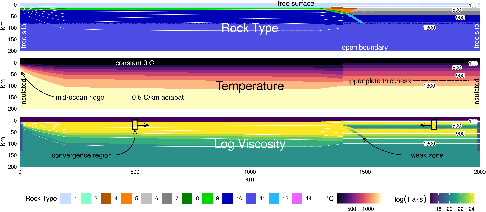

```


\end{landscape}


```{r materials}
readr::read_csv('assets/r/chpt2/materials.csv', show_col_types=F) %>%
dplyr::mutate(thermalConductivityConstant3=scientific(thermalConductivityConstant3)) %>%
kable(col.names =
  c('', 'kg/m$^3$', '$wt.\\%$', '', '', 'kJ/mol',
    'J/MPa$\\cdot$mol', '', '', 'MPa', '', '', '', '$\\mu$W/m$^3$'),
  linesep = '',
  caption = 'Material properties used in numerical experiments',
  escape = F,
  booktabs = T,
  format = 'latex'
) %>%
add_header_above(
  c('Material', '$\\\\rho$', '$H_2O$', 'Flow Law', '$log_{10}A$', '$E$', '$V$',
    '$n$', '$\\\\phi$', '$\\\\sigma_{crit}$', '$k_1$', '$k_2$', '$k_3$', '$H$'),
  escape = F,
  line_sep = 0
) %>%
kable_styling(latex_options = c('striped', 'scale_down')) %>%
kable_classic() %>%
footnote(
  general_title = '',
  general = c(
    '\\\\uline{\\\\textit{key}}: $A$: material constant, $E$, $V$: activation energy and volume, $n$: power law exponent, $\\\\phi$: internal friction angle, $\\\\sigma_{crit}$: critical stress, $k_1$-$k_3$: thermal conductivity constants, $H$: heat production',
    '\\\\uline{\\\\textit{constants}}: $C_p$: heat capacity = 1 [kJ/kg], $\\\\alpha$: expansivity = 2$\\\\times 10^{-5}$ [1/K], $\\\\beta$: compressibility = 0.045 [1/MPa]',
    '\\\\uline{\\\\textit{thermal conductivity}}: $k$ [W/mK] = $(k_1+\\\\frac{k_2}{T+77})\\\\times exp(k_3 \\\\cdot P)$ with $P$ in [MPa] and $T$ in [K]',
    '\\\\uline{\\\\textit{references}}: Turcotte \\\\& Schubert (2002), Ranalli (1995), Hilairet et al. (2007), Karato \\\\& Wu (1993)'
  ),
  escape = F,
  threeparttable = T
) %>%
landscape()
```

### Initial Setup and Boundary Conditions {#numBCs}

Simulations are 2000 km wide and 300 km deep (Figure \@ref(fig:init)). In the model domain, three governing equations of heat transport, momentum, and continuity are discretized and solved with a conservative finite-difference marker-in-cell approach on a fully staggered grid as outlined in @gerya2003. Numerical resolution is nonuniform with higher resolution (1 $\times$ 1 km) in a 600 km wide area surrounding the contact between the oceanic plate and continental margin, then gradually changing to lower resolution towards the model boundaries (5 $\times$ 1 km, x- and z-directions, respectively). The left and right boundaries are free-slip and thermally insulating (Figure \@ref(fig:init)a, b). Implementation of "sticky" air and water allows for a free topographical surface with a simple linear sedimentation and erosion model. The lower boundary is open to allow for oceanic plate descent with a spontaneous subduction angle [@burg2005].

(ref:paramsCap) Range of thermo-kinematic boundary conditions used in numerical experiments. (a) Thermal parameters (grayscale) range from 13 to 110 km/100 and broadly reflect the distribution of oceanic plate ages and convergence velocities in modern subduction zones. Model names include the prefix "cd" for "coupling depth" with increasing alphabetic suffixes. Note that neither axes are continuous. (b) Upper-plate thickness ($Z_{UP}$) is defined by a range of continental geotherms. Geotherms were constructed using a one-dimensional steady-state conductive cooling model with T(z=0) = 0 $^{\circ}$C, $\vec{q}$(z=0) = 59, 63, 69, 79 mW/m$^2$, and constant radiogenic heating of 1.0 $\mu$W/m$^3$ for a 35 km-thick crust and 0.022 $\mu$W/m$^3$ for the mantle. Continental geotherms are calculated up to 1300 $^{\circ}$C with a constant 0.5 $^{\circ}$C/km gradient (the mantle adiabat) extending to the base of the model domain.

```{r params, fig.cap='(ref:paramsCap)', fig.scap='Range of boundary conditions used in numerical experiments'}

include_graphics('assets/figs/chpt2/fig2.png')

```

A horizontal convergence force is applied to both plates in a rectangular region far from the continental margin (Figure \@ref(fig:init)c). An initial weak layer cutting the lithosphere permits subduction to initiate. The high-viscosity ($\eta = 10^{25}$ Pa $\cdot$ s) rectangular convergence regions apply constant horizontal velocities without deforming the lithosphere. Subduction angle is governed by free-motion of the subducting plate. Similarly, subduction velocity varies with time in response to extension or shortening of the overriding plate. $\Phi$ is thus calculated as the product of the horizontal convergence velocity and the oceanic plate age [cf. @kirby1991; @mckenzie1969]. For convenience and consistency with the literature, this study presents $\Phi$ in units of km/100 (Figure \@ref(fig:params)a).

### Rheologic Model {#rheologicModel}

Contributions from dislocation and diffusion creep are accounted for by computing a composite rheology for ductile rocks, $\eta_{eff}$:
\begin{equation}
  \begin{aligned}
    \frac{1}{\eta_{eff}} = \frac{1}{\eta_{diff}} + \frac{1}{\eta_{disl}}
  \end{aligned} 
  (\#eq:ductile)
\end{equation}
where $\eta_{diff}$ and $\eta_{disl}$ are effective viscosities for diffusion and dislocation creep.

\noindent For the crust and serpentinized mantle, $\eta_{diff}$ and $\eta_{disl}$ are computed as:
\begin{equation}
  \begin{aligned}
    \eta_{diff} &= \frac{1}{2} \ A \ \sigma_{crit}^{1-n} \ \exp\left[\frac{E+PV}{RT}\right] \\
    \eta_{disl} &= \frac{1}{2} \ A^{1/n} \ \dot{\varepsilon}_{II}^{(1-n)/n} \ \exp\left[\frac{E+PV}{nRT}\right]
  (\#eq:crust)
  \end{aligned}
\end{equation}
where $R$ is the gas constant, $P$ is pressure, $T$ is temperature in $K$, ${\dot{\varepsilon}}_{II} = \sqrt{\frac{1}{2}{{\dot{\varepsilon}}_{ij}}^{2}}$ is the square root of the second invariant of the strain rate tensor, $\sigma_{crit}$ is an assumed diffusion-dislocation transition stress, and $A$, $E$, $V$ and $n$ are the material constant, activation energy, activation volume, and stress exponent, respectively [Table \@ref(tab:materials), @hilairet2007; @ranalli1995].

\noindent For the mantle, $\eta_{diff}$ and $\eta_{disl}$ are computed as [@karato1993]:
\begin{equation}
  \begin{aligned}
    \eta_{diff} &= \frac{1}{2} \ A^{-1} \ G \ \left[\frac{h}{b}\right]^{m/n} \ \exp\left[\frac{E+PV}{RT}\right] \\
    \eta_{disl} &= \frac{1}{2} \ A^{-1/n} \ G \ \dot{\varepsilon}_{II}^{(1-n)/n} \ \exp\left[\frac{E+PV}{nRT}\right]
  \end{aligned}
  (\#eq:mantle)
\end{equation}
where $b$ = 5 $\times$ 10$^{-10}$ m is the Burgers vector, $G$ = 8 $\times$ 10$^{10}$ Pa is shear modulus, $h$ = 1 $\times$ 10$^{-3}$ m is the assumed grain size, $m$ = 2.5 is the grain size exponent, and the other flow law parameters are given in Table \@ref(tab:materials). Viscosity is limited in all numerical experiments from $\eta_{min}$ = 10$^{17}$ Pa $\cdot$ s to $\eta_{max}$ = 10$^{25}$ Pa $\cdot$ s.

\noindent An effective visco-plastic rheology is achieved by limiting $\eta_{eff}$ with a brittle (plastic) yield criterion:
\begin{equation}
  \eta_{eff} \leq \frac{C + \phi \ P}{2 \ \dot{\varepsilon}_{II}}
  (\#eq:plastic)
\end{equation}
where $\phi$ is the internal friction coefficient, $C$ cohesive strength at $P$ = 0, and ${\dot{\varepsilon}}_{ij}$ is the strain rate tensor (Table \@ref(tab:materials)).

### Defining Geotherms and Lithospheric Thickness {#numGeotherms}

Oceanic crust is modelled as 1 km of sediment cover overlying 2 km of basalt and 5 km of gabbro (Figure \@ref(fig:init)a). Oceanic lithosphere is continually made at a pseudo-mid-ocean ridge at the left boundary of the model (Figure \@ref(fig:init)b). An enhanced vertical cooling condition applied at 200 km from left boundary adjusts for the proper oceanic plate age, and therefore its lithospheric thickness as it enters the trench [@agrusta2013]. Oceanic plate ages range from 32.6 to 110 Ma and convergence velocities from 40 to 100 km/Ma (Figure \@ref(fig:params)a). This range of parameters broadly reflects the middle-range of modern global subduction systems [@syracuse2006].

Initial continental geotherms are determined by solving the heat flow equation in one-dimension to 1300 $^{\circ}$C (Figure \@ref(fig:params)b). This study assumes a fixed temperature of 0 $^{\circ}$C at the surface, constant radiogenic heating of 1 $\mu$W/m$^3$ in the 35 km-thick continental crust, 0.022 $\mu$W/m$^3$ in the mantle, with thermal conductivities of 2.3 W/mK and 3.0 W/mK for the continental crust and mantle, respectively. Above, 1300 $^{\circ}$C, temperature is assumed to constantly increase by 0.5 $^{\circ}$C/km (the mantle adiabat) to the base of the model domain.

Many studies define the base of the continental lithosphere at the 1300 $^{\circ}$C isotherm, but it can be determined directly by visualizing viscosity and strain rate as the model progresses. The mechanical base of the lithosphere ($Z_{UP}$) in the models generally occurs near the 1100 $^{\circ}$C isotherm---characterized by a rapid decrease in viscosity and increase in strain rate (Figures \@ref(fig:cdfStep1), \@ref(fig:cdfStep2), \@ref(fig:cdfStep3)). As such, this study considers oceanic and continental lithospheres as mechanical layers defined by viscosity, rather than defined merely by temperature. $Z_{UP}$ corresponding to backarc surface heat flow of 59, 63, 69, and 79 mW/m$^2$ are used in this study (Figure \@ref(fig:params)b).

### Metamorphic (De)hydration Reactions {#numHydration}

Using Lagrangian markers [@harlow1962; @harlow1964] to store and update material properties and \gls{pt}-strain fields allows for straight-forward numerical implementation of metamorphic reactions. This approach is key to regulating mechanical coupling dynamically in subduction zone simulations. For example, dehydration (eclogitization) of the oceanic plate and (de)stabilization of serpentine in the upper-plate mantle may be effectively modelled by tracing marker \gls{pt}-time paths while changing marker properties according to thermodynamically-stable mineral assemblages [e.g. @connolly2005]. For computational efficiency, however, water contents in this study are not computed by iteratively solving thermodynamic systems of equations.

Instead, gradual eclogitization of oceanic crust is computed as a linear function of lithostatic pressure to a maximum depth of 150 km, or temperature of 1427 $^{\circ}$C, while including garnet-in and plagioclase-out reactions defined by @ito1971. Mantle (de)hydration is computed according reactions boundaries defined by @schmidt1998 with a maximum water content of 2 $wt.\%$ (explained below). This approach effectively simulates continuous influx of water to the upper-plate mantle with relatively low computational cost, beginning with compaction and release of connate water at shallow depths, followed by a sequence of reactions consuming major hydrous phases (chlorite, lawsonite, zoisite, chloritoid, talc, amphibole, and phengite) in different parts of the hydrated basaltic crust [@schmidt1998; @vankeken2011].

The extent of metamorphic reaction effects on mechanical coupling, and the exact (de)hydration reaction(s) likely responsible, are unknown. However, formation of brucite and serpentine from dry olivine near the plate interface are inferred to strongly regulate mechanical behavior [@hyndman2003; @peacock1999a; @agard2016]. Brucite notably breaks down at much lower temperatures than serpentine [@schmidt1998], so serpentine (de)stabilization arguably represents the key transition from a weak-to-strong upper-plate mantle deep in subduction zones. This study elects an implementation of serpentine (de)hydration for this reason. The reaction is assumed to be abrupt and discontinuous, which is a fine approximation for near-endmember compositions like (Mg-rich) peridotites. The \gls{pt} conditions of the reaction $antigorite \Leftrightarrow olivine + orthopyroxene + H_{2}O$ were numerically implemented by the following equation [after @schmidt1998]:
\begin{equation}
  T_{atg-out}(z)=
  \begin{cases}
    751.50+6.008\times10^{-3}z-3.469\times10^{-8}z^2,& \text{for } z < 63000m \\
    1013.2-6.039\times10^{-5}z-4.289\times10{-9}z^2,& \text{for } z>63000m
  \end{cases}
  (\#eq:antstab)
\end{equation}
where $z$ is the depth of a marker from the surface in meters and $T$ is temperature in Kelvins. This reaction boundary is consistent to within 25 $^{\circ}$C of more recent experiments by @shen2015. Markers with internal temperature exceeding $T_{atg-out}(z)$ spontaneously form $olivine + orthopyroxene + H_{2}O$ and release their crystal-bound water. This implementation tacitly assumes thermodynamic equilibrium and is common to many versions of `I2VIS`.

Oceanic plates of different ages are also tacitly assumed to dehydrate similarly with the above implementation. However, older (colder) oceanic plates are expected to carry water to greater depths than younger (warmer) plates because of relatively delayed water-releasing reactions [@peacock1996]. Abrupt water release with serpentine dehydration (Equation \@ref(eq:antstab)) was tested to model deep water retention in cold oceanic plates. Mechanical coupling behavior was indistinguishable from gradual water release models. This implies rates of water release are less important than the depth of serpentine stability. Explicitly modelling other major dehydration reactions are thus unlikely to significantly affect mechanical coupling behavior, yet likely to introduce numerical artifacts at great computational cost. A simplified gradual water release model for all oceanic plates is therefore preferred.

Water released by rock forms discrete fluid particles that migrate with relative velocities defined by local deviatoric (non-lithostatic) pressure gradients [see Appendix \@ref(deHydration), @faccenda2009]. Fluid velocities are scaled by a 10 cm/yr vertical percolation velocity to account for purely lithostatic pressure gradients in the mantle [@gorczyk2007]. Fluid particles migrate until encountering rock that can consume additional water by equilibrium hydration or melting reactions, (Equation \@ref(tab:melts)).

The shallow upper-plate mantle can theoretically store large amounts of water as serpentine may contain up to 13 $wt.\%$ water [@reynard2013] and is generally stable at shallow mantle conditions. Thermodynamic models predict 8 $wt.\%$ water in the shallow upper-plate mantle [@connolly2005]. However, seismic studies suggest most shallow upper-plate mantles are only partially serpentinized (< 20-40%), equating to water contents of approximately 3-6 $wt.\%$ [@abers2017; @carlson2003]. Many modes of mantle hydration are documented or inferred, including evidence for channelized fluid flow within ophiolites exhumed from subduction zones [@angiboust2012a; @angiboust2014a; @zack2007; @plumper2017]. This study limits mantle wedge hydration to $\leq$ 2 $wt.\%~H_{2}O$ and assumes any excess $H_{2}O$ exits the system through channelized fluid flow during plastic or brittle deformation [@davies1999a].

### Visualization and Determination of Coupling Depth

The rheologic model and thermo-kinematic boundary conditions described in the previous sections always results in plate motions towards the left boundary (slab-rollback). Relatively high dip angles and extreme subduction velocities in some high-$\Phi$ experiments cause chaotic behavior by 10 Ma as the upper-plate is stretched thin and mechanical interference occurs between trench sediments and the high-viscosity convergence region 200 km from the left boundary. Numerical solutions are stable for most experiments, however, reaching quasi-steady state by 5 Ma. An additional 5 Ma is allowed to ensure stable geodynamics before observing coupling depth. Surface heat flow, rock type, temperature, viscosity, strain rate, shear heating, and velocity fields are visualized at approximately 10 Ma (e.g. Figure \@ref(fig:comp)) for all 64 experiments to assess geodynamics and solution stability (Figure \@ref(fig:antDepth)).

(ref:compCap) Visualizing model cdf with a 78 km upper-plate lithosphere at approximately 10 Ma. (a) Rock type shows a thin serpentine layer (pink) lubricating the plate interface. Note that low melt volumes are inconspicuous and quickly extracted. (b) Viscosity shows high contrast between the oceanic plate and serpentinized upper-plate mantle at shallow levels. Viscosity contrast disappears where serpentine becomes unstable. (c) Streamlines show focused mantle flow towards the interface, coinciding with the lower limit of serpentine stability. Note the converging isotherms that imply a feedback between heat transfer, serpentine destabilization, and mechanical coupling. (d) Strain rate shows localized deformation in the serpentine layer along the plate interface. Note that deformation in the upper-plate mantle is restricted to viscous flow beneath the lithosphere and along narrow, subvertical melt conduits. Rock type colors are the same as Figure \@ref(fig:init).

```{r comp, fig.cap='(ref:compCap)', fig.scap='Numerical experiment visualization'}

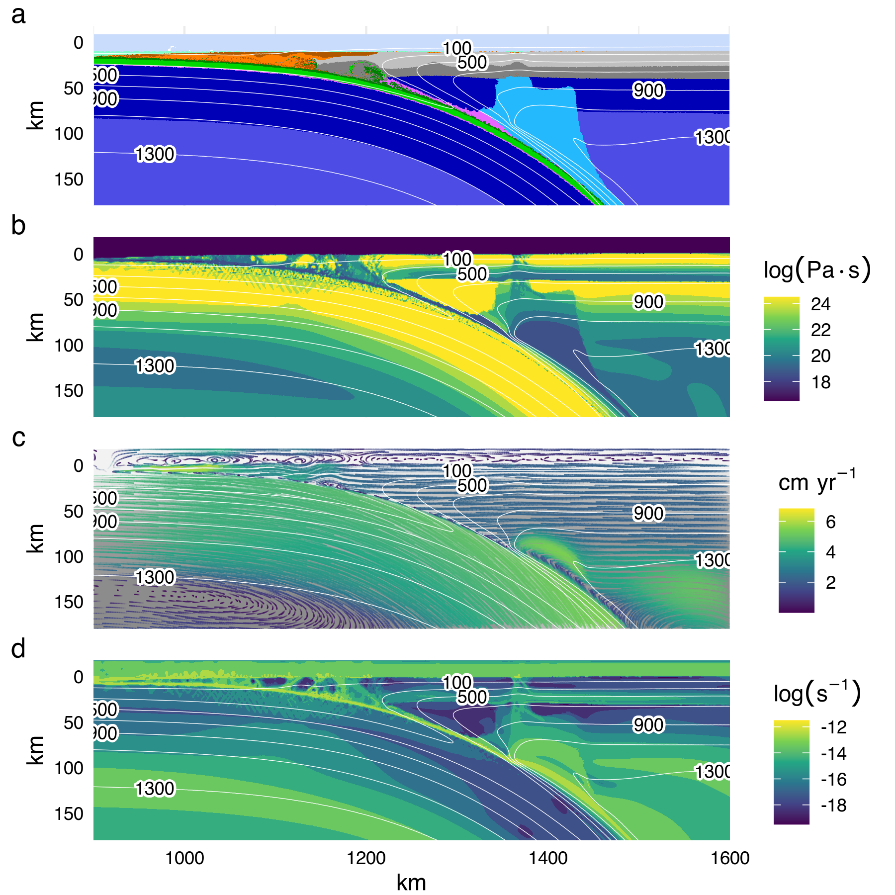

```

After approximately 10 Ma of subduction coupling depth is determined directly from viscosity by finding the approximate area where strength contrasts between serpentinized- and non-serpentinized upper-plate mantle diminishes to < 10$^2$ Pa $\cdot$ s. The node nearest to this region is assigned as the coupling depth. This study assumes mechanical coupling occurs instantaneously and at a single node. Mechanical coupling in reality must be dispersed across a finite length along the plate interface, however. At the numerical resolution the experiments, coupling-like viscosity contrasts are similar within a small area (approximately 5 $\times$ 5 km or 5 $\times$ 5 nodes), giving a qualitative uncertainty coupling depth on the order of 2.5 km.

## Results {#chpt2Results}

### Coupling Depth Estimators {#cdEstimators}

Coupling depth ($Z_{cpl}$) correlates strongly with upper-plate thickness ($Z_{UP}$) and weakly with $\Phi$ across all 64 numerical models (Table \@ref(tab:zcResults), Figures \@ref(fig:results) & \@ref(fig:biv)). The responsiveness of coupling depth to $Z_{UP}$ but not to $\Phi$ is a key result of this study. The following equation minimizes standard least squares while optimizing the number of parameters, *p value*, and $R^2$ for all possible permutations of the variables $Z_{UP}$ and $\Phi$ in linear and quadratic forms:
\begin{equation}
  Z_{cpl} = 4.95\times 10^{-3}\ Z_{UP}^{2}\ -\ 9.27\times 10^{-2}\ \Phi\ +\ 63.6
  (\#eq:zCpl)
\end{equation}
where $Z_{cpl}$ is coupling depth in km and $\Phi$ is the thermal parameter in km/100. Regression summaries show both linear and quadratic models of $Z_{cpl}$ vs. $Z_{UP}$ and $\Phi$ fit experimental results well (Tables \@ref(tab:anova) & \@ref(tab:regSummary)). Equation \@ref(eq:zCpl) represents a statistical model formulated with observations from physics-based simulations of subduction. Equation \@ref(eq:zCpl) is useful for estimating coupling depths in active subduction zones where $\Phi$ is known and $Z_{UP}$ can be inverted from surface heat flow.

Sensitivity of coupling depth to upper-plate thickness and $\Phi$ is apparent when visualizing Equation \@ref(eq:zCpl) and other regression models across $Z_{UP}$ and $\Phi$ space \@ref(fig:multiv). Applying Equation \@ref(eq:zCpl) to 17 active subduction zone segments (Table \@ref(tab:segs)) gives a wide range of estimated coupling depths, similar to the numerical simulations in this study. The distribution of estimated coupling depths, however, is relatively narrow and quasi-normal, with a mean of $\sim$ 82 km and standard deviation of 7 km (Figure \@ref(fig:multiv)d).

(ref:multivCap) Multivariate regressions and estimated coupling depth ($Z_{cpl}$) for 17 active subduction zone segments. Contoured plots show estimated $Z_{cpl}$ (contours) as a function of thermal parameter ($\Phi$) and upper-plate thickness ($Z_{UP}$) for linear (a) and quadratic (b, c) regressions. The best fit regression is panel b (Equation \@ref(eq:zCpl), see Tables \@ref(tab:anova) and \@ref(tab:regSummary)). Black squares are numerical experiments used to fit the contours. White points represent active subduction zones (Table \@ref(tab:segs)). Contours imply $Z_{cpl}$ depends strongly on $Z_{UP}$. While some estimated $Z_{cpl}$ for subduction zones with similar $\Phi$ are quite different (e.g. Alaska vs. N. Sumatra), some estimated $Z_{cpl}$ are quite similar for subduction zones with very different $\Phi$ (e.g. Kamchatka vs. N. Cascadia). (d) Distributions of estimated $Z_{cpl}$ for 17 active subduction zones shown in (a), (b), and (c). These 17 segments span a large range of $\Phi$ but are expected to have a relatively narrow distribution of $Z_{cpl}$ (82 $\pm$ 14 km) according to the regressions in (a), (b), and (c).

```{r multiv, fig.cap='(ref:multivCap)', fig.scap='Estimated coupling depths for 17 active subduction zone segments'}

knitr::include_graphics('assets/figs/chpt2/fig4.png')

```

```{r segs}
segs %>%
select(segment, qs, z1100, phi, zc.lin, zc.quad1, zc.quad2) %>%
mutate(
  'phi' = round(phi, 1),
  'zc.lin' = round(zc.lin),
  'zc.quad1' = round(zc.quad1),
  'zc.quad2' = round(zc.quad2)
) %>%
kbl(
  col.names = c(
  '',
  'mW/m$^2$',
  'km',
  'km/100',
  'km',
  'km',
  'km'
  ),
  linesep = '',
  caption = 'Estimated coupling depths for active subduction zones',
  escape = F,
  booktabs = T,
  format = 'latex'
) %>%
add_header_above(
  c(
    'Segment',
    '$\\\\vec{q}$',
    '$Z_{UP}$',
    '$\\\\Phi$',
    '$Z_{cpl}^a$',
    '$Z_{cpl}^b$',
    '$Z_{cpl}^c$'
  ),
  escape = F,
  line_sep = 0
) %>%
kable_styling(latex_options = c('striped')) %>%
kable_classic() %>%
footnote(
  general_title = '',
  general = c(
    'a: $Z_{cpl}=Z_{UP}+\\\\Phi$, b: $Z_{cpl}=Z_{UP}^2+\\\\Phi$, c: $Z_{cpl}=Z_{UP}+Z_{UP}^2+\\\\Phi$',
    '\\\\uline{\\\\textit{references}}: Currie \\\\& Hyndman (2006), Wada \\\\& Wang (2009)'),
  threeparttable = T,
  escape = F
)
```

### Surface Heat Flow

Upper-plate surface heat flow remains relatively stable and reflects initial upper-plate geotherms in the backarc region for experiments with low to moderate $\Phi$ (Figure \@ref(fig:hf)). However, high-amplitude and high-frequency positive surface heat flow deviations in the upper-plate are common in all experiments, especially for high-$\Phi$ experiments. These deviations correspond to extensional deformation and heat transport via lithospheric thinning and melt migration. These features are apparent as subvertical low viscosity, high strain rate columns originating from the plate interface (Figure \@ref(fig:comp)b, d) and point to potential sources of error when inverting surface heat flow in active subduction zones. Notably, the backarc is relatively unaffected by fluid and melt migration compared to the forearc. Estimating upper-plate thickness by inverting surface heat flow in the backarc is therefore preferable to forearc surface heat flow.

Surface heat flow across all numerical experiments is similar in the forearc region (normalized distance $\leq$ 0.75, Figure \@ref(fig:hf78)). In contrast, surface heat flow extending behind the arc region (normalized distance > 0.75, Figure \@ref(fig:hf78)) increases systematically, then levels off at values reflecting initial continental geotherms (i.e. reflecting initial upper-plate thickness). In reality, surface heat flow depend on fault slip rates and rates of volcanic outputs. However, heat flow in the behind the arc may remain in steady-state if rates of volcanism and crustal thinning by extension are low [@currie2004; @currie2006].

(ref:hf78Cap) Surface heat flow ($\vec{q}$) vs. normalized distance for model cdf with upper-plate thickness ($Z_{UP}$) ranging from 46 to 94 km. The distribution of $\vec{q}$ in the forearc (normalized distance between 0.0 and 1.0) is narrow and shows little variance until near the arc (normalized distance between 0.75 and 1.0). The broad distribution of $\vec{q}$ behind the arc (normalized distance > 1.0) reflects the broad distribution of initial continental geotherms ($Z_{UP}$). Any simple relationship between $\vec{q}$ and $Z_{UP}$ may be obscured by heating from extension or vertical migration of fluids, especially within the arc-region (high-amplitude fluctuations).

```{r hf78, fig.cap='(ref:hf78Cap)', fig.scap='Surface heat flow determined from numerical experiments'}

knitr::include_graphics('assets/figs/chpt2/fig5.png')

```

## Discussion {#chpt2Discussion}

### Dynamic Feedbacks Regulating Plate Coupling

A clear association between plate coupling and the reaction $antigorite \allowbreak \Leftrightarrow olivine + orthopyroxene + H_{2}O$ is observed in all experiments. A relatively narrow serpentine channel quickly forms above the dehydrating oceanic plate, localizing strain, lubricating the plate interface, and inhibiting transfer of shear stress between plates [e.g. @agard2016; @ruh2015]. This mechanical behavior is a direct consequence of a sharp rheologic change dependent on the location of serpentine dehydration reaction described in Section \@ref(numHydration) and its effect on the rheologic model described in Section \@ref(rheologicModel). Interactions among viscosity changes, serpentine dehydration, and heat transfer are regulated by competing dynamic feedbacks acting in the upper-plate. In summary, cooling and hydration of the shallow upper-plate mantle (serpentine stabilization) and heating from circulating asthenospheric mantle beneath the upper-plate lithosphere (driven by mechanical coupling) compete to stabilize coupling depth (Figure \@ref(fig:flow)).

(ref:flowCap) Visualizing viscosity and mantle flow near the coupling region at approximately 10 Ma for model cdf with upper-plate thickness of 78 km. Strong mantle flow beneath the lithospheric base (1100$^{\circ}$C) transfers heat towards the coupling region. Viscosity indicates coupling at the point where the viscosity contrast between the slab and mantle approaches zero (between points b & d). Reference points a-e are used for discussing coupling dynamics and thermal feedbacks (see Section \@ref(cplResponses)).

```{r flow, fig.cap='(ref:flowCap)', fig.scap='Visualizing viscosity and mantle flow'}

knitr::include_graphics('assets/figs/chpt2/fig6.png')

```

The entire process can be conceptualized with Figure \@ref(fig:flow) as follows. The upper-plate mantle cools via diffusive heat loss to the oceanic plate along the entire length of the plate interface (Figure \@ref(fig:flow)a). At shallow depths, water released from the oceanic plate stabilizes serpentine in the overriding upper-plate mantle, effectively decoupling the two plates (Figure \@ref(fig:flow)b, point a). A positive feedback stabilizes serpentine to greater depths as decoupled plates stagnate the upper-plate mantle, promoting further cooling and formation of serpentine. Numerical experiments imply only a thin layer of serpentine is sufficient to trigger this feedback.

Deeper along the plate interface, beyond the stability of serpentine, diffusive heat loss from the upper-plate mantle to the slab forms a thickening layer of high-viscosity mantle atop the oceanic plate (Figure \@ref(fig:flow)b, point b). Downward motion of the oceanic plate, plus accreted high-viscosity mantle (Figure \@ref(fig:flow)b, point b) relative to the deepest extent of the stiff upper-plate mantle (Figure \@ref(fig:flow)b, point c) creates a pressure gradient that attracts flow of the weakest materials---serpentine from the up-dip direction (Figure \@ref(fig:flow)b, point d)---and hot mantle from below (Figure \@ref(fig:flow)b, point e). Flow of hot mantle into the necking region between points b and c in Figure \@ref(fig:flow) is analogous to passive asthenospheric upwelling toward a mid-ocean ridge where two strong cooling lithospheric plates diverge. Highly efficient heat advection from the warm upper-plate asthenospheric mantle (Figure \@ref(fig:flow)a) prevents formation of sperentine---thus regulating and stabilizing the coupling depth.

Coupling mechanics apparent from numerical experiments can be described in terms of competing positive and negative feedbacks. The positive feedback involves addition of water into a diffusively cooling, shallow mantle to produce serpentine. The negative feedback involves serpentine destabilization by advection of heat from the deeper upper-plate asthenospheric mantle. Such thermal-petrologic-mechanical feedbacks drive coupling depth towards steady-state. The numerical experiments in this study imply a finely-tuned balance of serpentine stability can maintain coupling depths in subduction zones for potentially 10's of Ma.

### Coupling Responses to $Z_{UP}$ and $\Phi$ {#cplResponses}

How does upper-plate thickness influence coupling depth? Numerical experiments point to the upper-plate lithosphere-asthenosphere boundary as an important feature constraining coupling mechanics as it defines the permissible flow field in the upper-plate (Figure \@ref(fig:streams)a-d). Thin upper-plate lithospheres (Figure \@ref(fig:streams)a, b) permit shallow mantle flow and advection of heat farther up the plate interface. Thin upper-plate lithospheres thereby raise coupling depths by raising serpentine stability up the plate interface. Thick upper-plate lithospheres (Figure \@ref(fig:streams)c, d) restrict mantle wedge flow to deeper levels, deepening serpentine stability and mechanical coupling.

The thermal state of the slab, as represented by $\Phi$, has almost no effect on coupling depth by comparison. Relative insensitivity of coupling depth to $\Phi$ is consistent with previous studies of active subduction zones [@furukawa1993; @wada2009]. The irresponsiveness of coupling depth to changes in $\Phi$ is perhaps  due to competing cooling and heating effects driven by the subducting oceanic plate. For example, high-$\Phi$ oceanic plates (older plates with higher velocities) cool the upper-plate mantle more effectively, but also effectively heat the interface by driving stronger mantle circulation. In contrast, low-$\Phi$ oceanic plates (younger plates with lower velocities) are less effective in cooling the upper-plate mantle, but also ineffectively heat the interface by ineffectively driving mantle circulation. That is, the shallow vs. deep dynamic effects of $\Phi$ tend to cancel each other, explaining the lack of correlation between coupling depth and $\Phi$.

### Estimating Coupling Depths in Subduction Zones

Theoretically, coupling depth can be estimated directly by fitting forearc surface heat flow data using forward modelling approaches [e.g. @wada2009]. However, forward approaches typically adjust coupling depth independently from upper-plate thickness, which is inconsistent with an inherent link between coupling depth and upper-plate thickness discussed in Section \@ref(chpt2Discussion) (e.g. Figures \@ref(fig:hf78) & \@ref(fig:streams)). Moreover, many additional heat sources [e.g. shear heating and crustal plutonism, @gao2014; @reesjones2018] may contribute to forearc surface heat flow---increasing uncertainty when inverting upper-plate thickness from surface heat flow.

Assuming low degrees of backarc extension, estimating coupling depth in active subduction zones using Equation \@ref(eq:zCpl) with $Z_{UP}$ inverted from backarc surface heat flow is preferable to avoid additional uncertainties stemming from seismic and volcanic activity in the forearc. However, while $\Phi$ is inventoried for most active subduction zones [@syracuse2006], a corresponding dataset of $Z_{UP}$ does not exist. Several geophysical and petrologic methods might be considered for independent estimates of $Z_{UP}$ (e.g. seismic velocities, flexure, heat flow, mantle xenoliths). Backarc surface heat flow is still a good choice, however, because of its direct correspondence with $Z_{UP}$. For example, $Z_{UP}$ may be estimated using simple one-dimensional heat transport models assuming values for radiogenic heat production in the crust [@rudnick1998]. Special attention must be paid to crustal processes, including extension and magmatism, because additional heating will underestimate $Z_{UP}$ and, consequently, underestimate coupling depth.

(ref:streamsCap) Visualizing mantle flow at approximately 10 Ma for model cdf with upper-plate thickness of (a) 46, (b) 62, (c) 78, and (d) 94 km. All experiments are plotted on the same scale and location within the model domain. The flow of warm mantle is restricted to below the 1100$^{\circ}$C isotherm, which corresponds to the base of the upper-plate lithosphere ($Z_{UP}$). A minimum coupling depth ($Z_{cpl}$) appears to exist as models with extremely thin lithospheres (a) exhibit coupling at $\sim$ 70-80 km depth. $Z_{cpl}$ generally increases with increasing $Z_{UP}$ as mantle flow and advective heat transport are restricted to greater depths.

```{r streams, fig.cap='(ref:streamsCap)', fig.scap='Visualizing mantle flow and coupling'}

knitr::include_graphics('assets/figs/chpt2/fig7.png')

```

### Globally Similar Coupling Depths?

A $Z_{cpl}$ distribution of 82 $\pm$ 14 km (2$\sigma$) estimated for active subduction zones in this study (Figure \@ref(fig:multiv)d) roughly match the preferred $Z_{cpl}$ inferred from forearc surface heat flow for Cascadia and NE Japan [75-80 km, @syracuse2010; @wada2009] km. The range of $Z_{cpl}$ estimated for active subduction zones in this study (Figure \@ref(fig:multiv)d) is relatively broad, however. For example, omitting Mexico and Nankai because their $\Phi$ values fall outside the range of $\Phi$ used for numerical experiments, estimated coupling depths range from almost 100 km (Kyushu) to approximately 65 km (Sumatra and NE Japan, Table \@ref(tab:segs)).

Coupling depth in active subduction zones are commonly assumed to be narrowly distributed around 70-80 km [@wada2009; @syracuse2010]. The strong correlation between $Z_{UP}$ and $Z_{cpl}$ found from numerical experiments imply uniform coupling depths are possible if upper-plate thickness are globally uniform. The surface heat flow dataset compiled by @wada2009 (Table \@ref(tab:segs)) shows average backarc surface heat flow are indeed similar among active subduction zones---implying a narrow distribution of coupling depths (Figure \@ref(fig:multiv)d). Much of their dataset is based on @currie2006, who estimate upper-plate thickness for 10 circum-Pacific subduction zones of 50-60 km (defined by the 1200 $^{\circ}$C isotherm). Uniformly thin upper-plate thickness are corroborated by uniformly high heat flow (> 70 mW/m$^2$), thermobarometric constraints on mantle xenoliths, and P-wave velocities [@currie2006]. An attempt is made to further corroborate the uniformity of upper-plate thickness in Chapter \@ref(chpt3) by interpolating surface heat flow near active subduction zones.

Although it still curious why upper-plates among subduction zones may have similar thicknesses, one can assume it is likely related to some processes of lithospheric erosion proposed for subarc lithosphere. These include: lithospheric delamination induced by lower crust eclogitization [@sobolev2005], small-scale convection caused by hydration-induced mantle wedge weakening [@arcay2006], thermal erosion [@england2010], mechanical weakening by percolating melts [@gerya2011], and subarc foundering of magmatic cumulates [@jull2001]. Most of these mechanisms are thus strongly related to mantle wedge hydration, melting, and melt transport toward volcanic arcs.

The metamorphic rock record may also imply consistency among coupling depths in subduction zones. For example, the demise of a serpentine channel and onset of coupling may provide a natural barrier such that rocks are more likely to be exhumed from within the channel than from below it. The relative abundance of blueschists and eclogites should then be greater for pressures below estimated coupling depths (approximately 2.4 GPa or 70-80 km) than above them. 

## Conclusions

Three important results are highlighted in this study:

1. Coupling depth is stabilized near the base of the upper-plate lithosphere by competing dynamic feedbacks regulating heat transport, serpentine dehydration, and mechanical coupling in the upper-plate mantle.
2. A simple expression fitted to coupling depths observed in numerical experiments allows the coupling depths to be estimated for active subduction zones by inverting upper-plate thickness from surface heat flow.
3. Uniform surface heat flow in circum-Pacific subduction zones [@currie2006; @wada2009] may indicate uniform coupling depths at approximately 80 km.

Questions remain, however, including: how do warm (thin) upper-plates persist over 100's of kilometers behind arcs and throughout the lifespan of subduction zones? How abruptly are dehydration reaction occurring along the subduction interface? How can expressions like Equation \@ref(eq:zCpl) be improved using natural datasets? Each of these questions may be considered for future research.

\cleardoublepage

```{r loadChpt3, include=FALSE}
# Load extra libraries and functions
source('assets/r/chpt3/functions.R')
# Load data
load('assets/r/chpt3/hf.RData')
load('assets/r/chpt3/opt.RData')
load('assets/r/chpt3/sectors.RData')
v <-
  vgrm.summary %>%
  select(-c(itr, vgrm.wt, vgrm.rmse, vgrm.cost, cv.wt, cv.cost, cv.rmse, rmse)) %>%
  ungroup() %>%
  rename(rmse.krige = dir.rmse) %>%
  mutate(rmse.krige = round(rmse.krige, 1))
v.opt <-
  vgrm.summary %>%
  group_by(segment) %>%
  slice_min(cost) %>%
  select(-c(itr, vgrm.wt, vgrm.rmse, vgrm.cost, cv.wt, cv.cost, cost, cv.rmse)) %>%
  ungroup() %>%
  rename(rmse.krige = dir.rmse, rmse.sim = rmse) %>%
  mutate(
    rmse.sim = round(rmse.sim, 1),
    rmse.krige = round(rmse.krige, 1)
  )
interp.diff <-
  interp.diff.summary %>%
  group_by(segment) %>%
  slice_min(cost) %>%
  select(-c(n, cost, v.mod))
sigma.diff <-
  solns %>%
  pmap_df(
    ~st_set_geometry(..6, NULL) %>%
    mutate(segment = ..1, v.mod = ..2, cost = ..7, .before = est.sim)
  ) %>%
  group_by(segment, v.mod, cost) %>%
  drop_na() %>%
  summarise(
    n = n(),
    min = round(min(sigma.diff, na.rm = T)),
    max = round(max(sigma.diff, na.rm = T)),
    median = round(median(sigma.diff, na.rm = T)),
    IQR = round(IQR(sigma.diff, na.rm = T)),
    mean = round(mean(sigma.diff, na.rm = T)),
    sigma = round(sd(sigma.diff, na.rm = T)),
    .groups = 'drop'
  ) %>%
  group_by(segment) %>%
  slice_min(cost) %>%
  relocate('cost', .after = sigma) %>%
  relocate('n', .before = cost) %>%
  mutate('cost' = round(cost, 3))
med.sim <- map(shp.sectors, ~map_dbl(.x$interp, ~median(.x$est.sim)))
med.krige <- map(shp.sectors, ~map_dbl(.x$interp, ~median(.x$est.krige)))
sectors.df <-
  tibble(
    segment = unlist(map(shp.sectors, ~map_chr(.x$interp, ~.x$segment[1])), use.names = F),
    sector = unlist(map(shp.sectors, ~map_dbl(.x$interp, ~as.numeric(.x$split_fID[1]))), use.names = F),
    n.obs = unlist(map(shp.sectors, ~map_dbl(.x$pnts, ~nrow(.x))), use.names = F),
    min.obs = unlist(map(shp.sectors, ~map_dbl(.x$pnts, ~round(min(.x$hf),1))), use.names = F),
    med.obs = unlist(map(shp.sectors, ~map_dbl(.x$pnts, ~round(median(.x$hf),1))), use.names = F),
    max.obs = unlist(map(shp.sectors, ~map_dbl(.x$pnts, ~round(max(.x$hf),1))), use.names = F),
    iqr.obs = unlist(map(shp.sectors, ~map_dbl(.x$pnts, ~round(IQR(.x$hf),1))), use.names = F),
    n.sim = unlist(map(shp.sectors, ~map_dbl(.x$interp, ~nrow(.x))), use.names = F),
    min.sim = unlist(map(shp.sectors, ~map_dbl(.x$interp, ~round(min(.x$est.sim),1))), use.names = F),
    med.sim = unlist(map(shp.sectors, ~map_dbl(.x$interp, ~round(median(.x$est.sim),1))), use.names = F),
    max.sim = unlist(map(shp.sectors, ~map_dbl(.x$interp, ~round(max(.x$est.sim),1))), use.names = F),
    iqr.sim = unlist(map(shp.sectors, ~map_dbl(.x$interp, ~round(IQR(.x$est.sim),1))), use.names = F),
    min.krg = unlist(map(shp.sectors, ~map_dbl(.x$interp, ~round(min(.x$est.krige),1))), use.names = F),
    med.krg = unlist(map(shp.sectors, ~map_dbl(.x$interp, ~round(median(.x$est.krige),1))), use.names = F),
    max.krg = unlist(map(shp.sectors, ~map_dbl(.x$interp, ~round(max(.x$est.krige),1))), use.names = F),
    iqr.krg = unlist(map(shp.sectors, ~map_dbl(.x$interp, ~round(IQR(.x$est.krige),1))), use.names = F),
    med.dif = abs(med.sim - med.krg)
  )
sectors.summary <-
  sectors.df %>%
  group_by(segment) %>%
  summarise(
    'n.obs' = sum(n.obs),
    'n.sim' = sum(n.sim),
    avg.med.sim = round(mean(med.sim),1),
    sd.med.sim = round(sd(med.sim),1),
    avg.med.krg = round(mean(med.krg),1),
    sd.med.krg = round(sd(med.krg),1),
    avg.med.dif = round(mean(med.dif),1),
    sd.med.dif = round(sd(med.dif),1),
    avg.iqr.dif = round(mean(abs(iqr.sim - iqr.krg)),1),
    sd.iqr.dif = round(sd(abs(iqr.sim - iqr.krg)),1),
    range.med.sim = range(med.sim)[2] - range(med.sim)[1],
    range.med.krg = range(med.krg)[2] - range(med.krg)[1]
  )
```

# A Comparison of Surface Heat Flow Interpolations Near Subduction Zones {#chpt3}

\markboth{Chapter 3: Heat Flow Interpolations}{Chapter 3: Heat Flow Interpolations}

## Abstract {#chpt3Abstract}

The magnitude and spatial extent of heat fluxing through the Earth's surface depend on the integrated thermal state of Earth's lithosphere (conductive heat loss) plus heat generation (e.g. from seismic cycles and radioactive decay) and heat transfer via advection (e.g. by fluids, melts, and plate motions). Surface heat flow observations are thus critically important for understanding the thermo-mechanical evolution of subduction zones. Yet evaluating regional surface heat flow patterns across tectonic features remains difficult due to sparse observations irregularly-spaced at distances from 10$^{-1}$ to 10$^3$ km. Simple sampling methods (e.g. 1D trench-perpendicular transects across subduction zones) can provide excellent location-specific information but are insufficient for evaluating lateral (along-strike) variability. Robust interpolation methods are therefore required. This study compares two interpolation methods based on fundamentally different principles, *Similarity* and *Kriging*, to (1) investigate the spatial variability of surface heat flow near 13 presently active subduction zone segments and (2) provide insights into the reliability of such methods for subduction zone research. Similarity and Kriging predictions show diverse surface heat flow distributions and profiles among subduction zone segments and broad systematic changes along strike. Median upper-plate surface heat flow varies `r round(mean(sectors.summary$range.med.sim), 1)` mW/m$^2$ for Similarity and `r round(mean(sectors.summary$range.med.krg), 1)` mW/m$^2$ for Kriging within segments, on average, and up to `r round(range(sectors.summary$avg.med.sim)[2]-range(sectors.summary$avg.med.sim)[1], 1)` mW/m$^2$ for Similarity and up to `r round(range(sectors.summary$avg.med.krg)[2]-range(sectors.summary$avg.med.krg)[1], 1)` mW/m$^2$ for Kriging among segments. Diverse distributions and profiles within and among subduction zone segments imply spatial heterogeneities in lithospheric thickness, subsurface geodynamics, or near-surface perturbations, and/or undersampling relative to the scale and magnitude of spatial variability. Average accuracy rates of Similarity (`r round(mean(v.opt$rmse.sim), 1)` mW/m$^2$) and Kriging (`r round(mean(v.opt$rmse.krige), 1)` mW/m$^2$) predictions are comparable among subduction zone segments, implying either method is viable for subduction zone research. Importantly, anomalies and methodological idiosyncrasies identified by comparing Similarity and Kriging can aid in developing more accurate regional surface heat flow interpolations and identifying future survey targets.

## Introduction {#chpt3Intro}

The amount of heat escaping Earth's surface depends on the integrated thermal state of Earth's lithosphere, plus heat-transferring and heat-generating subsurface processes like hydrothermal circulation, radioactive decay, fault motion, and mantle convection [@fourier1827; @kelvin1863; @parsons1977; @pollack1977; @stein1992; @hutnak2008; @hasterok2013; @stein1994; @rudnick1998; @furlong2013; @gao2014; @furukawa1993; @wada2009; @kerswell2021; @currie2004; @currie2006]. Surface heat flow observations are thus critically important for understanding lithospheric evolution, crustal deformation and seismic hazards, groundwater hydrology and environmental impacts, and exploration of economic resources (e.g. hydrocarbon, mineral, and geothermal energy). Monumental efforts to take tens of thousands of continental and oceanic surface heat flow measurements (from more than 1000 individual studies) and compile them into databases [@pollack1993; @hasterok2008; @lucazeau2019; @jennings2021] enable multi-disciplinary investigations of lithospheric and crustal processes.

The most recent global surface heat flow database, *ThermoGlobe* [@lucazeau2019; @jennings2021], currently contains `r format(nrow(hf), big.mark = ',')` observations. Yet the spatial coverage near subduction zones is relatively sparse (n = `r format(nrow(bind_rows(shp.hf.crop)), big.mark = ',')` for this study) and highly irregular at the regional scale (10$^2$ to 10$^3$ km, see Figure \@ref(fig:globalhfComp) & Table \@ref(tab:hfSummaryTable)). Note that ThermoGlobe includes many datasets of high-resolution surface heat flow arrays, often collocated with seismic arrays, that span $\leq$ 10$^2$ km in total length. While high-resolution surveys can resolve fine spatial variations in surface heat flow at the study site scale, probing surface heat flow variations along a subduction zone segment requires evaluation of ThermoGlobe data across larger-scales. Thus, the primary challenge in quantifying segment-scale surface heat flow variations is evaluating sparse, irregularly-spaced observations separated by distances from 10$^{-1}$ to 10$^3$ km. This study solves the problem of irregularly-spaced data by (1) independently applying two interpolation methods to ThermoGlobe data near subduction zone segments, and then (2) regularly sampling the interpolated surface heat flow across large adjacent regions in the upper-plate (upper-plate sectors).

(ref:globalhfCompCap) Regional surface heat flow near subduction zone segments. (a) ThermoGlobe data from @lucazeau2019 cropped within 1000 km-radius buffers around 13 active subduction zone segments show uneven regional coverage. For example, note the relatively high observational density in the NW Pacific compared to other regions. (b) In contrast, a Similarity interpolation cropped within the same buffers presents an evenly-distributed approximation of regional surface heat flow. Similarity interpolation from @lucazeau2019. Subduction zone boundaries (bold white lines) defined by @syracuse2006. Plate boundaries (bold black lines) defined by @lawver2018. AA: Alaska Aleutians, AN: Andes, CA: Central America, KM: Kamchatka Marianas, KR: Kyushu Ryukyu, LA: Lesser Antilles, NBS: New Britain Solomon, NP: N Philippines, SBS: Sumatra Banda Sea, SC: Scotia, SP: S Philippines, TNZ: Tonga New Zealand, VN: Vanuatu.

```{r globalhfComp, fig.cap='(ref:globalhfCompCap)', fig.scap='Regional surface heat flow near subduction zone segments'}

knitr::include_graphics('assets/figs/chpt3/ThermoGlobeBufferComp.png')

```

The two interpolation methods compared in this study, *Kriging* and *Similarity*, are chosen because they represent end-member approaches based on fundamentally different principles and mathematical frameworks. Their comparative differences, therefore, may be important for understanding lithospheric thermal structure, identifying surface heat flow anomalies, evaluating practical limitations of each approach, and developing new methods combining the strengths of Kriging and Similarity techniques.

\clearpage

The rationale for applying Kriging and Similarity methods is embodied in the First and Third Laws of Geography, respectively:

> | \uline{Three Laws of Geography}:
> |
> |  1. Everything is related, but nearer things are more related
> |     [@krige1951; @matheron1963]
> |
> |  2. Geographic phenomena are inherently heterogeneous
> |     [@goodchild2004]
> |
> |  3. Localities with similar geographic configurations share other attributes
> |     [@zhu2018]

Generally speaking, the spatial continuity of surface heat flow reflects variations in lithospheric thermal structure and heat-transferring processes (neglecting variations in radiogenic heat production). For example, broad regions of low surface heat flow on continents outline cratons [@nyblade1993], anomalously low surface heat flow in oceanic crust implies significant heat extraction by seawater [@stein1994; @fisher2000; @hutnak2008; @hasterok2011], and trench-orthogonal surface heat flow profiles imply uniform upper-plate lithospheric thickness [@currie2004; @currie2006; @hyndman2005] and mechanical coupling depths [@furukawa1993; @wada2009; @kerswell2021] among subduction zones. For Kriging, such patterns and anomalies may be resolved (assuming adequate observational coverage) because Kriging estimation is inherently dependent on the spatial continuity of observed surface heat flow.

In contrast, Similarity may impose different patterns than Kriging because the method only depends on the similarity between two localities in terms of their *geographic configuration* [the makeup and structure of geographic variables over some spatial neighborhood around a point, @zhu2018]. Rather than interpolating (*sensu stricto*) like Kriging, Similarity predicts surface heat flow by comparing geographic, geologic, geochronologic, and geophysical information between a target point and the entire ThermoGlobe dataset [see @goutorbe2011 for method details]. In other words, Similarity predictions are fundamentally geologically-reasoned estimates of surface heat flow. For example, two localities have similar surface heat flow if they have similar bathymetry, lithology, proximity to active or ancient orogens, seafloor age, upper mantle shear wave velocity, etc. [@chapman1975; @lee1965; @sclater1970; @davies2013; @shapiro2004; @lucazeau2019].

This study compares regional Similarity and Kriging interpolations near 13 presently active subduction zones while considering the following questions: (1) how does surface heat flow vary near subduction zones, especially within the upper-plate? (2) How do Kriging and Similarity predictions compare? (3) What do the differences (if any) imply about geodynamic variability among active subduction zones? First, ordinary Kriging is applied to ThermoGlobe data near 13 presently active subduction zone segments [defined by @syracuse2006]. Kriging predictions are then directly compared (point-by-point) to Similarity predictions from a previous global-scale study by @lucazeau2019. Interpolation comparisons yield a variety of upper-plate surface heat flow distributions and profiles. Potential implications of mixed upper-plate profiles are discussed, especially with respect to uniform lithospheric thickness [e.g. @currie2004; @currie2006; @hyndman2005].

## Methods {#chpt3Methods}

### The ThermoGlobe Database

The ThermoGlobe database is available from the supplementary material of @lucazeau2019 and is accessible online at \url{http://heatflow.org} [@jennings2021]. It currently contains `r format(nrow(hf), big.mark=',')` data points, their locations in latitude/longitude, and important metadata---including a data quality rank (`Code 6`) from A (high-quality) to D (low-quality). @lucazeau2019 and \url{http://heatflow.org} provide details on compilation, references, historical perspective on ThermoGlobe, and previous compilations. ThermoGlobe is the most recent database available, has been carefully compiled, and is open-access.

Like @lucazeau2019, `r format(sum(hf$code6 == 'D', na.rm = T), big.mark = ',')` poor quality observations (`Code 6` = D), `r sum(is.na(hf['hf']), na.rm = T)` data points without heat flow observations, and `r sum(is.na(hf$longitude), na.rm = T)+sum(is.na(hf$latitude), na.rm = T)` without geographic information were excluded from the analysis. Note that quality control of such a large dataset is an ongoing endeavor and `r format(sum(hf$code6=='Z', na.rm = T), big.mark=',')` observations currently have an undetermined quality (`Code 6` = Z). Duplicate observations at the same location were parsed (to avoid singular covariance matrices during Kriging) by selecting only the best quality measurement. If duplicate measurements were of equal quality, one was randomly chosen. Finally, surface heat flow observations for Kriging and Similarity predictions were both limited to the range (0 - 250] mW/m$^2$. Observations outside of the range (0 - 250] mW/m$^2$ are considered anomalous [e.g. collected near geothermal systems, @lucazeau2019] and unrepresentative of lithospheric-scale thermal structure. Anomalous observations constitute a small fraction of measurements (`r format(nrow(hf[hf$hf < 0 | hf$hf > 250,]), big.mark = ',')` out of `r format(nrow(hf), big.mark = ',')`) forming long tails on either side of the global surface heat flow distribution. The final dataset used for Kriging contains `r format(nrow(hf.crop), big.mark=',')` observations after filtering for quality, missing values, and heat flow range, parsing duplicate pairs, and cropping within subduction zone buffers (Figure \@ref(fig:hfSummaryPlot) & Table \@ref(tab:hfSummaryTable)).

### Map Projection and Interpolation Grid

All geographic operations, including transformation, cropping, Kriging, and comparing interpolations, were performed using general-purpose functions in the R package `sf` [@pebesma2018]. ThermoGlobe data and Similarity interpolations from @lucazeau2019 were transformed into a Pacific-centered Robinson coordinate reference system using the open source geographic transformation software `PROJ` [@proj2021]. The transformation is defined by the `proj4` string `"+proj=robin +lon_0=-155 +lon_wrap=-155 +x_0=0 +y_0=0 +ellps=WGS84 +datum=WGS84 +units=m +no_defs"`. The Kriging domains were defined by drawing 1000 km-radius buffers around each subduction zone segment defined by @syracuse2006. Target locations for Kriging (the interpolation grid) were defined across the same grid used by @lucazeau2019 to compute point-by-point differences with their Similarity interpolation (Figure \@ref(fig:domainConstruct)). In this case, grid point locations represent the centroids of 0.5$^{\circ}$ $\times$ 0.5$^{\circ}$ unequal-area grid cells encompassing the entire globe.

(ref:domainConstructCap) Example of an interpolation domain constructed around the Sumatra Banda Sea segment. ThermoGlobe data [colored squares\; from @lucazeau2019] are cropped within a 1000 km-radius buffer (thin black line) surrounding the segment boundary (bold white line). Target locations for interpolation are defined by the intersections of a 0.5$^{\circ}$ $\times$ 0.5$^{\circ}$ grid [fine black mesh\; defined by @lucazeau2019] cropped to the same buffer. Note that Sumatra Banda Sea is one of the more densely sampled regions, yet still has considerable observational gaps. Segment boundary and volcanoes (gold diamonds) defined by @syracuse2006. Plate boundaries (bold black lines) defined by @lawver2018. AUP: Australian Plate, PSP: Philippine Sea Plate, SNP: Sunda Plate.

```{r domainConstruct, fig.cap='(ref:domainConstructCap)', fig.scap='Example of an interpolation domain'}

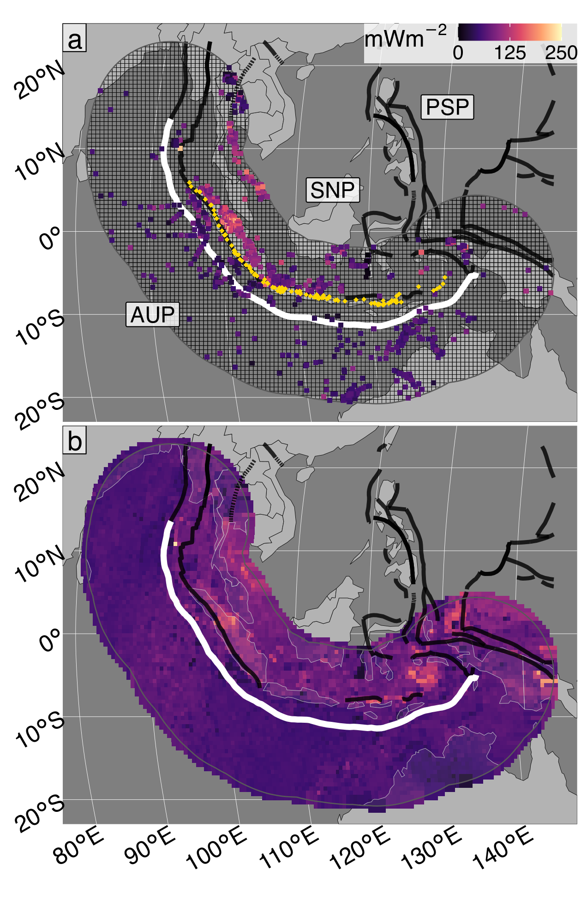

```

### Kriging

Kriging is derived from the theory of *regionalized variables* [@matheron1963; @matheron2019] and estimates an unknown quantity as a linear combination of all nearby known quantities. Kriging is a three-step process that involves: 1) estimating an experimental variogram $\hat{\gamma}(h)$ that characterizes the spatial continuity of some quantity within the Kriging domain, 2) fitting one of many variogram models $\gamma(h)$ to the experimental variogram, and 3) directly solving a linear system of Kriging equations to predict unknown quantities at arbitrary target locations [@krige1951; @cressie2015]. The general-purpose functions defined in the R package `gstat` [@graler2016; @pebesma2004] were used to perform all three Kriging steps. The first step computed an experimental variogram [after @bardossy1997]:
\begin{equation}
  \begin{aligned}
    \hat{\gamma}(h) &= \frac{1}{2N(h)}\sum_{N(h)}^{}[Z(u_i) - Z(u_j)]^2 \\
    h &= |u_i - u_j| \\
  \end{aligned}
  (\#eq:variogram)
\end{equation}
where $Z(u_i)$ and $Z(u_j)$ are observations located at $u_i$ and $u_j$ separated by a lag of $h$, and $N(h)$ is the number of observations separated by a given lag distance. The experimental variogram $\hat{\gamma}(h)$ evaluates the spatial continuity of the set of observations $Z(u)$ by computing the average variance among pairs of observations separated by increasingly greater lag distances. By convention the average variance is halved and called "semivariance".

For regularly-spaced data, lag distances are simply multiples of the grid-step distance, but irregularly-spaced data must be treated differently. In the case of irregularly-spaced surface heat flow in this study, a binwidth $\delta$ was defined as:
\begin{equation}
  \begin{aligned}
    &\delta = \frac{\max(h)\ (n_{lag}+shift)}{n_{lag}\ cut} \\
    &N(h) = \#\{h \  \in \  [h - \delta,\  h + \delta)\}
  \end{aligned}
  (\#eq:binwidth)
\end{equation}
where $\max(h)$ is the maximum separation distance within the Kriging domain, $n_{lag}$ is the number of lags used to evaluate the variogram, $shift$ is a lag shift constant that shifts the variogram by an integer number of binwidths, $cut$ is a lag cutoff constant (by convention $cut$ = 3). $N(h)$ is the number of observations that fall within $[h-\delta,\ h+\delta)$.

This study applied ordinary Kriging with isotropic variogram models (assumes semivariance is spatially invariant) to surface heat flow data projected onto a smooth sphere (neglects elevation). Kriging was applied locally (to avoid violating stationarity assumptions) by evaluating only the nearest $n_{max}$ observations at each target location, where "nearest" is defined by the distances between the target location and observations. Therefore, the domain of local Kriging expands or shrinks depending on the local observational density at each target location.

Several variogram parameters influence the Kriging result, including the choice of variogram model, the scope of local Kriging $n_{max}$, and choice of experimental variogram parameters in Equation \@ref(eq:variogram). Instead of choosing Kriging parameters by eye (a common practice for fitting variograms) this study used a constrained non-linear optimization approach to find optimum values for the variogram parameters $\{model,\ n_{lag},\ cut,\ n_{max},\ shift\}$. A weighted sum of the \gls{rmse} evaluated during variogram fitting and the \gls{rmse} evaluated between Kriging estimates and surface heat flow observations was used as a cost function to simultaneously optimize variogram and Kriging accuracy [after @li2018]. The R package `nloptr` was used to optimize Kriging parameters by finding a combination of the parameters $\{model,\ n_{lag},\ cut,\ n_{max},\ shift\}$ that minimizes the cost function. A full description of the Kriging system of equations, underlying assumptions, and optimization methods is presented in Appendix \@ref(krigeOpt) with optimization results for all segments and variogram models. All experimental and fitted variograms are in Appendix \@ref(interpDiffAppendix) with interpolations for each case not presented in the main text.

### Upper-Plate Sector Profiles {#upSectors}

Surface heat flow profiles and distributions were computed for several adjacent upper-plate regions to assess lateral (along-strike) surface heat flow variability. Profiles were defined by (1) splitting a subduction zone segment [defined by @syracuse2006] into 2-14 equidistant parts, (2) defining 500 km-wide single-sided buffers (sectors) around the segment parts, and (3) calculating the orthogonal great circle distance between each surface heat flow prediction (Similarity and Kriging), or observation (ThermoGlobe data), contained within a sector and the segment boundary (trench). Steps (1-3) above closely approximate the projection of surface heat flow onto a 1D trench-orthogonal line at the center of each sector [e.g. @currie2004; @currie2006; @hyndman2005; @wada2009; @morishige2020]. Profiles were smoothed by a three-point running average and fit with a local non-parametric regression curve [LOESS, @cleveland1988].

### Interpolation Accuracy

Previous studies evaluate global Similarity accuracy by either applying cross-validation during the interpolation process [e.g. @goutorbe2011] or directly computing residuals between predictions and surface heat flow observations after interpolation [e.g. @lucazeau2019]. Generally speaking, ranking models by comparing cross-validation results is typically preferred over directly comparing residuals for two reasons: (1) cross-validation gives a sense of how a model behaves when presented with *new* data (not part of the training data set used to fit the model), and (2) cross-validation can distinguish models that are overfit (high-accuracy due to "memorizing" the training data set). However, because Similarity is a non-parametric approach that does not involve "fitting" models to sets of training data (i.e. no residuals or cost function to minimize), cross-validating Similarity predictions does not effectively distinguish overfitting, nor does it give a sense of how well Similarity will behave when presented with new data. Similarity, as typically implemented [e.g. by @goutorbe2011; @lucazeau2019], always considers the entire global dataset of surface heat flow observations to make predictions at unknown target locations. Therefore leaving out a few observations has little effect. For example, even removing an entire continent's worth of surface heat flow data does not significantly affect the outcome of Similarity predictions compared to Similarity interpolations including the full ThermoGlobe dataset [see Figure 9 in @lucazeau2019].

To better compare Kriging (a parametric model fit to training data) and Similarity (a non-parametric model with prescribed weights), this study computed interpolation accuracies using a direct approach [similar to @lucazeau2019] for both methods. More specifically, the \gls{rmse} was computed for each surface heat flow observation by comparing the observed value to the nearest predicted value made across the 0.5$^{\circ}$ $\times$ 0.5$^{\circ}$ interpolation grid. Compared to cross-validation, this direct method provides a more robust and effective comparison between Similarity and Kriging accuracies. However, the direct approach is particularly susceptible to ignoring overfitting during Kriging estimation. Therefore caution must be taken to avoid misinterpreting unusually low Kriging error rates as indication of a more accurate model.

## Results {#chpt3Results}

### Similarity and Kriging Interpolations {#interpDiff}

#### Global Differences

Global differences between Similarity and Kriging interpolations across all subduction zone segments are centered near zero with median differences ranging from `r min(interp.diff$median)` to `r max(interp.diff$median)` mW/m$^2$, but broadly distributed with \glspl{iqr} from `r min(interp.diff$IQR)` to `r max(interp.diff$IQR)` mW/m$^2$ and long tails extending from `r min(interp.diff$min)` to `r max(interp.diff$max)` mW/m$^2$ (Table \@ref(tab:diffSummaryTable)). Distributions of interpolation differences are either approximately symmetrical, or slightly right-skewed (Figure \@ref(fig:diffSummaryPlot)). Slight right skew and positive median differences indicate a general tendency to predict higher surface heat flow by Similarity compared to Kriging. However, much of the right skew can be explained by spreading centers, transform faults, and volcanic regions predicted by Similarity that are unresolved by Kriging due to lack of observations in those regions (e.g. Scotia), and/or regions of anomalously-low surface heat flow within oceanic crust resolved by Kriging that are effectively overlooked by Similarity (e.g. Central America).

#### Regional Differences

Examples given in this section highlight the range of differences observed between Similarity and Kriging interpolations across subduction zone segments with anomalously-low surface heat flow within oceanic crust (Central America), with complex tectonic boundaries (Vanuatu), with excellent observational coverage (Kyushyu Ryukyu), and with very few observations (Scotia). Refer to Appendix \@ref(interpDiffAppendix) for the remaining set of visualized interpolations.

##### Central America

Distance to plate boundaries and the age of oceanic lithosphere are key geologic proxies exerting strong influence on Similarity predictions [@shapiro2004; @stein1992; @goutorbe2011]. Consequently, Similarity predicts high surface heat flow along the arms of the Gal√°pagos triple junction and within the (young) converging Cocos Plate near Central America (Figure \@ref(fig:centralAmericaDiff)). Kriging, on the other hand, predicts relatively low surface heat flow within the Cocos Plate despite its young age and close proximity to the nearby spreading centers. This is explained by anomalously-low surface heat flow observed within the Cocos Plate that is interpreted as regional modification of the expected surface heat flow by hydrothermal circulation of seawater [@hutnak2008]. These widespread observations of low surface heat flow constrain Kriging predictions to similarly low values within the Cocos Plate. Disagreement between Similarity and Kriging appears more subdued within the upper-plate, yet Similarity still predicts slightly higher surface heat flow on average.

(ref:centralAmericaDiffCap) Similarity and Kriging interpolations for Central America. (a) Relatively high surface heat flow is predicted by Similarity within the young Cocos Plate (CP) and along the arms of the Gal√°pagos triple junction (GTJ): the East Pacific Rise (EPR) and Cocos Ridge (CR). In contrast, (b) many anomalously-low surface heat flow observations within the CP [@hutnak2008] constrain Kriging predictions to low values. Segment boundary (bold white line) and volcanoes (gold diamonds) defined by @syracuse2006. Similarity interpolation from @lucazeau2019. Plate boundaries (bold black lines) defined by @lawver2018.

```{r centralAmericaDiff, fig.cap='(ref:centralAmericaDiffCap)', fig.scap='Similarity and Kriging interpolations for Central America'}

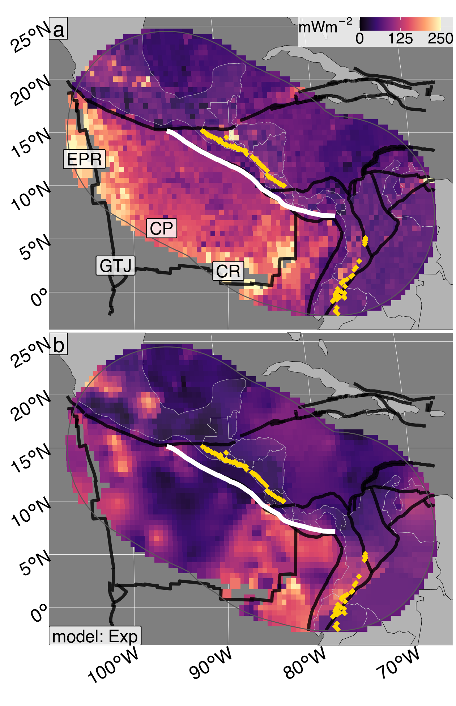

```

##### Vanuatu

The interpolation domain near Vanuatu is characterized by complex tectonic boundaries defining several microplates to the east of the volcanic arc (Figure \@ref(fig:vanuatuDiff)). The resolution of the geologic proxy datasets used to construct Similarity predictions (namely oceanic plate age, upper mantle density anomaly, sediment thickness, and distance to tectonic boundaries) is apparently too coarse to distinguish a small microplate near the northern tip of the Vanuatu segment from the New Hebrides, Balmoral Reef, and Conway Reef microplates. According to Similarity, the entire region is comprised of young oceanic plate with thin sediment cover, and thus is predicted to have uniformly-high surface heat flow. In contrast, excellent observational coverage enables Kriging to clearly distinguish the northern microplate as an anomalously-low surface heat flow region compared to the other microplates. Outside the cluster of microplates, Kriging predicts lower surface heat flow on average---similar to many other segments.

(ref:vanuatuDiffCap) Similarity and Kriging interpolations for Vanuatu. While (a) Similarity predicts more-or-less uniformly-high surface heat flow within the region defined by many microplates, (b) excellent observational coverage allows Kriging to distinguish the most northern microplate from the New Hebrides Plate (NHP), Balmoral Reef (BR), and Conway Reef  (CWR) microplates to the S. The geologic proxy datasets used to construct Similarity interpolations are apparently too coarse to resolve microplate-size features in this case. Segment boundary (bold white line) and volcanoes (gold diamonds) defined by @syracuse2006. Similarity interpolation from @lucazeau2019. Plate boundaries (bold black lines) defined by @lawver2018.

```{r vanuatuDiff, fig.cap='(ref:vanuatuDiffCap)', fig.scap='Similarity and Kriging interpolations for Central America'}

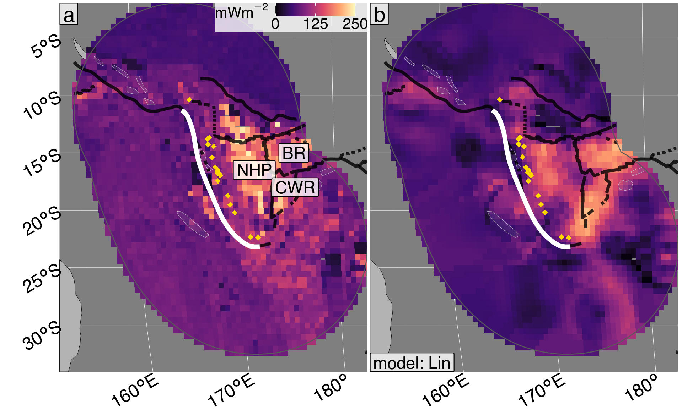

```

##### Kyushu Ryukyu

The interpolation domain near the Kyushu Ryukyu segment is characterized by a complex juxtaposition of active subduction and volcanism on the margins of the Philippine Sea Plate, and active rifting between the Ryukyu arc and the Eurasian continent [the Okinawa trough, @minami2022]. Contrasting oceanic plate ages, topography/bathymetry, sediment thickness, volcanic activity, and active tectonic settings (subduction vs. rifting) consequently produce a very textured distribution of Similarity predictions throughout the Kyushu Ryukyu domain (Figure \@ref(fig:kyushuRyukyuDiff)). For example, Similarity predictions clearly show the influence of multiple volcanic arc chains, plate boundaries, and the age of the subducting oceanic lithosphere. Geologic complexity notwithstanding, excellent coverage of surface heat flow observations throughout the domain enable Kriging predictions to resolve much of the texture predicted by Similarity. Regional Similarity and Kriging differences are small and narrowly distributed near Kyushu Ryukyu (median difference: `r interp.diff$median[interp.diff$segment == 'Kyushu Ryukyu']`, IQR: `r interp.diff$IQR[interp.diff$segment == 'Kyushu Ryukyu']` mW/m$^2$) as compared, for example, to Central America (median difference: `r interp.diff$median[interp.diff$segment == 'Central America']`, IQR: `r interp.diff$IQR[interp.diff$segment == 'Central America']` mW/m$^2$; Table \@ref(tab:diffSummaryTable)) despite having a comparable number of observations (n = `r format(nrow(shp.hf.crop[['Kyushu Ryukyu']]), big.mark = ',')`) as Central America (n = `r format(nrow(shp.hf.crop[['Central America']]), big.mark = ',')`). While Kriging predictions are smoother overall, both interpolations appear to corroborate each other, especially to the NE of the main Kyushu Ryukyu segment boundary.

(ref:kyushuRyukyuDiffCap) Similarity and Kriging interpolations for Kyushyu Ryukyu. (a) Similarity predicts a textured interpolation that is strongly influenced by multiple volcanic chains along the margins of the Philippine Sea Plate (PSP), contrasting oceanic plate ages, and active rifting in the Okinawa trough (OKT). (b) The Kriging interpolation is generally smoother, but corroborates much of the same texture predicted by Similarity due to relatively high observational density and regularity of observational coverage throughout the domain. Segment boundary (bold white line) and volcanoes (gold diamonds) defined by @syracuse2006. Similarity interpolation from @lucazeau2019. Plate boundaries (bold black lines) defined by @lawver2018.

```{r kyushuRyukyuDiff, fig.cap='(ref:kyushuRyukyuDiffCap)', fig.scap='Similarity and Kriging interpolations for Kyushyu Ryukyu'}

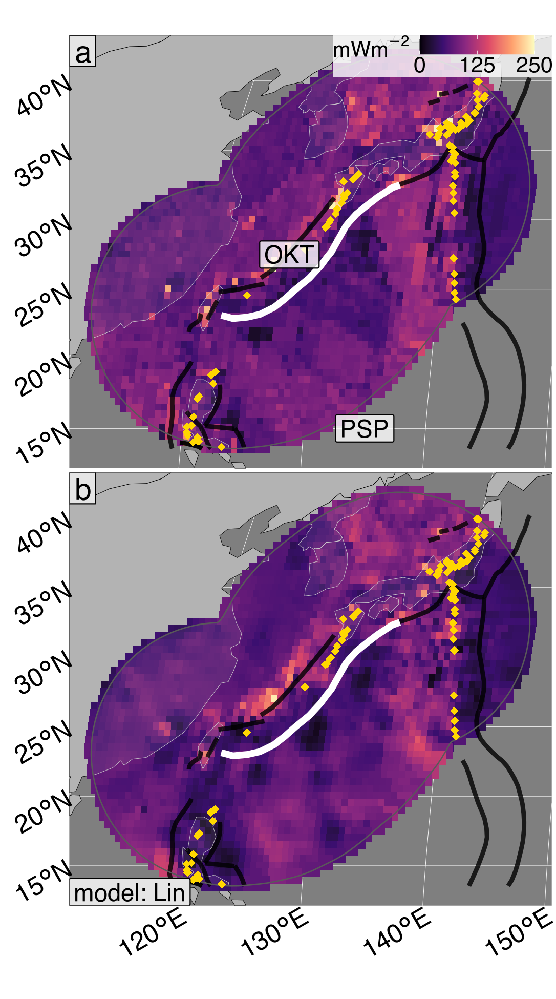

```

##### Scotia

The Scotia segment illustrates a case where surface heat flow observations are extremely sparse. Yet Similarity predicts multiple tectonic features including the East Scotia Ridge and the WSW-ENE trending transform boundary separating the Scotia and Sandwich Plates from the Antarctic Plate (Figure \@ref(fig:scotiaDiff)). Combinations of geologic proxy datasets enable Similarity to resolve these features despite having very few observations within the interpolation domain. Kriging, on the other hand, shows a high heat flow anomaly more or less in the region of the East Scotia Ridge, and a few low heat flow anomalies on the Antarctic Plate, but does not resolve any structure in a way that is geologically useful. Few surface heat flow observations (n = `r nrow(shp.hf.crop[['Scotia']])`) result in smooth Kriging predictions that approximate the expected mean value (`r hf.summary$mean[hf.summary$segment == 'Scotia']` mW/m$^2$) for most of the domain according to Equation \@ref(eq:linEstimate). 

(ref:scotiaDiffCap) Similarity and Kriging interpolations for Scotia. Despite extremely sparse data (n = `r nrow(shp.hf.crop[['Scotia']])`), (a) Similarity identifies two tectonic features, the East Scotia Ridge (ESR) and a transform fault (TF) separating the Scotia and Sandwich Plates (SP, SAN) from the Antartic Plate (AP). (b) Kriging predicts a high heat flow anomaly in the region of the ESR, and a few low heat flow anomalies in the AP, but otherwise appears featureless due to sparse data. Segment boundary (bold white line) and volcanoes (gold diamonds) defined by @syracuse2006. Similarity interpolation from @lucazeau2019. Plate boundaries (bold black lines) defined by @lawver2018.

```{r scotiaDiff, fig.cap='(ref:scotiaDiffCap)', fig.scap='Similarity and Kriging interpolations for Scotia'}

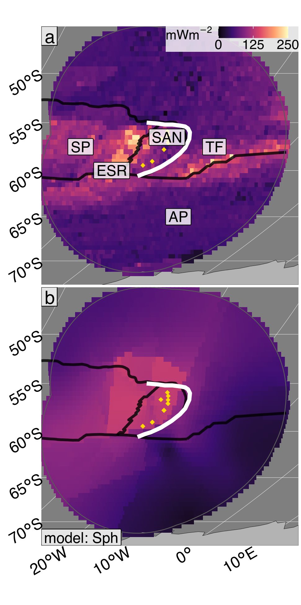

```

#### Upper-Plate Sector Samples {#upSectorsResults}

Sampling the interpolation grid and ThermoGlobe data from adjacent upper-plate sectors allows for first-order quantitative evaluation of the along-strike variability in upper-plate surface heat flow. However, ThermoGlobe data within sectors are often too few (n < 20 observations for `r nrow(sectors.df[sectors.df$n.obs < 20,])`/`r nrow(sectors.df)` sectors; Table \@ref(tab:sectorSummaryTable)) to compare distributions confidently with other sectors. Therefore, this study compares trench-orthogonal profiles of the dense, regularly-spaced Similarity and Kriging predictions. Generally speaking, distributions of Similarity and Kriging predictions in the upper-plates show a range of overlap and appear to fluctuate systematically across adjacent upper-plate sectors for some subduction zone segments. Moreover, Similarity and Kriging predictions reveal a variety of upper-plate surface heat flow profiles within and among subduction zone segments (Table \@ref(tab:sectorSummaryTable), Figures \@ref(fig:kyushuRyukyuUpper), \@ref(fig:sumatraBandaSeaUpper), \@ref(fig:newBritainSolomonUpper) & Appendix \@ref(lateralDiffAppendix)).

Below are three examples of subduction zone segments that illustrate part of the range of observed upper-plate surface heat flow patterns.

##### Kyushu Ryukyu

Kyushu Ryukyu characterizes a subduction zone segment with relatively consistent upper-plate surface heat flow for thousands of km along-strike. In this case, *consistent* refers to comparable Similarity and Kriging predictions *and* consistent surface heat flow distributions across sectors. That is, medians and \glspl{iqr} of Similarity and Kriging predictions overlap relatively well across most sectors---differing by only `r sectors.summary$avg.med.dif[sectors.summary$segment == 'Kyushu Ryukyu']` $\pm$ `r 2*sectors.summary$sd.med.dif[sectors.summary$segment == 'Kyushu Ryukyu']` mW/m$^2$ for medians and `r sectors.summary$avg.iqr.dif[sectors.summary$segment == 'Kyushu Ryukyu']` $\pm$ `r 2*sectors.summary$sd.iqr.dif[sectors.summary$segment == 'Kyushu Ryukyu']` mW/m$^2$ for \glspl{iqr}, on average (Table \@ref(tab:sectorSummaryTable) & Figure \@ref(fig:kyushuRyukyuUpper)). Upper-plate surface heat flow, as estimated by Kriging, appears to increase systematically from the NE to SW across sectors 8-6 before leveling out through sectors 5-1.

Meanwhile, ThermoGlobe data within Kyushu Ryukyu upper-plate sectors (n = `r sectors.summary$n.obs[sectors.summary$segment == 'Kyushu Ryukyu']`) vary considerably. Wide distributions of ThermoGlobe data appear near the trench and at approximately 200 km from the trench, coinciding with the young active rifting in the Okinawa trough (Figure \@ref(fig:kyushuRyukyuUpper)). Yet, smoothed trench-orthogonal Similarity and Kriging profiles gently arc through the approximate midrange of ThermoGlobe data. Profile shapes are consistent across sectors and show relatively little spread ($\leq$ 25 mW/m$^2$). All profiles gradually rise from approximately 50 mW/m$^2$ at the trench to maximums of approximately 75-100 mW/m$^2$ before gradually decreasing to approximately 75 mW/m$^2$ at 500 km into the upper-plate.

(ref:kyushuRyukyuUpperCap) Surface heat flow profiles for Kyushu Ryukyu upper-plate sectors. (a) Similarity and Kriging predictions across sectors are largely indistinguishable with overlapping medians and \glspl{iqr} (boxes). (b) Profiles are computed by finding orthogonal distances between the segment boundary (i.e. the trench, bold black line) and `r sectors.summary$n.sim[sectors.summary$segment == 'Kyushu Ryukyu']` surface heat flow predictions within eight 500 km-wide sectors (colored polygons). Profiles (colored curves with 95% confidence intervals) are remarkably consistent across sectors for (c) Kriging and  (d) Similarity predictions. Colored squares are ThermoGlobe data from @lucazeau2019. Segment boundary and volcanoes (gold diamonds) defined by @syracuse2006. Plate boundaries (bold black lines) defined by @lawver2018. Profile curves in (c) are LOESS regressions through three-point running averages (small colored data points).

```{r kyushuRyukyuUpper, fig.cap='(ref:kyushuRyukyuUpperCap)', fig.scap='Kyushu Ryukyu upper-plate sectors'}

knitr::include_graphics('assets/figs/chpt3/kyushuRyukyuUpperPlate.png')

```

##### Sumatra Banda Sea

Sumatra Banda Sea characterizes a subduction zone segment with moderately consistent upper-plate surface heat flow for thousands of km along-strike. In this case, *moderately consistent* refers to mostly comparable (overlapping) Similarity and Kriging predictions that distinctively fluctuate in a similar manner across sectors. That is, medians and \glspl{iqr} of Similarity and Kriging predictions overlap well for some sectors, but not others (e.g. sectors 1, 10, & 11, Figure \@ref(fig:sumatraBandaSeaUpper)). Median Similarity and Kriging predictions differ by `r sectors.summary$avg.med.dif[sectors.summary$segment == 'Sumatra Banda Sea']` $\pm$ `r 2*sectors.summary$sd.med.dif[sectors.summary$segment == 'Sumatra Banda Sea']` mW/m$^2$ on average, and \glspl{iqr} differ by `r sectors.summary$avg.iqr.dif[sectors.summary$segment == 'Sumatra Banda Sea']` $\pm$ `r 2*sectors.summary$sd.iqr.dif[sectors.summary$segment == 'Sumatra Banda Sea']` mW/m$^2$ on average across all sectors (Table \@ref(tab:sectorSummaryTable)). Similarity and Kriging predictions appear to broadly oscillate between higher and lower surface heat flow across adjacent sectors with a wavelength on the order of several sectors (10$^3$ km).

Meanwhile, Similarity and Kriging profiles show obvious differences. For example, Similarity predictions are distributed narrowly and increase monotonically from the trench to 500 km into the upper-plate, whereas Kriging profiles generally ramp up more steeply and begin to disperse at approximately 200 km from the trench. Similarity profiles remain narrowly distributed through at least 300 km from the trench, whereas Kriging profiles show up to 25-30 mW/m$^2$ spread among sectors at 300-500 km from the trench.

(ref:sumatraBandaSeaUpperCap) Surface heat flow profiles for Sumatra Banda Sea upper-plate sectors. (a) Similarity and Kriging predictions across sectors are moderately distinguishable with mostly overlapping \glspl{iqr}, except for sectors 1, 10, & 11 (boxes). (b) Profiles are computed by finding orthogonal distances between the segment boundary (trench; bold black line) and `r sectors.summary$n.sim[sectors.summary$segment == 'Sumatra Banda Sea']` surface heat flow predictions within ten 500 km-wide sectors (colored polygons). Profiles (colored curves with 95% confidence intervals) of (c) Kriging predictions show greater overall spread than (d) Similarity profiles (e.g. $\geq$ 200 km from the trench), implying nonuniform upper-plate surface heat flow across the segment. Colored squares are ThermoGlobe data from @lucazeau2019. Segment boundary and volcanoes (gold diamonds) defined by @syracuse2006. Plate boundaries (bold black lines) defined by @lawver2018. Profile curves in (c) are LOESS regressions through three-point running averages (small colored data points).

```{r sumatraBandaSeaUpper, fig.cap='(ref:sumatraBandaSeaUpperCap)', fig.scap='Sumatra Banda Sea upper-plate sectors'}

knitr::include_graphics('assets/figs/chpt3/SumatraBandaSeaUpperPlate.png')

```

##### New Britain Solomon

New Britain Solomon characterizes a subduction zone segment with inconsistent upper-plate surface heat flow and poor overlap between Similarity and Kriging predictions. Only one sector (sector 8) shows overlapping \glspl{iqr} of Similarity and Kriging predictions, whereas all other sectors strongly diverge (Figure \@ref(fig:newBritainSolomonUpper)). For example, median Kriging predictions range by `r sectors.summary$range.med.krg[sectors.summary$segment == 'New Britain Solomon']` mW/m$^2$ across all sectors, whereas median Similarity predictions range by `r sectors.summary$range.med.sim[sectors.summary$segment == 'New Britain Solomon']` mW/m$^2$. Moreover, Similarity and Kriging medians across all sectors differ by `r sectors.summary$avg.med.dif[sectors.summary$segment == 'New Britain Solomon']` $\pm$ `r 2*sectors.summary$sd.med.dif[sectors.summary$segment == 'New Britain Solomon']` mW/m$^2$ on average. Notably, opposing wave-like oscillations between higher and lower surface heat flow across adjacent sectors are observed in Similarity and Kriging predictions.

Meanwhile, Similarity and Kriging profiles are obviously distinguishable. For example, Kriging profiles are smooth and closely parallel ThermoGlobe data, whereas Similarity profiles show higher average surface heat flow (Figure \@ref(fig:newBritainSolomonUpper)). In contrast to flat Kriging profiles, high surface heat flow regions along Similarity profiles clearly show the influence of certain tectonic features (e.g. in sector 4, which intersects a volcanic center and ridge segment). Moreover, small confidence intervals around Kriging profiles suggest small uncertainties compared to Similarity. However, Kriging is determined to find the smallest variance solution by definition and can easily overfit the small number (n = `r sectors.summary$n.obs[sectors.summary$segment == 'New Britain Solomon']`) of ThermoGlobe data. Divergence between Similarity and Kriging predictions near New Britain Solomon thus appear to be driven by methodological differences and a tendency for Kriging to overfit small sample sets.

(ref:newBritainSolomonUpperCap) Surface heat flow profiles for New Britain Solomon upper-plate sectors. (a) Similarity and Kriging predictions across sectors are very distinguishable with non-overlapping \glspl{iqr} (boxes). (b) Profiles are computed by finding orthogonal distances between the segment boundary (trench; bold black line) and `r sectors.summary$n.sim[sectors.summary$segment == 'New Britain Solomon']` surface heat flow predictions within five 500 km-wide sectors (colored polygons). Profiles (colored curves with 95% confidence intervals) of (c) Kriging predictions are lower and show a narrow distribution compared to (d) Similarity profiles. Colored squares are ThermoGlobe data from @lucazeau2019. Segment boundary and volcanoes (gold diamonds) defined by @syracuse2006. Plate boundaries (bold black lines) defined by @lawver2018. Profile curves in (c) are LOESS regressions through three-point running averages (small colored data points).

```{r newBritainSolomonUpper, fig.cap='(ref:newBritainSolomonUpperCap)', fig.scap='New Britain Solomon upper-plate sectors'}

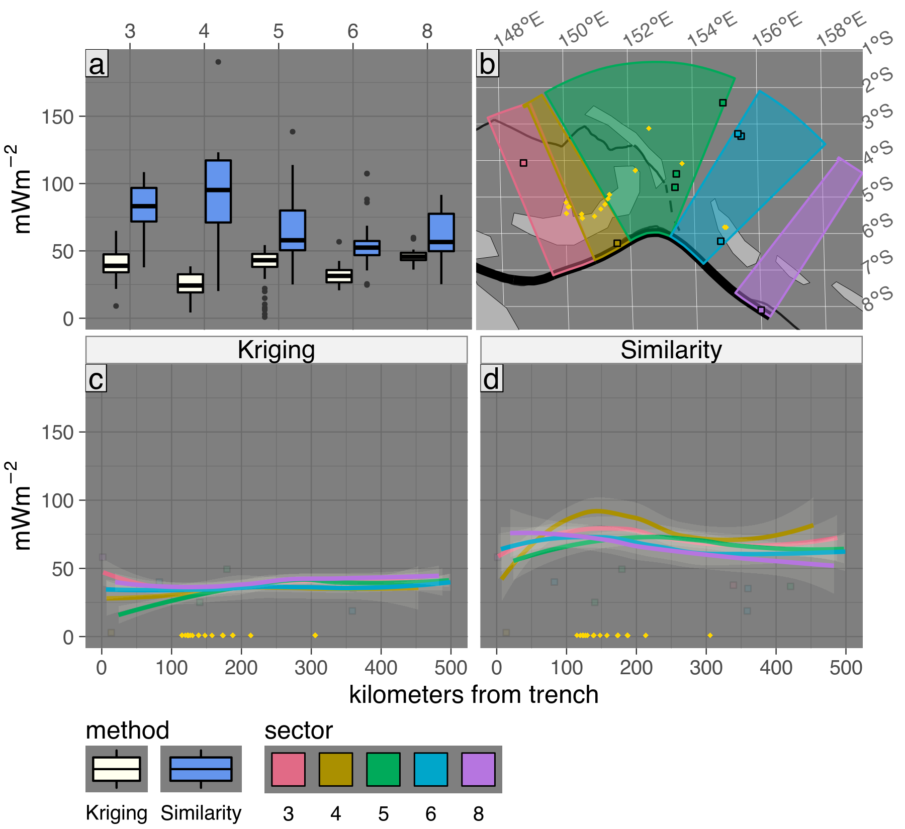

```

### Optimum Kriging Parameters

Optimized Kriging parameters vary substantially from segment to segment (Table \@ref(tab:vgrmSummaryTable)). However, despite a range of domain sizes, observational densities, and diverse plate configurations, Kriging parameters converge on solutions for all Kriging domains (Figure \@ref(fig:optTrace)) and show no systematic correlation with cost, with the exception of a negative correlation with the logarithm of the variogram model sill (Figure \@ref(fig:vgrmSummaryPlot)). Differences in cost are apparently explained by systematic regional differences in surface heat flow distributions (i.e. differences in the constant terms $\sigma_{vgrm}$ and $\sigma_{interp}$ in Equation \@ref(eq:costExp)) rather than sensitivity to any particular Kriging parameter.

```{r vgrmSummaryTable}
v.opt %>%
mutate(
  'cutoff.prop' = round(cutoff.prop, 1),
  'n.lags' = round(n.lags, 1),
  'lag.start' = round(lag.start, 1),
  'n.max' = round(n.max),
  'sill' = round(sill),
  'range' = round(range/1000)
) %>% 
kable(
  col.names = c('', '', '', '', '', '', '$(mW/m^2)^2$', 'km', 'mW/m$^2$', 'mW/m$^2$'),
  caption = 'Optimum variogram models and interpolation accuracy',
  linesep = '',
  escape = F,
  booktabs = T,
  format = 'latex'
) %>%
add_header_above(
  c('Segment', 'Model', 'Cut', 'Lags', 'Shift', '$n_{max}$', 'Sill', 'Range', '$RMSE_S$', '$RMSE_K$'),
  escape = F,
  line_sep = 0
) %>%
kable_styling(latex_options = c('striped', 'scale_down')) %>%
kable_classic() %>%
footnote(
  general_title = '',
  general = c('\\\\uline{\\\\textit{note}}: showing lowest-cost models from Table \\\\ref{tab:vgrmSummaryTableLong}', '\\\\uline{\\\\textit{key}}: $n_{max}$: max point-pairs, $RMSE_S$: Similarity accuracy, $RMSE_K$: Kriging accuracy'),
  threeparttable = T,
  escape = F
)
```

### Similarity and Kriging Error Rates

Regional Kriging error rates (ranging from `r round(min(v.opt$rmse.krige), 1)` to `r round(max(v.opt$rmse.krige), 1)` mW/m$^2$) are very similar to Similarity error rates from the same regions (ranging from `r round(min(v.opt$rmse.sim), 1)` to `r round(max(v.opt$rmse.sim), 1)` mW/m$^2$, Table \@ref(tab:vgrmSummaryTable)). Kriging errors can be relatively small compared to Similarity for domains with high observational density (e.g. `r v.opt$segment[which.min(v.opt$rmse.krige[!(v.opt$segment %in% c('Scotia'))])]`; n = `r format(nrow(shp.hf.crop[[v.opt$segment[which.min(v.opt$rmse.krige[!(v.opt$segment %in% c('Scotia'))])]]]), big.mark = ',')`, $\Delta$RMSE$_{K-S}$ = `r round(v.opt$rmse.krige[which.min(v.opt$rmse.krige[!(v.opt$segment %in% c('Scotia'))])] - rmse.luca$rmse[which.min(v.opt$rmse.krige[!(v.opt$segment %in% c('Scotia'))])], 1)`) but relatively large where observational density is comparatively low (`r v.opt$segment[which.max(v.opt$rmse.krige)]`; n = `r format(nrow(shp.hf.crop[[v.opt$segment[which.max(v.opt$rmse.krige)]]]), big.mark = ',')`, $\Delta$RMSE$_{K-S}$ = `r round(v.opt$rmse.krige[which.max(v.opt$rmse.krige)] - rmse.luca$rmse[which.max(v.opt$rmse.krige)], 1)`). The small Kriging error rate computed for `r v.opt$segment[which.min(v.opt$rmse.krige)]` (`r v.opt$rmse.krige[which.min(v.opt$rmse.krige)]` mW/m$^2$) likely reflects overfitting of few (n = `r format(nrow(shp.hf.crop[[v.opt$segment[which.min(v.opt$rmse.krige)]]]), big.mark = ',')`) observations. On average, Kriging error rates are `r round(mean(v.opt$rmse.krige/rmse.luca$rmse), 1)` times Similarity error rates across all segments. In comparison to previous work, regional Similarity error rates for most subduction zone segments in Table \@ref(tab:vgrmSummaryTable) are much higher than the 7 mW/m$^2$ Similarity error rate reported by @lucazeau2019. However, Similarity error rates in Table \@ref(tab:vgrmSummaryTable) are consistent with global Similarity error rates computed by cross-validation on a 1$^{\circ}$ $\times$ 1$^{\circ}$ grid (from 11.6 to 29.0 $mW/m^{-2}$) reported previously by @goutorbe2011.

## Discussion {#chpt3Discussion}

### Comparing Similarity and Kriging Interpolations {#interpDiffDiscussion}

Comparing two independent interpolation methods has distinct advantages for understanding subduction zone thermal structure and geodynamics. For example, many cases of Similarity and Kriging predictions corroborate known, expected, or predicted tectonic features. These include: (1) broad regions of low surface heat flow defining the oceanic plate and forearc along the Kamchatka Marianas segment (Figure \@ref(fig:kamchatkaMarianasDiff)), (2) high surface heat flow anomalies defining the volcanic center and transform fault separating the South American Plate and Caribbean Plates near the Lesser Antilles Segment (Figure \@ref(fig:lesserAntillesDiff)), (3) the general seafloor thermal structure near the N Philippines segment (Figure \@ref(fig:nPhilippinesDiff)), (4) a broad region of high surface heat flow within the NW part of the Sumatra Banda Sea segment upper-plate (Figure \@ref(fig:sumatraBandaSeaDiff)), and (5) high surface heat flow defining volcanic arc chains near the Kyushu Ryukyu segment (Figure \@ref(fig:kyushuRyukyuDiff)).

While corroboration of known or expected features is advantageous when comparing independent interpolation methods, inconsistencies between Similarity and Kriging predictions are equally valuable. For example, many cases of Similarity and Kriging predictions identify unexpected or poorly resolved tectonic features. These include: (1) much of the thermal structure along the Andes segment (Figure \@ref(fig:andesDiff)), (2) the location and extent of two spreading centers, the tip of a transform fault, and the regional thermal structure of the Cocos Plate near the Central America segment (Figure \@ref(fig:centralAmericaDiff)), (3) locations of plate boundaries near the New Britain Solomon (Figure \@ref(fig:newBritainSolomonDiff)) and Scotia segments (Figure \@ref(fig:scotiaDiff)), (4) a large low surface heat flow anomaly near the Sumatra Banda Sea segment (east of Borneo at approximately 120$^{\circ}$E and 5$^{\circ}$S, Figure \@ref(fig:sumatraBandaSeaDiff)), (5) a high heat flow anomaly defining a transform fault near the N tip of the Tonga New Zealand segment (Figure \@ref(fig:tongaNewZealandDiff)), and (6) the location of microplate boundaries near the Vanuatu segment (Figure \@ref(fig:vanuatuDiff)). 

Such inconsistencies between Similarity and Kriging interpolations identify tectonic features that either violate geologic proxy datasets, violate local surface heat flow observations, lack sufficient observational coverage to be resolved by Kriging, or are too fine-scale to be resolved by geologic proxy datasets on a 0.5$^{\circ}$ $\times$ 0.5$^{\circ}$ grid. In any case, the above examples demonstrate the utility of comparing independent interpolation methods in identifying relevant targets for future investigation and data acquisition (discussed further below). Maps of regional interpolated surface heat flow prepared in this study (Section \@ref(chpt3Results) and Appendices \@ref(interpDiffAppendix) & \@ref(lateralDiffAppendix), or similar) therefore provide important context for subduction zone research.

### Comparing Upper-Plate Sectors

#### Issues with Irregularly-Spaced Data

Surface heat flow profiles in previous studies were computed with observations sampled from within a single sector [@currie2004; @currie2006; @hyndman2005; @furukawa1993; @wada2009; @kerswell2021]. While extending a single-sector sampling approach to many adjacent sectors is simple to implement, inherent pitfalls are immediately obvious when comparing ThermoGlobe data among sectors. For example, the spatial density and regularity of ThermoGlobe data within adjacent sectors can often be drastically different (e.g. compare ThermoGlobe data counts across sectors from Central America, Sumatra Banda Sea, and Tonga New Zealand in Table \@ref(tab:sectorSummaryTable)). Fluctuating sample sizes among upper-plate sectors can make statistical comparisons of ThermoGlobe data equivocal. For instance, ThermoGlobe data are often too few (n < 20 observations for `r nrow(sectors.df[sectors.df$n.obs < 20,])`/`r nrow(sectors.df)` sectors, Table \@ref(tab:sectorSummaryTable)) to compare with statistical confidence. Many sectors (n = `r nrow(sectors.df[sectors.df$n.obs == 1,])`) have a single observation with a singular distribution (\gls{iqr} = 0) or few observations spanning a large range (very large \gls{iqr}). Many sectors encompass zero ThermoGlobe data and therefore cannot be compared at all. In other words, summary statistics necessary for gauging the continuity of surface heat flow among sectors (e.g. median, \gls{iqr}, Table \@ref(tab:sectorSummaryTable)) can be generally considered unreliable for a majority of sectors.

The above limitation arising from sampling irregularly-spaced data can be easily overcome by interpolation. That is because sampling a regular interpolation grid allows for more consistent sample sizes and spatial coverage across sectors. For example, many sectors defined in this study have few ThermoGlobe data (n < 5 observations for `r nrow(sectors.df[sectors.df$n.obs < 5,])`/`r nrow(sectors.df)` sectors, Table \@ref(tab:sectorSummaryTable)), yet the average number of Similarity and Kriging predictions within those same sectors is `r round(mean(sectors.df$n.sim[sectors.df$n.obs < 5]))`---about `r round(mean(sectors.df$n.sim[sectors.df$n.obs < 5])/5)` times the sample size on average. Surface heat flow variability among sectors is thus more confidently and consistently evaluated with interpolations *derived from* ThermoGlobe data, rather than from ThermoGlobe data directly.

#### Continuity of Upper-Plate Surface Heat Flow

How consistent and continuous is upper-plate surface heat flow within and among subduction zone segments? While Similarity and Kriging predictions show discontinuous upper-plate surface heat flow patterns for some segments (e.g. Andes, Lesser Antilles and Vanuatu, Figures \@ref(fig:andesUpper), \@ref(fig:lesserAntillesUpper) & \@ref(fig:vanuatuUpper)), other segments show rather continuous patterns (e.g. Central America, Kamchatka Marianas, Kyushu Ryukyu, N Philippines, Figures \@ref(fig:centralAmericaUpper), \@ref(fig:kamchatkaMarianasUpper), \@ref(fig:kyushuRyukyuUpper), \@ref(fig:nPhilippinesUpper)), and still other segments show mixed patterns depending on the interpolation method (e.g. Alaska Aleutians, New Britain Solomon, S Philippines, Sumatra Banda Sea, Tonga New Zealand, Figures \@ref(fig:alaskaAleutiansUpper), \@ref(fig:newBritainSolomonUpper), \@ref(fig:sPhilippinesUpper), \@ref(fig:sumatraBandaSeaUpper), \@ref(fig:tongaNewZealandUpper)). On the one hand, Similarity and Kriging interpolations can show nearly identical profiles along-strike for 1000's of km (e.g. Kamchatka Marianas, Kyushu Ryukyu, Sumatra Banda Sea, Figures \@ref(fig:kamchatkaMarianasUpper), \@ref(fig:kyushuRyukyuUpper), \@ref(fig:sumatraBandaSeaUpper)). These segments demonstrate large-scale continuity in upper-plate surface heat flow and may imply spatially homogeneous lithospheric thermal structure and/or spatially homogeneous heat-transferring dynamics [e.g. @currie2004; @currie2006; @furukawa1993; @wada2009; @kerswell2021]. Alternatively, continuous surface heat flow may reflect undersampling relative to local spatial variability of surface heat flow. Moreover, most segments show neither completely continuous nor discontinuous upper-plate surface heat flow patterns (Table \@ref(tab:sectorSummaryTable)).

Some segments show an apparent wave-like oscillation between higher and lower surface heat flow across multiple adjacent upper-plate sectors. In the Sumatra Banda Sea segment (Figure \@ref(fig:sumatraBandaSeaUpper)), median Similarity and Kriging predictions oscillate with a wavelength on the order of 10$^3$ km (approximately 5-7 sectors). Such large-wavelength oscillations may imply gradual along-strike variation in upper-plate thickness, coupling depths, and/or lithosphere-asthenosphere geodynamics. Near-surface perturbations probably do not significantly affect large-scale oscillations because hydrothermal effects are expected to be locally distributed in accordance with thin (< 400 m) sediment cover or close proximity to seamounts [< 60 km, @hasterok2011].

#### Identifying Survey Targets

Ideal survey targets for future surface heat flow observations should strive to simultaneously improve the spatial resolution and accuracy of Similarity and Kriging methods. For Similarity geographic configurations of new survey targets (the geologic context) should have the greatest diversity possible and should not overlap significantly with already oversampled regions in the geologic proxy parameter space. For example, numerous surface heat flow observations are located close to oceanic ridge systems because of historically productive study sites like Cascadia [western North America, e.g. @currie2004; @hyndman1993; @wang1995; @davis1990; @korgen1971; @jennings2021]. This biases Similarity predictions to look like Cascadia---as all interpolation targets located near oceanic ridge systems will adopt the same distribution of surface heat flow values measured near Cascadia (and a few other densely sampled regions, Figure \@ref(fig:cascadiaBias)). The same principle applies to any other geologic proxy variable sampled heavily from selectively few regions. Oversampling within the geologic proxy parameter space is dually undesirable when applying Similarity because it adds elements of bias and spatial-dependence to a method that is otherwise advantageous because of its spatial-independence.

(ref:cascadiaBiasCap) Global distribution of surface heat flow observations and distances to ridges. (a, b) Maps showing the localities of surface heat flow observations and their distances from ridges, and the complete global distribution of distances to ridges. (c) Normalized density estimates comparing the relative coverage of surface heat flow observations with the global distribution of distances from ridges. Differences in density reveal regions of over- and undersampling within the geologic proxy parameter space. Subduction zone boundaries (bold white lines) defined by @syracuse2006. Plate boundaries defined by @lawver2018. Global proxy data from @goutorbe2011.


\begin{landscape}


```{r cascadiaBias, out.width = '90%', fig.cap='(ref:cascadiaBiasCap)', fig.scap='Surface heat flow and distances to ridges'}

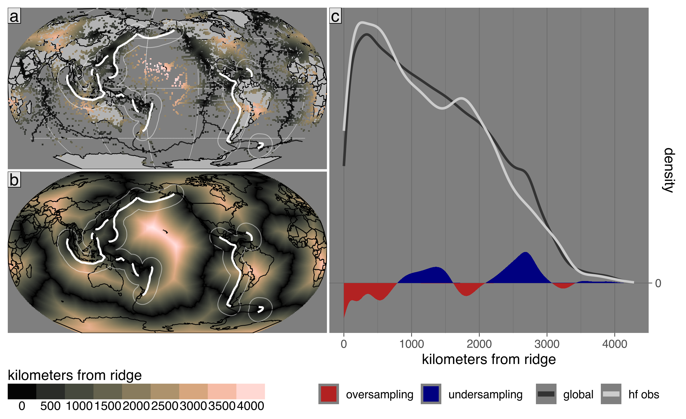

```


\end{landscape}


For Kriging, ideal survey target sites should provide the most regular coverage over a region of interest (e.g. a particular subduction zone segment). Evaluating surface heat flow distributions across upper-plate sectors offers opportunities for discovering future survey targets by identifying the least-constrained sectors. For example, segments with the greatest Similarity-Kriging discrepancies among sectors tend to have: (1) very few ThermoGlobe data (e.g. Alaska Aleutians, N Philippines, New Britain Solomon, S Philippines), (2) highly-irregular spatial coverage of ThermoGlobe data (e.g. Andes, Central America, Lesser Antilles), or (3) complex upper-plate tectonics (Vanuatu). A simple query of the ThermoGlobe dataset by sector can identify individual sectors with low or highly-irregular observational density or large Similarity-Kriging discrepancies. Thus, current observational gaps in regional surface heat flow can be efficiently identified by comparing independent interpolation methods within multiple-sectors.

### Comparing Similarity and Kriging Accuracies

Neither error rates nor first principles favor Similarity vs. Kriging on regional (10$^2$ to 10$^3$ km) scales. Rather, both methods are successfully generalizable and appropriate for subduction zone research. While some segments do show large discrepancies between Similarity and Kriging error rates (e.g. Scotia), low error rates do not necessarily imply more accurate predictions. For Scotia, few observations naturally lead to overfitting and low error rates, but choosing different Kriging parameters and/or highly localizing Kriging can also unintentionally overfit ThermoGlobe data and compromise regional interpolation accuracy. At `r round(mean(v.opt$rmse.krige/rmse.luca$rmse), 1)` times greater error rates than Similarity on average, however, Kriging error rates do not suggest overfitting is prevalent (Tables \@ref(tab:vgrmSummaryTable) and \@ref(tab:vgrmSummaryTableLong)).

Differences in error rates notwithstanding, Similarity has a distinct advantage compared to Kriging when applied to regions with relatively low observational density and/or highly-irregular spatial coverage. For example, Similarity predictions appear to be remarkably consistent with known tectonic features even in cases with few observations (e.g. Scotia and New Britain Solomon, Figures \@ref(fig:scotiaDiff) & \@ref(fig:newBritainSolomonDiff)). Integrating geologic proxies is therefore preferred when limited observations preclude practically useful Kriging interpolations.

### Layered Interpolation Approach

Similarity and Kriging interpolations are distinguishable by eye at the regional scale (e.g. compare Figures \@ref(fig:centralAmericaDiff), \@ref(fig:kyushuRyukyuDiff), and \@ref(fig:scotiaDiff) with the remaining segments in Appendices \@ref(interpDiffAppendix) & \@ref(lateralDiffAppendix)). The same unique properties of Similarity and Kriging methods that make them quickly discernible by eye can be independently leveraged. For example, because Similarity is inherently agnostic to the spatial configuration of observations [@goutorbe2011], accurate interpolations with well-defined plate boundaries are still possible for regions with relatively few observations (e.g. Scotia and New Britain Solomon, Figures \@ref(fig:scotiaDiff) & \@ref(fig:newBritainSolomonDiff)). Since surface heat flow observations near subduction zone segments are commonly sparse and irregularly spaced, spatial-independence from observations is a desirable property to maintain during the interpolation process.

On the other hand, conserving the "ground-truth" is an equally desirable property. Local ordinary Kriging conserves ground-truth by remaining agnostic to all other factors but the spatial configuration of surface heat flow observations (see Appendix \@ref(krigeOpt)). For example, Kriging resolves tectonic features near Tonga New Zealand and Vanuatu that are discordant with Similarity predictions, yet compatible with ThermoGlobe data (Figures \@ref(fig:tongaNewZealandDiff) & \@ref(fig:vanuatuDiff)). Another example is the young Cocos Plate near Central America where Similarity predicts relatively high heat flow by proximity to two spreading centers and young oceanic plate age, yet observations of anomalously low surface heat flow [e.g. @hutnak2008] constrain Kriging predictions to low values. Such contrasting predictions imply ThermoGlobe data violate one or more geologic proxy data sets used by Similarity. In other words, Kriging will tend to highlight anomalies (compared to Similarity) if they exist and have been observed.

In principle, carefully layering Similarity and Kriging methods may combine their properties to produce more accurate regional interpolations in the future. A layered approach simultaneously respects the First [@krige1951] and Third Laws of Geography [@zhu2018] by integrating geologic and spatial information. Many methods may be applied to combine Similarity and Kriging predictions. As a basic example: (1) compare Similarity and Kriging layers to detect anomalies, (2) compute weights proportional to the squared difference between Similarity and Kriging predictions to emphasized or subdue anomalies, (3) combine Similarity and Kriging layers using a weighted average scheme.

## Conclusions

This study evaluates regional patterns of surface heat flow near subduction zones by comparing Similarity and Kriging interpolations across adjacent upper-plate sectors. Methodological differences between Similarity and Kriging yield both similar and disparate predicted heat flow distributions and profiles among subduction zones. Four key conclusions arise from regional surface heat flow near active subduction zones:

1. Accurate regional interpolations of irregularly-spaced ThermoGlobe data are key to understanding broad (segment-scale) variations in lithospheric thermal structure near subduction zones.
2. Mixed upper-plate surface heat flow distributions and profiles imply various degrees of regional continuity among subduction zones in terms of their lithospheric thermal structure [contrary to expectations from @kerswell2021], heat-transferring subsurface dynamics, and/or observational density relative to the local spatial variability of surface heat flow.
3. Future surface heat flow surveys can maximize Similarity and Kriging accuracies by carefully considering the existing spatial distribution of surface heat flow observations and their distribution within geologic proxy parameter space.
4. Layered interpolation approaches may produce more accurate surface heat flow predictions by combining the independently-advantageous properties of Similarity and Kriging methods.

\cleardoublepage

```{r loadChpt4}
pd15 <- read_csv('assets/r/chpt4/pd15.csv', col_types = cols())
pd15.P <- pd15 %>% arrange(P) %>% mutate(prob = (row_number()-1)/n())
pd15.T <- pd15 %>% arrange(T) %>% mutate(prob = (row_number()-1)/n())
pd15.grad <- pd15 %>% arrange(grad) %>% mutate(prob = (row_number()-1)/n())
ag18 <- read_csv('assets/r/chpt4/ag18.csv', col_types = cols())
ag18.P <- ag18 %>% arrange(P) %>% mutate(prob = (row_number()-1)/n())
ag18.T <- ag18 %>% arrange(T) %>% mutate(prob = (row_number()-1)/n())
ag18.grad <- ag18 %>% arrange(grad) %>% mutate(prob = (row_number()-1)/n())
stats.summary <-
  read_csv('assets/r/chpt4/classification_stats_summary.csv', col_types = cols())
models <- stats.summary$model
# Summarise marker cdfP
cdfP.summary <-
  marx.firsttype.summary %>%
  filter(recovered) %>%
  select(maxP) %>%
  arrange(maxP) %>%
  mutate(prob = (row_number()-1)/n())
# Summarise marker cdfT
cdfT.summary <-
  marx.firsttype.summary %>%
  filter(recovered) %>%
  select(maxT) %>%
  arrange(maxT) %>%
  mutate(prob = (row_number()-1)/n())
# Summarise marker cdfT
cdfGrad.summary <-
  marx.firsttype.summary %>%
  filter(recovered) %>%
  select(maxGrad) %>%
  arrange(maxGrad) %>%
  mutate(prob = (row_number()-1)/n())
```

# Computing Rates and Distributions of Rock Recovery in Subduction Zones {#chpt4}

\markboth{Chapter 4: Marker Recovery}{Chapter 4: Marker Recovery}

## Abstract {#chpt4Abstract}

Bodies of rock that are detached (recovered) from subducting oceanic plates and exhumed to Earth's surface become invaluable records of the mechanical and chemical processing of subducted material. Well-studied bodies of exhumed \gls{hp} rocks provide insights into the nature of rock recovery, yet various interpretations concerning thermal gradients, recovery rates, and recovery depths arise when directly comparing the rock record with numerical simulations of subduction. Constraining recovery rates and depths directly from the rock record relies on small sample sizes of \gls{hp} rocks---making statistical inference weak. As an alternative approach, this study implements a "soft" clustering classification algorithm to identify rock recovery in numerical simulations of oceanic-continental convergence. Over one million markers are traced and classified from 64 simulations representing a large range of presently active subduction zones on Earth. Marker \gls{pt} distributions are compared across models and with the rock record to address the following three questions: how do recovery rates vary among subduction zones? How is recovery distributed along the plate interface? How does recovery vary among subduction zones and through time? Recovery pressures (depths) correlate strongly with convergence velocity and moderately with oceanic plate age, while \gls{pt} gradients correlate strongly with oceanic plate age and upper-plate thickness. Recovery rates strongly correlate with upper-plate thickness, yet show no correlation with other initial conditions. Likewise, \gls{pt} distributions of recovered markers show variable compatibility with the rock record depending on the collection of natural samples and suite(s) of numerical experiments. A significant gap in predicted marker recovery is found near 2 GPa and 550 $^{\circ}$C, coinciding with the highest density of exhumed \gls{hp} rocks. Implications for such a gap in marker recovery include a simplified numerical model that fails to capture the full range of recovery mechanisms, inconsistent thermal gradients compared to natural samples, and a relative overabundance of rocks studied from around 2 GPa and 550 $^{\circ}$C (scientific bias).

## Introduction {#chpt4Intro}

Maximum \gls{pt} conditions have been estimated for hundreds of \gls{hp} metamorphic rocks exhumed from subduction zones [Figure \@ref(fig:rockPTComp), @agard2018; @penniston2015; @hacker1996]. Metamorphic rocks (the *rock record*) are the only tangible evidence of \gls{pt}-strain fields experienced by Earth's lithosphere during deformation and chemical processing in subduction zones. Together with geophysical imaging [e.g. @bostock2013; @ferris2003; @naif2015; @hyndman2003; @syracuse2006; @rondenay2008; @mann2022], surface heat flow [e.g. @currie2006; @gao2014; @wada2009; @hyndman2005; @kohn2018; @morishige2020], and forward numerical modelling [e.g. @gerya2002; @gerya2006; @gerya2008; @sizova2010; @syracuse2010; @yamato2007; @yamato2008; @hacker2003; @peacock1990; @peacock1996; @mckenzie1969; @kerswell2021], the rock record underpins contemporary understandings of subduction geodynamics [e.g. @agard2009; @agard2021; @bebout2007].

(ref:rockPTCompCap) Distributions of \gls{pt} estimates from the rock record. (a) Pressure vs. temperature diagram showing the densities of pd15 [solid contours, @penniston2015] and ag18 [filled contours, @agard2018] datasets. Thin lines are thermal gradients labeled in $^{\circ}$C/km. Reaction boundaries for eclogitization of oceanic crust and antigorite dehydration are from @ito1971 and @schmidt1998, respectively. (b-d) Cumulative probability diagrams of pd15 and ag18 imply relatively uniform recovery of rocks across \gls{pt} space with distinct abundances of different rock types. Metamorphic facies: (1) forbidden zone ($\leq$ 5 $^{\circ}$C/km), (2) lws/ep blueschist to eclogite (5-15 $^{\circ}$C/km), (3) greenschist to amphibolite (15-30 $^{\circ}$C/km), (4) amphibolite to granulite ($\geq$ 30 $^{\circ}$C/km). Note that ag18 [no HT] excludes samples above 20 $^{\circ}$C/km.

```{r rockPTComp, fig.cap='(ref:rockPTCompCap)', fig.scap='Compiled \\gls{pt} estimates from the rock record'}

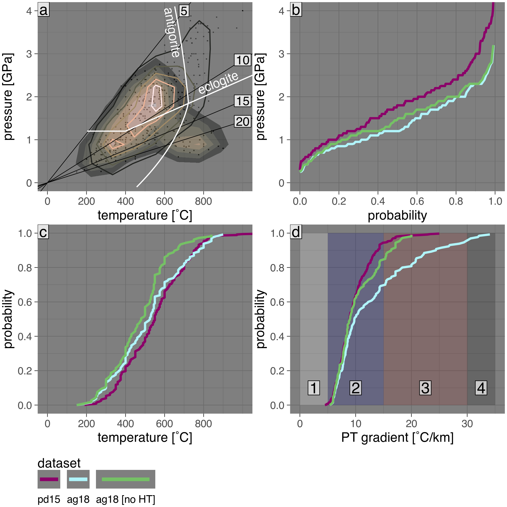

```

However, it remains difficult to directly interpret the rock record in terms of recovery rates and distributions along the plate interface. For example, large compilations of \gls{pt} estimates representing the global distribution of \gls{hp} rocks exhumed during the Phanerozoic [the pd15 and ag18 datasets, @agard2018; @penniston2015] reveal a kinked \gls{cdf} with respect to pressure (Figure \@ref(fig:rockPTComp)b). A smooth linear \gls{cdf} curve (not step-like) interrupted by a sharp change in slope around `r round(tail(ag18.P$P[ag18.P$prob <= 0.9], 1), 1)`-`r round(tail(pd15.P$P[pd15.P$prob <= 0.8], 1), 1)` GPa implies relatively uniform recovery of subducting material up to `r round(tail(ag18.P$P[ag18.P$prob <= 0.9], 1), 1)`-`r round(tail(pd15.P$P[pd15.P$prob <= 0.8], 1), 1)` GPa, but increasingly rare recovery above `r round(tail(ag18.P$P[ag18.P$prob <= 0.9], 1), 1)`-`r round(tail(pd15.P$P[pd15.P$prob <= 0.8], 1), 1)` GPa [@agard2018; @kerswell2021; @plunder2015; @monie2009]. While evidence for common mechanical coupling depths among presently active subduction zones near 2.3 GPa [@furukawa1993; @wada2009; @kerswell2021] is consistent with the distribution of recovery depths implied by pd15 and ag18 (Figure \@ref(fig:rockPTComp)b), upper-plate surface heat flow patterns presented in Chapter \@ref(chpt3) are generally inconsistent with uniform coupling depths, and geophysical constraints on mechanical transitions likely to induce rock recovery are still being revised [e.g. @abers2020; @audet2016; @audet2018; @morishige2020].

Moreover, different compilations of \gls{pt} estimates show relative density variations across \gls{pt} space. For example, @agard2018 note that compilations from @plunder2015 and @groppo2016 show less dispersion (i.e. a more step-like \gls{cdf}) than ag18 with tighter bi- or trimodal distributions clustering around important transitions along the plate interface. These peaks (modes) in the distribution of exhumed \gls{hp} rocks are inferred to coincide with the continental Moho at approximately 25-35 km and the transition to mechanical plate coupling at approximately 80 km [@agard2018; @plunder2015; @monie2009]. Less consensus explains a smaller, yet significant, intermediate mode at 55-60 km [@agard2009; @agard2018; @plunder2015]. This intermediate mode (at 55-60 km) coincides closely with a high density region of \gls{pt} estimates in the pd15 dataset.

Differences in compiled \gls{pt} datasets notwithstanding, key observations regarding rock recovery in subduction zones emerge from pd15 and ag18:

> | \uline{Key observations from the rock record:}
> |
> |  1. Rocks are recovered relatively uniformly up to 2.5 GPa
> |  2. `r round(abs(ag18.P$prob[which.min(abs(ag18.P$P-2.5))]-ag18.P$prob[which.min(abs(ag18.P$P-1))])*100)`-`r round(abs(pd15.P$prob[which.min(abs(pd15.P$P-2.5))]-pd15.P$prob[which.min(abs(pd15.P$P-1))])*100)`% of recovered rocks equilibrated between 1-2.5 GPa
> |  3. `r round((1-ag18.P$prob[which.min(abs(ag18.P$P-2.5))])*100)`-`r round((1-pd15.P$prob[which.min(abs(pd15.P$P-2.5))])*100)`% of recovered rocks equilibrated above 2.5 GPa
> |  4. `r round(abs(ag18.T$prob[which.min(abs(ag18.T$T-500))]-ag18.T$prob[which.min(abs(ag18.T$T-350))])*100)`-`r round(abs(pd15.T$prob[which.min(abs(pd15.T$T-500))]-pd15.T$prob[which.min(abs(pd15.T$T-350))])*100)`% of recovered rocks equilibrated between 350-500 $^{\circ}$C
> |  5. `r round((1-ag18.T$prob[which.min(abs(ag18.T$T-625))])*100)`-`r round((1-pd15.T$prob[which.min(abs(pd15.T$T-625))])*100)`% of recovered rocks equilibrated above 625 $^{\circ}$C
> |  6. `r round(abs(ag18.grad$prob[which.min(abs(ag18.grad$grad-10))]-ag18.grad$prob[which.min(abs(ag18.grad$grad-5))])*100)`-`r round(abs(pd15.grad$prob[which.min(abs(pd15.grad$grad-10))]-pd15.grad$prob[which.min(abs(pd15.grad$grad-5))])*100)`% of recovered rocks record gradients between 5-10 $^{\circ}$C/km
> |  7. `r round(abs(ag18.grad$prob[which.min(abs(ag18.grad$grad-10))]-ag18.grad$prob[which.min(abs(ag18.grad$grad-15))])*100)`-`r round(abs(pd15.grad$prob[which.min(abs(pd15.grad$grad-10))]-pd15.grad$prob[which.min(abs(pd15.grad$grad-15))])*100)`% of recovered rocks record gradients between 10-15 $^{\circ}$C/km
> |  8. `r round((1-pd15.grad$prob[which.min(abs(pd15.grad$grad-15))])*100)`-`r round((1-ag18.grad$prob[which.min(abs(ag18.grad$grad-15))])*100)`% of recovered rocks record gradients above 15 $^{\circ}$C/km

\noindent These ranges in the relative abundances of exhumed \gls{hp} rocks compiled in different datasets raise important questions in subduction zone research: are rocks recovered broadly and uniformly along the plate interface or discretely from certain depths? How do recovery rates and \gls{pt} distributions change across diverse subduction zone systems and through time?

Previous work comparing the rock record directly with numerical models has generally produced ambiguous interpretations concerning recovery rates and distributions along the plate interface. For example, comparisons of different geodynamic codes with diverse subsets of the rock record show various extents of agreement in terms of overlapping \gls{pt} paths and thermal gradients [e.g. @angiboust2012b; @penniston2015; @yamato2007; @yamato2008; @roda2010; @roda2012; @burov2014; @ruh2015; @plunder2018; @roda2020; @holt2021]. Initial setups for numerical experiments [oceanic plate age, convergence velocity, subduction dip angle, upper-plate thickness, and heating sources\; @kohn2018; @ruh2015; @penniston2015; @vankeken2019], differential recovery rates from subduction zones with favorable thermo-kinematic boundary conditions [@abers2017; @vankeken2018], and comparisons among suites of undifferentiated \gls{hp} rocks [e.g. grouping rocks recovered during subduction initiation with rocks recovered during "steady-state" subduction, see @agard2018; @agard2020] all potentially contribute to nonoverlapping \gls{pt} distributions and thermal gradients. Compounding the ambiguity are arguments that material is sporadically recovered during short-lived mechanical transitions [@agard2016] and/or geodynamic changes [@monie2009]---implying compilations of exhumed \gls{hp} rocks may not randomly sample of \gls{pt} conditions along the plate interface. Such ambiguities warrant further investigation into the general response of recovery rates and distributions along the plate interface to broad ranges of thermo-kinematic boundary conditions.

Fortunately, clues about the nature and \gls{pt} limits of rock recovery are provided by many extensively studied examples of exhumed plate interfaces [e.g. @agard2018; @cloos1988; @monie2009; @platt1986; @tewksbury2021a; @ioannidi2020; @plunder2013; @plunder2015; @angiboust2011; @angiboust2015; @kitamura2012; @wakabayashi2015; @fisher2021; @kotowski2019; @locatelli2019; @okay1989; @angiboust2015]. However, these type localities represent an unknown fraction of subducted material and differ significantly in terms of their geometry, composition (rock types), and interpreted deformation histories (recovery & exhumation). It is also unclear to what extent ag18 and pd15 (and other smaller compilations or subsets) represent the full range of conditions suitable for rock recovery and/or represent scientific sampling bias [e.g. rocks are more frequently resampled from the same pristine exposures than from other localities, @agard2018]. Thus, a primary challenge to inferring recovery rates and distributions accurately from the rock record fundamentally stems from small nonrandom samples (typically less than a few dozen \gls{pt} estimates from any given exhumed terrane) compared to the possibly large range of conditions suitable for rock recovery.

This study aims to address the problem of small nonrandom samples by tracing over one million (`r format(nrow(marx.firsttype.summary), big.mark = ',')`) Lagrangian markers from 64 numerical geodynamic models [@kerswell2021]. This large \gls{pt} dataset is insensitive to outliers and represents a statistically robust picture of recovery rates and \gls{pt} distributions in subduction zones for this particular type of model. Clear correlations are found among recovery rates, \gls{pt} distributions, and thermo-kinematic boundary conditions that define a range of plausible conditions for reproducing the rock record. Moreover, an unexpected gap in marker recovery is found coinciding with the highest densities of natural samples around 2 GPa and 550 $^{\circ}$C. Implications for a gap in marker recovery are discussed, including insufficient implementation of recovery mechanisms in numerical models and a potential overabundance of natural samples studied from around 2 GPa and 550 $^{\circ}$C (scientific bias).

## Methods {#chpt4Methods}

This study presents a dataset of Lagrangian markers (described below) from numerical experiments that simulate 64 oceanic-continental convergent margins with thermo-kinematic boundary conditions (oceanic plate age, convergence velocity, and upper-plate lithospheric thickness). These experiments closely represent the range of presently active subduction zones [@syracuse2006; @wada2009]. Initial conditions were modified from previous studies of active margins [@sizova2010; @gorczyk2007] using the geodynamic code `I2VIS` [@gerya2003]. `I2VIS` models visco-plastic flow of geologic materials by solving conservative equations of mass, energy, and momentum on a fully-staggered finite difference grid with a *marker-in-cell* technique [e.g. @harlow1965]. Further details about the initial setup, boundary conditions, and rheologic model are presented in @kerswell2021. Details about `I2VIS` and example code are presented in @gerya2003 and @gerya2019.

The following section defines Lagrangian markers (now referred to as *markers*) and briefly elaborates on their usefulness in understanding flow of geologic materials, followed by a description of the marker classification algorithm. A full mathematical description of the classification algorithm is presented in Appendix \@ref(gmm).

### Lagrangian Markers

Markers are mathematical objects representing discrete parcels of material flowing in a continuum [@harlow1962; @harlow1964]. Tracing markers (saving marker information at each timestep) is distinctly advantageous for investigating subduction dynamics in the following two ways.

First, modelling subduction requires solving equations of mass, motion, and heat transport in a partly layered, partly heterogeneous, high-strain region known as the *plate interface*, *subduction interface*, or *subduction channel* [@gerya2002]. Current conceptual models regard the plate interface as a visco-plastic continuum with complex geometry and structure, sharp thermal, chemical, and strain gradients, strong advection, and abundant fluid flow [@agard2016; @agard2018; @bebout2002; @bebout2007; @gerya2003; @penniston2015; @tewksbury2021a; @cloos1988; @stockhert2002; @shreve1986]. Finite-difference numerical approaches do not perform well with strong local gradients, and interpolating and updating temperature, strain, and chemical fields with markers greatly improves accuracy and stability of numerical solutions [@gerya2003; @gerya2019; @moresi2003].

Second, tracing a marker closely proxies for tracing a rock's \gls{pt}-time history. Strictly speaking, some deviations in calculated \gls{pt}-time histories are possible because our models make assumptions, including: (1) markers move in an incompressible continuum [@batchelor1953; @boussinesq1897], (2) marker material properties are governed by a simple petrologic model describing eclogitization of oceanic crust [@ito1971] and (de)hydration of upper mantle [$antigorite \allowbreak \Leftrightarrow olivine + orthopyroxene + H_{2}O$, @schmidt1998], and (3) marker stress and strain are related by a highly non-linear rheologic model derived from empirical flow laws [@hilairet2007; @ranalli1995; @karato1993; @turcotte2002]. For example, if rocks were highly compressible or could sustain large deviatoric stresses, pressures and temperatures might be different. However, insofar as Earth's lithosphere closely behaves like an incompressible visco-plastic fluid [under the assumptions above, @gerya2019; @kerswell2021; @gerya2003], comparisons between marker \gls{pt} distributions and the rock record may be made.

### Marker Classification

For each numerical experiment, `r format(nrow(marx.firsttype.summary[marx.firsttype.summary$model == 'cda46',]), big.mark = ',')` markers were initially selected from within a 760 km-long and 8 km-deep section of oceanic crust and seafloor sediments at $t$ = 0 Ma. Tracing proceeded for 115 timesteps (between `r round(min(marx.class.summary$time.maxP[marx.class.summary$tstar.maxP == 1])/1e6, 1)`-`r round(max(marx.class.summary$time.maxP[marx.class.summary$tstar.maxP == 1])/1e6, 1)` Ma depending on convergence velocity), which was sufficient for markers to be potentially subducted very deeply (up to 300 km) from their initial positions. However, only markers that detached from the subducting oceanic plate were relevant for comparison with \gls{pt} estimates of natural rocks (because such markers and rocks were not subducted). The main challenge, therefore, was to first develop a method for determining which markers among `r format(nrow(marx.firsttype.summary[marx.firsttype.summary$model == 'cda46',]), big.mark = ',')` detached and moved away from the subducting plate without knowing their fate *a priori*. Moreover, the method needed to be generalizable to a large range of numerical experiments. Note that markers that detach were classified as "recovered" even if they do not exhume to the surface in the modelling domain. The rationale is that diverse processes can cause exhumation of subduction zone rocks, including later tectonic events. Although not all detached markers might ever exhume, they all could be exhumed, in contrast to markers that clearly do not detach.

Classifying markers as either "recovered" or "not recovered" based solely on their undifferentiated traced histories defines an unsupervised classification problem [@barlow1989]. To solve the unsupervised classification problem, this study implemented a Gaussian mixture model [@reynolds2009]---a type of "soft" clustering algorithm used extensively for pattern recognition, anomaly detection, and estimating complex probability distribution functions [e.g. @banfield1993; @celeux1995; @figueiredo2002; @fraley2002; @vermeesch2018]. In this case, a Gaussian mixture model organizes markers into groups (clusters) by fitting $k$ = 14 bivariate Gaussian ellipsoids to the distribution of markers in \gls{pt} space. "Fitting" refers to adjusting parameters (centroids and covariance matrices) of all $k$ Gaussian ellipsoids until the ellipsoids and data achieve maximum likelihood (see Appendix \@ref(gmm) for a full mathematical description). Finally, marker clusters with centroids located within certain bounds are classified as "recovered". The entire classification algorithm can be summarised as follows:

> | \uline{Classifier algorithm:}
> |
> |  0. Select markers within a 760 $km\ \times$ 8 km section of oceanic crust
> |  1. Trace markers for 115 timesteps
> |  2. Identify maximum marker \glspl{pt}
> |  3. Apply Gaussian mixture modelling to maximum marker \glspl{pt}
> |  5. Check for cluster centroids within the bounds:
> |     $\geq$ 3 $^{\circ}$C/km AND $\leq$ 1300 $^{\circ}$C AND $\leq$ 120 km\ (3.4 GPa)
> |  6. Classify marker clusters found in step 5 as recovered
> |  7. Classify all other markers as subducted

\noindent Note that maximum marker \glspl{pt} used for clustering are assessed before markers transform (dehydrate or melt) and before the accretionary wedge toe collides with the high-viscosity convergence region positioned at 500 km from the left boundary (to avoid spurious maximum \glspl{pt} from sudden isothermal burial). "Hard" classification is possible by directly applying simple rules to markers without clustering [e.g. @roda2012]. However, "hard" methods are less generalizable than "soft" approaches like Gaussian mixture models, which can be implemented to study many possible features in numerical simulations with Lagrangian reference frames---not just recovery of subducted material. Figures \@ref(fig:class) & \@ref(fig:bigComp) illustrate marker classification for 1 of 64 numerical experiments. All other experiments are presented in Appendix \@ref(vis).

### Recovery Modes

To better understand how rock recovery can vary among subduction zones with different boundary conditions, important modes of marker recovery were determined by finding peaks in marker density with respect to \gls{pt} and thermal gradients. The tallest density peak (mode1) gives a sense of where the greatest abundance of markers are being recovered from. The deepest, or warmest, density peak (mode2) gives a sense of how the most deeply subducted markers (or markers with the highest thermal gradients) vary across different numerical experiments.

Note that correlations are not presented with respect to the thermal parameter $\Phi$ ($\Phi$ = $age \cdot \vec{v}$), unlike many studies. The rationale is three-fold: (1) the aim is to understand how oceanic plate age and convergence velocity affect marker recovery independently, (2) sample sizes of recovered markers are larger when grouped by oceanic plate age and convergence velocity (n = `r format(nrow(marx.firsttype.summary[marx.firsttype.summary$cv == 40,]), big.mark = ',')`) compared to grouping by $\Phi$ (n = `r format(nrow(marx.firsttype.summary[marx.firsttype.summary$phi == 13,]), big.mark = ',')`), and (3) $\Phi$ itself was formulated from a general relationship among thermo-kinematic boundary conditions to explain differences in earthquake distributions [@molnar1979; @kirby1991; @gorbatov1997; @mckenzie1969], and likely never intended as a precise tool for investigating subduction geodynamics. Indeed, correlations drawn among $\Phi$ and thermo-kinematic boundary conditions in this study (not presented) are ambiguous and their inclusion detracts from the correlations drawn independently with respect to oceanic plate age and convergence velocity.

(ref:classCap) Example of marker classification for model cde62. (a) Pressure vs. temperature diagram showing distributions of 14 marker clusters (`r format(nrow(marx.firsttype.summary[marx.firsttype.summary$model == 'cde62',]), big.mark = ',')` markers) as assigned by Gaussian mixture modelling. Markers belonging to clusters with centroids positioned at $\geq$ 3 $^{\circ}$C/km AND $\leq$ 1300 $^{\circ}$C AND $\leq$ 120 km (3.4 GPa) are classified as recovered. All others are classified as not recovered. Thin lines are thermal gradients labeled in $^{\circ}$C/km. (b) Pressure vs. temperature diagram showing marker classification in comparison with the pd15 and ag18 datasets. In this experiment, markers are generally recovered from thermal gradients between 5-10 $^{\circ}$C/km, but very few are recovered from the high-density region shared by pd15 and ag18 around 2 GPa and 550 $^{\circ}$C (light-pink density contours, solid and filled).

```{r class, fig.cap='(ref:classCap)', fig.scap='Example of marker classification for model cde62'}

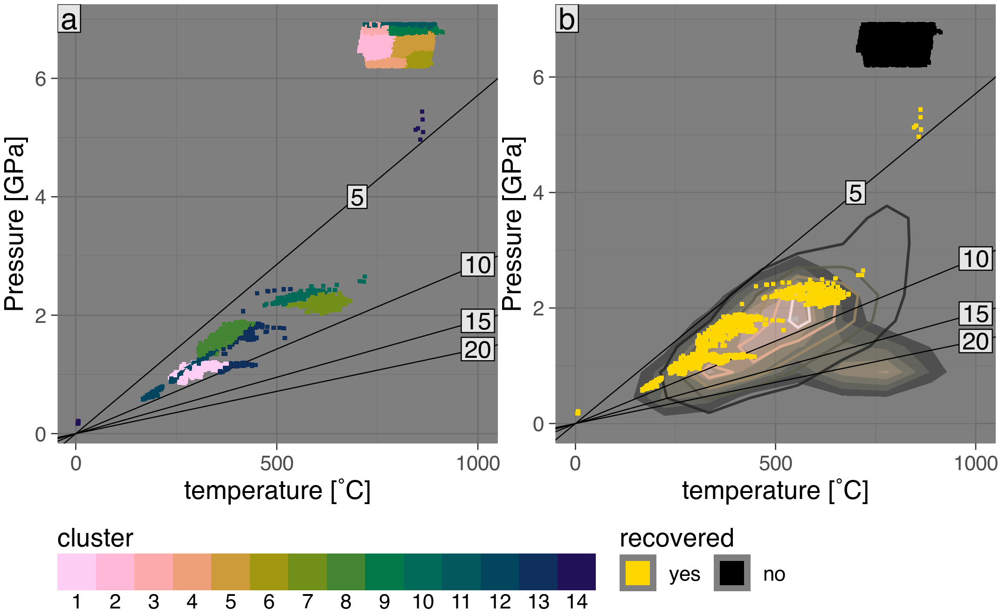

```

(ref:bigCompCap) Summary of classification results for model cde62. (a) Pressure vs. temperature diagram showing the density of recovered markers (point cloud and blue Tanaka contours) in comparison with the pd15 (solid density contours) and ag18 (filled density contours) datasets. Thin lines are thermal gradients labeled in $^{\circ}$C/km. Reaction boundaries for eclogitization of oceanic crust and antigorite dehydration are from @ito1971 and @schmidt1998, respectively. (b-d) Cumulative probability diagrams showing step-like curves that indicate trimodal recovery pressures (depths), bimodal recovery temperatures, and a smooth curve indicating almost all markers (`r round(abs(cdfGrad.summary$prob[which.min(abs(cdfGrad.summary$maxGrad*1e3-5))]-cdfGrad.summary$prob[which.min(abs(cdfGrad.summary$maxGrad*1e3-15))])*100)`%) are recovered from thermal gradients between 5-10 $^{\circ}$C/km compared to pd15 (`r round(abs(pd15.grad$prob[which.min(abs(pd15.grad$grad-5))]-pd15.grad$prob[which.min(abs(pd15.grad$grad-15))])*100)`%) and ag18 (`r round(abs(ag18.grad$prob[which.min(abs(ag18.grad$grad-5))]-ag18.grad$prob[which.min(abs(ag18.grad$grad-15))])*100)`%). (e) Visualization of log viscosity showing the major modes of marker recovery along the plate interface. Marker density is concentrated along relatively cool thermal gradients and within three distinct regions coinciding with the continental Moho (about 1 GPa), the onset of plate coupling (about 2.3 GPa and 625 $^{\circ}$C, and an intermediate cluster around 1.6 GPa and 350 $^{\circ}$C.


\begin{landscape}


```{r bigComp, fig.cap='(ref:bigCompCap)', fig.scap='Summary of classification results for model cde62'}

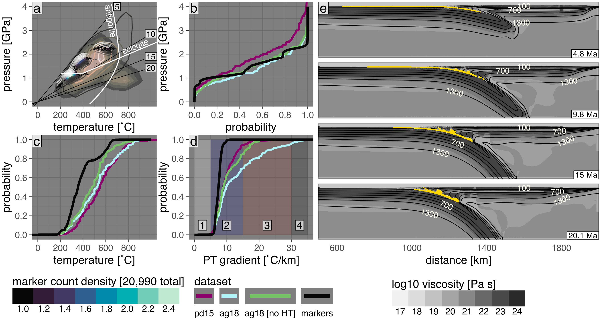

```


\end{landscape}


## Results {#chpt4Results}

### PT Distributions of Recovered Markers

Recovered markers generally overlap with pd15 and ag18 in terms of absolute \gls{pt} range, but show different density distributions across \gls{pt} space (Figure \@ref(fig:marxComp)). Significant differences become evident when comparing markers recovered from individual numerical experiments with the rock record vs. combining results of experiments. For example, many numerical experiments show nonuniform marker recovery, evident by segregated high-density peaks and step-like \glspl{cdf} (e.g. Figure \@ref(fig:bigComp)). Combining recovered markers from multiple numerical experiments (analogous to randomly sampling exhumed \gls{hp} rocks from different subduction zones) effectively fills in density gaps and presents a smoother picture of marker recovery across \gls{pt} space.

Whether comparing the rock record with individual numerical experiments, suites of experiments, or all numerical experiments, several key observations emerge from recovered markers:

\pagebreak

> | \uline{Key observations from recovered markers:}
> |
> |  1. Recovered markers from individual numerical experiments show bi-
> |     or trimodal recovery from discrete \gls{pt} regions with step-like \glspl{cdf}
> |     (Figure \@ref(fig:bigComp) & Appendix \@ref(vis))
> |
> |  2. A significant gap in marker recovery exists around 2 GPa and 550 $^{\circ}$C
> |     that coincides with the highest density of natural samples (Figure \@ref(fig:marxComp)a)
> |
> |  3. Markers are recovered from a single major mode near 1 GPa and a
> |     minor mode near 2.5 GPa with a high rate of recovery from lower
> |     pressures (`r round(cdfP.summary$prob[which.min(abs(cdfP.summary$maxP-(1.5e4)))]*100)`% from $\leq$ 1.5 GPa) compared to natural samples (`r round(pd15.P$prob[which.min(abs(pd15.P$P-1.5))]*100)`-`r round(ag18.P$prob[which.min(abs(ag18.P$P-1.5))]*100)`%
> |     from $\leq$ 1.5 GPa, Figure \@ref(fig:marxComp)b)
> |
> |  4. Markers are recovered from a single major mode near 350 $^{\circ}$C and a
> |     minor mode near 625 $^{\circ}$C with a high rate of recovery from lower
> |     temperatures (`r round(cdfT.summary$prob[which.min(abs(cdfT.summary$maxT-(273+500)))]*100)`% from $\leq$ 500 $^{\circ}$C) compared to natural samples (`r round(pd15.T$prob[which.min(abs(pd15.T$T-500))]*100)`-
> |     `r round(ag18.T$prob[which.min(abs(ag18.T$T-500))]*100)`% from $\leq$ 500 $^{\circ}$C, Figure \@ref(fig:marxComp)c)
> |
> |  5. The relative abundance of markers recovered along "typical" thermal
> |     gradients for subduction zones (`r round(cdfGrad.summary$prob[which.min(abs(cdfGrad.summary$maxGrad*1e3-15))]*100)-round(cdfGrad.summary$prob[which.min(abs(cdfGrad.summary$maxGrad*1e3-5))]*100)`% from 5-15 $^{\circ}$C/km) is greater than
> |     natural samples (`r round(ag18.grad$prob[which.min(abs(ag18.grad$grad-15))]*100)-round(ag18.grad$prob[which.min(abs(ag18.grad$grad-5))]*100)`-`r round(pd15.grad$prob[which.min(abs(pd15.grad$grad-15))]*100)-round(pd15.grad$prob[which.min(abs(pd15.grad$grad-5))]*100)`% from 5-15 $^{\circ}$C/km, Figure \@ref(fig:marxComp)d)
> |
> |  6. Few markers are recovered from the forbidden zone (`r round(cdfGrad.summary$prob[which.min(abs(cdfGrad.summary$maxGrad*1e3-5))]*100)`% from $\leq$ 5
> |     $^{\circ}$C/km, Figure \@ref(fig:marxComp)d)
> |
> |  7. Virtually no markers (`r round((1-cdfGrad.summary$prob[which.min(abs(cdfGrad.summary$maxGrad*1e3-15))])*100, 3)`%) are recovered from $\geq$ 15 $^{\circ}$C/km
> |     compared to natural samples (`r round((1-pd15.grad$prob[which.min(abs(pd15.grad$grad-15))])*100)`-`r round((1-ag18.grad$prob[which.min(abs(ag18.grad$grad-15))])*100)`% from $\geq$ 15 $^{\circ}$C/km, Figure \@ref(fig:marxComp)d)

(ref:marxCompCap) Recovered markers from all 64 simulations. (a) Pressure vs. temperature diagram showing the densities of recovered markers (point cloud and blue Tanaka contours) in comparison with the pd15 [solid contours, @penniston2015] and ag18 [filled contours, @agard2018] datasets. Thin lines are thermal gradients labeled in $^{\circ}$C/km. Reaction boundaries for eclogitization of oceanic crust and antigorite dehydration are from @ito1971 and @schmidt1998, respectively. (b-d) Cumulative probability diagrams showing single-step \glspl{cdf} that indicate high recovery rates from 0.8-1.5 GPa, $\leq$ 500 $^{\circ}$C, and $\leq$ 15 $^{\circ}$C/km compared to natural samples (`r round((cdfP.summary$prob[which.min(abs(cdfP.summary$maxP/1e4-1.5))]*100)-(cdfP.summary$prob[which.min(abs(cdfP.summary$maxP/0.8e4-1))]*100))`% vs. `r round(abs(pd15.P$prob[which.min(abs(pd15.P$P-0.8))]-pd15.P$prob[which.min(abs(pd15.P$P-1.5))])*100)`-`r round(abs(ag18.P$prob[which.min(abs(ag18.P$P-0.8))]-ag18.P$prob[which.min(abs(ag18.P$P-1.5))])*100)`%, `r round(cdfT.summary$prob[which.min(abs(cdfT.summary$maxT-273-500))]*100)`% vs. `r round(pd15.T$prob[which.min(abs(pd15.T$T-500))]*100)`-`r round(ag18.T$prob[which.min(abs(ag18.T$T-500))]*100)`%, > `r round(cdfGrad.summary$prob[which.min(abs(cdfGrad.summary$maxGrad*1e3-15))]*100, 2)`% vs. `r round(ag18.grad$prob[which.min(abs(ag18.grad$grad-15))]*100)`-`r round(pd15.grad$prob[which.min(abs(pd15.grad$grad-15))]*100)`%, respectively). Metamorphic facies: (1) forbidden zone ($\leq$ 5 $^{\circ}$C/km), (2) lws/ep blueschist to eclogite (5-15 $^{\circ}$C/km), (3) greenschist to amphibolite (15-30 $^{\circ}$C/km), (4) amphibolite to granulite ($\geq$ 30 $^{\circ}$C/km).

```{r marxComp, fig.cap='(ref:marxCompCap)', fig.scap='\\gls{pt} distribution of recovered markers from all simulations'}

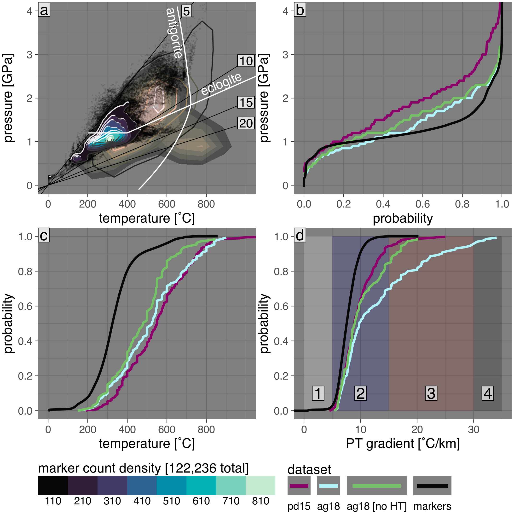

```

### Correlations with Boundary Conditions

#### Oceanic Plate Age Effect

The average thermal gradient of recovered markers correlates strongly with oceanic plate age. Both major \gls{pt} gradient modes (PT gradient mode1 & 2) correlate negatively with oceanic plate age, indicating an increase from about 6.5 $^{\circ}$C/km for old plates ($\geq$ 85 Ma) to about 8.5 $^{\circ}$C/km for younger plates ($\leq$ 55 Ma, Figure \@ref(fig:corrComp)). The dominant temperature mode (temperature mode1) does not correlate with oceanic plate age, yet markers recovered from temperatures well in excess of 350 $^{\circ}$C (temperature mode2) show a small, but significant, inverse correlation. The dominant pressure mode (pressure mode1) weakly correlates with oceanic plate age, indicating a slightly higher chance of recovery from beyond the continental Moho for the oldest oceanic plates ($\geq$ 85 Ma). In summary, oceanic plate age primarily affects the average \gls{pt} trajectory of recovered material, but does not significantly shift marker recovery along the plate interface. Finally, recovery rate does not correlate with oceanic plate age.

#### Convergence Velocity Effect

The average pressure of recovered markers correlates strongly with convergence velocity. The dominant pressure mode of recovered markers (pressure mode1) strongly correlates with convergence velocity, but does not change significantly until convergence velocity drops below 66 km/Ma (Figure \@ref(fig:corrComp)). More deeply subducted markers (pressure mode2) are inversely correlated with convergence velocity, showing average pressures increasing from about 1.7 GPa for fast moving plates (100 km/Ma) to about 2.6 GPa for slow moving plates (40 km/Ma). On the other hand, the major \gls{pt} gradient modes do not correlate with convergence velocity. In summary, decreasing convergence velocity shifts marker recovery deeper down the plate interface without significantly changing the average thermal gradient of subducted material. Finally, recovery rate does not correlate with convergence velocity.

#### Upper-plate Thickness Effect

@kerswell2021 demonstrated an association between upper-plate thickness and coupling depth in the same numerical experiments used to trace markers. \gls{pt} distributions of markers might therefore respond strongly to changes in upper-plate thickness, especially with respect to pressure. However, a surprisingly negligible effect is observed. For example, neither of the important pressure modes (pressure mode1 & 2) correlate with upper-plate thickness, nor does temperature mode 2 (usually the most deeply subducted markers) correlate with upper-plate thickness. In contrast, the average thermal gradient of recovered markers (\gls{pt} gradient mode1 & 2) correlate with upper-plate thickness. The dominant temperature mode (temperature mode1) does correlate with upper-plate thickness, but not with any other boundary condition. Recovery rate is also correlated with upper-plate thickness, but not with any other boundary condition, indicating higher recovery rates are more likely underneath thick upper-plates (above 10 % for 94 km-thick plates) than from underneath thin upper-plates (around 7.5 % for $\leq$ 62 km-thick plates, Figure \@ref(fig:corrComp)). In summary, thin upper-plates are more likely to produce warmer thermal gradients, higher temperatures, and lower recovery rates.


\begin{landscape}


(ref:corrCompCap) Correlations among important modes of marker recovery and thermo-kinematic boundary conditions. The dominant recovery mode (mode1) indicates the position of the tallest density peak (i.e. where the greatest number of markers detach), while mode2 indicates the position of the warmest, deepest, or highest gradient density peak (i.e. where the greatest number of deeply subducted markers detach). Oceanic plate age and upper-plate thickness affect the average \gls{pt} gradient of recovered markers (strong correlation with gradient modes), while convergence velocity shifts marker recovery up and down the plate interface (strong correlation with pressure and temperature modes). The dominant temperature mode (temperature mode1) and recovery rate are correlated with upper-plate thickness, but not with any other boundary condition. Symbols indicate the Spearman's rank correlation coeffecient that measures the significance of monotonic correlations. *** $\rho \leq$ 0.001, ** $\rho \leq$ 0.01, * $\rho \leq$ 0.05, - $\rho \geq$ 0.05. Boxplots with darker fills are highly significant (***), whereas faded boxplots are less significant (**, *) or insignificant (-).

```{r corrComp, fig.cap='(ref:corrCompCap)', fig.scap='Correlations among recovery modes and boundary conditions'}

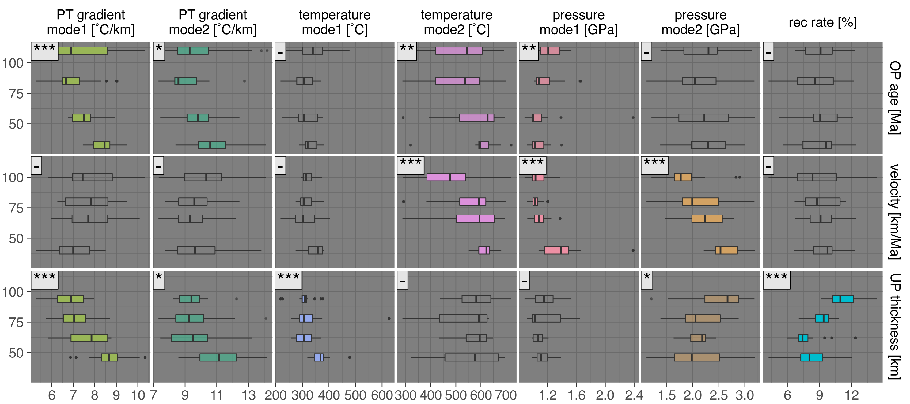

```


\end{landscape}


\begingroup
\renewcommand{\arraystretch}{0.5}

```{r recSummary}
stats.summary %>%
select(
  model,
  phi,
  z1100,
  age,
  cv,
  recovered.est,
  recovered.sigma,
  rec.ratio.est,
  mode1.maxP.est,
  mode2.maxP.est,
  mode1.maxT.est,
  mode2.maxT.est,
  mode1.maxGrad.est,
  mode2.maxGrad.est
) %>%
mutate(
  phi = round(phi, 1),
  recovered.est = round(recovered.est),
  recovered.sigma = round(recovered.sigma),
  rec.ratio.est = round(rec.ratio.est*100, 1),
  mode1.maxP.est = round(mode1.maxP.est/1e4, 2),
  mode2.maxP.est = round(mode2.maxP.est/1e4, 2),
  mode1.maxT.est = round(mode1.maxT.est-273, 1),
  mode2.maxT.est = round(mode2.maxT.est-273, 1),
  mode1.maxGrad.est = round(mode1.maxGrad.est*1e3, 1),
  mode2.maxGrad.est = round(mode2.maxGrad.est*1e3, 1)
) %>%
kable(
  caption = 'Subduction zone parameters and marker classification summary',
  linesep = '',
  col.names = c(
    '', 'km', 'km', 'Ma', 'km/Ma', '', '', '\\%', 'GPa', 'GPa',
    '$^{\\circ}$C', '$^{\\circ}$C', '$^{\\circ}$C/km', '$^{\\circ}$C/km'
  ),
  escape = F,
  longtable = T,
  booktabs = T,
  format = 'latex'
) %>%
add_header_above(
  c(
    'model', '$\\\\Phi$', '$Z_{UP}$', 'age', '$\\\\vec{v}$', 'rec.', '$\\\\sigma$',
    'rate', 'P md1', 'P md2', 'T md1', 'T md2', '$\\\\nabla$ md1', '$\\\\nabla$ md2'
  ),
  line_sep = 0,
  escape = F
) %>%
add_header_above(
  c('Initial Boundary Conditions' = 5, 'Marker Classification Summary' = 9),
  escape = F
) %>%
kable_styling(font_size = 10, latex_options = c('striped', 'repeat_header')) %>%
kable_classic() %>%
landscape()
```

\endgroup

## Discussion {#chpt4Discussion}

### Thermo-Kinematic Controls on Rock Recovery

While the combined distribution of markers recovered from all numerical experiments shows appreciable deviations from \gls{pt} estimates compiled by @penniston2015 and @agard2018, markers recovered from simulations with the youngest oceanic plates (32.6-55 Ma) and the slowest convergence velocities (40 km/Ma) begin to resemble the distribution of exhumed \gls{hp} rocks (compare Figure \@ref(fig:marxComp) with \@ref(fig:olderSlow) & \@ref(fig:youngSlow)) with respect to gradients and absolute \gls{pt} conditions. Slower subduction of younger plates strongly shifts marker recovery down the plate interface (strong correlation with the deepest and warmest PT modes, Figure \@ref(fig:corrComp)). The correlations in Figure \@ref(fig:corrComp) also suggests this shift towards deeper recovery along the subduction interface should be complemented by thin upper-plates---implying systems with thin upper-plates, slow convergence, and young oceanic plates should be most consistent with the distribution of rock recovery implied by pd15 and ag18 (compare Figure \@ref(fig:marxComp) with \@ref(fig:olderSlow) & \@ref(fig:youngSlow)). This correspondence might appear consistent with arguments that the rock record is comprised primarily of rock bodies exhumed from "warm" subduction settings [@abers2017; @vankeken2018], except that rock recovery does not correlate with subducting plate age or velocity, and recovery is poorer for thinner, warmer, upper plates (Figure \@ref(fig:corrComp)).

Moreover, other kinematic characteristics correlate with age and velocity. For example, simulations with young oceanic plates (models: `r paste(unique(str_extract(filter(stats.summary, age == 32.6)$model, 'cd.')), sep = ',')`), especially at slow convergence velocities (model: `r paste(unique(str_extract(filter(stats.summary, age == 32.6, cv == 40)$model, 'cd.')), sep = ',')`) show high subduction angles (see Appendix \@ref(vis)). High subduction angles tend to form thicker subduction interfaces that allow more markers to subduct to deeper, and thus warmer, conditions compared to other experiments that form narrow interfaces with shallow choke points (e.g. model: cdj, see Appendix \@ref(vis)). Observationally, the angle of subduction does not correlate significantly with plate age or velocity, but rather inversely with the duration of subduction [@hu2020]. Thus, the rock record might indicate preferential exhumation during the earlier stages of subduction when angles were steeper (although not necessarily during subduction initiation), even for older or faster subducting plates. More generally, differences in plate flexibility, overall subduction geometry, and velocity of plate motions strongly affect \gls{pt} distributions of rock recovery [@monie2009]---rather than strictly "warm" versus "cool" subduction settings *per se*. That is, thermo-kinematic boundary conditions typically inferred to strictly promote *thermal* effects (e.g. young oceanic plates fostering warmer thermal gradients) may indeed be promoting more *kinematic* effects (e.g. young flexible oceanic plates rolling back and supporting deeper subduction of material along thicker interfaces) that are subsequently *observed* as thermal effects (average increase in marker \glspl{pt}).

(ref:olderSlowCap) Recovered markers from simulations with 55 Ma old oceanic plates and the slowest convergence velocities (40 km/Ma, models: `r paste(filter(stats.summary, age == 55, cv == 40)$model, sep = ',')`). (a) Pressure vs. temperature diagram showing the densities of recovered markers (point cloud and blue Tanaka contours) in comparison with the pd15 [solid contours, @penniston2015] and ag18 [filled contours, @agard2018] datasets. Thin lines are thermal gradients labeled in $^{\circ}$C/km. Reaction boundaries for eclogitization of oceanic crust and antigorite dehydration are from @ito1971 and @schmidt1998, respectively. (b-d) Cumulative probability diagrams showing more uniform marker recovery with respect to pressure and considerable discrepancies among marker temperatures, \gls{pt} gradients, and natural samples.

```{r olderSlow, fig.cap='(ref:olderSlowCap)', fig.scap='Marker recovery from older-slow subduction simulations'}

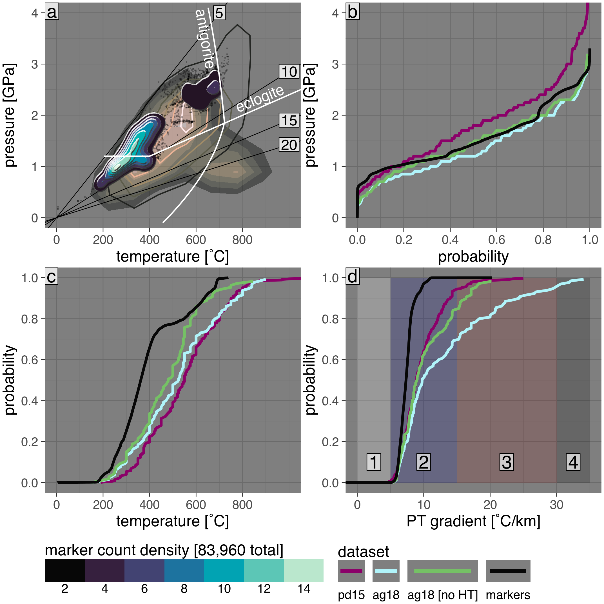

```

(ref:youngSlowCap) Recovered markers from simulations with the youngest oceanic plates (32.6 Ma) and slowest convergence velocities (40 km/Ma, models: `r paste(filter(stats.summary, age == 32.6, cv == 40)$model, sep = ',')`). (a) Pressure vs. temperature diagram showing the densities of recovered markers (point cloud and blue Tanaka contours) in comparison with the pd15 [solid contours, @penniston2015] and ag18 [filled contours, @agard2018] datasets. Thin lines are thermal gradients labeled in $^{\circ}$C/km. Reaction boundaries for eclogitization of oceanic crust and antigorite dehydration are from @ito1971 and @schmidt1998, respectively. (b-d) Cumulative probability diagrams showing the closest agreement between recovered markers and natural samples in this study. Notice considerable recovery gaps (markers) and discrepancies remain among marker temperatures, \gls{pt} gradients, and natural samples.

```{r youngSlow, fig.cap='(ref:youngSlowCap)', fig.scap='Marker recovery from young-slow subduction simulations'}

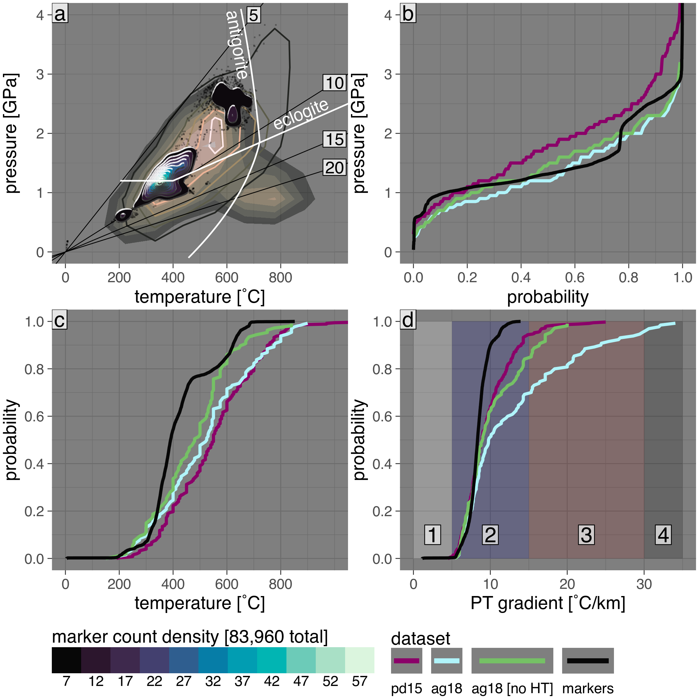

```

### Comparison with other Numerical Experiments

Marker \gls{pt} distributions and their correlations with thermo-kinematic boundary conditions presented above are determined directly from large samples of recovered material evolving dynamically in a deforming subduction interface (analogous to reconstructing thermal gradients from large random samples of exhumed \gls{hp} rocks). In contrast, other studies investigating thermal responses to variable boundary conditions typically determine \gls{pt} gradients statically along discrete surfaces representing megathrust faults [e.g. @abers2006; @syracuse2010; @gao2014; @mckenzie1969; @davies1999b; @molnar1990; @currie2004; @furukawa1993; @wada2009; @peacock1999b; @vankeken2019; @vankeken2011] or dynamically by "finding" the plate interface heuristically at each timestep [e.g. @arcay2017; @holt2021; @ruh2015]. Other studies using similar geodynamic codes have traced many fewer markers [typically dozens vs. > 100,000\; @faccenda2008; @gerya2002; @sizova2010; @yamato2007; @yamato2008], so have less statistical rigor. This study stresses the importance of large sample sizes because individual marker \gls{pt} paths can vary considerably within a single simulation, yet important modes of recovery become apparent from density peaks as more markers are traced. Furthermore, most other studies make no attempt to discriminate *recovery* [with some exceptions, e.g. @roda2012; @roda2020], so marker \gls{pt} paths are less analogous to \gls{pt} paths determined by applying petrologic modelling, for example.

### Comparison with Geophysical Observations {#geophysComp}

The locations of important recovery modes determined from numerical experiments correspond closely with the depths of important mechanical transitions inferred from seismic imaging studies and surface heat flow observations. For example, the dominant recovery mode common among all numerical experiments at about 1 GPa and 350 $^{\circ}$C (Table \@ref(tab:recSummary) & Figure \@ref(fig:marxComp)) is consistent with a layer of low seismic velocities and high $V_p/V_s$ ratios observed at numerous subduction zones between 20-50 km depth [@bostock2013]. While considerable unknowns persist about the nature of deformation in this region [@bostock2013; @tewksbury2021b], the low-velocity layer, accompanied by low-frequency and slow-slip seismic events, is often interpreted as a transitional brittle-ductile shear zone actively accommodating underplating of subducted material and/or formation of a tectonic mélange around the base of the continental Moho [@audet2016; @audet2018; @bostock2013; @calvert2011; @calvert2020; @delph2021].

Formation of low-velocity layers and their geophysical properties are generally attributed to high pore-fluid pressures caused by metamorphic reactions relating to the dehydration of oceanic crust [@hacker2008; @vankeken2011; @rondenay2008]. Surprisingly, despite implementation of a simple model for dehydration of oceanic crust [@ito1971; @kerswell2021], and a simple visco-plastic rheologic model [@gerya2003; @kerswell2021], the primary mode of marker recovery at `r round(mean(stats.summary$mode1.maxP.est)/1e4, 2)` $\pm$ `r round(2*sd(stats.summary$mode1.maxP.est)/1e4, 2)` GPa (2 $\sigma$, Table \@ref(tab:recSummary)) coincides closely with the expected region for shallow underplating according to geophysical constraints (35 $\pm$ 15 km or `r format(round(35/35, 1), nsmall = 1)` $\pm$ `r round(15/35, 1)` GPa). The size of the markers dataset (n = `r format(nrow(marx.firsttype.summary[marx.firsttype.summary$recovered,]), big.mark = ',')`) and prevalence of marker recovery from 1 GPa and 350 $^{\circ}$C suggest that although dehydration may indeed trigger detachment of subducting rocks, other factors---notably the compositional and mechanical transition in the upper-plate across the Moho---also influence detachment at this depth.

The termination of the low-velocity layer at depths beyond the continental Moho marks another important mechanical transition. This second transition is often interpreted as the onset of mechanical plate coupling near 80 km (or `r round(80/35, 1)` GPa) and coincides well with the deeper recovery modes determined from recovered markers at `r round(mean(stats.summary$mode2.maxP.est)/1e4, 1)` $\pm$ `r round(2*sd(stats.summary$mode2.maxP.est)/1e4, 1)` GPa (2 $\sigma$, Table \@ref(tab:recSummary)). Between these two modes of recovery at ~40 and ~80 km lies a gap that coincides with the densest recovery of natural rocks (pd15 & ag18, Figure \@ref(fig:marxComp)). This recovery gap is discussed in the following section.

### The Marker Recovery Gap

Although at least a few markers are recovered across the range of the pd15 and ag18 datasets, the differences between recovered markers and distributions of natural samples are numerous, including: (1) an obvious lack of markers recovered from $\geq$ 15 $^{\circ}$C/km  (`r round((1-cdfGrad.summary$prob[which.min(abs(cdfGrad.summary$maxGrad*1e3-10))])*100)`%) compared to pd15 and ag18 (`r round((1-pd15.grad$prob[which.min(abs(pd15.grad$grad-10))])*100)`-`r round((1-ag18.grad$prob[which.min(abs(ag18.grad$grad-10))])*100)`%, Figure \@ref(fig:marxComp)d), (2) recovery of markers from a single dominant mode near 1 GPa and 350 $^{\circ}$C compared to more uniform recovery across \gls{pt} space for natural samples (Figure \@ref(fig:marxComp)a-c), (3) a general shift towards lower temperatures and cooler thermal gradients for markers compared to natural samples, and (4) a remarkable gap in marker recovery near 2 GPa and 550 $^{\circ}$C that coincides with the highest density of natural samples (Figure \@ref(fig:marxComp)a). In fact, across 64 numerical experiments with wide-ranging initial conditions less than 1% (`r round(nrow(filter(marx.firsttype.summary, recovered & maxP > 1.8e4 & maxP < 2.2e4 & maxT > (500+273) & maxT < (625+273)))/nrow(filter(marx.firsttype.summary, recovered))*100, 2)`%) of markers are recovered from between 1.8-2.2 GPa and 500-625 $^{\circ}$C. Why might this gap occur? Four possibilities are evident:

> | \uline{Explanations for nonoverlapping densities at 2 GPa and 550 $^{\circ}$C:}
> |
> |  1. Simple rheologic models preclude certain recovery mechanisms
> |     (poor implementation or modelling bias, Section \@ref(geophysComp))
> |
> |  2. Peak metamorphic conditions are systematically misinterpreted
> |     [unknown \gls{pt} paths or petrologic bias, @penniston2015]
> |
> |  3. Rocks are frequently (re)sampled from the same unique conditions
> |     [nonrandom sampling or scientific bias, @agard2018]
> |
> |  4. Rocks are recovered during short-lived events not implemented in
> |     models [e.g. subduction of seamounts, @agard2009]

#### Modelling Bias

Simplifying assumptions in the numerical experiments could potentially influence rock recovery from the subducting slab. Substantially lower temperatures and thermal gradients in numerical experiments compared to natural samples (Figure \@ref(fig:marxComp)) possibly indicate imperfect implementation of heat generation and transfer [@penniston2015; @kohn2018]. Use of a simple serpentine rheology in the numerical experiments creates a weak interface. A stronger rheology [e.g. quartz or a mixed melange zone, @beall2019; @ioannidi2021] would yield greater heating and higher temperatures [@kohn2018]. In principle, a stronger rheology might shift the overall \gls{pt} distribution of markers to higher temperatures and help fill in the gap, or, possibly, change flow to extract rocks more uniformly along the plate interface. Although the effects of different interface rheologies on thermal structure or rock recovery were not explicitly explored in this study, even numerical simulations with the smallest \gls{pt} discrepancies between markers and natural samples (youngest oceanic plates and slowest convergence velocities, Figures \@ref(fig:olderSlow) & \@ref(fig:youngSlow)) exhibit the same sizeable gap in marker recovery. Thus, higher temperatures alone would not seem to close the gap.

#### Petrologic Bias

Petrologic bias implies decades of field observations, conventional thermobarometry [e.g. @spear1983], phase equilibria modelling [e.g. @connolly2005], trace element thermometry [e.g. @ferry2007; @kohn2020], and Raman Spectrometry of Carbonaceous Material thermometry [@beyssac2002] from many independent localities worldwide [e.g. @agard2009; @agard2018; @monie2009; @plunder2015; @plunder2013; @angiboust2009; @angiboust2012a; @avigad1991; @angiboust2016] have systematically misinterpreted the prograde and retrograde histories of exhumed \gls{hp} rocks. However, estimated uncertainties are generally too small for this argument to be viable [@penniston2015].

#### Scientific Biases

Two main factors lead to scientific bias. First, thermobarometric analysis is easier for certain rock types and mineral assemblages (e.g. eclogite-facies metabasites and metapelitic schists) than for others (e.g. quartzites, metagraywackes). Second, certain subduction complexes expose more rocks than others. These facts lead to sampling bias, both in the rocks that are selected for analysis and which subduction complexes contribute most to compilations. For example, a \gls{pt} condition of c. 550 $^{\circ}$C, 2 GPa typically yields assemblages that are both recognizable in the field (eclogites, *sensu stricto*, and kyanite- or chloritoid-schists) and amenable to thermobarometric calculations and petrologic modelling. This fact may lead to oversampling of the rocks that yield these \gls{pt} conditions and the subduction zones that expose these rocks. In @penniston2015, the western and central European Alps, which contain many rocks that equilibrated near this \gls{pt} condition, represented ~90 samples across < 1000 km (~1 sample per 100 km), whereas the Himalaya and Andes, which contained more diverse \gls{pt} conditions, represented only ~1 sample per 300-400 km. Some subduction zones are not represented at all in these datasets (e.g. central and western Aleutians, Kamchatka, Izu-Bonin-Marianas, Philippines, Indonesia, etc.), either because metamorphic rocks are not exposed or rock types are not amenable to petrologic investigation. Correcting for this type of bias is challenging because it would require large random samples of exhumed \gls{hp} rocks from localities worldwide and development of new techniques for quantifying \gls{pt} conditions in diverse rock types.

#### Short-lived Events

Detachment of rocks from the subducting slab might not occur continuously, but rather in response to specific events, such as subduction of asperities or seamounts [e.g. @agard2009] or abrupt fluid events. Yet no numerical models have attempted to model these events (insofar as determined from the available literature). In the case of seamounts, high surface roughness correlates with higher coefficients of friction [@gao2014]. Higher friction increases heating and temperatures, driving subduction interface thermal gradients into the field of \gls{pt} conditions defined by the pd15 and ag18 datasets [@kohn2018]. If asperities become mechanically unstable at depths of ~50-70 km, preferential detachment would create an "overabundance" of recorded \gls{pt} conditions at moderate temperature (c. 550 $^{\circ}$C) at ~2 GPa, as observed. 

Alternatively, although fluid release is modelled as continuous, it may occur sporadically. Two dehydration reactions along the subduction interface are particularly relevant: the transformation of lawsonite to epidote, and the transformation of chlorite (plus quartz) to garnet. Although dehydration of lawsonite is nearly discontinuous in \gls{pt} space, few rocks show clear evidence for lawsonite immediately prior to peak metamorphism (although such evidence can be subtle). In the context of equilibrium thermodynamics, chlorite dehydration should occur continuously below depths of ~35 km, consistent with assumptions of many numerical geodynamic models. However, recent research suggests substantial overstepping of this reaction, resulting in the abrupt formation of abundant garnet and release of water [@castro2017]. Direct geochronology of garnet growth rates in subduction complexes also suggests abrupt growth and water release [@dragovic2015]. Because fluids are thought to help trigger brittle failure (earthquakes) that could detach rocks from the subducting slab surface, abrupt release at a depth of ~50-70 km might again result in an "overabundance" of recorded \gls{pt} conditions at pressures of ~2 GPa. This mechanism would require relatively consistent degrees of overstepping in rocks of similar bulk composition and would not directly explain higher temperatures, however.

## Conclusion {#chpt4Conclusions}

This study traces \gls{pt} paths of more than one million markers from 64 subduction simulations representing a large range of presently-active subduction zones worldwide. Marker recovery is identified by implementing a "soft" clustering algorithm, and \gls{pt} distributions of recovered markers are compared among models and with the rock record. Such a large dataset presents a statistically-robust portrait of important recovery modes (where most markers are detached) along the plate interface. The three most important findings are as follows:

1. Numerical simulations with simplified (de)hydration models and visco-plastic rheologies simulate important recovery mechanisms near the base of the continental Moho around 1 GPa and 350 $^{\circ}$C (underplating and/or formation of tectonic mélanges) and near the depth of mechanical plate coupling around 2.5 GPa and 625 $^{\circ}$C.

2. Subduction systems with young oceanic plate ages, slow convergence velocities, and thin upper-plate lithospheres are most consistent with the rock record, but more likely because of kinematic effects (young flexible oceanic plates with high subduction angles accommodating deeper subduction of material) rather than strictly because of thermal effects (young oceanic plates promoting high thermal gradients). Recovery rate does not correlate with either plate age or subduction rate, and warmer subduction zones show poorer recovery.

3. A gap in marker recovery near 2 GPa and 550 $^{\circ}$C closely coincides with the highest densities of natural samples and suggests an "overabundance" of samples are studied from this \gls{pt} region. Explanations for this "overabundance" might include scientific bias, reaction overstepping (abrupt release of water), or processes such as subduction of seamounts that are not included in numerical simulations. Future work investigating natural samples and refining numerical geodynamic models might help resolve this discrepancy.

\cleardoublepage

# Conclusion {#chpt5}

\markboth{Chapter 5: Conclusion}{Chapter 5: Conclusion}

This work uses three computational approaches---simulation, interpolation, and applied statistics (machine learning)---to address the following questions. How does plate interface mechanics change across a range of subduction zones and how can it be quantified with currently available petrologic and geophysical datasets?

Plate coupling observed in numerical simulations from Chapter \@ref(chpt2) demonstrate steady-state mechanical behavior regulated self-consistently by feedbacks involving heat transfer and metamorphic dehydration of ultramafic sheet silicates in the upper-plate mantle. Coupling depth is only weakly correlated with $\Phi$ but strongly correlated with upper-plate lithospheric thickness. Thus uniform coupling depths are expected if subduction zones have uniformly thick upper-plates, which is indeed the case when considering averaged backarc surface heat flow for 13 presently active subduction zones [@currie2004; @hyndman2005; @currie2006; @wada2009].

However, surface heat flow interpolations in Chapter \@ref(chpt3) show a Kaleidoscope of upper-plate surface heat flow patterns---some implying continuous thermal structure, others implying discontinuous thermal structure---for 13 presently active subduction zones. While Kriging methods yield some spurious results for segments with low observational densities, both Similarity and Kriging methods indicate comparable accuracy rates on average. Thus both methods are ostensibly suitable for subduction zone research if carefully applied. Further, differences between Similarity and Kriging predictions highlight anomalies and point towards effective sampling strategies for future surveys.

Chapter \@ref(chpt4) takes a different approach by considering what \gls{pt} distributions of exhumed \gls{hp} metamorphic rocks imply about mechanical variability among subduction zones with respect to detachment (recovery) of subducted materials. A large (`r format(nrow(marx.firsttype.summary[marx.firsttype.summary$recovered,]), big.mark = ',')`) dataset of recovered markers shows marker \gls{pt} distributions and recovery rates correlate with certain thermo-kinematic boundary conditions (oceanic plate age, convergence velocity, and upper-plate thickness) and indicate a range of plausible conditions for reproducing the rock record. A sizeable gap in marker recovery around 2 GPa and 550 $^\circ$C, coinciding with the highest density of natural samples, implies biases (including imperfect implementation of recovery mechanisms in numerical experiments, sampling biases, and reaction overstepping) may be strongly affecting the rock record and/or numerical geodynamic models.

Future work may focus on refining and improving numerical geodynamic codes (to better implement heat generation/transfer and recovery mechanisms), surface heat flow datasets (to improve interpolation accuracies), and petrologic datasets (to enable sampling and modelling of more diverse rock types) by exploring and addressing the potential biases identified in the above studies.

\cleardoublepage

# References {-}

\markboth{References}{References}

<div id="refs_main"></div>

\cleardoublepage

# ThermoGlobe References {- #tglobe}

\markboth{ThermoGlobe References}{ThermoGlobe References}

<div id="refs_tglobe"></div>

\cleardoublepage

# (APPENDIX) Appendix {-}

\markboth{Appendix: Chapter 2}{Appendix: Chapter 2}

# Effects of Thermo-kinematic Boundary Conditions on Plate Coupling in Subduction Zones

\clearpage

## Serpentine Stability Depth Through Time {#antDepth}

Stability of serpentine progressively increases with depth along the plate interface as the subducting oceanic plate continuously cools and hydrates the shallow upper-plate mantle. However, this phenomenon ceases after approximately 5 Ma and dynamics change. From approximately 5 Ma to tens of Ma afterwards, the lower limit of serpentine dehydration stabilizes (Figure \@ref(fig:antDepth)). In theory, serpentine dehydration should continue to increase as long as water continues to flux from the oceanic plate and the shallow upper-plate remains stagnant and cooling. Stability of serpentine dehydration through tens of Ma is direct result of the correspondence between mechanical coupling and absence of serpentine along the plate interface. Notably, using Lagrangian frameworks to implement metamorphic reactions is an advantageous numerical feature allowing for such behavior.

```{r antDepth, fig.cap='Serpentine stability depth at the plate interface vs. time for models cda, cdf, and cdp with $Z_{UP}$ = 46, 62, 78, and 94 km. Serpentine stabilization deepens for approximately 5 Ma of subduction and then remains roughly constant for $\\leq$ 10 Ma. The exceptions are models with very thin $Z_{UP}$, which exhibit transient behavior for at least 15 Ma. Overall serpentine stability depth after approximately 5 Ma depends on upper-plate thickness.', fig.scap='Serpentine stability depth vs. time'}

knitr::include_graphics('assets/figs/chpt2/figA1.png')

```

Numerical experiments in this study suggest a negative dynamic feedback regulating coupling and serpentine dehydration can help explain how similar configurations, in terms of depths to subducting plates beneath arcs [@england2004] and thin upper-plates [@currie2006], may occur in subduction zones with different thermo-kinematic boundary conditions and subduction durations. The results indicate that subduction zones quickly (< 5 Ma) develop and stabilize quasi-permanent, generalized configurations with coupling depth dependent on upper-plate thickness.

Notable exceptions occur in models with the thinnest upper-plates ($Z_{UP}$ = 46 km). Rapid extension due to thin upper-plates form spreading centers in the upper-plate within 5 Ma. Passive asthenospheric upwelling near spreading centers diverts heat from deep within the upper-plate mantle. Enough heat is apparently diverted to disrupt thermal feedbacks regulating coupling and serpentine stability near the plate interface. In principle, diversion of heat from the plate interface could lead to cooler conditions, deeper serpentine stability, and thus deeper coupling. Further testing to confirm this behavior may artificially increase upper-plate strength in thin upper-plate thickness experiments to prevent high rates of spreading.

```{r cdfStep1, fig.cap='Visualizing model cdf with $Z_{UP}$ = 78 km at 1.64 Ma. (a) Rock type. (b) Temperature. (c) Viscosity. (d) Streamlines. Early subduction is facilitated by the prescribed initial weak layer cutting the lithosphere. Strain is localized in the weak serpentine layer along the plate interface. The shallow upper-plate mantle is stagnant and loses heat to the subducting plate, promoting serpentine stabiliization to greater depths. Rock type colors are the same as Figure \\ref{fig:init}.', fig.scap='Results for model cdf with $Z_{UP}$ = 78 km at 1.64 Ma'}

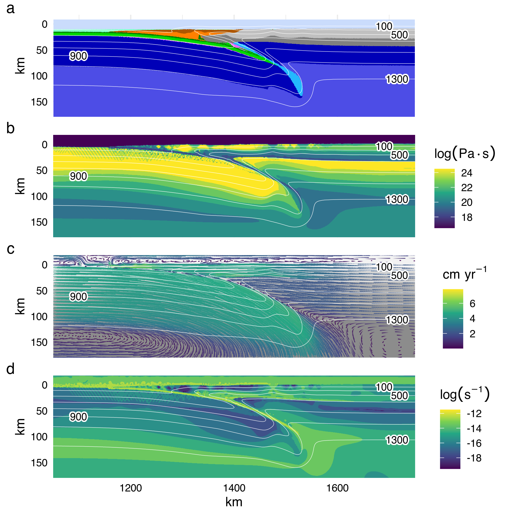

```

```{r cdfStep2, fig.cap='Visualizing model cdf with $Z_{UP}$ = 78 km at 5.05 Ma. (a) Rock type. (b) Temperature. (c) Viscosity. (d) Streamlines. By 5 Ma balance is achieved between cooling and heating in the shallow and deep upper-plate mantle, respectively. A feedback regulating heat transfer, serpentine destabilization, and mechanical coupling is already stabilizing coupling depth. Rock type colors are the same as Figure \\ref{fig:init}.', fig.scap='Results for model cdf with $Z_{UP}$ = 78 km at 5.05 Ma'}

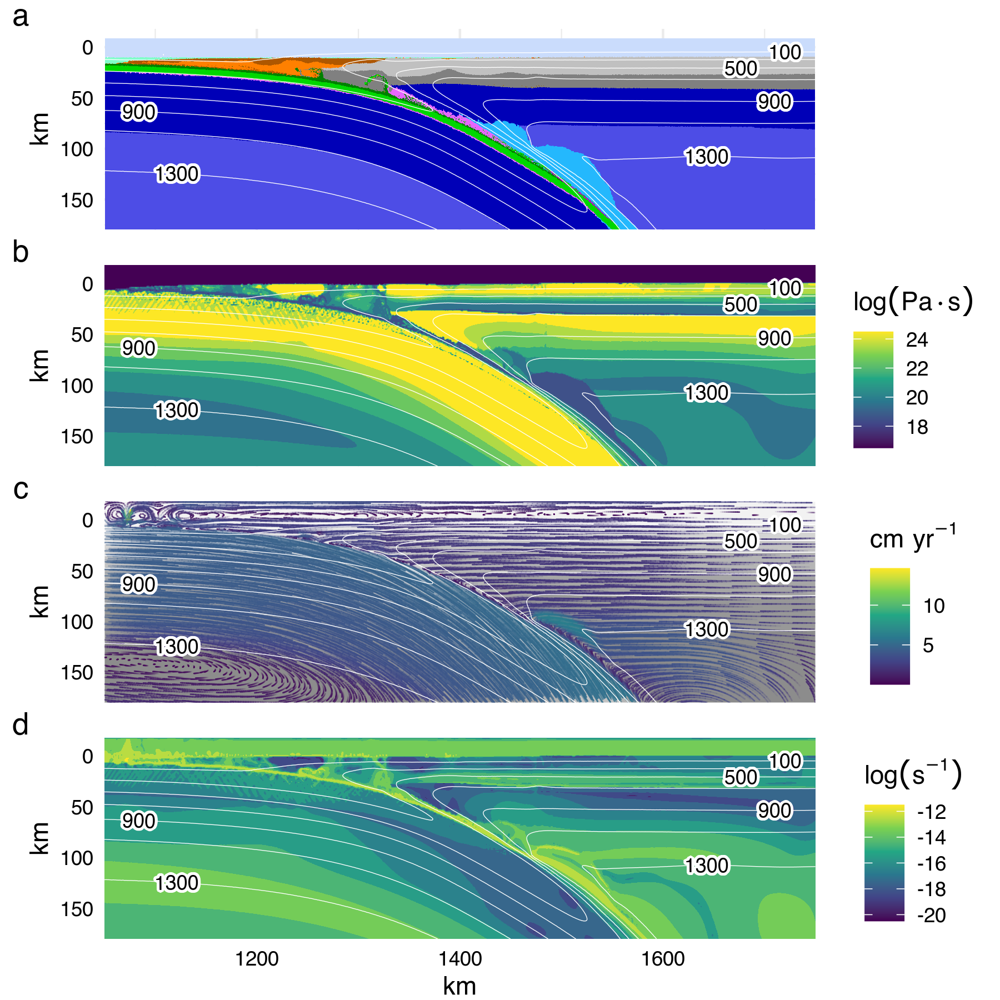

```

```{r cdfStep3, fig.cap='Visualizing standard model cdf with $Z_{UP}$ = 78 km at 9.93 Ma. (a) Rock type. (b) Temperature. (c) Viscosity. (d) Streamlines. Geodynamics remain approximately constant from 5 Ma (cf. Figure \\ref{fig:cdfStep2}). The system remains in steady state for as long water fluxes to the upper-plate mantle and serpentine is stable. Rock type colors are the same as Figure \\ref{fig:init}.', fig.scap='Results for model cdf with $Z_{UP}$ = 78 km at 9.93 Ma'}

knitr::include_graphics('assets/figs/chpt2/figA4.png')

```

```{r hf, fig.cap='Surface heat flow calculated at approximately 10 Ma for all numerical experiments. Normalized distance is the distance from the left boundary to the trench, divided by the distance between the trench and arc. Grayscale corresponds to $\\Phi$. High amplitude fluctuations near the arc region (normalized distance = 1.0) correspond to vertical migration of fluids and melts. In the backarc region (normalized distance $\\geq$ 1.0), these fluctuations correspond to lithospheric extension. Backarc extension is most apparent for high-$\\Phi$ experiments (lighter gray lines). Experiments with no extension show a tight distribution of surface heat flow in the backarc region (darker gray lines).', fig.scap='Surface heat flow for all numerical experiments'}

knitr::include_graphics('assets/figs/chpt2/figA7.png')

```

\clearpage

## Regression Summaries {#regSummary}

The form of the preferred quadratic regression model in Section \@ref(cdEstimators) (Figure \@ref(fig:results) & Table \@ref(tab:zcResults)) implies a lower limit to coupling depth of approximately 60 km, even for thin upper-plate thickness and, presumably, under warm conditions during nascent subduction. In principle, thin upper-plates could allow effective heat transfer in a flowing shallow asthenospheric mantle---hindering deep stabilization of serpentine. Olivine and pyroxene would be the stable mantle minerals, and strong, shallow coupling between plates would be expected @gerya2008. However, even the warmest numerical experiments (low-$\Phi$ & thin upper-plate thickness) in this study eventually stabilize serpentine in the shallow upper-plate mantle. This is evident by increasing depth of mechanical coupling with time for the first 5 Ma of subduction (Figure \@ref(fig:antDepth)).

```{r results, fig.cap='Coupling depths ($Z_{cpl}$, grayscale) determined from numerical experiments. Model names are listed along the top axis and correspond to the range of thermal parameter $\\Phi$ values along the bottom axis. Note that the ($\\Phi$) axis is not linear. $Z_{cpl}$ increases systematically with increasing $Z_{UP}$ (change in grayscale down columns) for all models. Trends in $Z_{cpl}$ with respect to $\\Phi$ (change in grayscale across rows) are less apparent.', fig.scap='Coupling depths determined from numerical experiments'}

knitr::include_graphics('assets/figs/chpt2/figA5.png')

```

```{r anova}
bvm.z1100.lin$anova %>%
select(-null.value, -term) %>%
mutate(
  'estimate' = round(estimate, 1),
  'conf.low' = round(conf.low, 1),
  'conf.high' = round(conf.high, 1),
  'adj.p.value' = scientific(adj.p.value, digits = 3)
) %>%
kbl(
  col.names = c('', '$[km]$', '$[km]$', '$[km]$', ''),
  booktabs = T,
  caption = 'Summary of ANOVA test',
  format = 'latex',
  escape = F
) %>%
row_spec(0, align = 'c') %>%
add_header_above(
  c('$Z_{UP}$ Groups', '$Z_{cpl}$ Estimate', 'Upper Bound', 'Lower Bound', 'p value'),
  escape = F,
  line = F
) %>%
kable_classic() %>%
kable_styling(latex_options = c('striped')) %>%
footnote(
  general_title = '',
  general = c('Pair-wise Tukey\'s test comparing means between groups. Estimates are differences between means. Null hypothesis is that means are not different'),
  threeparttable = T,
  escape = F
)
```

```{r regSummary}
map_df(list(
  bvm.phi.lin,
  bvm.z1100.lin,
  bvm.z1100.quad1,
  bvm.z1100.quad2,
  mvm.lin,
  mvm.quad1,
  mvm.quad2
  ),
  ~.x$model, .id = 'reg'
) %>%
select(-statistic) %>%
mutate(
  'estimate' = round(estimate, 1),
  'std.error' = round(std.error, 1),
  'p.value' = scientific(p.value, digits = 3),
  'term' = ifelse(
    term == 'phi',
    '$\\phi$',
    ifelse(term == 'z1100', '$Z_{UP}$', ifelse(term == 'z1100^2', '$Z_{UP}^2$', term))
  )
) %>%
kbl(
  col.names = c('Model', 'Term', 'Estimate', 'Std. Error', 'p value'),
  booktabs = T,
  caption = 'Summary of regression models',
  format = 'latex',
  escape = F
) %>%
kable_styling(latex_options = c('striped')) %>%
kable_classic() %>%
footnote(
  general_title = '',
  general = c('\\\\uline{\\\\textit{models}}: 1: $[z_c=\\\\phi]$, 2: $[z_c=Z_{UP}]$, 3: $[z_c=Z_{UP}^2]$, 4: $[z_c=Z_{UP}+Z_{UP}^2]$, 5: $[z_c=Z_{UP}+\\\\phi]$, 6: [$z_c=Z_{UP}^2+\\\\phi]$, 7: $[z_c=Z_{UP}+Z_{UP}^2+\\\\phi]$'),
  threeparttable = T,
  escape = F
)
```

\begingroup
\renewcommand{\arraystretch}{0.5}

```{r zcResults}
d <- mods %>%
select(model, z1100, phi, zc) %>%
mutate('model' = model %>% stringr::str_extract('cd.'))
kable(
  d,
  col.names = c('Model', '$Z_{UP}$ $[km]$', '$\\Phi$ $[km/100]$', '$Z_{cpl}$ $[km]$'),
  caption = 'Coupling depth results',
  linesep = '',
  escape = F,
  booktabs = T,
  longtable = T,
  format = 'latex'
) %>%
kable_styling(latex_options = c('striped', 'repeat_header')) %>%
kable_classic()
```

\endgroup

```{r biv, fig.cap='Bivariate regressions. (a) Coupling depth ($Z_{cpl}$) vs. upper-plate thickness ($Z_{UP}$) shows $Z_{cpl}$ increasing approximately quadratically with increasing $Z_{UP}$. The correlation is highly significant (see Tables \\ref{tab:anova} and \\ref{tab:regSummary}) and explains more than 80\\% of the variance in $Z_{cpl}$. $Z_{UP}$ alone estimates $Z_{cpl}$ well. (b) $Z_{cpl}$ vs. thermal parameter ($\\Phi$) shows no significant correlation (no line fits with a slope significantly different from zero). $\\Phi$ has little effect on $Z_{cpl}$ and cannot be used as a standalone estimator.', fig.scap='Bivariate regressions of coupling results'}

knitr::include_graphics('assets/figs/chpt2/figA6.png')

```

\clearpage

## (De)hydration Model {#deHydration}

The material properties used in the numerical experiments are listed in Table \@ref(tab:materials) and Table \@ref(tab:melts). For details about the sedimentation and erosion, melting and extraction, and rheological models, refer to @sizova2010. Here we discuss only the hydrodynamic model, because it is the most relevant aspect of the numerical experiments.

Hydrodynamics in the numerical models control the timing and magnitude of mantle wedge hydration. The main sources of water delivered to the mantle are altered basaltic crust and seafloor sediments, which we assumed to contain up to 5 $wt.\% H_{2}O$. We assumed a gradual expulsion of water from pore space and through quasi-continuous dehydration reactions occurring within the slab. Water content is computed using the following equation:
\begin{equation}
  \chi_{H_{2}O} = \chi_{H_{2}O_{init}}\times\left(1-\frac{\Delta z}{150\times 10^{3}}\right)
\end{equation}
where $\chi_{H_{2}O_{init}}$ = 5 $wt.\%$ and $\Delta z$ is a marker's depth below the topographical surface.

If a rock marker dehydrates, an independent water particle is instantaneously generated at the same location with the respective $H_{2}O$ content. The new water particle is moved in accordance to the local velocity field, described by the following equation:
\begin{equation}
  \begin{aligned}
    \vec{v}_{\text{water}} & = (\vec{v}_x,\ \vec{v}_z) \\
    \vec{v}_z & = \vec{v}_z - \vec{v}_{z(\text{percolation})} \\
  \end{aligned}
\end{equation}
where $\vec{v}_{water}$ is the velocity vector of the water particle, $\vec{v}_{x}$ and $\vec{v}_{z}$ are the local velocity vectors of the solid state mantle or crust, and $\vec{v}_{z(percolation)}$ is a imposed constant upward percolation velocity (10 $cm/year$). We implicitly neglect kinetics of reactions, as material properties of markers change instantaneously at equilibrium reactions.

```{r melts}
readr::read_csv('assets/r/chpt2/melt_curves.csv', show_col_types = F) %>%
dplyr::rename(Material = material) %>%
dplyr::mutate(
  c = scientific(c),
  e = scientific(e),
  g = scientific(g),
  h = scientific(h)
) %>%
kable(
  caption = 'Melting curves used in numerical experiments',
  linesep = '',
  escape = F,
  booktabs = T,
  format = 'latex'
) %>%
kable_styling(latex_options = c('striped', 'scale_down')) %>%
kable_classic() %>%
footnote(
  general_title = '',
  general = c(
    '\\\\uline{\\\\textit{solidus curve}}: $T(P)=[b+\\\\frac{c}{(P+d)}+\\\\frac{e}{(P+d)^2}]$ at $P<a$ and $[f+gP+hP^2]$ at $P\\\\geq a$',
    '\\\\uline{\\\\textit{liquidus curve}}: $T(P) = i+jP$ with $T$ in $[K]$ and $P$ in $[MPa]$',
    '\\\\uline{\\\\textit{reference}}: Schmidt \\\\& Poli (1998)'
  ),
  escape = F,
  threeparttable = T
)
```

## Rheologic Sensitivity Tests on Plate Coupling {#rheologicSensitivity}

Numerical modelling practitioners simulating subduction zones approach mechanical coupling between plates differently. A simple, but highly effective approach, is prescribing a layer of arbitrary strength extending from the surface to an arbitrary depth or temperature along the plate interface. This approach effectively inhibits transfer of shear stress between plates and is analogous to controlling a no-slip condition at the interface (plates move with the same velocity vector beyond the coupling point). Numerous models use this method [e.g. @peacock1996; @peacock1999b; @wada2009; @syracuse2010] in part because it allows fine-tuning to specific subduction zone configurations. Serpentine-or talc-rich horizons are typically invoked to justify implementing such a condition at shallow interface depths.

The experiments outlined in Section \@ref(numMethods) do not explicitly define coupling, but rather use a rheologic model that explicitly follows experimentally determined flow laws and mineral stability fields. This approach conceptually follows and extends petrologic explanations for a weak interface [@hyndman2003; @peacock1999a]. As a corollary, dehydration of serpentine, or possibly talc, at higher temperatures must strengthen the interface [@agard2016]. Noting that talc is unstable at P > 2.0 GPa in an ultramafic rock [@schmidt1998], a serpentine rheology is arguably the most relevant candidate responsible for a strength increase, and thus coupling, at \gls{pt} conditions inferred for coupling in active subduction zones [@wada2009; @syracuse2010].

Sensitivity tests of the rheologic model presented in Section \@ref(rheologicModel) were run using diverse experiments adjusting the rheology of serpentine (compared to Table \@ref(tab:materials)), the shape and position of the antigorite-out reaction (compared to \@ref(eq:antstab)), and certain hydrodynamic parameters. For brevity, these results are not presented here. The experiments included:

1. antigorite $\leftarrow$ wet olivine flow law
2. antigorite and wet olivine $\leftarrow$ dry olivine flow law
3. isothermal antigorite reaction at 690 $^{\circ}$C
4. antigorite reaction isothermal Clapeyron slope at 715 $^{\circ}$C
5. antigorite reaction with positive linear Clapeyron slope
6. linear release of $H_{2}O$ with depth
7. no fluid-induced weakening

Only experiments 5 and 7 listed above were inconsistent with the results presented Section \@ref(chpt2Results). Experiment 5 results in transient coupling depths and discontinuous antigorite stability in the upper-plate mantle, whereas experiment 7 results in two-sided subduction [e.g. @gerya2008]. These sensitivity experiments imply numerical coupling mechanisms are mostly contingent on fluid flux to the upper-plate mantle and the implementation of serpentine stability. The experiments also show coupling is relatively insensitive to the exact flow law parameters.

\cleardoublepage

\markboth{Appendix: Chapter 3}{Appendix: Chapter 3}

# A Comparison of Surface Heat Flow Interpolations Near Subduction Zones

\clearpage

## Kriging System and Optimization {#krigeOpt}

### Ordinary Kriging

This study applies local isotropic ordinary Kriging methods under the following general assumptions:

- $\hat{\gamma}(h)$ is directionally invariant (isotropic)
- $\hat{\gamma}(h)$ is evaluated in two-dimensions and neglects elevation
- The first and second moments of $Z(u)$ are assumed to follow the conditions:

\begin{equation}
  \begin{aligned}
    &E[Z(u)] = \hat{Z}(u) = constant \\
    &E[(Z(u + h) - \hat{Z}(u))(Z(u) - \hat{Z}(u))] = C(h)
  \end{aligned}
  (\#eq:krigeAssumptions)
\end{equation}
where $h$ is the lag distance, $C(h)$ is the covariance function, $E[Z(u)]$ is the expected value of the random variable $Z(u)$, and $\hat{Z}(u)$ is the arithmetic mean of $Z(u)$.

Equation \@ref(eq:krigeAssumptions) is known as "weak second-order stationarity". It assumes the underlying probability distribution of the observations $Z(u)$ does not change in space and the covariance $C(h)$ only depends on the distance $h$ between two observations. These assumptions are expected to be valid in cases where the underlying natural process is stochastic, spatially continuous, and has the property of additivity such that $\frac{1}{n}\sum_{i=1}^n Z(u_i)$ has the same meaning as $Z(u)$ [@bardossy1997].

The following are two illustrative cases where Equation \@ref(eq:krigeAssumptions) is likely valid:

> The thickness of a sedimentary unit with a homogeneous concentration of radioactive elements can be approximated by $q_s = q_b + \int A \,dz$, where $q_b$ is a constant heat flux entering the bottom of the layer and $A$ is the heat production within the layer with thickness $z$ [@furlong2013]. If one has two samples, $Z(u_1)$ = 31 mW/m$^2$ and $Z(u_2)$ = 30.5 mW/m$^2$, their corresponding thicknesses would be $Z'(u_1)$ = 1000 m and $Z'(u_2)$ = 500 m for $A$ = 0.001 mW/m$^3$ and $q_b$ = 30 mW/m$^2$. The variable, $Z(u)$, in this case is additive because the arithmetic mean of the samples is a good approximation of the average sedimentary layer thickness, $(Z(u_1) + Z(u_2)) /$ 2 = 750 m.

> The age of young oceanic lithosphere can be approximated by $q_s(t) = kT_b(\pi\kappa t)^{-1/2}$, where $q_s(t)$ is surface heat flow of a plate with age, $t$, $T_b$ is the temperature at the base of the plate, $k$ is thermal conductivity, and $\kappa = k/\rho C_p$ is thermal diffusivity [@stein1992]. Using reasonable values for $k$ = 3.138 W/mK, $\rho$ = 3330 kg/m$^3$, $C_p$ = 1171 J/kgK, $T_b$ = 1350 $^{\circ}$C, two samples, $Z(u_1)$ = 180 mW/m$^2$ and $Z(u_2)$ = 190 mW/m$^2$, would correspond to plates with ages of $Z'(u_1)$ = 10 Ma, and $Z'(u_2)$ = 9 Ma, respectively. Since $Z(u_1) + Z(u_2) /$ 2 = 185 mW/m$^2$ and $Z'(185~mW/m^2)$ = 9.5 Ma = $Z'(u_1) + Z'(u_2) /$ 2, the variable $Z(u)$ in this case is also additive.

Equation \@ref(eq:krigeAssumptions) is likely invalid in regions that transition among two or more tectonic regimes, however. For example, the expected (mean) heat flow $E[Z(u)]$ will change when moving from a spreading center to a subduction zone and thus $E[Z(u)] \neq constant$ over the region of interest. In other words, stationarity is violated and Kriging estimates may become spurious. Careful selection of Kriging parameters (outlined below; e.g. maximum point-pairs to use for local Kriging) can reduce or eliminate violations of stationarity assumptions embodied in \@ref(eq:krigeAssumptions).

The second step is fitting a variogram model $\gamma(h)$ to the experimental variogram. This study fits six popular variogram models with sills (or theoretical sills) to the experimental variogram. The models are defined as [@pebesma2004]:
\begin{equation}
  \begin{aligned}
    Bes &\leftarrow \gamma(h) = 1 - \frac{h}{a}\ K_1\left(\frac{h}{a}\right) \quad \text{for } \  h \geq 0 \\
    Cir &\leftarrow \gamma(h) =
    \begin{cases}
      \frac{2}{\pi}\frac{h}{a}\ \sqrt{1-\left(\frac{h}{a}\right)^2} + \frac{2}{\pi}\ arcsin\left(\frac{h}{a}\right) \quad \text{for } \  0 \leq h \leq a \\
      nug + sill \quad \text{for } \  h > a
    \end{cases} \\
    Exp &\leftarrow \gamma(h) = 1 - exp\left(\frac{-h}{a}\right) \quad \text{for } \  h \geq 0 \\
    Gau &\leftarrow \gamma(h) = 1 - exp\left(\left[\frac{-h}{a}\right]^2\right) \quad \text{for } \  h \geq 0 \\
    Lin &\leftarrow \gamma(h) =
    \begin{cases}
      \frac{h}{a} \quad \text{for } \  0 \leq h \leq a \\
      nug + sill \quad \text{for } \  h > a
    \end{cases} \\
    Sph &\leftarrow \gamma(h) =
    \begin{cases}
      \frac{3}{2}\frac{h}{a} - \frac{1}{2}\left(\frac{h}{a}\right)^3 \quad \text{for } \  0 \leq h \leq a \\
      nug + sill \quad \text{for } \  h > a
    \end{cases} \\
  \end{aligned}
  (\#eq:varMods)
\end{equation}
where $h$ is the lag distance, $nug$ is the nugget, $sill$ is the sill, $a$ is the effective range, $K_1$ is a modified Bessel function. The models are Bessel, Circular, Exponential, Gaussian, Linear, and Spherical. For models without explicit sills (Bes, Exp, Gau), the effective range $a$ is the distance where the variogram reaches 95% of its maximum defined as 4$a$, 3$a$, and $\sqrt{3}a$ for Bes, Exp, and Gau, respectively [@graler2016; @pebesma2004]. The function `fit.variogram` in `gstat` is used to try all variogram models. The best model is selected by the minimum weighted least squares [@pebesma2004] error with weights proportional to the number of points in each lag divided by the squared lag distance $wt = N(h)_k/h_k^2$. Gaussian models produce spurious results in every case and are not included in the final analysis. Moreover, Circular models produce indistinguishable results from Spherical models, and so too were omitted from the final analysis.

Ordinary Kriging is used for interpolation, which estimates unknown observations $\hat{Z}(u)$ as a linear combination of all known observations [@bardossy1997]:
\begin{equation}
  \hat{Z}(u) = \sum_{i=1}^n \lambda_i Z(u_i)
  (\#eq:linEstimate)
\end{equation}

The conditions in Equation \@ref(eq:krigeAssumptions) set up a constrained minimization problem that can be solved with a system of linear equations. The expected value of $Z(u)$ is assumed to be the mean according to \@ref(eq:krigeAssumptions), so the weights must be:
\begin{equation}
  \begin{aligned}
    E[\hat{Z}(u)] &= \sum_{i=1}^n \lambda_i E[Z(u_i)] \\
    \sum_{i=1}^n \lambda_i &= 1
  \end{aligned}
  (\#eq:unbiased)
\end{equation}

This constraint is known as the unbiased condition, which states that the sum of the weights must equal one. However, there is an infinite set of real numbers one could use for the weights, $\lambda_i$. The goal is to find the set of weights in Equation \@ref(eq:linEstimate) that minimizes the estimation variance. This can be solved by minimizing the covariance function, $C(h)$ from Equation \@ref(eq:krigeAssumptions):
\begin{equation}
  \begin{aligned}
    & \sigma^2(u) = Var[Z(u) - \hat{Z}(u)] = \\
    & E\left[(Z(u) - \sum_{i=1}^n \lambda_i Z(u_i))^2\right] = \\
    & E\left[Z(u)^2 + \sum_{j=1}^n \sum_{i=1}^n \lambda_j \lambda_i Z(u_j)Z(u_i) - 2 \sum_{i=1}^n \lambda_i Z(u_i)Z(u)\right] = \\
    & C(0) + \sum_{j=1}^n \sum_{i=1}^n \lambda_j \lambda_i C(u_i - u_j) - 2 \sum_{i=1}^n \lambda_i C(u_i - u)
  \end{aligned}
  (\#eq:minVar)
\end{equation}

Minimizing Equation \@ref(eq:minVar) with respect to the unbiased condition (Equation \@ref(eq:unbiased)), yields the best linear unbiased estimator [BLUE, @bardossy1997] for Equation \@ref(eq:linEstimate) and together comprise the Kriging system of equations. The functions `krige` and `krige.cv` in `gstat` are used for surface heat flow interpolation and error estimation by k-fold cross-validation [@pebesma2004].

### Optimization with `nloptr` {#nloptr}

Achieving accurate Kriging results depends on one's choice of many Kriging parameters, $\Theta$. In this study, we investigate a set of parameters:
\begin{equation} 
  \Theta = \{model,\ n_{lag},\ cut,\ n_{max},\ shift\}
  (\#eq:params)
\end{equation}
where $model$ is one of the variogram models defined in Equation \@ref(eq:varMods), $n_{lag}$ is the number of lags, $cut$ is a lag cutoff proportionality constant, $n_{max}$ is the maximum point-pairs for local Kriging, and $shift$ is a horizontal lag shift constant. The lag cutoff constant $cut$ controls the maximum separation distance between pairs of points used to calculate the experimental variogram (i.e. the x-axis range or "width" of the experimental variogram). The horizontal lag shift constant $shift$ removes the first few lags from being evaluated by effectively shifting all lags to the left proportionally by $shift$. This is necessary to avoid negative ranges when fitting experimental variograms with anomalously high variances at small lag distances.

The goal is to find $\Theta$ such that the Kriging function $f(x_i;\ \Theta)$ gives the minimum error defined by a cost function $C(\Theta)$, which represents the overall goodness of fit of the interpolation. This study defines a cost function that simultaneously considers errors between the experimental variogram $\hat{\gamma}(h)$ and modelled variogram $\gamma(h)$, and between surface heat flow observations $Z(u_i)$ and Kriging estimates $\hat{Z}(u)$ [after @li2018]:
\begin{equation}
  \begin{aligned}
    C(\Theta) &= w_{vgrm}\ C_{vgrm}(\Theta) + w_{interp}\ C_{interp}(\Theta) \\
    &w_{vgrm} + w_{interp} = 1
  \end{aligned}
  (\#eq:cost)
\end{equation}
where $C_{vgrm}(\Theta)$ is the normalized \gls{rmse} evaluated during variogram fitting and $C_{interp}(\Theta)$ is the normalized \gls{rmse} evaluated during Kriging. Weighted ordinary least squares is used to evaluate $C_{vgrm}(\Theta)$, whereas k-fold cross-validation is used to evaluate $C_{interp}(\Theta)$. K-fold splits the dataset $|Z(u_i)|$ into $k$ equal intervals, removes observations from an interval, and then estimates the removed observations by fitting a variogram model to data in the remaining $k-1$ intervals. This process is repeated over all $k$ intervals so that the whole dataset has been cross-validated. The final expression to minimize becomes:
\begin{equation}
  \begin{aligned}
    &C(\Theta) = \\
    &\frac{w_{vgrm}}{\sigma_{vgrm}}\ \left(\frac{1}{N(h)}\ \sum_{k=1}^{N}\ w(h_k)\ [\hat{\gamma}(h_k)-\gamma(h_k;\ \Theta)]^2\right)^{1/4} + \\
    &\frac{w_{interp}}{\sigma_{interp}}\ \left(\frac{1}{M}\ \sum_{i=1}^{M}\ [Z(u_i)-\hat{Z}(u_i;\ \Theta)]^2\right)^{1/2}
  \end{aligned}
  (\#eq:costExp)
\end{equation}
where $N(h)$ is the number of point-pairs used to evaluate the experimental variogram and $w(h_k) = N(h)_k/h_k^2$ are weights defining the importance of the $kth$ lag on the variogram model fit.  $Z(u_i)$ and $\hat{Z}(u_i;\ \Theta)$ are the observed and estimated values, respectively, and m is the number of measurements in $|Z(u_i)|$. The \glspl{rmse} are normalized by dividing by $\sigma_{vgrm}$ and $\sigma_{interp}$, which represent the standard deviation of the experimental variogram $\hat{\gamma}(h)$ and surface heat flow observations $Z(u_i)$, respectively. The weights $w_{vgrm}$ and $w_{interp}$ were varied between 0 and 1 to test the effects on $C(\Theta)$. Preferred weights of $w_{vgrm}$ = $w_{interp}$ = 0.5 are selected to balance the effects of $C_{vgrm}(\Theta)$ and $C_{interp}(\Theta)$ on the cost function.

(ref:vgrmSummaryPlotCap) Summary of optimized Kriging parameters. Cost does not correlate strongly with most Kriging parameters (solid black line with ivory 95% confidence intervals), indicating the optimization procedure is successfully generalizable across subduction zone segments. The exception is a correlation between cost and the logarithm of the experimental variogram sill. Note that parameter values adjust from an initial value (solid white line) during the optimization procedure.

```{r vgrmSummaryPlot, fig.cap='(ref:vgrmSummaryPlotCap)', fig.scap='Summary of optimized variogram models'}

knitr::include_graphics('assets/figs/chpt3/vgrmSummary.png')

```

Minimization of $C(\Theta)$ is achieved by non-linear constrained optimization using algorithms defined in the R package `nloptr` [@ypma2014]. Global search methods had limited success compared to local search methods. See [the official documentation](https://nlopt.readthedocs.io/en/latest/NLopt_Introduction/) for more information on `nloptr` and available optimization algorithms. The run used to produce the visualizations in this study apply the `NLOPT_LN_COBYLA` method [constrained optimization by linear approximation, @powell1994] with 50 max iterations, leave-one-out cross-validation (k-fold $=$ the number of observations) in the evaluated segment, and cost function weights of $w_{vgrm}$ = $w_{interp}$ = 0.5 (Figure \@ref(fig:optTrace)). All data, code, and instructions to reproduce results in this study can be found at \url{https://github.com/buchanankerswell/kerswell_kohn_backarc}.

(ref:optTraceCap) Cost function minimization for Kriging interpolations. Most variogram models (panels) converge on a local optimum for most Kriging domains (lines) after 15-20 iterations. Each line represents one of thirteen subduction zone segments. See text for bound constraints and other options passed to the optimization procedure.

```{r optTrace, fig.cap='(ref:optTraceCap)', fig.scap='Cost function minimization for Kriging interpolations'}

include_graphics('assets/figs/chpt3/optTrace.png')

```

\clearpage

## Variogram Models {#vgrmModelsAppendix}

```{r loopVgrms, results = "asis"}
walk(
  c(
    'Alaska Aleutians',
    'Andes',
    'Central America',
    'Kamchatka Marianas',
    'Kyushu Ryukyu',
    'Lesser Antilles',
    'N Philippines',
    'New Britain Solomon',
    'S Philippines',
    'Scotia',
    'Sumatra Banda Sea',
    'Tonga New Zealand',
    'Vanuatu'
  ), ~{
    cat(', 'Vgrms.png "Fitted variograms for ', .x, '")', '\n\n', sep = '')
})
```

\clearpage

\begingroup
\renewcommand{\arraystretch}{0.5}

```{r vgrmSummaryTableLong}
v %>%
mutate(
  'cutoff.prop' = round(cutoff.prop, 1),
  'n.lags' = round(n.lags, 1),
  'lag.start' = round(lag.start, 1),
  'n.max' = round(n.max, 1),
  'sill' = round(sill),
  'range' = round(range/1000),
  'cost' = round(cost, 3)
) %>% 
kable(
  col.names = c('', '', '', '', '', '', '$(mWm^{-2})^2$', 'km', 'mW/m$^2$', 'mW/m$^2$'),
  caption = 'Optimum variogram models and Kriging accuracy',
  linesep = '',
  escape = F,
  booktabs = T,
  longtable = T,
  format = 'latex'
) %>%
add_header_above(
  c('Segment', 'Model', 'Cutoff', 'Lags', 'Shift', '$n_{max}$', 'Sill', 'Range', 'Cost', '$RMSE_K$'),
  escape = F,
  line_sep = 0
) %>%
kable_styling(full_width = F, latex_options = c('striped', 'repeat_header'), font_size = 9) %>%
kable_classic() %>%
footnote(
  general_title = '',
  general = c('\\\\uline{\\\\textit{key}}: $n_{max}$: max point-pairs, $RMSE_K$: Kriging accuracy'),
  threeparttable = T,
  escape = F
)
```

\endgroup

\clearpage

## ThermoGlobe Summary

(ref:hfSummaryPlotCap) Distribution of ThermoGlobe observations from @lucazeau2019 cropped within 1000 km-radius buffers around 13 active subduction zone segments. Heat flow distributions are centered between `r min(hf.summary$median)` and `r max(hf.summary$median)` mW/m$^2$, generally right-skewed, and irregularly distributed. Skewness reflects near-surface perturbations from geothermal systems and tectonic regions with high thermal activity while irregularity reflects complex heat exchange acting across multiple spatial scales from 10$^-1$ to 10$^3$ km.

```{r hfSummaryPlot, fig.cap='(ref:hfSummaryPlotCap)', fig.scap='ThermoGlobe observations near subduction zones'}

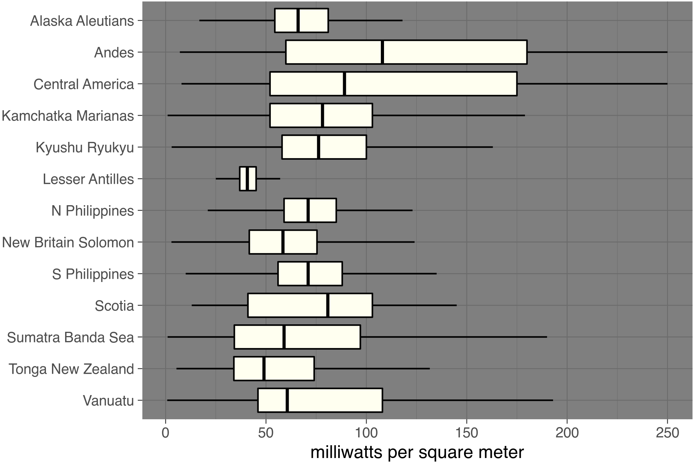

```

```{r hfSummaryTable}
hf.summary %>%
kable(
  caption = 'ThermoGlobe heat flow summary',
  linesep = '',
  col.names = c('Segment', 'n', 'Min', 'Max', 'Median', 'IQR', 'Mean', '$\\sigma$'),
  escape = F,
  booktabs = T,
  format = 'latex') %>%
kable_styling(latex_options = c('striped')) %>%
kable_classic() %>%
footnote(
  general_title = '',
  general = c('\\\\uline{\\\\textit{key}}: n: [\\\\# of observations], all other units are in mW/m$^2$', '\\\\uline{\\\\textit{note}}: ThermoGlobe data are filtered for quality, restricted to [0, 250) mW/m$^2$, and cropped within 1000 km-radius buffers of segment boundaries'),
  threeparttable = T,
  escape = F
)
```

\clearpage

## Comparing Similarity and Kriging Interpolations {#interpDiffAppendix}

(ref:diffSummaryPlotCap) Differences between Similarity and Kriging interpolations by segment, computed as Similarity-Kriging. Differences are centered near zero with medians ranging from `r min(interp.diff$median)` to `r max(interp.diff$median)` mW/m$^2$, but broadly distributed with \glspl{iqr} from `r min(interp.diff$IQR)` to `r max(interp.diff$IQR)` mW/m$^2$ and some long tails extending from `r min(interp.diff$min)` to `r max(interp.diff$max)` mW/m$^2$. Positive medians and right skew indicate a general tendency towards higher surface heat flow predictions by Similarity compared to Kriging. The broadest distributions (Andes and Central America) reflect less subtle differences between methods. Distributions are colored by quartiles (25%, 50%, 75%). Similarity interpolation from @lucazeau2019.

```{r diffSummaryPlot, fig.cap='(ref:diffSummaryPlotCap)', fig.scap='Differences between Similarity and Kriging interpolations'}

knitr::include_graphics('assets/figs/chpt3/interpDiffSummary.png')

```

(ref:sigmaDiffSummaryPlotCap) Summary of differences between Similarity and Kriging uncertainties computed as Similarity-Kriging. Differences are centered at slightly negative values with median differences ranging from `r min(sigma.diff$median)` to `r max(sigma.diff$median)` mW/m$^2$, and relatively narrowly distributed with \glspl{iqr} from `r min(sigma.diff$IQR)` to `r max(sigma.diff$IQR)` mW/m$^2$ and some long tails extending from `r min(sigma.diff$min)` to `r max(sigma.diff$max)` mW/m$^2$. Negative medians indicate greater uncertainties by Kriging compared to Similarity. Distributions are colored by quantiles (25%, 50%, 75%). Similarity data from @lucazeau2019. Refer to Figure \@ref(fig:diffSummaryPlot) for estimate differences.

```{r sigmaDiffSummaryPlot, fig.cap='(ref:sigmaDiffSummaryPlotCap)', fig.scap='Differences between Similarity and Kriging uncertainties'}

knitr::include_graphics('assets/figs/chpt3/interpSigmaDiffSummary.png')

```

```{r diffSummaryTable}
interp.diff %>%
kable(
  col.names = c('Segment', 'Min', 'Max', 'Median', 'IQR', 'Mean', '$\\sigma$'),
  caption = 'Summary of Similarity-Kriging prediction differences',
  linesep = '',
  escape = F,
  digits = 3,
  booktabs = T,
  format = 'latex'
) %>%
kable_styling(latex_options = c('striped')) %>%
kable_classic() %>%
footnote(
  general_title = '',
  general = c('\\\\uline{\\\\textit{note}}: All units are mW/m$^2$'),
  threeparttable = T,
  escape = F
)
```

```{r sigmaDiffSummaryTable}
sigma.diff %>%
select(-c(cost, n)) %>%
kable(
  col.names = c('Segment', 'Model', 'Min', 'Max', 'Median', 'IQR', 'Mean', '$\\sigma$'),
  caption = 'Summary of Similarity-Kriging uncertainty differences',
  linesep = '',
  escape = F,
  digits = 3,
  booktabs = T,
  format = 'latex'
) %>%
kable_styling(latex_options = c('striped', 'scale_down')) %>%
kable_classic() %>%
footnote(
  general_title = '',
  general = c('\\\\uline{\\\\textit{note}}: Showing optimal Kriging models only, difference is calculated as Similarity-Kriging', '\\\\uline{\\\\textit{key}}: Cost: [mW/m$^2$], n: number of target locations (grid size), all other units are mW/m$^2$'),
  threeparttable = T,
  escape = F
)
```

\clearpage

```{r alaskaAleutiansDiff, fig.cap='Similarity (a) and Kriging (b) interpolations for Alaska Aleutians. Refer to the main text for explanation of panels and colors.', fig.scap='Similarity and Kriging interpolations for Alaska Aleutians'}

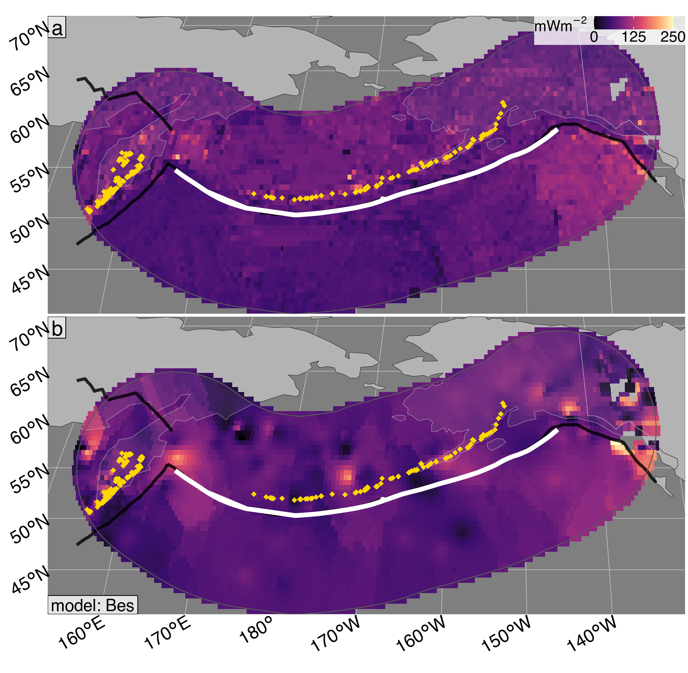

```

```{r andesDiff, fig.cap='Similarity (a) and Kriging (b) interpolations for Andes. Refer to the main text for explanation of panels and colors.', fig.scap='Similarity and Kriging interpolations for Andes'}

knitr::include_graphics('assets/figs/chpt3/AndesDiffComp.png')

```

```{r kamchatkaMarianasDiff, fig.cap='Similarity (a) and Kriging (b) interpolations for Kamchatka Marianas. Refer to the main text for explanation of panels and colors.', fig.scap='Similarity and Kriging interpolations for Kamchatka Marianas'}

knitr::include_graphics('assets/figs/chpt3/KamchatkaMarianasDiffComp.png')

```

```{r lesserAntillesDiff, fig.cap='Similarity (a) and Kriging (b) interpolations for Lesser Antilles. Refer to the main text for explanation of panels and colors.', fig.scap='Similarity and Kriging interpolations for Lesser Antilles'}

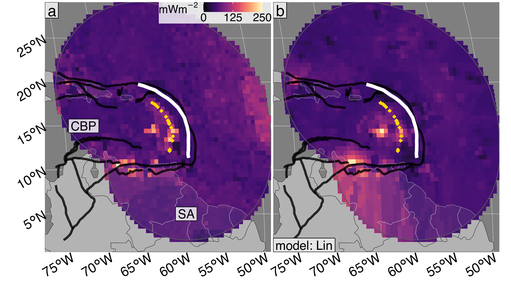

```

```{r nPhilippinesDiff, fig.cap='Similarity (a) and Kriging (b) interpolations for N Philippines. Refer to the main text for explanation of panels and colors.', fig.scap='Similarity and Kriging interpolations for N Philippines'}

knitr::include_graphics('assets/figs/chpt3/NPhilippinesDiffComp.png')

```

```{r newBritainSolomonDiff, fig.cap='Similarity (a) and Kriging (b) interpolations for New Britain Solomon. Refer to the main text for explanation of panels and colors.', fig.scap='Similarity and Kriging interpolations for New Britain Solomon'}

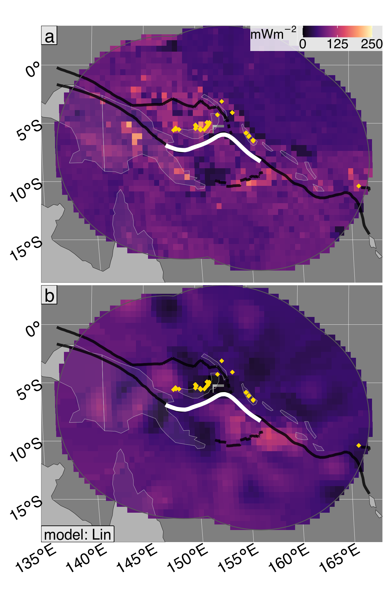

```

```{r sPhilippinesDiff, fig.cap='Similarity (a) and Kriging (b) interpolations for S Philippines. Refer to the main text for explanation of panels and colors.', fig.scap='Similarity and Kriging interpolations for S Philippines'}

knitr::include_graphics('assets/figs/chpt3/SPhilippinesDiffComp.png')

```

```{r sumatraBandaSeaDiff, fig.cap='Similarity (a) and Kriging (b) interpolations for Sumatra Banda Sea. Refer to the main text for explanation of panels and colors.', fig.scap='Similarity and Kriging interpolations for Sumatra Banda Sea'}

knitr::include_graphics('assets/figs/chpt3/SumatraBandaSeaDiffComp.png')

```

```{r tongaNewZealandDiff, fig.cap='Similarity (a) and Kriging (b) interpolations for Tonga New Zealand. Refer to the main text for explanation of panels and colors.', fig.scap='Similarity and Kriging interpolations for Tonga New Zealand'}

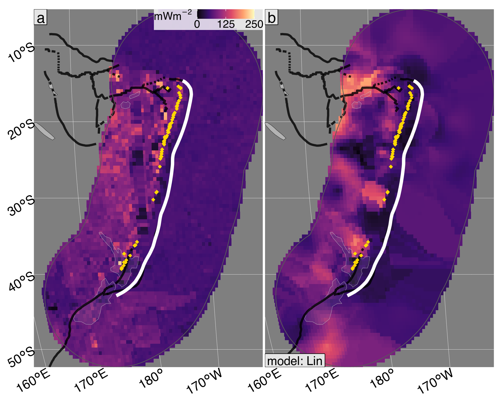

```

\clearpage

## Upper-plate Surface Heat Flow {#lateralDiffAppendix}

```{r alaskaAleutiansUpper, fig.cap='Surface heat flow profiles for Alaska Aleutians upper-plate sectors. Refer to the main text for explanation of panels and colors.', fig.scap='Alaska Aleutians upper-plate sectors'}

knitr::include_graphics('assets/figs/chpt3/AlaskaAleutiansUpperPlate.png')

```

```{r andesUpper, fig.cap='Surface heat flow profiles for Andes upper-plate sectors. Refer to the main text for explanation of panels and colors.', fig.scap='Andes upper-plate sectors'}

knitr::include_graphics('assets/figs/chpt3/AndesUpperPlate.png')

```

```{r centralAmericaUpper, fig.cap='Surface heat flow profiles for Central America upper-plate sectors. Refer to the main text for explanation of panels and colors.', fig.scap='Central America upper-plate sectors'}

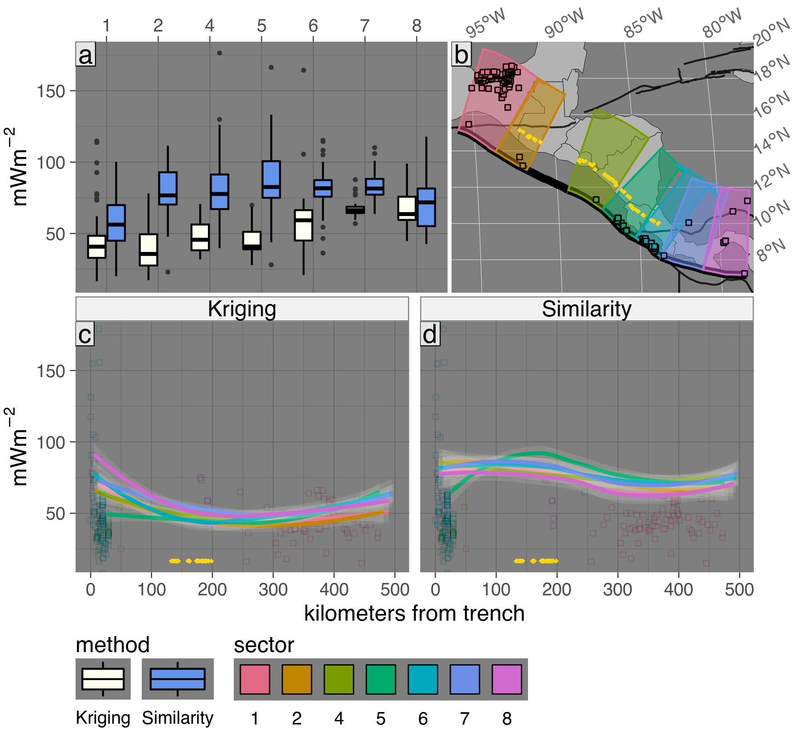

```

```{r kamchatkaMarianasUpper, fig.cap='Surface heat flow profiles for Kamchatka Marianas upper-plate sectors. Refer to the main text for explanation of panels and colors.', fig.scap='Kamchatka Marianas upper-plate sectors'}

knitr::include_graphics('assets/figs/chpt3/kamchatkaMarianasUpperPlate.png')

```

```{r lesserAntillesUpper, fig.cap='Surface heat flow profiles for Lesser Antilles upper-plate sectors. Refer to the main text for explanation of panels and colors.', fig.scap='Lesser Antilles upper-plate sectors'}

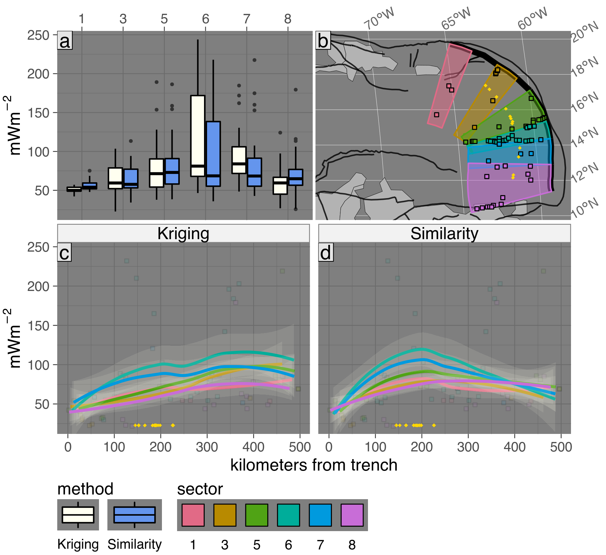

```

```{r nPhilippinesUpper, fig.cap='Surface heat flow profiles for N Philippines upper-plate sectors. Refer to the main text for explanation of panels and colors.', fig.scap='N Philippines upper-plate sectors'}

knitr::include_graphics('assets/figs/chpt3/NPhilippinesUpperPlate.png')

```

```{r sPhilippinesUpper, fig.cap='Surface heat flow profiles for S Philippines upper-plate sectors. Refer to the main text for explanation of panels and colors.', fig.scap='S Philippines upper-plate sectors'}

knitr::include_graphics('assets/figs/chpt3/SPhilippinesUpperPlate.png')

```

```{r scotiaUpper, fig.cap='Surface heat flow profiles for Scotia upper-plate sectors. Refer to the main text for explanation of panels and colors.', fig.scap='Scotia upper-plate sectors'}

knitr::include_graphics('assets/figs/chpt3/ScotiaUpperPlate.png')

```

```{r tongaNewZealandUpper, fig.cap='Surface heat flow profiles for Tonga New Zealand upper-plate sectors. Refer to the main text for explanation of panels and colors.', fig.scap='Tonga New Zealand upper-plate sectors'}

knitr::include_graphics('assets/figs/chpt3/TongaNewZealandUpperPlate.png')

```

```{r vanuatuUpper, fig.cap='Surface heat flow profiles for Vanuatu upper-plate sectors. Refer to the main text for explanation of panels and colors.', fig.scap='Vanuatu upper-plate sectors'}

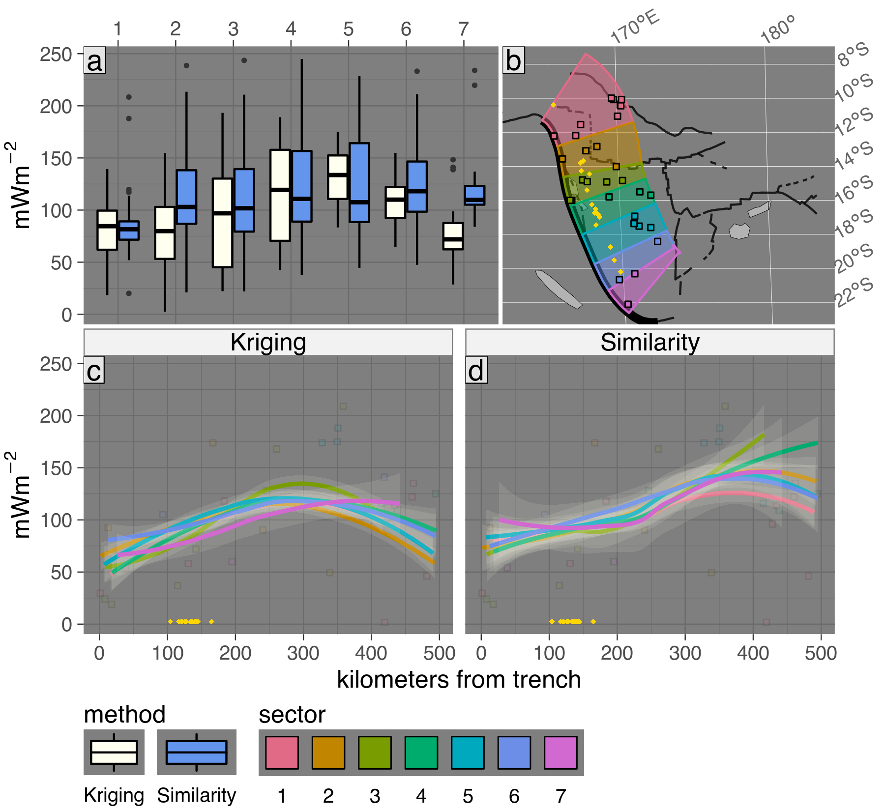

```

\clearpage

\begingroup
\renewcommand{\arraystretch}{0.5}

```{r sectorSummaryTable}
sectors.df %>%
select(-c(min.obs, max.obs, min.sim, max.sim, min.krg, max.krg, med.dif)) %>%
kable(
  col.names = c('Segment', 'Sector', 'n', 'Median', 'IQR', 'n', 'Median', 'IQR', 'Median', 'IQR'),
  caption = 'Summary of upper-plate surface heat flow',
  linesep = '',
  escape = F,
  digits = 3,
  longtable = T,
  booktabs = T,
  format = 'latex'
) %>%
add_header_above(
  c(' ' = 2, 'ThermoGlobe' = 3, 'Similarity' = 3, 'Kriging' = 2),
  escape = F
) %>%
kable_styling(latex_options = c('striped', 'repeat_header'), font_size = 10) %>%
kable_classic() %>%
footnote(
  general_title = '',
  general = c('\\\\uline{\\\\textit{note}}: Similarity and Kriging prediction counts are the same. Surface heat flow units are mW/m$^2$.'),
  threeparttable = T,
  escape = F
)
```

\endgroup

\cleardoublepage

\markboth{Appendix: Chapter 4}{Appendix: Chapter 4}

# Computing Rates and Distributions of Rock Recovery in Subduction Zones

\clearpage

## Gaussian Mixture Models {#gmm}

Let the traced markers represent a $d$-dimensional array of $n$ random independent variables $x_i \in \mathbb{R}^{n \times d}$. Assume markers $x_i$ were drawn from $k$ discrete probability distributions with parameters $\Phi$. The probability distribution of markers $x_i$ can be modelled with a mixture of $k$ components:
\begin{equation}
  p(x_i | \Phi) = \sum_{j=1}^k \pi_j p(x_i | \Theta_j)
  (\#eq:gmix)
\end{equation}
where $p(x_i | \Theta_j)$ is the probability of $x_i$ under the $j^{th}$ mixture component and $\pi_j$ is the mixture proportion representing the probability that $x_i$ belongs to the $j^{th}$ component $(\pi_j \geq 0; \sum_{j=1}^k \pi_j = 1)$.

Assuming $\Theta_j$ describes a Gaussian probability distributions with mean $\mu_j$ and covariance $\Sigma_j$, Equation \@ref(eq:gmix) becomes:
\begin{equation}
  p(x_i | \Phi) = \sum_{j=1}^k \pi_j \mathcal{N}(x_i | \mu_j, \Sigma_j)
  (\#eq:mix)
\end{equation}
where
\begin{equation}
  \mathcal{N}(x_i | \mu_j, \Sigma_j) = \frac{exp\{ -\frac{1}{2}(x_i - \mu_j)(x_i - \mu_j)^T \Sigma_j^{-1}\}}{\sqrt{det(2 \pi \Sigma_j)}}
  (\#eq:gauss)
\end{equation}

The parameters $\mu_j$ and $\Sigma_j$, representing the center and shape of each cluster, are estimated by maximizing the log of the likelihood function, $L(x_i | \Phi) = \prod_{i=1}^n p(x_i | \Phi)$:
\begin{equation}
  log~L(x_i | \Phi) = log \prod_{i=1}^n p(x_i | \Phi) = \sum_{i=1}^n log \left[ \sum_{j=1}^k \pi_j p(x_i | \Theta_j) \right]
  (\#eq:loglik)
\end{equation}

Taking the derivative of Equation \@ref(eq:loglik) with respect to each parameter, $\pi$, $\mu$, $\Sigma$, setting the equation to zero, and solving for each parameter gives the maximum likelihood estimators:
\begin{equation}
  \begin{aligned}
    N_j &= \sum_{i=1}^n \omega_{i} \\
    \pi_j &= \frac{N_j}{n} \\
    \mu_j &= \frac{1}{N_j} \sum_{i=1}^n \omega_{i} x_i \\
    \Sigma_j &= \frac{1}{N_j} \sum_{i=1}^n \omega_{i} (x_i - \mu_j)(x_i - \mu_j)^T
  \end{aligned}
  (\#eq:mle)
\end{equation}
where $\omega_{i}$ ($\omega_{i} \geq 0; \sum_{j=1}^k \omega_{i} = 1$) are membership weights representing the probability of an observation $x_i$ belonging to the $j^{th}$ Gaussian and $N_j$ represents the number of observations belonging to the $j^{th}$ Gaussian. Please note that $\omega_{i}$ is unknown for markers so maximum likelihood estimator cannot be computed with Equation \@ref(eq:mle). The solution to this problem is the Expectation-Maximization algorithm, which is defined below.

General purpose functions in the R package `Mclust` [@scrucca2016] are used to fit Gaussian mixture models. "Fitting" refers to adjusting all $k$ Gaussian parameters $\mu_j$ and $\Sigma_j$ until the data and Gaussian ellipsoids achieve maximum likelihood defined by Equation \@ref(eq:loglik). After @banfield1993, covariance matrices $\Sigma$ in `Mclust` are parameterized to be flexible in their shape, volume, and orientation [@scrucca2016]:
\begin{equation}
  \Sigma_j = \lambda_j D_j A_j D_j^T
  (\#eq:eigen)
\end{equation}
where $D_j$ is the orthogonal eigenvector matrix, $A_j$ and $\lambda_j$ are diagonal matrices of values proportional to the eigenvalues. This implementation allows fixing one, two, or three geometric elements of the covariance matrices. That is, the volume $\lambda_j$, shape $A_j$, and orientation $D_j$ of Gaussian clusters can change or be fixed among all $k$ clusters [e.g. @celeux1995; @fraley2002]. Fourteen parameterizations of Equation \@ref(eq:eigen) are tried, representing different geometric combinations of the covariance matrices $\Sigma$ [see @scrucca2016] and the Bayesian information criterion is computed [@schwarz1978]. The parameterization for Equation \@ref(eq:eigen) is chosen by Bayesian information criterion.

## Expectation-Maximization

The Expectation-Maximization algorithm estimates Gaussian mixture model parameters by initializing $k$ Gaussians with parameters $(\pi_j, \mu_j, \Sigma_j)$, then iteratively computing membership weights with Equation \@ref(eq:posterior) and updating Gaussian parameters with Equation \@ref(eq:mle) until reaching a convergence threshold [@dempster1977].

The *expectation* (E-)step involves a "latent" multinomial variable $z_{i} \in \{1, 2, \dots, k\}$ representing the unknown classifications of $x_i$ with a joint distribution $p(x_i,z_{i}) = p(x_i | z_{i})p(z_{j})$. Membership weights $\omega_{i}$ are equivalent to the conditional probability $p(z_{i} | x_i)$, which represents the probability of observation $x_i$ belonging to the $j^{th}$ Gaussian. Given initial guesses for Gaussian parameters $\pi_j$, $\mu_j$, $\Sigma_j$, membership weights are computed using Bayes Theorem (E-step):
\begin{equation}
  p(z_{i} | x_i) = \frac{p(x_i | z_{i})p(z_{j})}{p(x_i)} = \frac{\pi_j \mathcal{N}(\mu_j, \Sigma_j)}{\sum_{j=1}^k \pi_j \mathcal{N}(\mu_j, \Sigma_j)} = \omega_{i}
  (\#eq:posterior)
\end{equation}
and Gaussian estimates are updated during the *maximization* (M-)step by applying $\omega_{i}$ to Equation \@ref(eq:mle). This step gives markers $x_i$ class labels $z_i \in \{1, \dots, k\}$ representing assignment to one of $k$ clusters (Figure \@ref(fig:class)).

\cleardoublepage

## Marker Classifications {#vis}

The following pages contain visualizations of marker classifications results including marker \gls{pt} distributions and geodynamic snapshots for all 64 subduction zone simulations presented in the main text of this study. All data and visualizations are available online at \url{https://github.com/buchanankerswell/kerswell_et_al_marx}.

\clearpage

```{r loopClass, results = "asis"}
walk(models, ~{
    cat('\n\n\\blandscape\n\n')
    cat('', '', sep = '')
    cat('\n\n\\elandscape\n\n')
})
```
