```{r settings, echo=FALSE, include=FALSE}
# Use system's latexmk
options(tinytex.latexmk.emulation = FALSE)
options(knitr.kable.NA = '')
# Some recommended settings
knitr::opts_chunk$set(
  echo = F,
  message = F,
  warning = F,
  fig.pos = 'htbp',
  out.extra = '',
  fig.align = 'center',
  out.width = '100%'
)
suppressMessages({
  library(dplyr)
  library(tibble)
  library(readr)
  library(purrr)
  library(stringr)
  library(knitr)
  library(kableExtra)
  library(scales)
})

# Chpt1 load
fts.summary <-
  map_df(
    c('46', '62', '78', '94'),
    ~read_csv(paste0('assets/r/chpt4/class_summary', .x, '.csv'), col_types = cols())
  )
```

# Introduction {#chpt1}

\markboth{Chapter 1: Introduction}{Chapter 1: Introduction}

As noted by @gerya2014, a scarcity of observational constraints through time and space makes the study of geodynamics on Earth extraordinarily challenging (Figure \@ref(fig:sparse)). Luckily, application of various computational approaches---simulation, interpolation, and applied statistics---enable geodynamic inquiry despite sparse datasets. This dissertation leverages computational methods to investigate a fundamental component of Plate Tectonic theory, *subduction*.

(ref:sparseCap) The Geodynamicist's dilemma. Time-depth diagram representing the data availability on Earth. The rock record (red circles) encodes information about geodynamic processes throughout Earth's history, but only within approximately 100 $km$ of Earth's surface. Geophysical data (blue circles) provide images of Earth's deep interior, but only since the 20th century CE (or 10$^{-7}$ $Ga$). Direct observations (green circle) are limited to the present-day surface. Size of the circles represents the abundance of available data. Reprinted from @gerya2014 with permission.


```{r sparse, fig.cap='(ref:sparseCap)', fig.scap='The Geodynamicist\'s dilemma'}

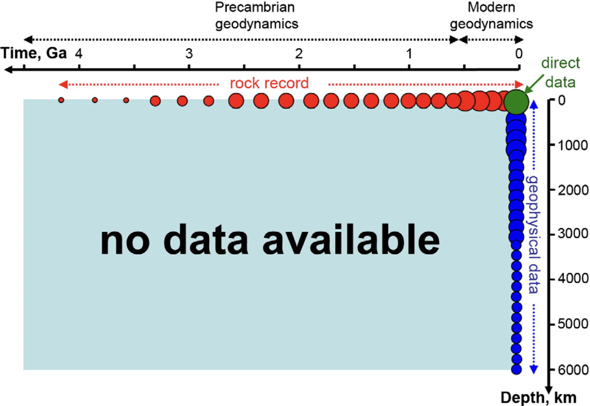

```

Subduction occurs when two lithospheric plates converge and the denser plate *subducts* beneath the other at a *subduction zone*. Subduction zones are implicated in myriad geodynamic phenomena, including seismicity, metamorphism, volatile flux, volcanism, dynamic plate motions, and crustal deformation [@cizkova2013; @gonzalez2016; @hirauchi2010; @peacock1990; @peacock1991; @peacock1993; @peacock1996; @peacock1999a; @hacker2003; @vankeken2011; @grove2012; @gao2017]. These phenomena are largely defined by plate motions and mechanical behavior along the plate interface [@furukawa1993; @peacock1994; @peacock1996]. Important inputs and thermo-kinematic boundary conditions exerting first-order control on subduction zone structure and geodynamics (plate velocity, subduction angle, plate thickness, sediment thickness, crustal structure, subduction duration, and others) vary considerably among presently active subduction zones worldwide [e.g., @syracuse2010; @syracuse2006].

Intuition suggests subduction zone inputs and thermo-kinematic boundary conditions should influence mechanical behavior along the plate interface. Yet previous work argues for rather uniform depths of plate (de)coupling among subduction zones with diverse thermo-kinematic boundary conditions [@furukawa1993; @wada2008; @wada2009]. Models based on such uniform mechanical behavior are widely adopted over alternative models [after @syracuse2010] and imply some aspects of subduction zone mechanics are minimally affected by thermo-kinematic boundary conditions. However, the spatial variability (with depth *and* along strike in map view) of plate interface mechanics is difficult to quantify and currently characterized for transects across relatively few subduction zone segments compared to the global extent of actively converging margins.

This dissertation is motivated by the following question. How can one quantify the spatial variability of plate interface mechanical behavior across a range of subduction zones? Each chapter focuses on quantifying an aspect of subduction zone mechanics using different computational approaches and datasets.

Chapter \@ref(chpt2) numerically simulates oceanic-continental subduction across a range of thermo-kinematic boundary conditions and plate coupling is observed after 10 $Ma$. Multivariate linear regression is then used to formulate an expression for estimating coupling depth. The expression requires estimates for upper-plate thickness, which can be inverted from surface heat flow. Average upper-plate surface heat flow for 13 presently active subduction zones yield a narrow distribution of coupling depths---supporting the idea of broadly uniform mechanical coupling depths among subduction zones.

Chapter \@ref(chpt3) takes a closer look surface heat flow by quantifying its spatial variability in 2D. Two interpolations methods, Kriging and Similarity, are compared to assess differences in their regional heat flow predictions near subduction zones. While Kriging and Similarity yield comparable regional interpolations on average, both approaches show lateral (along strike) surface heat flow variability in the upper plate. Discontinuous upper-plate surface heat flow implies non-uniform upper-plate thickness and contradicts broadly uniform coupling depths predicted in Chapter \@ref(chpt2).

Finally, Chapter \@ref(chpt4) applies machine learning techniques to recognize detachment of subducting markers (representing recovered rock fragments) from the numerical simulations in Chapter \@ref(chpt2). A large (`r format(nrow(fts.summary[fts.summary$rec,]), big.mark = ',')`) \glsfirst{ptt} dataset of recovered markers is compared across numerical experiments and with a global compilation of \gls{pt} estimates for rocks exhumed from subduction zones (the rock record). Marker \gls{ptt} distributions are distinct from the rock record for most numerical simulations, except for the most slowly-converging systems (40 $km/Ma$). Both marker \gls{ptt} distributions and marker recovery rates correlate with thermo-kinematic boundary conditions, implying non-uniform mechanical detachment of rock among subduction zones.

\cleardoublepage

# Effects of Thermo-kinematic Boundary Conditions on Plate Coupling in Subduction Zones {#chpt2}

\markboth{Chapter 2: Coupling Depths}{Chapter 2: Coupling Depths}

```{r loadChpt2, echo=FALSE}
suppressMessages({
  load('assets/r/chpt2/chpt2_data.RData')
  load('assets/r/chpt2/chpt2_regressions.RData')
})
```

## Abstract {#chpt2Abstract}

Deep mechanical coupling between converging plates is implicated in dynamic plate motions, crustal deformation, seismic cycles, arc magmatism, detachment (recovery) of subducting material, and is considered a key feature of subduction zone geodynamics. This study uses two-dimensional numerical simulations of oceanic-continental convergent margins to investigate effects of thermo-kinematic boundary conditions on coupling---specifically focusing on thermal parameter ($\Phi$) and upper-plate thickness. Numerical simulations implement coupling by including the metamorphic (de)hydration reaction $antigorite \allowbreak \Leftrightarrow olivine + orthopyroxene + H_{2}O$ in the upper-plate mantle. Visualizing P-T-strain fields show thermal feedbacks regulating coupling depth dynamically with strong responses to upper-plate thickness and weak responses to $\Phi$. The results imply estimation of coupling depth is possible by inverting upper-plate thickness from surface heat flow. Moreover, surface heat flow sampled from the backarc region near 17 presently active subduction zones imply uniform upper-plate thickness, and thus uniform coupling depths among subduction zones.

## Introduction {#chpt2Intro}

Subduction geodynamics are largely defined by plate motions and mechanical behavior along the plate interface. For example, a transition from mechanically decoupled (plates moving differentially with respect to each other) to coupled plates (plates moving with the same local velocity) dramatically increases temperature by inducing mantle circulation in the upper-plate asthenospheric mantle [@peacock1994; @peacock1996]. Observations from numerical simulations and forearc surface heat flow imply coupling transitions occur globally within a narrow range of depths in modern subduction zones (70-80 $km$). Further, coupling appears essentially unresponsive to diverse thermo-kinematic boundary conditions, including oceanic-plate age, convergence velocity, and subduction geometry [@furukawa1993; @wada2008; @wada2009]. While uniform coupling depths among subduction zones are inferred from numerical simulations and surface heat flow, this phenomenon remains curious and unconfirmed to a large extent. To understand subduction zone geodynamics, it is essential to understand why modern subduction zones appear to achieve similar coupling depths despite differences in their physical characteristics.

Notwithstanding, many numerical geodynamic models use coupling depths of 70-80 $km$ as a boundary condition [@abers2017; @currie2004; @syracuse2010; @vankeken2011; @vankeken2018; @wada2012; @gao2014; @wilson2014], although not exclusively [e.g. 40-56 $km$, @england2010; @peacock1996]. Similar coupling depths among subduction zones is an attractive hypothesis for at least two reasons. First, it helps explain a relatively narrow range of depths to subducting oceanic-plates beneath volcanic arcs [@england2004; @syracuse2006] as mechanical coupling is expected to be closely associated with the onset of flux melting. Second, mechanical coupling is required to detach crustal fragments from the subducting plate [@agard2016], so uniform coupling depths may also help explain why maximum pressures recorded by subducted oceanic material worldwide is $\leq$ 2.3-2.5 $GPa$ [roughly 80 $km$, @agard2009; @agard2018].

The location and extent of mechanical coupling along the plate interface is implicated in myriad geodynamic phenomena, including seismicity, metamorphism, volatile flux, volcanism, plate motions, and crustal deformation [@cizkova2013; @gonzalez2016; @hirauchi2010; @peacock1990; @peacock1991; @peacock1993; @peacock1996; @peacock1999a; @hacker2003; @vankeken2011; @grove2012; @gao2017]. Consequently, the mechanics of coupling have been extensively studied and discussed. Coupling fundamentally depends on the strength (viscosity) of materials above, within, and below the plate interface. Water flux from compaction and dehydration of hydrous minerals with increasing \glsfirst{pt} forms layers of low viscosity sheet silicates near the plate interface. Transmission of shear stress between plates is inhibited by formation of talc and serpentine in the shallow upper-plate mantle [@peacock1999a]. Lack of traction along the interface, combined with cooling from the subducting plate surface, ensures a positive feedback between hydrous mineral formation and mechanical decoupling. Experimentally determined flow laws, petrologic observations, and geophysical observations all support the plausibility of this conceptual model of subduction interface behavior [e.g., @agard2016; @agard2018; @gao2014; @peacock1999a].

Experimental control over important thermo-kinematic boundary conditions make geodynamic numerical simulations essential for investigating such complex geodynamic environments. @wada2009 previously investigated the effects of $\Phi$ on coupling depths by numerically simulating 17 presently active subduction zones. Among other thermo-kinematic boundary conditions, their models specify convergence rate, subduction geometry, thermal structure of oceanic- and overriding-plates, and degree of coupling along the subduction interface. Notably, their experiments control for interface rheology and discriminate best-fit coupling depths based on observed forearc surface heat flow.

This study similarly specifies thermo-kinematic boundary conditions to numerically simulate the range of modern subduction zone systems, but regulates interface rheology dynamically by implementing metamorphic reactions that respond to evolving P-T-strain fields. Subduction geometry and coupling depth are not fully determined features, in other words, but spontaneous model outcomes within the range of specified boundary conditions discussed in Section \@ref(numMethods). As in previous studies [e.g., @ruh2015], rheological effects of the dehydration reaction $antigorite \allowbreak \Leftrightarrow olivine + orthopyroxene + H_{2}O$ are implemented to drive mechanical coupling. An abrupt viscosity increase accompanies antigorite (serpentine) destabilization, thereby inducing mechanical coupling, as defined by empirically-determined flow laws used in the experiments (Table \@ref(tab:materials)).

This chapter focuses on two fundamental questions. How does coupling depth respond to $\Phi$ *and* upper-plate thickness? And how stable is coupling depth through time? First, 64 convergent margins with variable upper-plate thickness and $\Phi$ are numerically simulated and mechanical plate coupling is observed. Thermal feedbacks within the system are visualized in terms of mantle temperature, viscosity, and velocity fields and coupling depth responses to a range of $\Phi$ and upper-plate thickness are quantified using multivariate linear regression. Three different regression models are then used to estimate coupling depths for 17 presently active subduction zones. Coupling depth estimates are narrowly distributed, regardless of regression model form. Finally, implications and questions regarding uniformity among subduction zones in terms of surface heat flow, upper-plate thickness, and coupling depth are discussed.

## Numerical Modelling Methods {#numMethods}

This study simulates converging oceanic-continental plates, where an ocean basin is being consumed by subduction at a continental margin (Figure \@ref(fig:init)). Initial conditions are modified from previous numerical experiments of active margins [@sizova2010; @gorczyk2007] using the code `I2VIS` [@gerya2003], although plate coupling was not the focus of their studies. An identical rheologic model with identical material properties (Table \@ref(tab:materials)), and a identical hydration/melt model (Table \@ref(tab:melts) & Appendix \@ref(deHydration)) to @sizova2010 are implemented. However, the version of `I2VIS` in this study differs from @sizova2010 in its initial setup, overall dimension, resolution, continental geotherm, dehydration model, and left boundary condition (origin of new oceanic lithosphere). Differences are outlined in this section and in Appendix \@ref(deHydration). Sixty-four `I2VIS` models constructed with varying convergence rates ($\vec{v}$), oceanic-plate ages, and upper-plate thickness (Figure \@ref(fig:params)) were ran on the [Euler cluster](https://scicomp.ethz.ch/wiki/Euler) at ETH, Zürich for at least 100 timesteps.


\begin{landscape}


```{r init, fig.cap='Initial model configuration and boundary conditions. (a) A free sedimentation/erosion boundary at the surface is maintained by implementing a layer of "sticky" air and water, and an infinite-like open boundary at the bottom allows for spontaneous oceanic-plate descent and subduction angle. Left and right boundaries are free slip and thermally insulating. Initial material distribution includes 7 $km$ of oceanic crust (2 $km$ basalt, 5 $km$ gabbro), 1 $km$ of oceanic sediments, and 35 $km$ of continental crust, thinning ocean-ward. (b) Oceanic lithosphere is continually created at the left boundary. The oceanic geotherm is calculated using a half-space cooling model and the continental geotherm is calculated using a one-dimensional steady-state conductive cooling model to 1300 $^{\\circ}C$. The base of the upper-plate lithosphere ($Z_{UP}$) is defined by visualizing viscosity and generally coincides with the 1100 $^{\\circ}C$ isotherm. (c) Oceanic crust is bent under loading from passive margin sediments, and a weak zone extends through the lithosphere to help induce subduction. Convergence velocities are imposed at stationary, high-viscosity regions far from the trench. Rock type colors are: [1] air, [2] water, [4,5] sediments, [6,7] felsic crust, [8] basalt, [9] gabbro, [10,11] dry mantle, [12] hydrated mantle, [14] serpentinized mantle.', fig.scap='Initial model configuration and boundary conditions'}

include_graphics('assets/figs/chpt2/fig1.png')

```


\end{landscape}


### Initial Setup and Boundary Conditions {#numBCs}

Simulations are 2000 $km$ wide and 300 $km$ deep (Figure \@ref(fig:init)). In the model domain, three governing equations of heat transport, momentum, and continuity are discretized and solved with a conservative finite-difference marker-in-cell approach on a fully staggered grid as outlined in @gerya2003. Numerical resolution is non-uniform with higher resolution (1 $km$ x 1 $km$) in a 600 $km$ wide area surrounding the contact between the oceanic-plate and continental margin, then gradually changing to lower resolution towards the model boundaries (5 $km$ x 1 $km$, x- and z-directions, respectively). The left and right boundaries are free-slip and thermally insulating (Figure \@ref(fig:init)a, b). Implementation of "sticky" air and water allows for a free topographical surface with a simple linear sedimentation and erosion model. The lower boundary is open to allow for oceanic-plate descent with a spontaneous subduction angle [@burg2005].

A horizontal convergence force is applied to both plates in a rectangular region far from the continental margin (Figure \@ref(fig:init)c). An initial weak layer cutting the lithosphere permits subduction to initiate. The high-viscosity ($\eta = 10^{25}~Pa\cdot s$) rectangular convergence regions apply constant horizontal velocities without deforming the lithosphere. Subduction angle is governed by free-motion of the subducting plate. Similarly, subduction velocity varies with time in response to extension or shortening of the overriding plate. $\Phi$ is thus calculated as the product of the horizontal convergence velocity and the oceanic-plate age [c.f. @kirby1991; @mckenzie1969]. For convenience and consistency with the literature, this study presents $\Phi$ in units of $km$/100 (Figure \@ref(fig:params)a).

```{r params, fig.cap='Range of thermo-kinematic boundary conditions used in numerical experiments. (a) Thermal parameters (grayscale) range from 13 to 110 $km/100$ and broadly reflect the distribution of oceanic-plate ages and convergence velocities in modern subduction zones. Model names include the prefix "cd" for "coupling depth" with increasing alphabetic suffixes. Note that neither axes are continuous. (b) Upper-plate thickness ($Z_{UP}$) is defined by a range of continental geotherms. Geotherms were constructed using a one-dimensional steady-state conductive cooling model with $T(z=0)$ = 0 $^{\\circ}C$, $\\vec{q}(z=0)$ = 59, 63, 69, 79 $mW/m^2$, and constant radiogenic heating of 1.0 $\\mu W/m^3$ for a 35 $km$-thick crust and 0.022 $\\mu W/m^3$ for the mantle. Continental geotherms are calculated up to 1300 $^{\\circ}$C with a constant 0.5 $^{\\circ}C/km$ gradient (the mantle adiabat) extending to the base of the model domain.', fig.scap='Range of boundary conditions used in numerical experiments'}

include_graphics('assets/figs/chpt2/fig2.png')

```

### Defining Geotherms and Lithospheric Thickness {#numGeotherms}

Oceanic crust is modeled as 1 $km$ of sediment cover overlying 2 $km$ of basalt and 5 $km$ of gabbro (Figure \@ref(fig:init)a). Oceanic lithosphere is continually made at a pseudo-mid-ocean ridge at the left boundary of the model (Figure \@ref(fig:init)b). An enhanced vertical cooling condition applied at 200 $km$ from left boundary adjusts for the proper oceanic-plate age, and therefore its lithospheric thickness as it enters the trench [@agrusta2013]. Oceanic-plate ages range from 32.6 to 110 $Ma$ and convergence velocities from 40 to 100 $km/Ma$ (Figure \@ref(fig:params)a). This range of parameters broadly reflects the middle-range of modern global subduction systems [@syracuse2006].

Initial continental geotherms are determined by solving the heat flow equation in one-dimension to 1300 $^{\circ}C$ (Figure \@ref(fig:params)b). This study assumes a fixed temperature of 0 $^{\circ}C$ at the surface, constant radiogenic heating of 1 $\mu W/m^{3}$ in the 35 $km$-thick continental crust, 0.022 $\mu W/m^{3}$ in the mantle, with thermal conductivities of 2.3 $W/mK$ and 3.0 $W/mK$ for the continental crust and mantle, respectively. Above, 1300 $^{\circ}C$, temperature is assumed to constantly increase by 0.5 $^{\circ}C/km$ (the mantle adiabat) to the base of the model domain.

Many studies define the base of the continental lithosphere at the 1300 $^{\circ}C$ isotherm, but it can be determined directly by visualizing viscosity and strain rate as the model progresses. The mechanical base of the lithosphere ($Z_{UP}$) in the models generally occurs near the 1100 $^{\circ}C$ isotherm---characterized by a rapid decrease in viscosity and increase in strain rate (Figures \@ref(fig:cdfStep1), \@ref(fig:cdfStep2), \@ref(fig:cdfStep3)). As such, this study considers oceanic and continental lithospheres as mechanical layers defined by viscosity, rather than defined merely by temperature. $Z_{UP}$ corresponding to backarc surface heat flow of 59, 63, 69, and 79 $mW/m^{2}$ are used in this study (Figure \@ref(fig:params)b).

### Metamorphic (De)hydration Reactions {#numHydration}

Using Lagrangian markers [@harlow1962; @harlow1964] to store and update material properties and P-T-strain fields allows for straight-forward numerical implementation of metamorphic reactions. This approach is key to regulating mechanical coupling dynamically in subduction zone simulations. For example, dehydration (eclogitization) of the oceanic-plate and (de)stabilization of serpentine in the upper-plate mantle may be effectively modelled by tracing marker \gls{ptt} paths while changing marker properties according to thermodynamically-stable mineral assemblages [e.g., @connolly2005]. For computational efficiency, however, water contents in this study are not computed by iteratively solving thermodynamic systems of equations. Instead, gradual eclogitization of oceanic crust is computed as a linear function of lithostatic pressure to a maximum depth of 150 $km$, or temperature of 1427 $^\circ C$, while including garnet-in and plagioclase-out reactions defined by @ito1971. Mantle (de)hydration is computed according reactions boundaries defined by @schmidt1998 with a maximum water content of 2 $wt.\%$ (explained below). This approach effectively simulates continuous influx of water to the upper-plate mantle with relatively low computational cost, beginning with compaction and release of connate water at shallow depths, followed by a sequence of reactions consuming major hydrous phases (chlorite, lawsonite, zoisite, chloritoid, talc, amphibole, and phengite) in different parts of the hydrated basaltic crust [@schmidt1998; @vankeken2011].

The extent of metamorphic reaction effects on mechanical coupling, and the exact (de)hydration reaction(s) likely responsible, are unknown. However, formation of brucite and serpentine from dry olivine near the plate interface are inferred to strongly regulate mechanical behavior [@hyndman2003; @peacock1999a; @agard2016]. Brucite notably breaks down at much lower temperatures than serpentine [@schmidt1998], so serpentine (de)stabilization arguably represents the key transition from a weak-to-strong upper-plate mantle deep in subduction zones. This study elects an implementation of serpentine (de)hydration for this reason. The reaction is assumed to be abrupt and discontinuous, which is a fine approximation for near-endmember compositions like (Mg-rich) peridotites. The \gls{pt} conditions of the reaction $antigorite \Leftrightarrow olivine + orthopyroxene + H_{2}O$ were numerically implemented by the following equation [after @schmidt1998]:
\begin{equation}
  T_{atg-out}(z)=
  \begin{cases}
    751.50+6.008\times10^{-3}z-3.469\times10^{-8}z^2,& \text{for } z < 63000m \\
    1013.2-6.039\times10^{-5}z-4.289\times10{-9}z^2,& \text{for } z>63000m
  \end{cases}
  (\#eq:antstab)
\end{equation}
where $z$ is the depth of a marker from the surface in meters and $T$ is temperature in Kelvins. This reaction boundary is consistent to within 25 $^{\circ}C$ of more recent experiments by @shen2015. Markers with internal temperature exceeding $T_{atg-out}(z)$ spontaneously form $olivine + orthopyroxene + H_{2}O$ and release their crystal-bound water. This implementation tacitly assumes thermodynamic equilibrium and is common to many versions of `I2VIS`.

Oceanic-plates of different ages are also tacitly assumed to dehydrate similarly with the above implementation. However, older (colder) oceanic-plates are expected to carry water to greater depths than younger (warmer) plates because of relatively delayed water-releasing reactions [@peacock1996]. Abrupt water release with serpentine dehydration (Equation \@ref(eq:antstab)) was tested to model deep water retention in cold oceanic-plates. Mechanical coupling behavior was indistinguishable from gradual water release models. This implies rates of water release are less important than the depth of serpentine stability. Explicitly modelling other major dehydration reactions are thus unlikely to significantly affect mechanical coupling behavior, yet likely to introduce numerical artifacts at great computational cost. A simplified gradual water release model for all oceanic-plates is therefore preferred.

Water released by rock forms discrete fluid particles that migrate with relative velocities defined by local deviatoric (non-lithostatic) pressure gradients [see Appendix \@ref(deHydration), @faccenda2009]. Fluid velocities are scaled by a 10 $cm/yr$ vertical percolation velocity to account for purely lithostatic pressure gradients in the mantle [@gorczyk2007]. Fluid particles migrate until encountering rock that can consume additional water by equilibrium hydration or melting reactions, (Equation \@ref(tab:melts)).

The shallow upper-plate mantle can theoretically store large amounts of water as serpentine may contain up to 13 $wt.\%$ water [@reynard2013] and is generally stable at shallow mantle conditions. Thermodynamic models predict 8 $wt.\%$ water in the shallow upper-plate mantle [@connolly2005]. However, seismic studies suggest most shallow upper-plate mantles are only partially serpentinized (< 20-40%), equating to water contents of approximately 3-6 $wt.\%$ [@abers2017; @carlson2003]. Many modes of mantle hydration are documented or inferred, including evidence for channelized fluid flow within ophiolites exhumed from subduction zones [@angiboust2012a; @angiboust2014; @zack2007; @plumper2017]. This study limits mantle wedge hydration to $\leq$ 2 $wt.\%~H_{2}O$ and assumes any excess $H_{2}O$ exits the system through channelized fluid flow during plastic or brittle deformation [@davies1999].

```{r materials}
readr::read_csv('assets/r/chpt2/materials.csv', show_col_types=F) %>%
dplyr::mutate(thermalConductivityConstant3=scientific(thermalConductivityConstant3)) %>%
kable(
  col.names = c(
    'Material',
    '$\\rho$',
    '$H_2O$',
    'Flow Law',
    '$log_{10}A$',
    '$E$',
    '$V$',
    '$n$',
    '$\\phi$',
    '$\\sigma_{crit}$',
    '$k_1$',
    '$k_2$',
    '$k_3$',
    '$H$'
  ),
  linesep = '',
  caption = 'Material properties used in numerical experiments',
  escape = F,
  booktabs = T,
  format = 'latex'
) %>%
kable_styling(latex_options = c('striped', 'scale_down')) %>%
kable_classic() %>%
footnote(
  general_title = '',
  general = c(
    '\\\\uline{\\\\textit{key}}: $\\\\rho$: density $[kg/m^3]$, $H_2O$: water content $[wt.\\\\%]$, $A$: material constant, $E$: activation energy $[kJ/mol]$, $V$: activation volume $[J/MPa\\\\cdot mol]$, $n$: power law exponent, $\\\\phi$: internal friction angle, $\\\\sigma_{crit}$: critical stress $[MPa]$, $H$: heat production $[\\\\mu W/m^3]$',
    '\\\\uline{\\\\textit{constants}}: $C_p$: heat capacity = $1~[kJ/kg]$, $\\\\alpha$: expansivity = $2\\\\times 10^{-5}~[1/K]$, $\\\\beta$: compressibility = $0.045~[1/MPa]$',
    '\\\\uline{\\\\textit{thermal conductivity}}: $k$ $[W/m \\\\cdot K]=(k_1+\\\\frac{k_2}{T+77})\\\\times exp(k_3 \\\\cdot P)$ with $P$ in $[MPa]$ and $T$ in $[K]$',
    '\\\\uline{\\\\textit{references}}: Turcotte \\\\& Schubert (2002), Ranalli (1995), Hilairet et al. (2007), Karato \\\\& Wu (1993)'
  ),
  escape = F,
  threeparttable = T
) %>%
landscape()
```

### Rheologic Model {#rheologicModel}

Contributions from dislocation and diffusion creep are accounted for by computing a composite rheology for ductile rocks, $\eta_{effective}$:
\begin{equation}
  \begin{aligned}
    \frac{1}{\eta_{effective}} = \frac{1}{\eta_{diff}} + \frac{1}{\eta_{disl}}
  \end{aligned} 
  (\#eq:ductile)
\end{equation}
where $\eta_{diff}$ and $\eta_{disl}$ are effective viscosities for diffusion and dislocation creep. For the crust and serpentinized mantle, $\eta_{diff}$ and $\eta_{disl}$ are computed as:
\begin{equation}
  \begin{aligned}
    \eta_{diff} &= \frac{1}{2} \ A \ \sigma_{crit}^{1-n} \ \exp\left[\frac{E+PV}{RT}\right] \\
    \eta_{disl} &= \frac{1}{2} \ A^{1/n} \ \dot{\varepsilon}_{II}^{(1-n)/n} \ \exp\left[\frac{E+PV}{nRT}\right]
  (\#eq:crust)
  \end{aligned}
\end{equation}
where $R$ is the gas constant, $P$ is pressure, $T$ is temperature in $K$, ${\dot{\varepsilon}}_{II} = \sqrt{\frac{1}{2}{{\dot{\varepsilon}}_{ij}}^{2}}$ is the square root of the second invariant of the strain rate tensor, $\sigma_{crit}$ is an assumed diffusion-dislocation transition stress, and $A$, $E$, $V$ and $n$ are the material constant, activation energy, activation volume, and stress exponent, respectively [Table \@ref(tab:materials), @hilairet2007; @ranalli1995]. For the mantle, $\eta_{diff}$ and $\eta_{disl}$ are computed as [@karato1993]:
\begin{equation}
  \begin{aligned}
    \eta_{diff} &= \frac{1}{2} \ A^{-1} \ G \ \left[\frac{h}{b}\right]^{m/n} \ \exp\left[\frac{E+PV}{RT}\right] \\
    \eta_{disl} &= \frac{1}{2} \ A^{-1/n} \ G \ \dot{\varepsilon}_{II}^{(1-n)/n} \ \exp\left[\frac{E+PV}{nRT}\right]
  \end{aligned}
  (\#eq:mantle)
\end{equation}
where $b$=$5\times10^{-10}$ $m$ is the Burgers vector, $G$=$8\times10^{10}$ $Pa$ is shear modulus, $h$=$1\times10^{-3}$ $m$ is the assumed grain size, $m=2.5$ is the grain size exponent, and the other flow law parameters are given in Table \@ref(tab:materials). Viscosity is limited in all numerical experiments from $\eta_{min} = 10^{17}\ Pa \cdot s$ to $\eta_{max} = 10^{25}\ Pa \cdot s$. An effective visco-plastic rheology is achieved by limiting $\eta_{effective}$ with a brittle (plastic) yield criterion:
\begin{equation}
  \eta_{effective} \leq \frac{C + \phi \ P}{2 \ \dot{\varepsilon}_{II}}
  (\#eq:plastic)
\end{equation}
where $\phi$ is the internal friction coefficient, $C$ cohesive strength at $P$ = 0, and ${\dot{\varepsilon}}_{ij}$ is the strain rate tensor (Table \@ref(tab:materials)).

### Visualization and Determination of Coupling Depth

The rheologic model and thermo-kinematic boundary conditions described in the previous sections always results in plate motions towards the left boundary (slab-rollback). Relatively high dip angles and extreme subduction velocities in some high-$\Phi$ experiments cause chaotic behavior by 10 $Ma$ as the upper-plate is stretched thin and mechanical interference occurs between trench sediments and the high-viscosity convergence region 200 $km$ from the left boundary. Numerical solutions are stable for most experiments, however, reaching quasi-steady state by 5 $Ma$. An additional 5 $Ma$ is allowed to ensure stable geodynamics before observing coupling depth. Surface heat flow, rock type, temperature, viscosity, strain rate, shear heating, and velocity fields are visualized at approximately 10 $Ma$ (e.g. Figure \@ref(fig:comp)) for all 64 experiments to assess geodynamics and solution stability (Figure \@ref(fig:antDepth)).

```{r comp, fig.cap='Visualizing model cdf with a 78 $km$ upper-plate lithosphere at approximately 10 $Ma$. (a) Rock type shows a thin serpentine layer (pink) lubricating the plate interface. Note that low melt volumes are inconspicuous and quickly extracted. (b) Viscosity shows high contrast between the oceanic-plate and serpentinized upper-plate mantle at shallow levels. Viscosity contrast disappears where serpentine becomes unstable. (c) Streamlines show focused mantle flow towards the interface, coinciding with the lower limit of serpentine stability. Note the converging isotherms that imply a feedback between heat transfer, serpentine destabilization, and mechanical coupling. (d) Strain rate shows localized deformation in the serpentine layer along the plate interface. Note that deformation in the upper-plate mantle is restricted to viscous flow beneath the lithosphere and along narrow, subvertical melt conduits. Rock type colors are the same as Figure 1.', fig.scap='Numerical experiment visualization'}

knitr::include_graphics('assets/figs/chpt2/fig3.png')

```

After approximately 10 $Ma$ of subduction coupling depth is determined directly from viscosity by finding the approximate area where strength contrasts between serpentinized- and non-serpentinized upper-plate mantle diminishes to $<$ 10$^2$ $Pa \cdot s$. The node nearest to this region is assigned as the coupling depth. This study assumes mechanical coupling occurs instantaneously and at a single node. Mechanical coupling in reality must be dispersed across a finite length along the plate interface, however. At the numerical resolution the experiments, coupling-like viscosity contrasts are similar within a small area (approximately 5 $\times$ 5 $km$ or 5 $\times$ 5 nodes), giving a qualitative uncertainty coupling depth on the order of 2.5 $km$.

## Results {#chpt2Results}

### Coupling Depth Estimators {#cdEstimators}

Coupling depth ($Z_{cpl}$) correlates strongly with upper-plate thickness ($Z_{UP}$) and weakly with $\Phi$ across all 64 numerical models (Table \@ref(tab:zcResults), Figures \@ref(fig:results) & \@ref(fig:biv)). The responsiveness of coupling depth to $Z_{UP}$ but not to $\Phi$ is a key result of this study. The following equation minimizes standard least squares while optimizing the number of parameters, *p value*, and $R^2$ for all possible permutations of the variables $Z_{UP}$ and $\Phi$ in linear and quadratic forms:
\begin{equation}
  Z_{cpl} = 4.95\times 10^{-3}\ Z_{UP}^{2}\ -\ 9.27\times 10^{-2}\ \Phi\ +\ 63.6
  (\#eq:zCpl)
\end{equation}
where $Z_{cpl}$ is coupling depth in $km$ and $\Phi$ is the thermal parameter in $km/100$. Regression summaries show both linear and quadratic models of $Z_{cpl}$ vs. $Z_{UP}$ and $\Phi$ fit experimental results well (Tables \@ref(tab:anova) & \@ref(tab:regSummary)). Equation \@ref(eq:zCpl) represents a statistical model formulated with observations from physics-based simulations of subduction. Equation \@ref(eq:zCpl) is useful for estimating coupling depths in active subduction zones where $\Phi$ is known and $Z_{UP}$ can be inverted from surface heat flow.

```{r segs}
segs %>%
select(segment, qs, z1100, phi, zc.lin, zc.quad1, zc.quad2) %>%
mutate(
  'phi' = round(phi, 1),
  'zc.lin' = round(zc.lin),
  'zc.quad1' = round(zc.quad1),
  'zc.quad2' = round(zc.quad2)
) %>%
kbl(
  col.names = c(
  'Segment',
  '$\\vec{q}$',
  '$Z_{UP}$',
  '$\\Phi$',
  '$Z_{cpl}^a$',
  '$Z_{cpl}^b$',
  '$Z_{cpl}^c$'
  ),
  linesep = '',
  caption = 'Estimated coupling depths for active subduction zones',
  escape = F,
  booktabs = T,
  format = 'latex'
) %>%
kable_styling(latex_options = c('striped')) %>%
kable_classic() %>%
footnote(
  general_title = '',
  general = c(
    '\\\\uline{\\\\textit{key}}: $\\\\vec{q}$: average backarc surface heat flow $[mWm^{-2}]$, $Z_{UP}$: upper-pate thickness $[km]$, $\\\\Phi$: thermal parameter = $[km/100]$, $Z_{cpl}$: coupling depth $[km]$',
    '\\\\uline{\\\\textit{estimators}}: a: $[Z_{cpl}=Z_{UP}+\\\\Phi]$, b: $[Z_{cpl}=Z_{UP}^2+\\\\Phi]$, c: $[Z_{cpl}=Z_{UP}+Z_{UP}^2+\\\\Phi]$',
    '\\\\uline{\\\\textit{references}}: Currie \\\\& Hyndman (2006), Wada \\\\& Wang (2009)'),
  threeparttable = T,
  escape = F
)
```

Sensitivity of coupling depth to upper-plate thickness and $\Phi$ is apparent when visualizing Equation \@ref(eq:zCpl) and other regression models across $Z_{UP}$ and $\Phi$ space \@ref(fig:multiv). Applying Equation \@ref(eq:zCpl) to 17 active subduction zone segments (Table \@ref(tab:segs)) gives a wide range of estimated coupling depths, similar to the numerical simulations in this study. The distribution of estimated coupling depths, however, is relatively narrow and quasi-normal, with a mean of $\sim$ 82 $km$ and standard deviation of 7 $km$ (Figure \@ref(fig:multiv)d).

```{r multiv, fig.cap='Multivariate regressions and estimated coupling depth ($Z_{cpl}$) for 17 active subduction zone segments. Contoured plots show estimated $Z_{cpl}$ (contours) as a function of thermal parameter ($\\Phi$) and upper-plate thickness ($Z_{UP}$) for linear (a) and quadratic (b, c) regressions. The best fit regression is panel b (Equation \\ref{eq:zCpl}, see Tables \\ref{tab:anova} and \\ref{tab:regSummary}). Black squares are numerical experiments used to fit the contours. White points represent active subduction zones (Table \\ref{tab:segs}). Contours imply $Z_{cpl}$ depends strongly on $Z_{UP}$. While some estimated $Z_{cpl}$ for subduction zones with similar $\\Phi$ are quite different (e.g. Alaska vs. N. Sumatra), some estimated $Z_{cpl}$ are quite similar for subduction zones with very different $\\Phi$ (e.g. Kamchatka vs. N. Cascadia). (d) Distributions of estimated $Z_{cpl}$ for 17 active subduction zones shown in (a), (b), and (c). These 17 segments span a large range of $\\Phi$ but are expected to have a relatively narrow distribution of $Z_{cpl}$ (82 $\\pm$ 14 $km$) according to the regressions in (a), (b), and (c).', fig.scap='Estimated coupling depths for 17 active subduction zone segments'}

knitr::include_graphics('assets/figs/chpt2/fig4.png')

```

### Surface Heat Flow

Upper-plate surface heat flow remains relatively stable and reflects initial upper-plate geotherms in the backarc region for experiments with low to moderate $\Phi$ (Figure \@ref(fig:hf)). However, high-amplitude and high-frequency positive surface heat flow deviations in the upper-plate are common in all experiments, especially for high-$\Phi$ experiments. These deviations correspond to extensional deformation and heat transport via lithospheric thinning and melt migration. These features are apparent as subvertical low viscosity, high strain rate columns originating from the plate interface (Figure \@ref(fig:comp)b, d) and point to potential sources of error when inverting surface heat flow in active subduction zones. Notably, the backarc is relatively unaffected by fluid and melt migration compared to the forearc. Estimating upper-plate thickness by inverting surface heat flow in the backarc is therefore preferable to forearc surface heat flow.

Surface heat flow across all numerical experiments is similar in the forearc region (normalized distance $\leq$ 0.75, Figure \@ref(fig:hf78)). In contrast, surface heat flow extending behind the arc region (normalized distance $>$ 0.75, Figure \@ref(fig:hf78)) increases systematically, then levels off at values reflecting initial continental geotherms (i.e. reflecting initial upper-plate thickness). In reality, surface heat flow depend on fault slip rates and rates of volcanic outputs. However, heat flow in the behind the arc may remain in steady-state if rates of volcanism and crustal thinning by extension are low [@currie2004; @currie2006].

```{r hf78, fig.cap='Surface heat flow ($\\vec{q}$) vs. normalized distance for model cdf with upper-plate thickness ($Z_{UP}$) ranging from 46 to 94 $km$. The distribution of $\\vec{q}$ in the forearc (normalized distance between 0.0 and 1.0) is narrow and shows little variance until near the arc (normalized distance between 0.75 and 1.0). The broad distribution of $\\vec{q}$ behind the arc (normalized distance $>$ 1.0) reflects the broad distribution of initial continental geotherms ($Z_{UP}$). Any simple relationship between $\\vec{q}$ and $Z_{UP}$ may be obscured by heating from extension or vertical migration of fluids, especially within the arc-region (high-amplitude fluctuations).', fig.scap='Surface heat flow calculated from numerical experiments'}

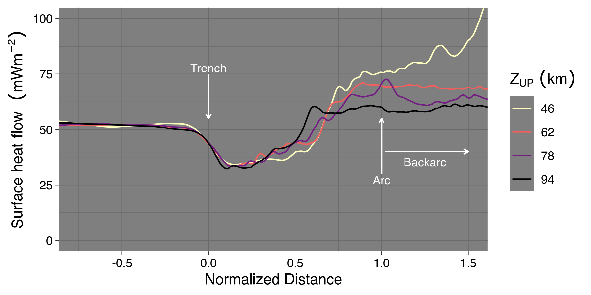

```

## Discussion {#chpt2Discussion}

### Dynamic Feedbacks Regulating Plate Coupling

A clear association between plate coupling and the reaction $antigorite \allowbreak \Leftrightarrow olivine + orthopyroxene + H_{2}O$ is observed in all experiments. A relatively narrow serpentine channel quickly forms above the dehydrating oceanic-plate, localizing strain, lubricating the plate interface, and inhibiting transfer of shear stress between plates [e.g., @agard2016; @ruh2015]. This mechanical behavior is a direct consequence of a sharp rheologic change dependent on the location of serpentine dehydration reaction described in Section \@ref(numHydration) and its effect on the rheologic model described in Section \@ref(rheologicModel). Interactions among viscosity changes, serpentine dehydration, and heat transfer are regulated by competing dynamic feedbacks acting in the upper-plate. In summary, cooling and hydration of the shallow upper-plate mantle (serpentine stabilization) and heating from circulating asthenospheric mantle beneath the upper-plate lithosphere (driven by mechanical coupling) compete to stabilize coupling depth (Figure \@ref(fig:flow)).

The entire process can be conceptualized with Figure \@ref(fig:flow) as follows. The upper-plate mantle cools via diffusive heat loss to the oceanic-plate along the entire length of the plate interface (Figure \@ref(fig:flow)a). At shallow depths, water released from the oceanic-plate stabilizes serpentine in the overriding upper-plate mantle, effectively decoupling the two plates (Figure \@ref(fig:flow)b, point a). A positive feedback stabilizes serpentine to greater depths as decoupled plates stagnate the upper-plate mantle, promoting further cooling and formation of serpentine. Numerical experiments imply only a thin layer of serpentine is sufficient to trigger this feedback.

```{r flow, fig.cap='Visualizing viscosity and mantle flow near the coupling region at approximately 10 $Ma$ for model cdf with upper-plate thickness of 78 $km$. Strong mantle flow beneath the lithospheric base (1100$^{\\circ}C$) transfers heat towards the coupling region. Viscosity indicates coupling at the point where the viscosity contrast between the slab and mantle approaches zero (between points b \\& d). Reference points a-e are used for discussing coupling dynamics and thermal feedbacks (see Section \\ref{cplResponses}).', fig.scap='Visualizing viscosity and mantle flow'}

knitr::include_graphics('assets/figs/chpt2/fig6.png')

```

Deeper along the plate interface, beyond the stability of serpentine, diffusive heat loss from the upper-plate mantle to the slab forms a thickening layer of high-viscosity mantle atop the oceanic-plate (Figure \@ref(fig:flow)b, point b). Downward motion of the oceanic-plate, plus accreted high-viscosity mantle (Figure \@ref(fig:flow)b, point b) relative to the deepest extent of the stiff upper-plate mantle (Figure \@ref(fig:flow)b, point c) creates a pressure gradient that attracts flow of the weakest materials---serpentine from the up-dip direction (Figure \@ref(fig:flow)b, point d)---and hot mantle from below (Figure \@ref(fig:flow)b, point e). Flow of hot mantle into the necking region between points b and c in Figure \@ref(fig:flow) is analogous to passive asthenospheric upwelling toward a mid-ocean ridge where two strong cooling lithospheric plates diverge. Highly efficient heat advection from the warm upper-plate asthenospheric mantle (Figure \@ref(fig:flow)a) prevents formation of sperentine---thus regulating and stabilizing the coupling depth.

Coupling mechanics apparent from numerical experiments can be described in terms of competing positive and negative feedbacks. The positive feedback involves addition of water into a diffusively cooling, shallow mantle to produce serpentine. The negative feedback involves serpentine destabilization by advection of heat from the deeper upper-plate asthenospheric mantle. Such thermal-petrologic-mechanical feedbacks drive coupling depth towards steady-state. The numerical experiments in this study imply a finely-tuned balance of serpentine stability can maintain coupling depths in subduction zones for potentially 10's of Ma.

### Coupling Responses to $Z_{UP}$ and $\Phi$ {#cplResponses}

How does upper-plate thickness influence coupling depth? Numerical experiments point to the upper-plate lithosphere-asthenosphere boundary as an important feature constraining coupling mechanics as it defines the permissible flow field in the upper-plate (Figure \@ref(fig:streams)a-d). Thin upper-plate lithospheres (Figure \@ref(fig:streams)a, b) permit shallow mantle flow and advection of heat farther up the plate interface. Thin upper-plate lithospheres thereby raise coupling depths by raising serpentine stability up the plate interface. Thick upper-plate lithospheres (Figure \@ref(fig:streams)c, d) restrict mantle wedge flow to deeper levels, deepening serpentine stability and mechanical coupling.

The thermal state of the slab, as represented by $\Phi$, has almost no effect on coupling depth by comparison. Relative insensitivity of coupling depth to $\Phi$ is consistent with previous studies of active subduction zones [@furukawa1993; @wada2009]. The irresponsiveness of coupling depth to changes in $\Phi$ is perhaps  due to competing cooling and heating effects driven by the subducting oceanic-plate. For example, high-$\Phi$ oceanic-plates (older plates with higher velocities) cool the upper-plate mantle more effectively, but also effectively heat the interface by driving stronger mantle circulation. In contrast, low-$\Phi$ oceanic-plates (younger plates with lower velocities) are less effective in cooling the upper-plate mantle, but also ineffectively heat the interface by ineffectively driving mantle circulation. That is, the shallow vs. deep dynamic effects of $\Phi$ tend to cancel each other, explaining the lack of correlation between coupling depth and $\Phi$.

### Estimating Coupling Depths in Subduction Zones

Theoretically, coupling depth can be estimated directly by fitting forearc surface heat flow data using forward modelling approaches [e.g., @wada2009]. However, forward approaches typically adjust coupling depth independently from upper-plate thickness, which is inconsistent with an inherent link between coupling depth and upper-plate thickness discussed in Section \@ref(chpt2Discussion) (e.g. Figures \@ref(fig:hf78) & \@ref(fig:streams)). Moreover, many additional heat sources [e.g. shear heating and crustal plutonism, @gao2014; @reesjones2018] may contribute to forearc surface heat flow---increasing uncertainty when inverting upper-plate thickness from surface heat flow.

Assuming low degrees of backarc extension, estimating coupling depth in active subduction zones using Equation \@ref(eq:zCpl) with $Z_{UP}$ inverted from backarc surface heat flow is preferable to avoid additional uncertainties stemming from seismic and volcanic activity in the forearc. However, while $\Phi$ is inventoried for most active subduction zones [@syracuse2006], a corresponding dataset of $Z_{UP}$ does not exist. Several geophysical and petrologic methods might be considered for independent estimates of $Z_{UP}$ (e.g. seismic velocities, flexure, heat flow, mantle xenoliths). Backarc surface heat flow is still a good choice, however, because of its direct correspondence with $Z_{UP}$. For example, $Z_{UP}$ may be estimated using simple one-dimensional heat transport models assuming values for radiogenic heat production in the crust [@rudnick1998]. Special attention must be paid to crustal processes, including extension and magmatism, because additional heating will underestimate $Z_{UP}$ and, consequently, underestimate coupling depth.

```{r streams, fig.cap='Visualizing mantle flow at approximately 10 $Ma$ for model cdf with upper-plate thickness of (a) 46, (b) 62, (c) 78, and (d) 94 $km$. All experiments are plotted on the same scale and location within the model domain. The flow of warm mantle is restricted to below the 1100$^{\\circ}C$ isotherm, which corresponds to the base of the upper-plate lithosphere ($Z_{UP}$). A minimum coupling depth ($Z_{cpl}$) appears to exist as models with extremely thin lithospheres (a) exhibit coupling at $\\sim$ 70-80 $km$ depth. $Z_{cpl}$ generally increases with increasing $Z_{UP}$ as mantle flow and advective heat transport are restricted to greater depths.', fig.scap='Visualizing mantle flow and coupling by upper-plate thickness'}

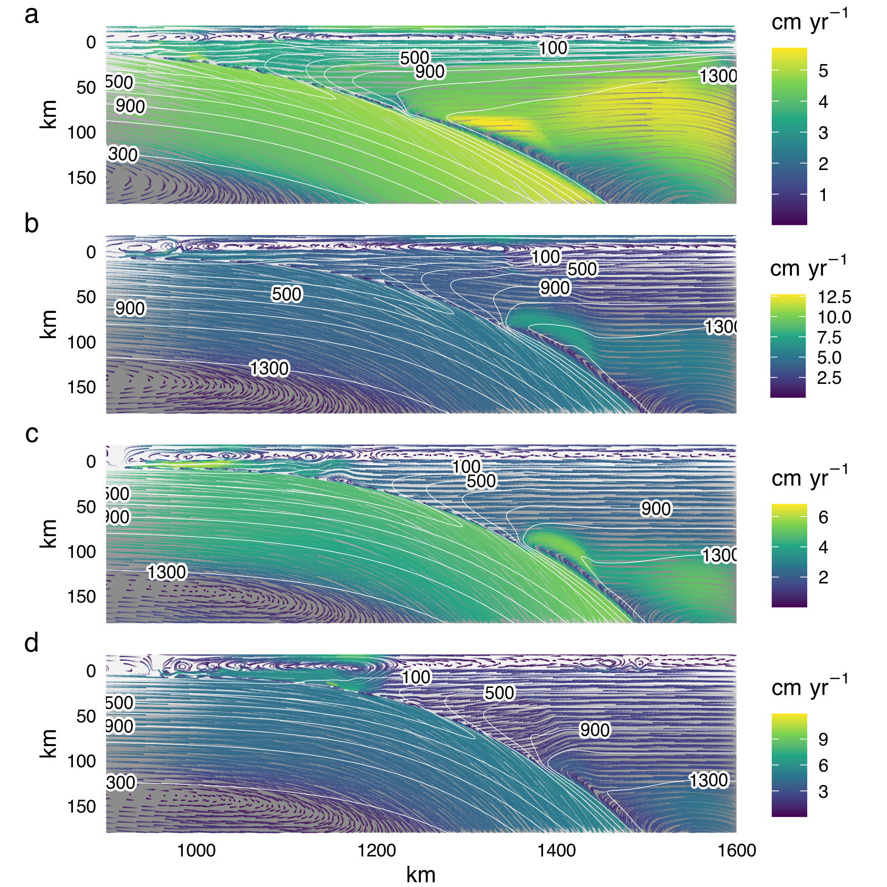

```

### Globally Similar Coupling Depths?

A $Z_{cpl}$ distribution of 82 $\pm$ 14 $km$ (2$\sigma$) estimated for active subduction zones in this study (Figure \@ref(fig:multiv)d) roughly match the preferred $Z_{cpl}$ inferred from forearc surface heat flow for Cascadia and NE Japan [75-80 $km$, @syracuse2010; @wada2009] $km$. The range of $Z_{cpl}$ estimated for active subduction zones in this study (Figure \@ref(fig:multiv)d) is relatively broad, however. For example, omitting Mexico and Nankai because their $\Phi$ values fall outside the range of $\Phi$ used for numerical experiments, estimated coupling depths range from almost 100 $km$ (Kyushu) to approximately 65 $km$ (Sumatra and NE Japan, Table \@ref(tab:segs)).

Coupling depth in active subduction zones are commonly assumed to be narrowly distributed around 70-80 $km$ [@wada2009; @syracuse2010]. The strong correlation between $Z_{UP}$ and $Z_{cpl}$ found from numerical experiments imply uniform coupling depths are possible if upper-plate thickness are globally uniform. The surface heat flow dataset compiled by @wada2009 (Table \@ref(tab:segs)) shows average backarc surface heat flow are indeed similar among active subduction zones---implying a narrow distribution of coupling depths (Figure \@ref(fig:multiv)d). Much of their dataset is based on @currie2006, who estimate upper-plate thickness for 10 circum-Pacific subduction zones of 50-60 $km$ (defined by the 1200 $^{\circ}C$ isotherm). Uniformly thin upper-plate thickness are corroborated by uniformly high heat flow ($>$ 70 $mW/m^{2}$), thermobarometric constraints on mantle xenoliths, and P-wave velocities [@currie2006]. An attempt is made to further corroborate the uniformity of upper-plate thickness in Chapter \@ref(chpt3) by interpolating surface heat flow near active subduction zones.

Although it still curious why upper-plates among subduction zones may have similar thicknesses, one can assume it is likely related to some processes of lithospheric erosion proposed for subarc lithosphere. These include: lithospheric delamination induced by lower crust eclogitization [@sobolev2005], small-scale convection caused by hydration-induced mantle wedge weakening [@arcay2006], thermal erosion [@england2010], mechanical weakening by percolating melts [@gerya2011], and subarc foundering of magmatic cumulates [@jull2001]. Most of these mechanisms are thus strongly related to mantle wedge hydration, melting, and melt transport toward volcanic arcs.

The metamorphic rock record may also imply consistency among coupling depths in subduction zones. For example, the demise of a serpentine channel and onset of coupling may provide a natural barrier such that rocks are more likely to be exhumed from within the channel than from below it. The relative abundance of blueschists and eclogites should then be greater for pressures below estimated coupling depths (approximately 2.4 $GPa$ or 70-80 $km$) than above them. This hypothesis will be explicitly explored in Chapter \@ref(chpt4). 

## Conclusions

Three important results are highlighted in this study:

1. Coupling depth is stabilized near the base of the upper-plate lithosphere by competing dynamic feedbacks regulating heat transport, serpentine dehydration, and mechanical coupling in the upper-plate mantle.

2. A simple expression fitted to coupling depths observed in numerical experiments allows the coupling depths to be estimated for active subduction zones by inverting upper-plate thickness from surface heat flow.

3. Uniform surface heat flow in circum-Pacific subduction zones [@currie2006; @wada2009] may indicate uniform coupling depths at approximately 80 $km$.

Questions remain, however, including: how do warm (thin) upper-plates persist over 100's of kilometers behind arcs and throughout the lifespan of subduction zones? How abruptly are dehydration reaction occurring along the subduction interface? How can expressions like Equation \@ref(eq:zCpl) be improved using natural datasets? Each of these questions may be considered for future research.

\cleardoublepage

```{r loadChpt3, include=FALSE}
# Load extra libraries and functions
source('assets/r/chpt3/functions.R')
# Load data
load('assets/r/chpt3/hf.RData')
load('assets/r/chpt3/opt.RData')
v <-
  vgrm.summary %>%
  select(-c(itr, vgrm.wt, vgrm.rmse, vgrm.cost, cv.wt, cv.cost))
v.opt <-
  vgrm.summary %>%
  filter(v.mod != 'Gau') %>%
  group_by(segment) %>%
  slice_min(cost) %>%
  select(-c(itr, vgrm.wt, vgrm.rmse, vgrm.cost, cv.wt, cv.cost))
interp.diff <-
  interp.diff.summary %>%
  group_by(segment) %>%
  filter(v.mod != 'Gau') %>%
  slice_min(cost) %>%
  select(-c(n, cost, v.mod)) %>%
  ungroup() %>%
  mutate(
    rmse.sim = round(rmse.luca$rmse, 1),
    rmse.krige = round(v.opt$cv.rmse, 1)
  )
sigma.diff <-
  solns %>%
  pmap_df(
    ~st_set_geometry(..6, NULL) %>%
    mutate(segment = ..1, v.mod = ..2, cost = ..7, .before = est.sim)
  ) %>%
  group_by(segment, v.mod, cost) %>%
  drop_na() %>%
  summarise(
    n = n(),
    min = round(min(sigma.diff, na.rm = T)),
    max = round(max(sigma.diff, na.rm = T)),
    median = round(median(sigma.diff, na.rm = T)),
    IQR = round(IQR(sigma.diff, na.rm = T)),
    mean = round(mean(sigma.diff, na.rm = T)),
    sigma = round(sd(sigma.diff, na.rm = T)),
    .groups = 'drop'
  ) %>%
  group_by(segment) %>%
  filter(v.mod != 'Gau') %>%
  slice_min(cost) %>%
  relocate('cost', .after = sigma) %>%
  relocate('n', .before = cost) %>%
  mutate('cost' = round(cost, 3))
```

# A Comparison of Heat Flow Interpolations Near Subduction Zones {#chpt3}

\markboth{Chapter 3: Heat Flow Interpolations}{Chapter 3: Heat Flow Interpolations}

## Abstract {#chpt3Abstract}

The magnitude of heat fluxing through the Earth's surface is directly proportional to the magnitude of temperature gradients and strain rates within Earth's crust and upper mantle. Global heat flow databases are thus promising sources for generating and testing hypotheses about subduction geodynamics. However, evaluating surface heat flow across large tectonic features requires careful projection and interpolation of sparse observations. This study compares two interpolation methods based on fundamentally different principles, Kriging and Similarity, to investigate spatial variability of surface heat flow near 13 presently active subduction zones. Kriging and Similarity are grossly comparable at regional scales with median differences from `r min(interp.diff$median)` to `r max(interp.diff$median)` $mWm^{-2}$. More importantly, Kriging and Similarity both show distinctive trench-perpendicular surface heat flow patterns along strike within the upper-plates of 7 out of 13 segments. Moreover, average upper-plate surface heat flow can differ up to 50 $mWm^{-2}$ along a single subduction zone segment. Subduction zone segments with discontinuous upper-plate surface heat flow may reflect spatially heterogeneous lithospheric thickness (contrary to expectations from Chapter \@ref(chpt2)), spatially heterogeneous dynamics, spatially heterogeneous near-surface perturbations, and/or undersampling relative to the scale and magnitude of spatial variability. Subduction zone segments with continuous upper-plate surface heat flow may imply the opposite. Potential explanations for a nearly 50%-50% split between segments with (dis)continuous upper-plate surface heat flow patterns is yet to be identified and warrants further investigation.

## Introduction {#chpt3Intro}

Surface heat flow databases [@pollack1993; @hasterok2008; @lucazeau2019; @jennings2021] enable geodynamic investigations by relating the amount of heat escaping Earth's surface to heat-transferring and heat-generating subsurface processes like hydrothermal circulation, radioactive decay, fault motion, and mantle convection [@fourier1827; @kelvin1863; @parsons1977; @pollack1977; @stein1992; @hasterok2013; @stein1994; @rudnick1998; @furlong2013; @gao2014; @furukawa1993; @wada2009; @kerswell2020; @currie2004; @currie2006]. Surface heat flow observations have motivated research in many scientific and industrial fields as evident by more than 1,393 publications compiled in the largest and most recent surface heat flow database [ThermoGlobe, @jennings2021; @lucazeau2019].

While ThermoGlobe currently contains `r format(nrow(hf), big.mark = ',')` observations, the regional coverage near subduction zones is uneven and irregularly-spaced (Table \@ref(tab:hfSummaryTable) & Figure \@ref(fig:globalhfComp)). Many methods may be considered to interpolate surface heat flow including inverse distance weighting, various splines and linear regressions, nearest-neighbor, general additive models, Kriging, and Similarity, to name a few. Generally speaking, these methods predict surface heat flow across a grid of arbitrarily defined locations with unknown surface heat flow (the targets) by fitting mathematical models to available surface heat flow observations (the examples). The two interpolation methods compared in this study, Kriging and Similarity, are chosen because they represent end-member methodological classes based on fundamentally different principles. Their comparative differences, therefore, may be important for advancing understanding of subduction zone processes, for targeting areas for future heat flow research, for improving either method in the context of subduction zone research, and for developing new layered interpolation methods that combine the strengths of Kriging and Similarity techniques.

(ref:globalhfCompCap) Surface heat flow near subduction zone segments. (a) ThermoGlobe data from @lucazeau2019 cropped within 1000 $km$-radius circular buffers around 13 active subduction zone segments show uneven regional coverage. For example, note the relatively high observational density in the NW Pacific compared to other regions. (b) In contrast, Similarity interpolation cropped within the same buffers presents an evenly-distributed approximation of regional surface heat flow. Similarity interpolation from @lucazeau2019. Subduction zone boundaries (bold white lines) and volcanoes (gold diamonds) defined by @syracuse2006. Plate boundaries (bold black lines) defined by @lawver2018. AA: Alaska Aleutians, AN: Andes, CA: Central America, KM: Kamchatka Marianas, KR: Kyushu Ryukyu, LA: Lesser Antilles, NBS: New Britain Solomon, NP: N Philippines, SBS: Sumatra Banda Sea, SC: Scotia, SP: S Philippines, TNZ: Tonga New Zealand, VN: Vanuatu.

```{r globalhfComp, fig.cap='(ref:globalhfCompCap)', fig.scap='Similarity interpolation of near 13 active subduction zone segments'}

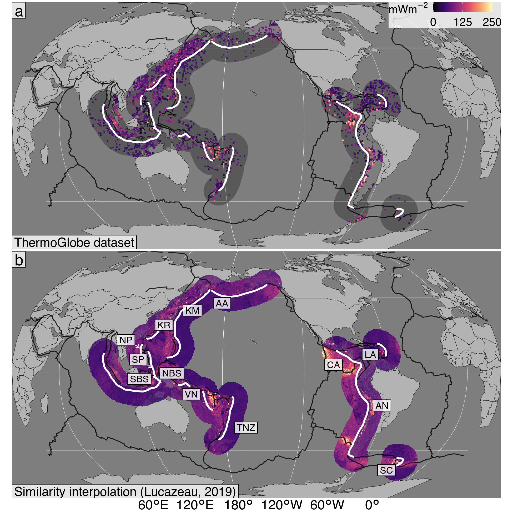

```

In one class of methods (including Kriging), interpolation involves adjusting certain model parameters that depend on the relative positions of examples and targets. Because model parameters are spatially dependent, these methods inherently attempt to conserve the spatial continuity of observed surface heat flow. Kriging, therefore, predicts a more accurate (or truthful) *on-the-ground* distribution of surface heat flow compared to Similarity methods (described below). The rationale for using Kriging is embodied in the First Law of Geography: *everything is related, but nearer things are more related* [@krige1951; @matheron1963].

```{r hfSummaryTable}
hf.summary %>%
kable(
  caption = 'ThermoGlobe heat flow summary by segment',
  linesep = '',
  col.names = c('Segment', 'n', 'Min', 'Max', 'Median', 'IQR', 'Mean', '$\\sigma$'),
  escape = F,
  booktabs = T,
  format = 'latex') %>%
kable_styling(latex_options = c('striped')) %>%
kable_classic() %>%
footnote(
  general_title = '',
  general = c('\\\\uline{\\\\textit{key}}: n: [\\\\# of observations], all other units are in $mWm^{-2}$', '\\\\uline{\\\\textit{note}}: ThermoGlobe data are filtered for quality, restricted to [0, 250) $mWm^{-2}$, and cropped within 1000 $km$-radius circular buffers of segment boundaries'),
  threeparttable = T,
  escape = F
)
```

However, ordinary Kriging must satisfy a condition known as *second order weak stationarity*. That is, the relationship among surface heat flow observations is constant and only depends on the relative separation (lag) distance between pairs of observations. This assumption may be violated within tectonically-diverse regions where the underlying geodynamics may quickly transition from subduction to spreading centers, for example. However, stationarity need only apply over the local Kriging domain, so stationarity can be maintained by careful choice of Kriging parameters. Although not necessary in this study, stationarity assumptions can relax and other techniques that respect the Second Law of Geography [*spatial phenomena are inherently heterogeneous*, @goodchild2004], such as directional Kriging or Markov-Bayes techniques [@bardossy1997], can be applied.

In stark contrast to Kriging, Similarity methods are spatially independent and predict surface heat flow by integrating geographic, geologic, geochronologic, and geophysical information [see @goutorbe2011 for method details]. The technique involves evaluating the number of similar observable geologic proxies between a target and *every* example in the entire global dataset [e.g. a target and an example are similar if they have similar bathymetry, elevation, proximity to active or ancient orogens, seafloor age, upper mantle shear wave velocities, etc., @chapman1975; @lee1965; @sclater1970; @davies2013; @shapiro2004; @lucazeau2019]. Surface heat flow is then predicted at a target location as a function of the target's similarity with each example and the surface heat flow observed at each example, irrespective of their locations. Global-scale problems and regional domains with relatively few surface heat flow data are particularly suited for Similarity as the method is independent of observational density. The rationale for using Similarity is embodied in the Third Law of Geography: *the more similar the geographic configuration of two points, the more similar their values* [@zhu2018].

However, it is especially notable for regional geodynamic investigations that Kriging is explicitly spatially dependent, whereas Similarity is not. Generally speaking, spatial (dis)continuity of surface heat flow observations reflect the (dis)continuity of subsurface geodynamics (assuming insignificant near-surface perturbations). For example, broad regions of low surface heat flow on continents outline cratons and repeated surface heat flow patterns near subduction zones are interpreted to reflect uniform upper-plate lithospheric thickness [@currie2004; @currie2006; @hyndman2005] and mechanical coupling depths [@furukawa1993; @wada2009; @kerswell2020]. While Similarity may be accurate in many cases, simply imposing surface heat flow by layering geologic proxies without explicitly considering the spatial continuity of surface heat flow observations is concerning for at least two reasons. It may 1) discount random unpredictable subsurface geodynamics, and/or 2) discount random unpredictable near-surface perterbations. Either case leads to erroneous surface heat flow inversions and interpretations of subsurface geodynamics. It is therefore crucial for regional geodynamic investigations to characterize the true spatial continuity of surface heat flow observations whenever possible.

This Chapter compares surface heat flow interpolations produced by Similarity and Kriging methods for 13 presently active subduction zones while considering the following questions. How does surface heat flow vary in 2D near subduction zones, especially along strike within upper-plates? Are Kriging and Similarity methods comparable when applied to surface heat flow near subduction zones? What do the differences (if any) imply about geodynamic variability among active subduction zones, especially with respect to uniform upper-plate thickness discussed in Chapter \@ref(chpt2)?

First, ordinary Kriging is applied to the ThermoGlobe dataset [@lucazeau2019; @jennings2021] cropped within 1000 $km$-radius circular buffers around 13 presently active subduction zones defined by @syracuse2006. Kriging predictions are then directly compared (point-by-point) to Similarity interpolations from a previous global-scale study by @lucazeau2019. The results show Kriging and Similarity methods are grossly comparable at regional scales ($\geq$ 100's of $km$), but more importantly, show distinct differences in upper-plate surface heat flow for 7 out of 13 subduction zone segments. Average upper-plate surface heat flow can vary up to 50 $mWm^{-2}$ across a single subduction zone segment---implying non-uniform upper-plate thickness in contradiction to expectations from Chapter \@ref(chpt2). More subtle differences between Kriging and Similarity results point to inherent methodological strengths that may be combined in layered interpolation methods.

## Methods {#chpt3Methods}

### The ThermoGlobe Database

The ThermoGlobe database is available from the supplementary material of @lucazeau2019 and is accessible online at \url{http://heatflow.org} [@jennings2021]. It currently contains `r format(nrow(hf), big.mark=',')` data points, their locations in latitude/longitude, and important metadata---including a data quality rank (`Code 6`) from A (high-quality) to D (low-quality). The reader is referred to @lucazeau2019 and \url{http://heatflow.org} for details on compilation, references, historical perspective on ThermoGlobe, and previous compilations. ThermoGlobe is the most recent database available, has been carefully compiled, and is open-access.

Like @lucazeau2019, `r format(sum(hf$code6 == 'D', na.rm = T), big.mark = ',')` poor quality observations (`Code 6` = D), `r sum(is.na(hf['hf']), na.rm = T)` data points without heat flow observations, and `r sum(is.na(hf$longitude), na.rm = T)+sum(is.na(hf$latitude), na.rm = T)` without geographic information are excluded from the analysis. Note that quality control of such a large dataset is an ongoing endeavor and `r format(sum(hf$code6=='Z', na.rm = T), big.mark=',')` observations currently have an undetermined quality (`Code 6` = Z). Duplicate observations at the same location are parsed (to avoid singular covariance matrices during Kriging) by selecting only the best quality measurement. If duplicate measurements are of equal quality, one is randomly chosen. Finally, only surface heat flow observations in the range (0 - 250] $mWm^{-2}$ are included in Kriging. Similarity interpolations from @lucazeau2019 is also limited to the range (0 - 250] $mWm^{-2}$. Observations outside of the range (0 - 250] $mWm^{-2}$ are considered anomalous [e.g. collected near geothermal systems, @lucazeau2019] and constitute a small fraction of measurements (`r format(nrow(hf[hf$hf < 0 | hf$hf > 250,]), big.mark = ',')` out of `r format(nrow(hf), big.mark = ',')`) forming long tails on either side of the global surface heat flow distribution. The final dataset used for Kriging contains `r format(nrow(hf.crop), big.mark=',')` observations after filtering for quality, missing values, and heat flow range, parsing duplicate pairs, and cropping within subduction zone buffers (Table \@ref(tab:hfSummaryTable) & Figure \@ref(fig:hfSummaryPlot)).

### Map Projection and Interpolation Grid

All geographic operations, including transformation, cropping, Kriging, and comparing interpolations, are performed using general-purpose functions in the `R` package `sf` [@pebesma2018]. ThermoGlobe data and Similarity interpolations from @lucazeau2019 are transformed into a Pacific-centered Robinson coordinate reference system using the open source geographic transformation software `PROJ` [@proj2021]. The transformation is defined by the `proj4` string `"+proj=robin +lon_0=-155 +lon_wrap=-155 +x_0=0 +y_0=0 +ellps=WGS84 +datum=WGS84 +units=m +no_defs"`. The Kriging domains (Figure \@ref(fig:domainConstruct)) are defined by drawing 1000 $km$-radius circular buffers around each subduction zone segment defined by @syracuse2006. Target locations for Kriging are defined across the same grid used by @lucazeau2019 to compute point-by-point differences with their Similarity interpolation.

(ref:domainConstructCap) Example of an interpolation domain constructed around Sumatra Banda Sea. ThermoGlobe data (colored squares) are cropped within a 1000 $km$-radius circular buffer (thin black line) around the segment boundary (bold white line). Target locations for interpolation are defined by the intersections of a 0.5$^\circ \times$ 0.5$^\circ$ grid (black mesh) cropped to the same buffer. Note that Sumatra Banda Sea is one of the most sampled regions, yet still has considerable observational gaps. Grid locations defined by @lucazeau2019. Segment boundary and volcanoes (gold diamonds) defined by @syracuse2006. Plate boundaries (bold black lines) defined by @lawver2018.

```{r domainConstruct, out.width='100%', fig.cap='(ref:domainConstructCap)', fig.scap='Example of an interpolation domain constructed around Sumatra Banda Sea'}

knitr::include_graphics('assets/figs/chpt3/SumatraBandaSeaInterp.png')

```

### Kriging

Kriging is derived from the theory of *regionalized variables* [@matheron1963; @matheron2019] and approximates an unknown quantity as a linear combination of all nearby known quantities. Kriging is a three-step process that involves: 1) estimating an experimental variogram $\hat{\gamma}(h)$ that characterizes the spatial (dis)continuity of some quantity within the Kriging domain, 2) fitting one of many variogram models $\gamma(h)$ to the experimental variogram, and 3) directly solving a linear system of Kriging equations to predict unknown quantities at arbitrary target locations [@krige1951; @cressie2015]. The general-purpose functions defined in the `R` package `gstat` [@graler2016; @pebesma2004] are used to perform all three Kriging steps. The first step is computing an experimental variogram [after @bardossy1997]:
\begin{equation}
  \begin{aligned}
    &\hat{\gamma}(h) = \frac{1}{2N(h)}\sum_{N(h)}^{}[Z(u_i) - Z(u_j)]^2 \\
    &h = |u_i - u_j| \\
    &\delta = \frac{\max(h)\ (n_{lag}+l)}{n_{lag}\ c} \\
    &N(h) = \#\{h \  \in \  [h - \delta,\  h + \delta)\}
  \end{aligned}
  (\#eq:variogram)
\end{equation}
where the experimental variogram $\hat{\gamma}(h)$ evaluates the spatial continuity (or variability) of the set of observations $Z(u)$ by computing the average variance among pairs of observations separated by increasingly greater "lag distances" $h$, or simply "lags". By convention the average variance among pairs of observations separated by some lag distance is halved and called "semivariance". $Z(u_i)$ and $Z(u_j)$ are observations located at points $u_i$ and $u_j$ with a lag of $h = u_i - u_j$. For regularly-spaced data, lag distances are simply multiples of the grid-step distance, but irregularly-spaced data must be treated differently. In the case of irregularly-spaced surface heat flow in this study, a binwidth $\delta$ is defined as a function of the maximum separation distance within the Kriging domain $\max(h)$, the number of lags used to evaluate the variogram $n_{lag}$, a lag shift constant $l$ that shifts the variogram by an integer number of binwidths, and a lag cutoff constant $c$ which is simply a fraction between 0 and 1 (by convention $c=1/3$). $N(h)$ is the number of observations that fall within a lag distance with bindwidth $[h - \delta,\  h + \delta)$.

This study applies ordinary Kriging with isotropic variogram models (assumes semivariance is spatially invariant) to surface heat flow data projected onto a smooth sphere (neglects elevation). Kriging is applied locally (to avoid violating stationarity assumptions) by evaluating only the nearest $n_{max}$ observations at each target location, where "nearest" is defined by the distances between the target location and observations. Therefore, the domain of local Kriging expands or shrinks depending on the local observational density at each target location.

Several variogram parameters influence the Kriging result, including the choice of variogram model, the scope of local Kriging $n_{max}$, and choice of experimental variogram parameters in Equation \@ref(eq:variogram). Instead of choosing Kriging parameters by eye (a common practice for fitting variograms) this study uses a constrained non-linear optimization approach to find optimum values for the parameters $\{model,\ n,\ c,\ n_{max},\ l\}$. A weighted sum of variogram \gls{rmse} and Kriging \gls{rmse} is used as a cost function to simultaneously optimize variogram and Kriging accuracy [after @li2018]. The `R` package `nloptr` is used to optimize Kriging parameters by finding a combination of $\{model,\ n,\ c,\ n_{max},\ l\}$ that minimizes the cost function. A full description of the Kriging system of equations, underlying assumptions, and optimization methods is presented in Appendix \@ref(krigeOpt) with optimization results for all segments and variogram models. All experimental and fitted variograms are presented in Appendix \@ref(interpDiffAppendix) with interpolations for each case.

### Upper-plate Sectors

Surface heat flow profiles and distributions are computed for several adjacent upper-plate regions (sectors) to assess lateral (along-strike) surface heat flow variability. Profiles are defined by (1) splitting a subduction zone segment into 2-8 equidistant parts, (2) defining a 500 $km$-wide single-sided buffer around each part, and (3) calculating the orthogonal great circle distance between each surface heat flow prediction, or observation, and the segment boundary (trench). Steps (1-3) above closely approximate the 2D distribution of surface heat flow projected onto a 1D trench-orthogonal line at the center of a sector [e.g., @currie2004; @currie2006; @hyndman2005; @wada2009]. Profiles are smoothed by a three-point running average and fit with a local non-parametric regression curve [LOESS, @cleveland1988].

### Similarity accuracy

Previous studies evaluate global Similarity prediction accuracy by applying leave-one-out cross-validation during the interpolation process [@goutorbe2011] or directly computing \gls{rmse} after interpolation [@lucazeau2019]. While this study evaluates Kriging accuracy with leave-one-out cross-validation [similar to @goutorbe2011], Similarity accuracy is evaluated with a direct approach [similar to @lucazeau2019] because of its simplicity, robustness, and ease of implementation compared to cross-validation. First, surface heat flow for grid cells containing observations is computed by a weighted average of all observations within a cell. In contrast to @lucazeau2019, who use equal weights (arithmetic mean) for all observations within a cell, this study applies an inverse weighted distance method defined as [@shepard1968]: 
\begin{equation}
  \begin{aligned}
    Z(u_c) &=
    \begin{cases}
      \ \frac{\sum_{i=1}^N \omega_i\ Z(u_i)}{\sum_{i=1}^N \omega_i} \quad \text{if } d(u_i,\ u_c) \neq 0 \text{ for all } i \\
      \ u_i \quad \quad \quad \quad \quad \text{if }  d(u_i,\ u_c) = 0 \text{ for some } i
    \end{cases} \\
    \omega_i &= \frac{1}{d(u_i,\ u_c)^p}
  \end{aligned}
  (\#eq:idw)
\end{equation}
where $Z(u_c)$ is the expected surface heat flow at a grid cell center point $u_c$, $Z(u_i)$ is the surface heat flow observed at location $u_i$, $N$ is the number of observations contained within 55 $km$ (approximately 0.5$^\circ$) of the grid cell center point, $\omega_i$ is the weight applied to $Z(u_i)$, $d(u_i, u_c)$ is a function measuring the distance between observation location $u_i$ and grid cell center point, and $p=2$ is a power constant affecting the smoothness of the interpolation. This method yields an average surface heat flow that is more spatially consistent than computing the arithmetic mean. Finally, Similarity accuracy is evaluated by directly computing \gls{rmse} at all grid cell center points $u_c$ found in the previous step.

## Results {#chpt3Results}

### Optimum Kriging Parameters

Optimized Kriging parameters vary substantially from segment to segment (Table \@ref(tab:vgrmSummaryTable)). However, despite a range of domain sizes, observational densities, and diverse tectonic configurations, Kriging parameters converge on solutions for all Kriging domains (Figure \@ref(fig:optTrace)) and show no systematic correlation with cost (Figure \@ref(fig:vgrmSummaryPlot)). Differences in cost are apparently explained by systematic regional differences in surface heat flow distributions (i.e. differences in the constant terms $\sigma_{vgrm}$ and $\sigma_{interp}$ in Equation \@ref(eq:costExp)) rather than sensitivity to Kriging parameters.

```{r vgrmSummaryTable}
v.opt %>%
select(-c(cv.rmse, rmse)) %>%
mutate(
  'cutoff.prop' = round(cutoff.prop, 1),
  'n.lags' = round(n.lags, 1),
  'lag.start' = round(lag.start, 1),
  'n.max' = round(n.max, 1),
  'sill' = round(sill),
  'range' = round(range/1000),
  'cost' = round(cost, 3)
) %>% 
kable(
  col.names = c('Segment', 'Model', 'Cutoff', 'Lags', 'Shift', '$n_{max}$', 'Sill', 'Range', 'Cost'),
  caption = 'Optimum variogram models by segment',
  linesep = '',
  escape = F,
  booktabs = T,
  format = 'latex'
) %>%
kable_styling(latex_options = c('striped')) %>%
kable_classic() %>%
footnote(
  general_title = '',
  general = c('\\\\uline{\\\\textit{key}}: $n_{max}$: max point-pairs, Sill $[(mWm^{-2})^2]$, Range $[km]$, Cost $[mWm^{-2}]$'),
  threeparttable = T,
  escape = F
)
```

### Interpolation Accuracy

Regional Kriging errors from `r round(min(v.opt$cv.rmse), 1)` to `r round(max(v.opt$cv.rmse), 1)` $mWm^{-2}$ all exceed regional Similarity errors from `r round(min(rmse.luca$rmse), 1)` to `r round(max(rmse.luca$rmse), 1)` $mWm^{-2}$ except for the Lesser Antilles (Table \@ref(tab:diffSummaryTable)). Kriging errors can be relatively small compared to Similarity for domains with high observational density (`r v.opt$segment[which.min(v.opt$cv.rmse)]`; n = `r format(nrow(shp.hf.crop[[v.opt$segment[which.min(v.opt$cv.rmse)]]]), big.mark = ',')`, $\Delta$RMSE = `r round(v.opt$cv.rmse[which.min(v.opt$cv.rmse)] - rmse.luca$rmse[which.min(v.opt$cv.rmse)], 1)`) but relatively large where observational density is comparatively low (`r v.opt$segment[which.max(v.opt$cv.rmse)]`; n = `r format(nrow(shp.hf.crop[[v.opt$segment[which.max(v.opt$cv.rmse)]]]), big.mark = ',')`, $\Delta$RMSE = `r round(v.opt$cv.rmse[which.max(v.opt$cv.rmse)] - rmse.luca$rmse[which.max(v.opt$cv.rmse)], 1)`). On average, Kriging error rates are `r round(mean(v.opt$cv.rmse/rmse.luca$rmse), 1)` times higher than Similarity. Regional Similarity error rates for most subduction zone segments are slightly higher than the 7 $mWm^{-2}$ Similarity error rate reported by @lucazeau2019 (for their preferred global model with 7 proxy observables). However, Similarity error rates in Table \@ref(tab:diffSummaryTable) are consistent with global Similarity error rates from 11.6 to 29.0 $mW/m^{-2}$ reported previously by @goutorbe2011.

```{r diffSummaryTable}
interp.diff %>%
kable(
  col.names = c('Segment', 'Min', 'Max', 'Median', 'IQR', 'Mean', '$\\sigma$', '$RMSE_S$', '$RMSE_K$'),
  caption = '[Similarity$-$Krige] prediction differences by segment',
  linesep = '',
  escape = F,
  digits = 3,
  booktabs = T,
  format = 'latex'
) %>%
kable_styling(latex_options = c('striped')) %>%
kable_classic() %>%
footnote(
  general_title = '',
  general = c('\\\\uline{\\\\textit{note}}: All units are $mWm^{-2}$, showing lowest-cost models from Table \\\\ref{tab:vgrmSummaryTableLong} (excluding Gaussian)', '\\\\uline{\\\\textit{key}}: $RMSE_S$: Similarity accuracy, $RMSE_K$: Kriging accuracy'),
  threeparttable = T,
  escape = F
)
```

### Interpolation Comparison

#### Global Differences

Global differences between Similarity and Kriging interpolations across all subduction zone segments are centered near zero with median differences ranging from `r min(interp.diff$median)` to `r max(interp.diff$median)` $mWm^{-2}$, but broadly distributed with interquartile ranges from `r min(interp.diff$IQR)` to `r max(interp.diff$IQR)` $mWm^{-2}$ and long tails extending from `r min(interp.diff$min)` to `r max(interp.diff$max)` $mWm^{-2}$ (Table \@ref(tab:diffSummaryTable)). Distributions of interpolation differences are either approximately symmetrical, or slightly right-skewed (Figure \@ref(fig:diffSummaryPlot)). Slight right skew and positive median differences indicate a general tendency of Similarity to predict higher surface heat flow compared to Kriging. However, much of the right skew can be explained by spreading centers, transform faults, and volcanic regions predicted by Similarity that are unresolved by Kriging due to lack of observations in those regions (e.g. Central America).

#### Regional Differences

Examples given in this section highlight the range of differences observed between Similarity and Kriging interpolations across subduction zone segments with spreading centers (Central America), without spreading centers (Kyushyu Ryukyu), and regions with very few observations (Scotia). Please refer to \@ref(interpDiffAppendix) for the complete set of visualized interpolations.

##### Central America

Similarity predicts the arms of the Galápagos triple junction to the SW of the Central America segment, whereas Kriging only roughly resolves them (Figure \@ref(fig:centralAmericaDiff)). Consequently, Similarity predictions highlight two distinct regions---high surface heat flow along the arms of the triple junction and within the subducting Cocos Plate, and low surface heat flow to the E and NE of the Cocos Plate and volcanic arc (Figure \@ref(fig:centralAmericaDiff)). In contrast, Kriging predicts relatively low surface heat flow within the Cocos Plate where Similarity predicts higher surface heat flow by proximity to the nearby spreading centers.

(ref:centralAmericaDiffCap) Similarity and Kriging interpolations for Central America. Arms of the Galápagos triple junction (GTJ), the East Pacific Rise (EPR), and Cocos Ridge (CR), are predicted by Similarity (a), but smoothed-out by Kriging (b). Note the differences between predictions within the Cocos Plate (CP) where Similarity predicts relatively high surface heat flow compared to Kriging. Segment boundary (bold white line) and volcanoes (gold diamonds) defined by @syracuse2006. Similarity interpolation from @lucazeau2019. Plate boundaries (bold black lines) defined by @lawver2018.

```{r centralAmericaDiff, out.width = '67%', fig.cap='(ref:centralAmericaDiffCap)', fig.scap='Similarity and Kriging interpolations for Central America'}

knitr::include_graphics('assets/figs/chpt3/CentralAmericaDiffComp.png')

```

##### Kyushu Ryukyu

Similarity and Kriging differences are small and narrowly distributed near Kyushu Ryukyu (median difference: `r interp.diff$median[interp.diff$segment == 'Kyushu Ryukyu']`, IQR: `r interp.diff$IQR[interp.diff$segment == 'Kyushu Ryukyu']` $mWm^{-2}$) compared to Central America (median difference: `r interp.diff$median[interp.diff$segment == 'Central America']`, IQR: `r interp.diff$IQR[interp.diff$segment == 'Central America']` $mWm^{-2}$; Table \@ref(tab:diffSummaryTable)). Kyushyu Ryukyu has a comparable number of observations (n = `r format(nrow(shp.hf.crop[['Kyushu Ryukyu']]), big.mark = ',')`) as Central America (n = `r format(nrow(shp.hf.crop[['Central America']]), big.mark = ',')`), but a simpler tectonic configuration (no spreading centers) and more regularly spaced observations. Kriging near Kyushu Ryukyu corroborates much of the texture predicted in the Similarity interpolation (Figure \@ref(fig:kyushuRyukyuDiff)). A combination of high observation density, relatively uniform distribution of measurements, and relatively simple tectonic configuration make for comparable Similarity and Kriging results.

(ref:kyushuRyukyuDiffCap) Similarity and Kriging interpolations for Kyushyu Ryukyu. (a) Similarity predicts a textured interpolation. (b) The Kriging interpolation is generally smoother, but corroborate much of the same texture predicted by Similarity because of relatively high observational density and regular spatial coverage near Kyushu Ryukyu. Segment boundary (bold white line) and volcanoes (gold diamonds) defined by @syracuse2006. Similarity interpolation from @lucazeau2019. Plate boundaries (bold black lines) defined by @lawver2018.

```{r kyushuRyukyuDiff, out.width='63%', fig.cap='(ref:kyushuRyukyuDiffCap)', fig.scap='Similarity and Kriging interpolations for Kyushyu Ryukyu'}

knitr::include_graphics('assets/figs/chpt3/KyushuRyukyuDiffComp.png')

```

##### Scotia

The Scotia segment illustrates a case where surface heat flow observations are incredibly sparse. Similarity imposes multiple tectonic features, including the East Scotia Ridge and the WSW-ENE trending transform boundary separating the Scotia and Sandwich Plates from the Antarctic Plate (Figure \@ref(fig:scotiaDiff)). Kriging, on the other hand, shows a heat flow anomaly more or less in the region of the East Scotia Ridge, but does not resolve structure in a way that is geologically useful. Very few surface heat flow observations (n = `r nrow(shp.hf.crop[['Scotia']])`) force Kriging predictions to approximate the expected value (mean: `r hf.summary$mean[hf.summary$segment == 'Scotia']` $mWm^{-2}$) for most of the domain according to Equation \@ref(eq:linEstimate). 

(ref:scotiaDiffCap) Similarity and Kriging interpolations for Scotia. (a) Similarity identifies two tectonic features, the East Scotia Ridge (ESR) and a transform fault (TF) separating the Scotia and Sandwich Plates (SP, SAN) from the Antartic Plate (AP). Kriging predicts a high heat flow anomaly in the region of the ESR, but otherwise appears featureless because of incredibly sparse data. Segment boundary (bold white line) and volcanoes (gold diamonds) defined by @syracuse2006. Similarity interpolation from @lucazeau2019. Plate boundaries (bold black lines) defined by @lawver2018.

```{r scotiaDiff, out.width='56%', fig.cap='(ref:scotiaDiffCap)', fig.scap='Similarity and Kriging interpolations for Scotia'}

knitr::include_graphics('assets/figs/chpt3/ScotiaDiffComp.png')

```

### Upper-plate Variability

Lateral surface heat flow variability across upper-plates may be categorized in 1 of 8 ways based on Similarity and Kriging prediction patterns within upper-plate sectors. Each upper-plate can be characterized as having (dis)continuous Similarity prediction patterns, and/or (dis)continuous Kriging prediction patterns, and/or (in)comparable Similarity vs. Kriging prediction patterns. Discontinuous upper-plate surface heat flow patterns are more commonly predicted by either interpolation method than continuous upper-plate surface heat flow patterns (see Appendix \@ref(lateralDiffAppendix)). Discontinuous surface heat flow patterns are predicted by either Similarity or Kriging for 12/13 segments and by both Similarity and Kriging for 7/13 segments (e.g., Kyushu Ryukyu; Figure \@ref(fig:kyushuRyukyuUpper)). In contrast, continuous upper-plate surface heat flow patterns are predicted by either Similarity or Kriging for 6/13 segments and by both Similarity and Kriging for only 1/13 segments (Kamchatka Marianas; Figure \@ref(fig:kamchatkaMarianasUpper)). At least 7/13 segments show incomparable upper-plate surface heat flow patterns predicted by Similarity and Kriging (e.g. Central America; Figure \@ref(fig:centralAmericaUpper)).

(ref:centralAmericaUpperCap) Surface heat flow profiles for Central America upper-plate sectors. (a) Profiles are computed by finding orthogonal distances between the trench (bold black line) and surface heat flow predictions within eight 500 $km$-wide sectors (colored polygons). (b) Similarity and Kriging prediction (ivory and dark grey curves) are distinguishable across sectors with barely overlapping median surface heat flow ranges (ivory and dark grey rectangular regions). Median surface heat flow ranges about 25 $mWm^{-2}$ across sectors for both Similarity and Kriging predictions. (c) Surface heat flow profiles (colored curves) from Similarity and Kriging predictions are narrowly-banded, but offset from each other up to 25-30 $mWm^{-2}$. Kriging profiles are more consistent with heat flow observations cropped from ThermoGlobe [colored squares, @lucazeau2019]. However, note that Similarity profiles show higher heat flow than Kriging near active volcanic vents (gold diamonds). Segment boundary and volcanoes defined by @syracuse2006. Curves in (c) are LOESS regressions through three-point running averages (small colored data points).

```{r centralAmericaUpper, fig.cap='(ref:centralAmericaUpperCap)', fig.scap='Surface heat flow profiles for Central America upper-plate sectors'}

knitr::include_graphics('assets/figs/chpt3/CentralAmericaUpperPlate.png')

```

(ref:sumatraBandaSeaUpperCap) Surface heat flow profiles for Sumatra Banda Sea upper-plate sectors. (a) Profiles are computed by finding orthogonal distances between the trench (bold black line) and surface heat flow predictions within eight 500 $km$-wide sectors (colored polygons). (b) Similarity and Kriging predictions (ivory and dark grey curves) overlap across sectors, yet median surface heat flow ranges are much greater for Kriging ($\geq$ 50 $mWm^{-2}$; dark grey rectangular region) than for Similarity predictions ($\leq$ 15 $mWm^{-2}$; ivory rectangular region). (c) Surface heat flow profiles (colored curves) from Kriging predictions are more widely banded than Similarity profiles. Colored squares are surface heat flow observations cropped from ThermoGlobe [@lucazeau2019]. Segment boundary and volcanoes (gold diamonds) defined by @syracuse2006. Curves in (c) are LOESS regressions through three-point running averages (small colored data points).

```{r sumatraBandaSeaUpper, fig.cap='(ref:sumatraBandaSeaUpperCap)', fig.scap='Surface heat flow profiles for Sumatra Banda Sea upper-plate sectors'}

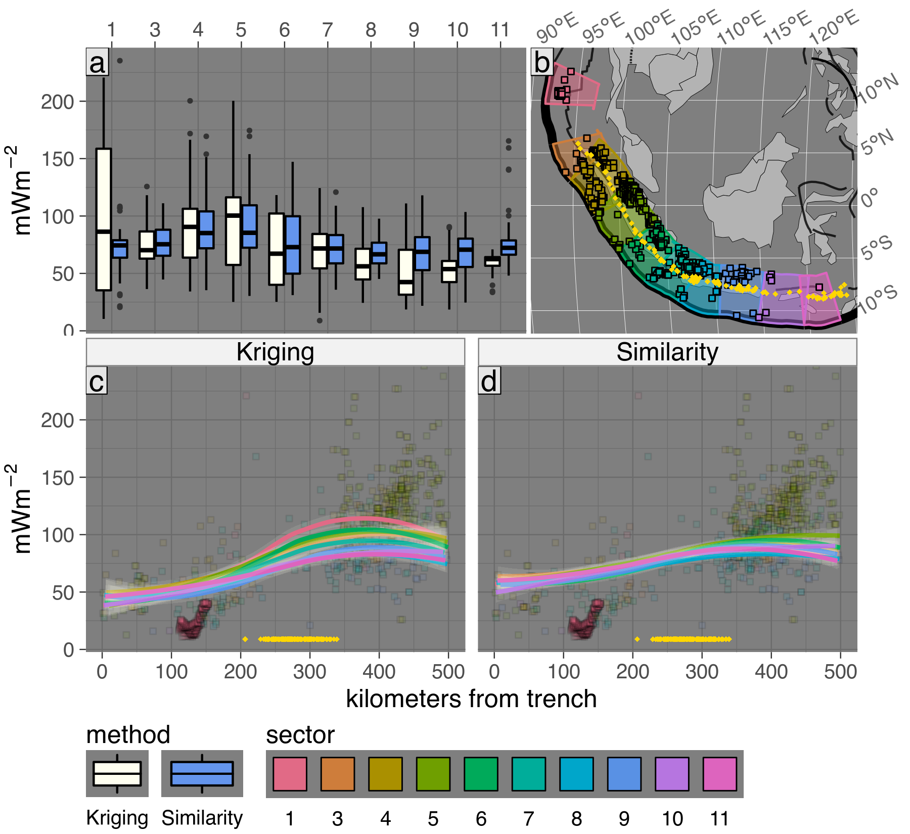

```

\clearpage

## Discussion {#chpt3Discussion}

### Similarity and Kriging Comparisons

Because Similarity and Kriging are fundamentally based on different underlying mathematical frameworks, comparing surface heat flow predictions can improve understanding of subduction zone processes in the following ways.

First, comparable Similarity and Kriging interpolations can corroborate expected and/or predicted tectonic features. For example, Similarity and Kriging both predict low surface heat flow regions defining the oceanic plate and forearc along the Kamchatka Marianas segment (Figure \@ref(fig:kamchatkaMarianasDiff)). Similarity and Kriging both predict high surface heat flow anomalies defining the volcanic center and transform fault separating the South American Plate and Caribbean Plates near the Lesser Antilles Segment (Figure \@ref(fig:lesserAntillesDiff)). Moreover, Similarity and Kriging both predict a broad region of high surface heat flow within the NW part of the Sumatra Banda Sea segment upper-plate (Figure \@ref(fig:sumatraBandaSeaDiff)), corroborating a uniformly-thin upper-plate lithosphere inferred from previous studies [@hyndman2005; @currie2006]. Other examples of general agreement between interpolation methods are observed near the Kyushu Ryukyu (Figure \@ref(fig:kyushuRyukyuDiff)) and N Philippines segments (Figure \@ref(fig:nPhilippinesDiff)). Tectonic features predicted by Similarity and Kriging are confirmed independently by prior geologic information and local surface heat flow observations.

Second, inconsistent Similarity and Kriging predictions can identify tectonic features that are unexpected or currently unresolved by either method. For example, Similarity and Kriging predictions do not confirm the same features near the Central America segment, including the location and extent of two spreading centers, the tip of a transform fault, and the thickness of the Cocos Plate (Figure \@ref(fig:centralAmericaDiff)). A high heat flow anomaly defining a transform fault near the N tip of the Tonga New Zealand segment is predicted by Kriging, but not by Similarity (Figure \@ref(fig:tongaNewZealandDiff)). Further, there is significant disagreement on the location of microplate boundaries predicted by Similarity vs. Kriging near the Vanuatu segment (Figure \@ref(fig:vanuatuDiff)). Features predicted by only one interpolation method either violate prior geologic information, violate local surface heat flow observations, or simply lack sufficient observational coverage to resolve by Kriging. In any case, inconsistent Similarity and Kriging predictions can identify specific features relevant targets for future data acquisition and investigation. The comparisons in Section \@ref(chpt3Results) and Appendices \@ref(interpDiffAppendix) & \@ref(lateralDiffAppendix) thus provide important context for subduction zone research.

### Similarity and Kriging Accuracies

While one approach is not evidently more favorable based on first principles, regional Similarity error rates are considerably lower than Kriging (Table \@ref(tab:diffSummaryTable). However, relatively low error rates do not necessarily imply Similarity produces more accurate interpolations. It is difficult to assess the true comparative accuracy between Similarity and Kriging interpolations for two reasons. First, practically reducing Kriging error rates is possible by choosing different Kriging parameters (e.g. the maximum number of point-pairs used for local Kriging $n_{max}$). While minimizing Kriging cross-validation error by an optimization procedure is a standard geostatistical approach, it does not necessarily guarantee the most accurate interpolation. For example, error rates may be reduced by highly localizing Kriging (by decreasing the number of maximum point-pairs $n_{max}$ used for Kriging at each target location). Consequently, regional interpolation accuracy may be compromised if observations are irregularly-spaced and clustered in local high-density areas. Low Kriging error rates are therefore generally an indication of good interpolation results, but do not fully determine accuracy without evaluating the spatial relationships among observations used to calculate the error rates.

Second, Similarity's low error rates are computed with relatively few data points compared to Kriging (from `r names(map_dbl(shp.hf.crop, nrow))[which.min(map_dbl(shp.hf.crop, nrow))]`: n = `r min(map_dbl(shp.hf.crop, nrow))` to `r names(map_dbl(shp.hf.crop, nrow))[which.max(map_dbl(shp.hf.crop, nrow))]`: n = `r max(map_dbl(shp.hf.crop, nrow))`). This study computes Kriging error rates using all surface heat flow observations within the interpolation domain. In contrast, Similarity error rates are computed using a subset of observations that are explicitly co-located with the 0.5$^\circ \times$ 0.5$^\circ$ grid of target locations taken from @lucazeau2019. Similarity error rates may increase (or decrease) relative to Kriging error rates if computed using all observations within each interpolation domain. Computing Similarity error rates on the same set of observations as Kriging would require reproducing the Similarity results of @lucazeau2019 from the constituent proxy datasets, which are not provided as supplementary files.

Differences in error rates notwithstanding, Similarity has a distinct advantage compared to Kriging in regions with relatively low observational coverage (e.g. Scotia; Figure \@ref(fig:scotiaDiff)). While the detailed regional texture imposed by similarity is artificial insofar as it does not represent known spatial changes in surface heat flow, discrete tectonic features imposed by Similarity appear to be geodynamically consistent in most cases. Similarity may produce ostensibly accurate solutions even in cases with zero observations by integrating multiple sources of geologic information into a composite estimate of surface heat flow. This is a strength of the Similarity method that can be leveraged where limited observations preclude accurate Kriging interpolations. Regardless of methodology, the accuracy and resolution of interpolations compared in this study are sufficient to probe hypotheses about regional geodynamic uniformity among active subduction zones on the basis of surface heat flow (discussed below).

### Upper-plate Sector Variability

Although Kriging and Similarity predictions overlap in many sectors, differences in distributions and median predictions signal subtle but important differences in their contrasting mathematical frameworks. For example, Kriging tends to spatially smooth out surface heat flow gradients (e.g., across the trench, forearc, arc, and backarc), whereas Similarity is agnostic to gradients and can present very textured interpolations.

Lateral variability in upper-plate surface heat flow patterns may imply spatially heterogeneous lithospheric thickness (contrary to expectations from Chapter \@ref(chpt2)), spatially heterogeneous dynamics, spatially heterogeneous near-surface perturbations, and/or undersampling relative to the scale and magnitude of spatial variability. As a corollary, lateral similarity in upper-plate surface heat flow patterns imply the opposite. While uniformly thin upper-plate lithospheres and depths of plate coupling among subduction zones are inferred from similar patterns of upper-plate surface heat flow among subduction zone segments [@currie2004; @currie2006; @furukawa1993; @kerswell2020; @wada2009], these inferences are drawn selected transects.

In contrast, regional surface heat flow interpolations across thousands of square kilometers presented in this study clearly show very mixed results. Some upper-plates appear rather uniform across large regions (e.g., Kamchatka Marianas; Figures \@ref(fig:kamchatkaMarianasDiff) & \@ref(fig:kamchatkaMarianasUpper))---supporting uniformly upper-plate thickness inferred from previous work. However, many other subduction zone segments show distinct patterns of surface heat flow within several adjacent upper-plate sectors (e.g., Central America; Figures \@ref(fig:centralAmericaDiff) & \@ref(fig:centralAmericaUpper)). These results stress the importance of characterizing the lateral variability of surface heat flow to better qualify claims of broad uniformity among (and within) active subduction zone segments.

### Layered Interpolation Approach

Regional interpolation differences and distinct upper-plate surface heat flow patterns predicted by Similarity and Kriging arise from methodological differences that highlight the strengths of either method. For example, geodynamically consistent predictions are possible in regions with relatively few observations by Similarity (e.g., Scotia and New Britain Solomon; Figures \@ref(fig:scotiaDiff) & \@ref(fig:newBritainSolomonDiff)), whereas resolution of unpredictable or unexpected tectonic features is possible by Kriging (e.g., Tonga New Zealand; Figure \@ref(fig:tongaNewZealandDiff)). Combining the strengths of both approaches is possible using a layered interpolation approach.

For example, a Bayesian framework can be used in the following manner. First, regional Similarity is used to initialize a geodynamically consistent interpolation from geologic proxy datasets (layer 0: the priors). The prior Similarity predictions are then updated by Kriging predictions with a weighting scheme to incorporate the on-the-ground reality of surface heat flow observations. A layered approach simultaneously respects the First and Third Laws of Geography by integrating geologic and spatial information. Such an approach is generalizable to other geodynamic investigations and can be more accurate in principle, but is yet to be tried in practice (at least in the context of regional surface heat flow near subduction zone segments).

## Conclusions

This study compares Kriging and Similarity interpolations to distinguish spatial patterns of surface heat flow near subduction zones. Differences between Similarity and Kriging predictions highlight at least three important points of consideration:

1. In many cases Similarity and Kriging interpolations show distinct patterns of surface heat flow that highlight methodological differences between the two approaches, yet also corroborate each other in many other cases
2. Both Similarity and Kriging interpolations show patterns of continuous and discontinuous surface heat flow among upper-plate sectors, countering arguments of broadly uniform upper-plate thickness and plate coupling depths among (or within) subduction zone segments
3. Layered interpolation approaches can combine the strengths of Similarity (geodynamic consistency) and Kriging (spatial consistency) to produce more accurate surface heat flow predictions

\cleardoublepage

```{r loadChpt4}
pd15 <- read_csv('assets/r/chpt4/pd15.csv', col_types = cols())
class.summary <- read_csv('assets/r/chpt4/marx_summary.csv', col_types = cols())
fts.summary <-
  map_df(
    c('46', '62', '78', '94'),
    ~read_csv(paste0('assets/r/chpt4/class_summary', .x, '.csv'), col_types = cols())
  )
models <-
  list.files('assets/figs/chpt4/k10', full.names = T) %>%
  str_extract('cd.[0-9]+') %>%
  unique()
```

# Computing Rates and Distributions of Rock Recovery in Subduction Zones {#chpt4}

\markboth{Chapter 4: Marker Recovery}{Chapter 4: Marker Recovery}

## Abstract {#chpt4Abstract}

\Glsfirst{hp} metamorphic rocks that are detached (recovered) from subducting oceanic-plates and exhumed to the Earth's surface become invaluable records of P-T-strain fields deep in subduction zones. For example, comparing metamorphic \glsfirst{ptt} estimates from suites of \gls{hp} rocks allows for evaluation of \gls{pt} gradients along the plate interface through time. However, some incongruent interpretations concerning \gls{pt} gradients, recovery rates, and recovery depths arise when comparing globally aggregated \gls{ptt} estimates with \gls{pt} gradients from numerical geodynamic models. This study evaluates marker recovery in numerical simulations of oceanic-continental convergence across a range of initial thermo-kinematic boundary conditions representing presently active subduction zones. Over one-million markers traced from 64 simulated subduction zones are classified as recovered, or lost, by implementing a soft clustering classification algorithm. Marker \gls{ptt} distributions are compared across models and with the rock record to address the following questions. How do recovery rates vary among subduction zones? How is recovery distributed along the plate interface, and how does it vary among subduction zones and through time? Marker \gls{ptt} distributions and recovery rates show sensitivity to oceanic-plate age, convergence velocity, and relative detachment timing, but not to upper-plate lithospheric thickness. Marker \gls{ptt} distributions are distinct from the rock record across all but the slowest-converging (40 $km/Ma$) simulations. Four geodynamic regimes with different recovery modes are recognized and discussed with implications for interpreting the rock record. This study highlights the immediate usefulness of augmenting observational constraints with a large (`r format(nrow(fts.summary[fts.summary$rec,]), big.mark = ',')`) simulated dataset.

## Introduction {#chpt4Intro}

Maximum metamorphic conditions, in terms of \glsfirst{pt}, have been estimated for hundreds of \glsfirst{hp} rocks exhumed from subduction zones [Figure \@ref(fig:pd15), @agard2018; @penniston2015]. Aggregated suites of \gls{hp} rocks (the *rock record*) are the only tangible record of P-T-strain fields experienced by Earth's lithosphere during deformation and chemical processing in subduction zones [e.g., @agard2009; @agard2018; @penniston2015]. Together with geophysical imaging [e.g., @ferris2003; @naif2015; @hyndman2003; @syracuse2006; @rondenay2008], surface heat flow [e.g. Chapter \@ref(chpt3), @currie2006; @gao2014; @wada2009; @hyndman2005], and forward numerical modelling [e.g., @gerya2008; @gerya2002; @sizova2010; @gerya2006; @syracuse2010; @yamato2007; @yamato2008; @hacker2003; @peacock1990; @peacock1996; @mckenzie1969], the rock record underpins contemporary understandings of subduction geodynamics [e.g., @agard2009; @agard2018; @bebout2007].

What geodynamic information can be extracted from the rock record? Previous work comparing \gls{pt} distributions of \gls{hp} rocks with numerical geodynamic models identifies two key observations. First, global \gls{pt} estimates compiled by @penniston2015 (the `pd15` dataset) reveal a kinked \gls{cdf} with respect to pressure (Figure \@ref(fig:pd15)). A change in \gls{cdf} slope around `r round(tail(pd15$pressure[pd15$cumulative <= 0.8], 1), 1)` $GPa$ implies relatively uniform recovery of oceanic material up to `r round(tail(pd15$pressure[pd15$cumulative <= 0.8], 1), 1)` $GPa$, but increasingly rare recovery above `r round(tail(pd15$pressure[pd15$cumulative <= 0.8], 1), 1)` $GPa$ [@agard2018; @kerswell2020]. Note that eclogites recovered from extreme pressures above approximately 3 $GPa$ generally have felsic compositions and typify deep subduction of continental material exhumed immediately preceding continental collision [@agard2018]. While evidence of uniform mechanical coupling depths among presently active subduction zones near 2.3 $GPa$ [@currie2006; @furukawa1993; @wada2009; @kerswell2020] is consistent with a relative probability decrease above `r round(tail(pd15$pressure[pd15$cumulative <= 0.8], 1), 1)` $GPa$ implied by `pd15`'s \gls{cdf}, Chapter \@ref(chpt3) shows evidence from 2D interpolations of surface heat flow in contradiction of uniform coupling depths. Moreover, it is unclear if `pd15`'s \gls{cdf} implies a shift in the probability of *recovery* or *exhumation* of oceanic material from around `r round(tail(pd15$pressure[pd15$cumulative <= 0.8], 1), 1)` $GPa$, or perhaps a simpler explanation such as sampling bias (i.e. more greenschists and blueschists have been studied relative to (ultra-)\gls{hp} rocks).

Second, \gls{hp} rocks recovered from pressures of $\leq$ 2 $GPa$ generally record higher temperatures than estimated by some numerical experiments [@penniston2015]. Potential explanations for non-overlapping \gls{pt} distributions among \gls{hp} rocks and numerical models include choice of thermo-kinematic boundary conditions for numerical experiments (oceanic-plate age, convergence velocity, subduction dip angle, upper-plate thickness, heating sources, etc.), differential exhumation of \gls{hp} rocks from subduction zones with higher average \gls{pt} gradients, and comparisons among suites of undifferentiated \gls{hp} rocks with variable relative detachment timing [@penniston2015; @abers2017; @kohn2018; @agard2018; @vankeken2019]. Please note, however, that many comparisons among diverse numerical experiments and metamorphic terranes show various extents of agreement depending on one's choice of initial thermo-kinematic boundary conditions and preferred suite(s) of \gls{hp} rocks [@yamato2007; @yamato2008; @roda2010; @angiboust2012b; @roda2012; @burov2014; @ruh2015; @plunder2018; @roda2020; @holt2021]. Such assorted conclusions warrant further investigation into the general response of \gls{ptt} distributions to broad ranges of thermo-kinematic boundary conditions.

(ref:pd15Cap) \gls{pt} estimates from the rock record. Maximum metamorphic conditions for exhumed \gls{hp} rocks (left; n = `r nrow(pd15)`) roughly fall within thermal gradients from 5 $K/km$ to 20 $K/km$ (thin black lines; calculated with a lithostatic gradient of 35 $km/GPa$). \gls{pt} estimates are concentrated along a high-probability ridgeline that drops off sharply above `r round(tail(pd15$pressure[pd15$cumulative <= 0.8], 1), 1)` $GPa$ (colored contours; calculated with a 2D Gaussian kernel). The \gls{cdf} (right) shows the relative probability of rock recovery explicitly with respect to pressure. Note the shared y-axis. The long ridgeline (left) and change in \gls{cdf} slope at `r round(tail(pd15$pressure[pd15$cumulative <= 0.8], 1), 1)` $GPa$ (right) imply uniform recovery of greenschists and blueschists up to `r round(tail(pd15$pressure[pd15$cumulative <= 0.8], 1), 1)` $GPa$, but increasingly rare eclogite recovery from depths $\geq$ `r round(tail(pd15$pressure[pd15$cumulative <= 0.8], 1), 1)` $GPa$. Data from @penniston2015.

```{r pd15, fig.cap='(ref:pd15Cap)', fig.scap='\\gls{pt} estimates from the rock record'}

include_graphics('assets/figs/chpt4/pd15.png')

```

Two hypotheses regarding mechanical processing of oceanic material in subduction zones follow from the above observations:

> 1. The probability of recovering \gls{hp} rocks is relatively uniform up to `r round(tail(pd15$pressure[pd15$cumulative <= 0.8], 1), 1)` $GPa$ (null: recovery is non-uniform with depth)
>
> 2. Recovery rates of \gls{hp} rocks vary with thermo-kinematic boundary conditions (null: recovery rates are not different among subduction zone)

These hypotheses aim at important questions in subduction zone research. Are \gls{hp} rocks recovered broadly along the plate interface or discretely? Are \gls{hp} rocks differentially recovered from subduction zones with favorable thermo-kinematic boundary conditions or is recovery ubiquitous among subduction zones? How do recovery rates change across diverse subduction zones?

The primary obstacle in addressing such questions is differentiating an unrestrained number of possible forward models with relatively few (dozens) \gls{ptt} estimates from any particular exhumed \gls{hp} metamorphic terrane. In other words, there is an imbalance between the size and scope of possible subduction zone models and the size and scope of observational constraints. This Chapter addresses the problem by augmenting observational constraints with a large (`r format(nrow(fts.summary[fts.summary$rec,]), big.mark = ',')`) simulated \gls{ptt} dataset. More than one million markers are traced from 64 numerical experiments representing the range of thermo-kinematic boundary conditions for presently active oceanic-continental margins [experiments from Chapter \@ref(chpt2), @kerswell2020; @syracuse2006; @wada2009]. Traced markers are classified as recovered, or lost, according to characteristics of their \gls{ptt} paths using a soft clustering classification algorithm. \gls{pt} distributions of markers appear sensitive to convergence rate and oceanic-plate age, but insensitive to upper-plate thickness (contrary to expectations from Chapter \@ref(chpt2)). Further, recovery rates are strongly dependent on initial thermo-kinematic boundary conditions, characterized by the thermal parameter $\Phi$. Four distinct geodynamic regimes are identified and their implications are discussed for interpreting aggregate \gls{pt} datasets like `pd15`.


## Methods {#chpt4Methods}

This study presents a dataset of Lagrangian markers (described below) from the numerical experiments in Chapter \@ref(chpt2) [@kerswell2020]. The experiments simulate 64 oceanic-continental convergent margins with thermo-kinematic boundary conditions (oceanic-plate age, convergence velocity, and upper-plate lithospheric thickness) that generally represent the range of presently active subduction zones [@syracuse2006; @wada2009]. Initial conditions were modified from previous studies of active margins [@sizova2010; @gorczyk2007]. The code `I2VIS` models visco-plastic flow of geologic materials by solving three conservative equations of mass, energy, and momentum on a fully-staggered finite difference grid with a *marker-in-cell* technique [@gerya2003; @harlow1965]. Further details about the initial setup, boundary conditions, and rheologic model are in Chapter \@ref(chpt2) and Appendix \@ref(deHydration) [@kerswell2020]. Details about the marker-in-cell technique are in @gerya2003 and @gerya2019.

This section defines Lagrangian markers (now referred to as markers) and briefly elaborates on their usefulness in understanding fluid flow, followed by a description of the marker classification algorithm. Mathematical details on classification are in Appendix \@ref(gmm).

### Lagrangian Markers

Markers are mathematical objects representing discrete parcels of fluid flowing in a continuum [@harlow1962; @harlow1964]. Tracing markers (saving marker information at each timestep) is distinctly advantageous for investigating subduction dynamics in the following two ways.

First, under a set of assumptions, tracing markers is like tracing a rock's \gls{ptt} history. Assumptions in this study include an incompressible continuum [@batchelor1953; @boussinesq1897], a petrologic model governing marker material properties [@ito1971; @schmidt1998], and a highly non-linear rheologic model relating stress and strain by empirical flow laws [@hilairet2007; @ranalli1995; @karato1993; @turcotte2002]. Insofar as Earth's lithosphere behave like an incompressible visco-plastic fluid [under the assumptions above, @gerya2019; @kerswell2020; @gerya2003], comparisons between marker \gls{ptt} paths and the rock record may be made.

Second, markers deform in a partly layered, partly heterogeneous, high-strain region known as the *plate interface*, *subduction interface*, or *subduction channel* [@gerya2002]. Current conceptual models of the plate interface epitomize a visco-plastic continuum with complex geometry and structure, sharp thermal, chemical, and strain gradients, strong advection, and abundant fluid flow [@agard2016; @agard2018; @bebout2002; @bebout2007; @gerya2003; @syracuse2010; @penniston2015]. Because finite-difference numerical approaches do not perform well with strong local gradients, interpolating and updating temperature, strain, and chemical fields with markers greatly improves accuracy and stability of numerical solutions [@gerya2003; @gerya2019; @moresi2003].

### Marker Classification

On average, `r format(round(mean(class.summary$n)), big.mark = ',')` markers are initially selected from within a 760 $km$ wide and 8 $km$ deep section of oceanic crust and seafloor sediments at $t$ = 0 $Ma$. Tracing proceeds for 79 timesteps, which is sufficient for most markers to be deeply subducted ($\geq$ 200 $km$) from their initial positions. However, only markers recovered from the subducting oceanic-plate are relevant for comparison with \gls{pt} estimates of natural rocks. The main challenge, therefore, is to first determine which markers among `r format(nrow(fts.summary), big.mark = ',')` detach and move away from the subducting plate without knowing their fate *a priori*.

Classifying markers as either *recovered* or *lost* based solely on their undifferentiated traced histories defines an unsupervised classification problem [@barlow1989]. This study implements a Gaussian mixture model [Appendix \@ref(gmm), @reynolds2009], which is a type of "soft" clustering algorithm used extensively to solve such problems. In this case, Gaussian mixture model organizes markers into groups (clusters) by fitting $k=10$ bivariate Gaussian distributions to their maximum \gls{pt} (attained at depths of at least 20 $km$; maximum P and T are considered independently). "Fitting" refers to adjusting parameters of all $k$ Gaussians (centroids and covariance matrices) until the Gaussian ellipsoids and data achieve maximum likelihood (see Appendix \@ref(gmm)). Groups of markers are then labeled as either *recovered* or *lost* based on cluster centroid locations in \gls{pt} space and other simple rules given in Table \@ref(tab:rules).

```{r rules}
tibble(
  Rule = seq_len(7),
  Explanation = c(
    'max P is reached after collision with convergence region',
    'marker changes into melt or water',
    'T never exceeds 50 $^\\circ$C',
    'extreme non-lithostatic max P',
    'max P is 7.5$\\sigma$ above the mean (recovered) max P',
    'cluster centroid is below a $5\\ K/km$ gradient',
    'none of the above'
  ),
  Class = c(
    'collision (lost)',
    'phase change (lost)',
    'T anomaly (lost)',
    'P anomaly (lost)',
    'P anomaly (lost)',
    'subducted (lost)',
    'recovered'
  ),
  Total = c(
    format(sum(fts.summary$maxPtimeout), big.mark = ','),
    format(sum(fts.summary$toutMarx), big.mark = ','),
    format(sum(fts.summary$zeroT), big.mark = ','),
    format(sum(fts.summary$abovePZ), big.mark = ','),
    format(sum(fts.summary$anomHP), big.mark = ','),
    format(sum(fts.summary$toutClust), big.mark = ','),
    format(sum(fts.summary$rec), big.mark = ',')
  )
) %>%
kable(
  caption = 'Classifier rules and total class counts',
  linesep = '',
  escape = F,
  booktabs = T,
  format = 'latex'
) %>%
kable_styling(latex_options = c('striped')) %>%
kable_classic() %>%
footnote(
  general_title = '',
  general = c('\\\\uline{\\\\textit{Rule 1}}: refers to collision between trench sediments and a rectangular convergence region centered at 500 $km$ from the left boundary. Marker \\\\gls{pt} paths after collision are unrepresentative of natural buoyancy-driven plate motions.', '\\\\uline{\\\\textit{Rule 4}}: refers to markers that experience extreme deviatoric stress and thus have max P\'s that do not correspond to max depth.'),
  threeparttable = T,
  escape = F
) %>%
landscape()
```

(ref:classCap) Example of marker classification for model cdf78. Clustering assigns `r format(round(class.summary$n[class.summary$model == 'cdf78']), big.mark = ',')` markers (squares) into ten classes according to their maximum \gls{pt} relative to all other markers (left). The size of cluster centroids (triangles) are proportional to the number of markers in a class. Markers belonging to clusters with centroids that have average \gls{pt} gradients greater than 5 $K/km$ (plotting to the right of the thin black line labelled "5") classify as recovered. Additional rules are applied to (re)classify individual markers (right; see Table \@ref(tab:rules)). Thin black lines are average \gls{pt} gradients of 5 $K/km$ and 20 $K/km$ (calculated with a lithostatic gradient of 35 $km/GPa$).

```{r class, fig.cap='(ref:classCap)', fig.scap='Example of marker classification for model cdf78'}

include_graphics('assets/figs/chpt4/k10/cdf78_class.png')

```

Please note that classification is possible by directly applying simple rules without clustering [e.g. markers reach a max depth of $Z$ before returning to a depth of $Z-dZ$, @roda2010]. This is an example of "hard" classification that assigns binary labels (marker is either recovered or lost), which is generally less flexible than "soft" approaches like Gaussian mixture model that assign probabilities (maker is 85% likely recovered, 15% likely lost). Similar approaches using Gaussian mixture model are broadly used in many scientific fields for pattern recognition, anomaly detection, and estimating complex probability distribution functions [e.g., @banfield1993; @celeux1995; @figueiredo2002; @fraley2002; @vermeesch2018]. Moreover, clustering methods (Appendix \@ref(gmm)) may be generally adopted to distinguish many possible feature(s) in geodynamic numerical models with Lagrangian reference frames. Figure \@ref(fig:class) shows an example of marker classification for 1 of 64 numerical experiments. All other experiments are in Appendix \@ref(vis).

## Results {#chpt4Results}

### PT Distributions of Recovered Markers

Markers compiled from all numerical experiments show distinct patterns of probability density and absolute \gls{pt} compared to `pd15` (Figure \@ref(fig:meta)). Marker density is asymmetric and bimodal with a high-probability peak around 1 $GPa$ (lower-blueschist to upper-greenschist facies) and a modest probability hill aroung 2.5 $GPa$ (upper-blueschist to eclogite facies). The probability density distribution of `pd15`, in contrast, is slightly shifted towards higher \gls{pt} gradients overall and is more uniformly distributed along a high-probability ridgeline spanning from 0.8 to 2.4 $GPa$ (upper-greenschist to lower-eclogite facies). \gls{hp} rocks recovered from 0.8 $GPa$ to 2.4 $GPa$ are especially overrepresented in `pd15` compared to markers compiled from all numerical experiments (Figure \@ref(fig:meta)).

(ref:metaCap) \gls{pt} distribution of recovered markers from all simulations. Maximum \gls{pt} for `r format(nrow(fts.summary[fts.summary$rec,]), big.mark = ',')` recovered markers compiled from all 64 subduction zone simulations (left; colored contours) show an asymmetric, bimodal distribution with a high-probability peak around 1 $GPa$ (upper-greenschist to lower-blueschist facies) and a modest probability hill around 2.5 $GPa$ (upper-blueschist to eclogite facies). Recovered markers neither completely overlap with the rock record (`pd15`; light gray density contours) in absolute \gls{pt} nor in terms of probability density. The \gls{cdf} (right) shows markers recovered between approximately 0.8 and 2.4 $GPa$ (greenschists to upper-blueschist) are especially overrepresented in the rock record (`pd15`; gray line) compared to simulations (black line). Rocks with maximum pressures above 2.4 $GPa$ (eclogites) are also overrepresented in the rock record (to a lesser degree) compared to simulations. Note that the gap between the gray and black lines (right) represents the relative difference in abundance of recovered material between `pd15` and simulations. Thin black lines are average \gls{pt} gradients of 5 $K/km$ and 20 $K/km$ (calculated with a lithostatic gradient of 35 $km/GPa$). 

```{r meta, fig.cap='(ref:metaCap)', fig.scap='\\gls{pt} distribution of recovered markers from all simulations'}

include_graphics('assets/figs/chpt4/meta.png')

```

To better understand how rock recovery varies among subduction zones, marker \gls{pt} distributions are visualized in terms of convergence velocity (Figure \@ref(fig:cvDensity)), oceanic-plate age (Figure \@ref(fig:ageDensity)), upper-plate lithospheric thickness (Figure \@ref(fig:zupDensity)), and relative detachment timing (Figure \@ref(fig:detachDensity)). Each of these effects is summarised below.

\begingroup
\renewcommand{\arraystretch}{0.5}

```{r recSummary}
dm <- class.summary %>%
select(
  model,
  phi,
  z1100,
  age,
  cv,
  n,
  est.rec,
  est.lost,
  est.subducted,
  est.chaos,
  est.transformed,
  est.Panomaly,
  est.Tanomaly,
  est.ratio,
  sd.ratio
) %>%
mutate(
  'est.rec' = round(est.rec),
  'est.lost' = round(est.lost),
  'est.subducted' = round(est.subducted),
  'est.chaos' = round(est.chaos),
  'est.transformed' = round(est.transformed),
  'est.Panomaly' = round(est.Panomaly),
  'est.Tanomaly' = round(est.Tanomaly),
  'est.ratio' = round(est.ratio*100, 1),
  'sd.ratio' = round(sd.ratio*100, 2)
)
kable(
  dm,
  caption = 'Subduction zone parameters and marker recovery rates',
  linesep = '',
  col.names = c("model", "$\\Phi$", "$Z_{UP}$", "age", "$\\vec{v}$", "n", "recov", "lost", "subd", "collsn", "phase", "P anom", "T anom", "recov\\%", "$\\sigma_{rec}\\%$"),
  escape = F,
  longtable = T,
  booktabs = T,
  format = 'latex'
) %>%
add_header_above(
  c('Model Parameters' = 5, 'Marker Classification' = 10),
  escape = F
) %>%
kable_styling(font_size = 10, latex_options = c('striped', 'repeat_header')) %>%
kable_classic() %>%
footnote(
  general_title = '',
  general = c('\\\\uline{\\\\textit{key}}: $\\\\Phi$: thermal parameter $[km/100]$, $Z_{UP}$: upper-plate thickness $[km]$, age: oceanic-plate age $[Ma]$, $\\\\vec{v}$: convergence velocity $[km/Ma]$, please refer to Table \\\\ref{tab:rules} for marker classification explanation', '\\\\uline{\\\\textit{note}}: $\\\\sigma_{rec}\\\\%$ is computed from 100 initializations of Gaussian mixture model clustering with 10 percent of markers randomly left out'),
  threeparttable = T,
  escape = F
) %>%
landscape()
```

\endgroup

#### Convergence Velocity Effect

Convergence velocity exhibits the strongest effect on marker \gls{pt} distributions. Markers recovered from the slowest-converging simulations (40 $km/Ma$) are more uniformly distributed across a wide band of metamorphic facies from approximately 0.8 to 3 $GPa$ (lower-greenschist to eclogite facies) compared to faster-converging simulations (Figure \@ref(fig:cvDensity)). The broadly skewed probability ridgeline exhibited by the slowest-converging models is most similar to `pd15`'s broad bimodal probability ridgeline in the sense that markers are recovered with relative frequency across a broad range of pressures. These \gls{pt} distributions contrast with faster-converging simulations that have more discrete, segregated, high-probability regions with a stronger majority components of \gls{hp} markers recovered around 1 $GPa$ (upper-greenschist to blueschist facies). Simulations with convergence velocities $\geq$ 66 $km/Ma$ also appear to have significant gaps in recovery between approximately 1.5 to 2.5 $GPa$ (blueschist and eclogite facies) and higher average \gls{pt} gradients. Please note, however, that simulations with $\geq$ 66 $km/Ma$ convergence rates are most similar with `pd15` if only comparing absolute \gls{pt} distributions.

(ref:cvDensityCap) \gls{pt} distribution of recovered markers by convergence velocity (panel headers = $km/Ma$). Marker \gls{pt} distributions (colored contours) are remarkably different for the lowest-convergence simulations (topleft; 40 $km/Ma$) compared to all other convergence rates ($\geq$ 66 $km/Ma$). The slowest-converging simulations recover fewer markers (distribution is smoother) along lower average \gls{pt} gradients, and have more uniform probability density across pressures $\geq$ 2 $GPa$. Faster-converging simulations ($\geq$ 66 $km/Ma$) show more segregated distributions with significant gaps in recovery around 2 $GPa$ (blueschist facies). The rock record (`pd15`; light gray contours) is most consistent with slow convergence ($<$ 66 $km/Ma$) in terms of probability density but more consistent with the faster convergence ($\geq$ 66 $km/Ma$) in terms of absolute \gls{pt}. An apparent threshold and geodynamic shift exists between velocities of 40 to 66 $km/Ma$. Thin black lines are average \gls{pt} gradients of 5 $K/km$ and 20 $K/km$ (calculated with a lithostatic gradient of 35 $km/GPa$).

```{r cvDensity, fig.cap='(ref:cvDensityCap)', fig.scap='\\gls{pt} distribution of recovered markers by convergence velocity'}

include_graphics('assets/figs/chpt4/cvDensity.png')

```

#### Oceanic-plate Age Effect

Oceanic-plate age has the second strongest effect on marker \gls{pt} distributions, although the effect is relatively small compared to convergence velocity. Older oceanic-plates recover fewer markers from slightly higher average pressures than younger oceanic-plates (Figure \@ref(fig:ageDensity)). Significant gaps in the abundances of moderate-P and (ultra-)\gls{hp} rocks appear in simulations across oceanic-plate ages, except for simulations with 85 $Ma$ plates. Oceanic-plates $\geq$ 85 $Ma$ are most consistent with `pd15`, but still very distinct.

(ref:ageDensityCap) \gls{pt} distribution of recovered markers by oceanic-plate age (panel headers = $Ma$). Marker \gls{pt} distributions (colored contours) show a trend towards lower recovery rates (smoother contours), a shift towards higher average pressures, and more uniform probability density across 1.5 to 2.5 $GPa$ (lower-blueschist to lower-eclogite facies) with increasing oceanic-plate age. The rock record (`pd15`; light gray contours) generally agrees more with older oceanic-plates ($\geq$ 85 $Ma$), yet is still distinct. Thin black lines are average \gls{pt} gradients of 5 $K/km$ and 20 $K/km$ (calculated with a lithostatic gradient of 35 $km/GPa$).

```{r ageDensity, fig.cap='(ref:ageDensityCap)', fig.scap='\\gls{pt} distribution of recovered markers by oceanic-plate age'}

include_graphics('assets/figs/chpt4/ageDensity.png')

```

#### Upper-plate Thickness Effect

Chapter \@ref(chpt2) demonstrates an association between upper-plate thickness and coupling depth in the same numerical experiments that markers are sampled from [@kerswell2020 ]. \gls{pt} distributions of markers are therefore expected to respond strongly to changes in upper-plate thickness, especially with respect to pressure (depth). However, a surprisingly modest effect is observed (Figure \@ref(fig:zupDensity)). Marker density transitions towards more uniform distributions and higher top-end pressures with increasing upper-plate thickness, while average \gls{pt} gradients significantly decrease. The shift towards more abundant (ultra-)\gls{hp} rocks with increasing upper-plate thickness is more modest than anticipated from Chapter \@ref(chpt2) but still consistent with a general increase in mechanical coupling depth with increasing upper-plate thickness [@kerswell2020; @ruh2015].

Notably, markers recovered from simulations with thin upper-plates ($\leq$ 62 $km$) match `pd15` well in terms of *absolute* \gls{pt} distribution. Yet, marker densities draw the opposite association (thicker upper-plates are most consistent with `pd15`). A noticeable absence of markers recovered from pressures of approximately 2 $GPa$ in simulations with thin upper-plates is also inconsistent with `pd15`, which has a modest-probability hill around 2 $GPa$ where relatively few markers get recovered.

(ref:zupDensityCap) \gls{pt} distribution of recovered markers by upper-plate lithospheric thickness (panel headers = $km$). Marker \gls{pt} distributions (colored contours) become marginally more uniform and have lower average \gls{pt} gradients with increasing upper-plate thickness. The rock record (`pd15`; light gray contours) is most consistent with thin upper-plates ($\leq$ 62 $km$) in terms of absolute \gls{pt} distribution. Regardless of upper-plate thickness, relatively few markers are recovered from pressures around 2 $GPa$ compared to the rock record. In general, upper-plate thickness has a surprisingly small effect on the \gls{pt} distribution of recovered markers with respect to pressure. Thin black lines are average \gls{pt} gradients of 5 $K/km$ and 20 $K/km$ (calculated with a lithostatic gradient of 35 $km/GPa$).


```{r zupDensity, fig.cap='(ref:zupDensityCap)', fig.scap='Marker PT distribution by upper-plate thickness'}

include_graphics('assets/figs/chpt4/zupDensity.png')

```

#### Detachment Timing Effect

Figure \@ref(fig:detachDensity) shows marker \gls{pt} distributions at 10 percent increments of total subduction duration. Marker recovery exhibits three trends with respect to time. First, marker recovery rates decrease through time with a substantial drop after approximately 40% of total subduction duration. Second, average \gls{pt} gradients rotate anti-clockwise from approximately 10-15 to 5 $K/km$ after 50% of total subduction duration. Finally, markers are recovered from increasingly higher pressures beginning from 0.2-1.3 to 3.5 $GPa$ by 40% of total subduction duration. Secular trends in marker recovery show significant low-P, moderate- to high-T marker recovery (greenschist to amphibolite facies) during the first 30-40% of the subduction life-cycle, followed by a higher relative proportion of (ultra-)\gls{hp} markers (blueschist and eclogites). Absolute \gls{pt} trends are most consistent with `pd15` during the first third of the subduction life-cycle, but marker probability density is most consistent with `pd15` during the final half of the subduction life-cycle.

(ref:detachDensityCap) \gls{pt} distribution of recovered markers by relative detachment timing (panel headers = 10% increments of total subduction duration). Marker \gls{pt} distributions (colored contours) are restricted to lower-P, moderate- to higher-T conditions through the first third of the subduction life-cycle. Average \gls{pt} gradients then progressively rotate towards cooler conditions while recovery extends to higher pressures through time ($\geq$ 0.3). Recovery rates continuously fall (contours get smoother) through time with a significant decrease after approximately 40% of the subduction life-cycle has passed. Absolute \gls{pt} and probability distributions are both time-dependent. Gray contours represent the \gls{pt} distribution of the rock record (`pd15`). Thin black lines are average \gls{pt} gradients of 5 $K/km$ and 20 $K/km$ (calculated with a lithostatic gradient of 35 $km/GPa$).

```{r detachDensity, fig.cap='(ref:detachDensityCap)', fig.scap='Marker PT distribution by relative detachment timing'}

include_graphics('assets/figs/chpt4/detachDensity.png')

```

### Recovery Rates

A notable pattern emerges when comparing recovery rates among all 64 subduction simulations by thermo-kinematic boundary conditions (Figure \@ref(fig:recRate)). Simulations with younger and more slowly converging oceanic-plates (low-$\Phi$) have higher recovery rates than older and more quickly converging oceanic-plates (high-$\Phi$). This negative correlation between $\Phi$ and recovery rate appears gradual and continuous. In contrast, no apparent correlation exists between recovery rate and upper-plate lithospheric thickness. Please also note that low-$\Phi$ simulations generally appear to have broader distributions of marker recovery across pressure in addition to higher recovery rates (Figure \@ref(fig:recRate)).

On average `r round(mean(class.summary$est.ratio)*100, 1)` percent of markers get recovered from subduction (Table \@ref(tab:recSummary)). While volumes of rock cannot be directly computed from recovery rates because markers are mathematical point features, volumes may be roughly estimated by assuming markers represent the entire 760 $\times$ 8 $km$ section of oceanic crust and seafloor sediments they were sampled from. Rates of subducted material then range from `r format(round(min((1-class.summary$est.ratio)*760*8)), big.mark = ',')` to `r format(round(max((1-class.summary$est.ratio)*760*8)), big.mark = ',')` $km^3/km$, with a mean of `r format(round(mean((1-class.summary$est.ratio)*760*8)), big.mark = ',')` $km^3/km$. Rates of recovered material range from `r format(round(min(class.summary$est.ratio*760*8)), big.mark = ',')` to `r format(round(max(class.summary$est.ratio*760*8)), big.mark = ',')` $km^3/km$, with a mean of `r format(round(mean(class.summary$est.ratio*760*8)), big.mark = ',')` $km^3/km$.


(ref:recRateCap) Recovery rates for all 64 subduction simulations by thermo-kinematic boundary conditions. Negative correlations are observed among recovery rate, oceanic-plate age ($Ma$), convergence velocity ($km/Ma$), and thermal parameter ($\Phi$; $km/100$). Note that $\Phi$ is simply the product of oceanic-plate age and convergence velocity. No apparent correlation is observed between recovery rate and upper-plate thickness ($km$). Data point size and color represent the interquartile range of maximum marker pressures ($GPa$). The youngest and slowest-moving oceanic-plates generally have the highest recovery rates and marker recovery across broader ranges of pressures.

```{r recRate, fig.cap='(ref:recRateCap)', fig.scap='Recovery rates for all 64 subduction simulations'}

include_graphics('assets/figs/chpt4/recRate.png')

```

## Discussion {#chpt4Discussion}

### Recovery Rates

Marker recovery rates show a smooth negative correlation with $\Phi$ and no correlation with upper-plate thickness (Figure \@ref(fig:recRate)). Geodynamic factors contributing to this association are difficult to deduce, however, partly because $\Phi$ itself was formulated from a general relationship among thermo-kinematic boundary conditions to explain differences in earthquake distributions among subduction zones [@molnar1979; @kirby1991; @gorbatov1997; @mckenzie1969], and likely never intended as a precise tool for investigating subduction geodynamics. Notwithstanding, oceanic-plate age appears to explain most of the correlation between recovery rates and $\Phi$. Average recovery rate drops systematically with increasing oceanic-plate age. In contrast, only the slowest-converging simulations (40 $km/Ma$) appear to have distinct recovery rates compared to more quickly-converging simulations ($\geq$ 66 $km/Ma$; Figure \@ref(fig:recRate)). 

A common observation among simulations with young oceanic-plates, especially at slow convergence rates, are high subduction angles. Moreover, simulations with high subduction angles tend to create more space for underplating detached material (see Figure \@ref(fig:geodyn), discussed below). These observations imply recovery rates respond to $\Phi$ because of differences in plate flexibility and overall subduction geometry, rather than oceanic-plate age and convergence velocity *per se*. Please note, however, that subduction angle appears to be most strongly correlated with subduction duration compared to other thermo-kinematic boundary conditions [@hu2020]. Drawing a relationship among $\Phi$, subduction angle, and recovery rates, without also considering subduction duration, is therefore inconclusive. Recovery rates may obviously correlate with $\Phi$, but a concrete explanation is difficult to untangle.

### PT Distributions

Although \gls{pt} distributions of recovered markers for some simulations are consistent with `pd15` in absolute terms, probability densities bear little resemblance to `pd15` for most simulations. From an absolute perspective, marker \gls{pt} distributions from simulations with moderate to fast convergence velocities ($\geq$ 66 $km/Ma$; Figure \@ref(fig:cvDensity)), older oceanic-plates ($\geq$ 85 $Ma$; Figure \@ref(fig:ageDensity)), or thin upper-plates ($\leq$ 62 $km$; Figure \@ref(fig:zupDensity)) could be considered consistent with `pd15`. However, it would be very unlikely to reproduce `pd15` by randomly sampling markers from the above simulations. Only the slowest-converging simulations recover \gls{hp} rocks with similar relative frequency across pressures of $\sim$ 0.8 to 2.4 $GPa$ compared to `pd15` (Figure \@ref(fig:ecdfs)).

(ref:ecdfsCap) Coupling depths of recovered marker pressures by thermo-kinematic boundary conditions. Convergence velocity has the largest effect on the pressure distributions of recovered markers (topleft). Only the slowest-converging simulations (40 $km/Ma$) resemble the rock record (`pd15`; thin jagged black line) and are distinct from faster-converging simulations ($\geq$ 66 $km/Ma$), implying a geodynamic shift towards more discrete recovery along the plate interface at > 40 $km/Ma$. Oceanic-plate ages have a moderate effect on marker recovery, with older plates recovering more markers from 1.5 to 2.5 $GPa$ (topright). The thermal parameter shows a range of marker distributions that reflect the combined effects of convergence velocity and age (bottomleft). Upper-plate thickness has surprisingly little effect on marker recovery (bottomright). Regardless of thermo-kinematic boundary conditions, most simulations present distributions that do overlap with `pd15`. \gls{hp} rocks between 0.8 and 2.4 $GPa$ are overrepresented in `pd15` compared to most simulations.

```{r ecdfs, fig.cap='(ref:ecdfsCap)', fig.scap='Cumulative probability distributions of marker `maxP` by thermo-kinematic initial conditions'}

include_graphics('assets/figs/chpt4/ecdfs.png')

```

The fact that very few simulations recover as many markers from 0.8 to 2.4 $GPa$ compared to `pd15`, except for the slowest-converging systems (Figure \@ref(fig:ecdfs)), is a key result of this study. Different possible interpretations may follow from this observation. For example, the rock record may be comprised of \gls{hp} rocks mostly recovered from slowly-converging subduction zones. Alternatively, the rock record may not reflect the true distribution of \gls{hp} rocks recovered in subduction zones and is overrepresented (biased) by \gls{hp} rocks between 0.8 to 2.4 $GPa$. A simple calculation may test the former interpretation:

> One-half of modern day subduction zone segments have estimated convergence velocities below 66 $km/Ma$ [@syracuse2010]. As a conservative estimate, the prior probability of sampling a \gls{hp} rock from a slowly-converging system is around 50%, assuming the proportion of slowly-converging systems is constant through time and recovery rates are equal among subduction zones. So the chance of sampling a \gls{hp} rock from a slowly-converging system is not exceedingly small. However, the probability that half (n = `r format(nrow(pd15[pd15$pressure >= 0.8 & pd15$pressure <= 2.4,])/2, big.mark = ',')`) of \gls{hp} rocks in `pd15` with pressure estimates between 0.8 and 2.4 $GPa$ (n = `r format(nrow(pd15[pd15$pressure >= 0.8 & pd15$pressure <= 2.4,]), big.mark = ',')`) were sampled from slowly-converging systems can be approximated by a binomial probability distribution:
> \begin{equation}P(k) = B\left(n \atop k \right)\ p^k\ q^{n-k} = B\left(260 \atop 130 \right)\ 0.5^{130}\ 0.5^{130} \approx 5\% (\#eq:binom) \end{equation}
> where $P(k)$ is the probability of sampling $k=130$ \gls{hp} rocks from $n=260$ trials, $B\left( n \atop k \right) = n!/k!(n-k)!$ is the binomial distribution, and $p$ and $q$ are the chances of sampling a \gls{hp} frock from a slowly-converging system and not sampling a \gls{hp} rock, respectively.

In other words, there is a 5% chance that 130/260 \gls{hp} rocks in `pd15` were sampled exclusively from slowly-converging ($\leq$ 66 $km/Ma$) subduction zones. It is therefore unlikely that `pd15` represents preferential sampling of \gls{hp} rocks from only slowly-converging subduction zones (the same principle can also be applied to other thermo-kinematic boundary conditions). Rather, it is much more likely that `pd15` reflects an overabundance of undifferentiated samples between 0.8 and 2.4 $GPa$. While the true distribution of \gls{hp} rock recovered globally cannot be known, rough calculations demonstrating the improbability of preferential sampling from a subset of subduction zones and a general inconsistency among marker \gls{pt} distributions and the rock record stress the importance of differentiating \gls{pt} estimates with relevant metadata. For example, sorting aggregated suites of \gls{hp} rocks by like metamorphic ages, lithologies, and estimates for thermo-kinematic boundary conditions [e.g., @agard2018], make for better comparisons with natural and simulated \gls{ptt} datasets.

### Geodynamic regimes {#geodynamics}

Marker motions are constrained by a high-viscosity wedge of upper mantle in the forearc region (known as the *cold nose*) and a low-viscosity serpentinized subduction channel (see Appendix \@ref(vis)). Four geodynamic regimes are observed across all 64 simulations, each with a different channel geometry and pressure distribution of recovered markers (Figure \@ref(fig:geodyn)). Thick, rigid oceanic-plates, especially converging at high velocities (high-$\Phi$), tend to have low subduction angles and narrow subduction channels. Most markers are recovered at the base of the accretionary prism and no eclogites are recovered. These simulations imply systems with low subduction angles are expected to have low recovery rates from pressures $\geq$ 1.5 $GPa$ (Figure \@ref(fig:geodyn), cdh94).

(ref:geodynCap) Geodynamic regimes generally observed in subduction simulations (main panels) and their marker \glspl{cdf} with respect to pressure (insets). Simulations with thick-rigid oceanic-plates (cdh94) tend to have low subduction angles, especially at high convergence rates (high-$\Phi$), and no eclogite recovery. The other three regimes all share flexible plates, higher subduction angles, and recovery of eclogites to different extents. Slowly-converging simulations (cde62) tend to have wide low-viscosity serpentinized channels that store underplated material uniformly with depth. Simulations like cde62 are consistent with `pd15` in terms of their \glspl{cdf} (inset). The final two regimes (cdb78 & cda78) show deep opening of the serpentine channel. The mantle wedge completely detaches from the upper-plate in several models and diapirs rise in subvertical low-viscosity channels behind the mantle wedge. Simulations with diapirs also closely resemble `pd15` in terms their \glspl{cdf}.

```{r geodyn, out.width='85%', fig.cap='(ref:geodynCap)', fig.scap='Geodynamic regimes their probability distributions of recovered markers'}

include_graphics('assets/figs/chpt4/geodynamics.png')

```

The other three geodynamic regimes share two commonalities: 1) they recover eclogites to various degrees, and 2) they have more flexible oceanic-plates and higher subduction angles. Slowly-converging systems with flexible plates (low-$\Phi$) tend to have wider subduction channels that accommodate more underplating of oceanic crust and sediments along the length of the subduction interface compared to flatter subduction angles (Figure \@ref(fig:geodyn), cde62). Markers from simulations with higher subduction angles display more uniform \glspl{cdf}, with respect to pressure, that closely resemble `pd15` (compare insets in Figure \@ref(fig:geodyn)). These observations again imply rock recovery is sensitive to the geometry of subduction, which may be conflated with other thermo-kinematic boundary conditions when using $\Phi$ as an explanatory variable.

The last two geodynamic regimes are characterized by narrow channels that widen at depth, separating the cold nose from the upper-plate (Figure \@ref(fig:geodyn) cdb78, cda78). In many simulations, the mantle wedge separates entirely and the low-viscosity serpentine channel connects with the lower continental crust. A subvertical, low-viscosity corridor forms and markers rise as diapirs into the mantle wedge (Figure \@ref(fig:geodyn), cda78). Moreover, markers \glspl{cdf} from simulations with diapirs closely resemble `pd15` (compare insets in Figure \@ref(fig:geodyn)). These simulations imply mantle wedge separation may be a plausible mechanism for diapir formation.

## Conclusion {#chpt4Conclusions}

This study traces \gls{ptt} paths of more than one-million markers from 64 subduction simulations, identifies recovered markers, and computes their \gls{pt} distributions across a range of thermo-kinematic boundary conditions. \gls{ptt} distributions of recovered markers are compared with the rock record (`pd15`) to address the following hypotheses:

> 1. The probability of recovering \gls{hp} rocks is relatively uniform up to `r round(tail(pd15$pressure[pd15$cumulative <= 0.8], 1), 1)` $GPa$ (null: recovery is non-uniform with depth)
>
> 2. Recovery rates of \gls{hp} rocks vary with thermo-kinematic boundary conditions (null: recovery rates are not different among subduction zone)

With respect to the first hypothesis, \gls{pt} distributions of recovered markers are distinct from the rock record (`pd15`) across almost all simulations except for a minority of slowly-converging models (40 $km/Ma$, Figure \@ref(fig:ecdfs)), and models that develop separated mantle wedges and diapirs (Figure \@ref(fig:geodyn)). The majority of simulations recovery relatively few markers from 0.8 to 2.4 $GPa$ compared to `pd15`. This result implies `pd15` is overrepresented (biased) by \gls{hp} rocks between 0.8 and 2.4 $GPa$. Differentiating the rock record by relevant metadata (lithology, metamorphic ages, thermo-kinematic boundary conditions estimates) is critically important to select against such bias [e.g., @agard2018].

With respect to the second hypothesis, recovered markers show a negative correlation between $\Phi$ and recovery rate, implying a strong dependence of recovery rates on thermo-kinematic boundary conditions. However, simulations also show an apparent association between recovery rates and subduction angle. This may imply that recovery rates are sensitive to $\Phi$ because of differences in subduction geometry, rather than oceanic-plate age or convergence velocity *per se*. Correlations among recovery rate and thermo-kinematic boundary conditions are difficult to untangle because $\Phi$ conflates thermo-kinematic effects (by design) and is therefore not the most precise explanatory variable. While a correlation between recovery rates and $\Phi$ is apparent, the sensitivity of recovery rates to thermo-kinematic boundary conditions (Figure \@ref(fig:recRate)), especially subduction geometry, warrants further investigation.

\cleardoublepage

# Conclusion {#chpt5}

\markboth{Chapter 5: Conclusion}{Chapter 5: Conclusion}

This work uses three computational approaches---simulation, interpolation, and applied statistics---to address the following question. How diverse is mechanical behavior along the plate interface across a range of plausible subduction zone configurations?

Plate coupling observed in numerical simulations from Chapter \@ref(chpt2) demonstrate steady-state mechanical behavior regulated self-consistently by feedbacks involving heat transfer and metamorphic dehydration of ultramafic sheet silicates in the upper-plate mantle. Coupling depth is only weakly correlated with $\Phi$ but strongly correlated with upper-plate lithospheric thickness. Thus uniform coupling depths are expected if subduction zones have uniformly thick upper-plates, which is indeed the case when considering averaged backarc surface heat flow for 17 presently active subduction zones [@currie2004; @hyndman2005; @currie2006; @wada2009].

However, 2D interpolations in Chapter \@ref(chpt3) show diverse spatial patterns of surface heat flow---some implying homogeneous thermal structure, others implying heterogeneous thermal structure---near 13 presently active subduction zones. While Kriging methods yield inconsistent results for segments with low observational densities, Similarity methods show geologically-consistent interpolations of surface heat flow across all segments. Both methods, where applicable, generally agree and present surface heat flow interpolations in contradiction of broadly uniform upper-plate lithospheric thickness inferred from other (1D) sampling strategies [e.g., @currie2004; @hyndman2005; @currie2006; @wada2009]. These results imply broadly non-uniform coupling depths among subduction zones.

Chapter \@ref(chpt4) takes a different approach by considering what \gls{pt} distributions of \gls{hp} rocks imply about mechanical variability among subduction zones. A large (`r format(nrow(fts.summary[fts.summary$rec,]), big.mark = ',')`) dataset of recovered markers shows marker \gls{ptt} distributions and recovery rates correlate with $\Phi$ and subduction duration, but not upper-plate lithospheric thickness (as expected from Chapter \@ref(chpt2)). These results imply broad differences in the mechanics of rock recovery through time and among subduction zones.

While self-regulating mechanisms of uniform (and sustained) depths of plate coupling among different subduction zones are plausible (Chapter \@ref(chpt2)), 2D interpolations of surface heat flow (Chapter \@ref(chpt3)), and \gls{ptt} distributions of recovered markers (Chapter \@ref(chpt4)) imply a more diverse picture of mechanical behavior across different subduction zone settings. One reason for such assorted conclusions is using a relatively crude explanatory variable ($\Phi$) for comparison. $\Phi$ is demonstrably useful for explaining variability among some features of subduction geodynamics [@molnar1979; @kirby1991; @gorbatov1997; @wada2009; @syracuse2010], but demonstrably ineffective in many cases [@maunder2019]. Future work may focus on developing new explanatory variables, scaling surface heat flow datasets, and developing composite interpolation approaches to better estimate relative geodynamic variability among subduction zones.

\cleardoublepage

# References {-}

\markboth{References}{References}

<div id="refs_main"></div>

\cleardoublepage

# ThermoGlobe References {- #tglobe}

\markboth{ThermoGlobe References}{ThermoGlobe References}

<div id="refs_tglobe"></div>

\cleardoublepage

# (APPENDIX) Appendix {-}

\markboth{Appendix: Chapter 2}{Appendix: Chapter 2}

#

## Serpentine Stability Depth Through Time {#antDepth}

Stability of serpentine progressively increases with depth along the plate interface as the subducting oceanic-plate continuously cools and hydrates the shallow upper-plate mantle. However, this phenomenon ceases after approximately 5 $Ma$ and dynamics change. From approximately 5 $Ma$ to tens of $Ma$ afterwards, the lower limit of serpentine dehydration stabilizes (Figure \@ref(fig:antDepth)). In theory, serpentine dehydration should continue to increase as long as water continues to flux from the oceanic-plate and the shallow upper-plate remains stagnant and cooling. Stability of serpentine dehydration through tens of $Ma$ is direct result of the correspondence between mechanical coupling and absence of serpentine along the plate interface. Notably, using Lagrangian frameworks to implement metamorphic reactions is an advantageous numerical feature allowing for such behavior.

```{r antDepth, fig.cap='Serpentine stability depth at the plate interface vs. time for models cda, cdf, and cdp with $Z_{UP}$ = 46, 62, 78, and 94 $km$. Serpentine stabilization deepens for approximately 5 $Ma$ of subduction and then remains roughly constant for $\\leq$ 10 $Ma$. The exceptions are models with very thin $Z_{UP}$, which exhibit transient behavior for at least 15 $Ma$. Overall serpentine stability depth after approximately 5 $Ma$ depends on upper-plate thickness.', fig.scap='Serpentine stability depth vs. time'}

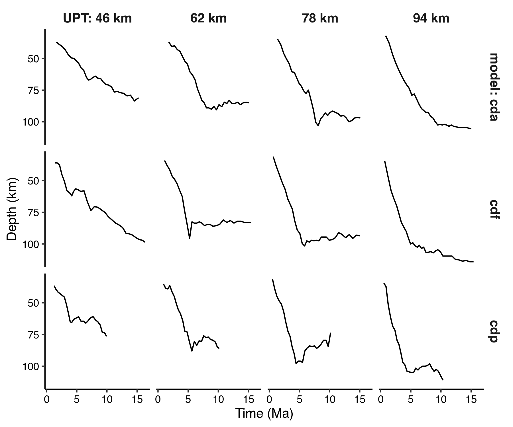

```

Numerical experiments in this chapter suggest a negative dynamic feedback regulating coupling and serpentine dehydration can help explain how similar configurations, in terms of depths to subducting plates beneath arcs [@england2004] and thin upper-plates [@currie2006], may occur in subduction zones with different thermo-kinematic boundary conditions and subduction durations. The results indicate that subduction zones quickly ($<$ 5 $Ma$) develop and stabilize quasi-permanent, generalized configurations with coupling depth dependent on upper-plate thickness.

Notable exceptions occur in models with the thinnest upper-plates ($Z_{UP}$ = 46 $km$). Rapid extension due to thin upper-plates form spreading centers in the upper-plate within 5 $Ma$. Passive asthenospheric upwelling near spreading centers diverts heat from deep within the upper-plate mantle. Enough heat is apparently diverted to disrupt thermal feedbacks regulating coupling and serpentine stability near the plate interface. In principle, diversion of heat from the plate interface could lead to cooler conditions, deeper serpentine stability, and thus deeper coupling. Further testing to confirm this behavior may artificially increase upper-plate strength in thin upper-plate thickness experiments to prevent high rates of spreading.

```{r cdfStep1, fig.cap='Visualizing model cdf with $Z_{UP}$ = 78 $km$ at 1.64 $Ma$. (a) Rock type. (b) Temperature. (c) Viscosity. (d) Streamlines. Early subduction is facilitated by the prescribed initial weak layer cutting the lithosphere. Strain is localized in the weak serpentine layer along the plate interface. The shallow upper-plate mantle is stagnant and loses heat to the subducting plate, promoting serpentine stabiliization to greater depths. Rock type colors are the same as Figure \\ref{fig:init}.', fig.scap='Results for model cdf with $Z_{UP}$ = 78 $km$ at 1.64 $Ma$'}

knitr::include_graphics('assets/figs/chpt2/figA2.png')

```

```{r cdfStep2, fig.cap='Visualizing model cdf with $Z_{UP}$ = 78 $km$ at 5.05 $Ma$. (a) Rock type. (b) Temperature. (c) Viscosity. (d) Streamlines. By 5 $Ma$ balance is achieved between cooling and heating in the shallow and deep upper-plate mantle, respectively. A feedback regulating heat transfer, serpentine destabilization, and mechanical coupling is already stabilizing coupling depth. Rock type colors are the same as Figure \\ref{fig:init}.', fig.scap='Results for model cdf with $Z_{UP}$ = 78 $km$ at 5.05 $Ma$'}

knitr::include_graphics('assets/figs/chpt2/figA3.png')

```

```{r cdfStep3, fig.cap='Visualizing standard model cdf with $Z_{UP}$ = 78 $km$ at 9.93 $Ma$. (a) Rock type. (b) Temperature. (c) Viscosity. (d) Streamlines. Geodynamics remain approximately constant from 5 $Ma$ (cf. Figure \\ref{fig:cdfStep2}). The system remains in steady state for as long water fluxes to the upper-plate mantle and serpentine is stable. Rock type colors are the same as Figure \\ref{fig:init}.', fig.scap='Results for model cdf with $Z_{UP}$ = 78 $km$ at 9.93 $Ma$'}

knitr::include_graphics('assets/figs/chpt2/figA4.png')

```

\clearpage

## Regression Summaries {#regSummary}

The form of the preferred quadratic regression model in Section \@ref(cdEstimators) (Figure \@ref(fig:results) & Table \@ref(tab:zcResults)) implies a lower limit to coupling depth of approximately 60 $km$, even for thin upper-plate thickness and, presumably, under warm conditions during nascent subduction. In principle, thin upper-plates could allow effective heat transfer in a flowing shallow asthenospheric mantle---hindering deep stabilization of serpentine. Olivine and pyroxene would be the stable mantle minerals, and strong, shallow coupling between plates would be expected @gerya2008. However, even the warmest numerical experiments (low-$\Phi$ & thin upper-plate thickness) in Chapter \@ref(chpt2) eventually stabilize serpentine in the shallow upper-plate mantle. This is evident by increasing depth of mechanical coupling with time for the first 5 $Ma$ of subduction (Figure \@ref(fig:antDepth)).

```{r results, fig.cap='Coupling depths ($Z_{cpl}$, grayscale) determined from numerical experiments. Model names are listed along the top axis and correspond to the range of thermal parameter $\\Phi$ values along the bottom axis. Note that the ($\\Phi$) axis is not linear. $Z_{cpl}$ increases systematically with increasing $Z_{UP}$ (change in grayscale down columns) for all models. Trends in $Z_{cpl}$ with respect to $\\Phi$ (change in grayscale across rows) are less apparent.', fig.scap='Coupling depths determined from numerical experiments'}

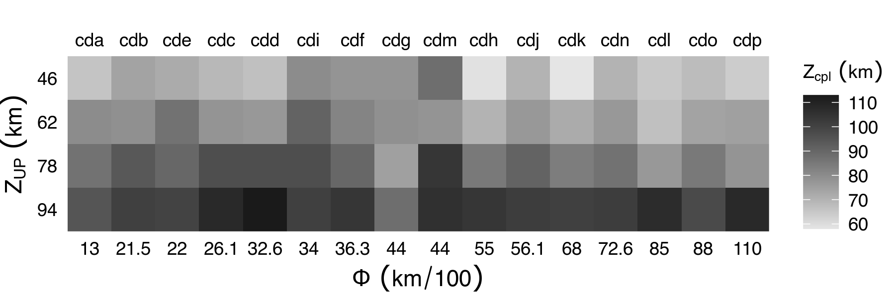

```

\begingroup
\renewcommand{\arraystretch}{0.5}

```{r zcResults}
d <- mods %>%
select(model, z1100, phi, zc) %>%
mutate('model' = model %>% stringr::str_extract('cd.'))
kable(
  d,
  col.names = c('Model', '$Z_{UP}$ $[km]$', '$\\Phi$ $[km/100]$', '$Z_{cpl}$ $[km]$'),
  caption = 'Coupling depth results',
  linesep = '',
  escape = F,
  booktabs = T,
  longtable = T,
  format = 'latex'
) %>%
kable_styling(latex_options = c('striped', 'repeat_header')) %>%
kable_classic()
```

\endgroup

Summary statistics for the regression models presented in Section \@ref(cdEstimators) are given in Tables \@ref(tab:anova) and \@ref(tab:regSummary).

```{r anova}
bvm.z1100.lin$anova %>%
select(-null.value, -term) %>%
mutate(
  'estimate' = round(estimate, 1),
  'conf.low' = round(conf.low, 1),
  'conf.high' = round(conf.high, 1),
  'adj.p.value' = scientific(adj.p.value, digits = 3)
) %>%
kbl(
  col.names = c('', '$[km]$', '$[km]$', '$[km]$', ''),
  booktabs = T,
  caption = 'Summary of ANOVA test',
  format = 'latex',
  escape = F
) %>%
row_spec(0, align = 'c') %>%
add_header_above(
  c('$Z_{UP}$ Groups', '$Z_{cpl}$ Estimate', 'Upper Bound', 'Lower Bound', 'p value'),
  escape = F,
  line = F
) %>%
kable_classic() %>%
kable_styling(latex_options = c('striped')) %>%
footnote(
  general_title = '',
  general = c('Pair-wise Tukey\'s test comparing means between groups. Estimates are differences between means. Null hypothesis is that means are not different'),
  threeparttable = T,
  escape = F
)
```

```{r regSummary}
map_df(list(
  bvm.phi.lin,
  bvm.z1100.lin,
  bvm.z1100.quad1,
  bvm.z1100.quad2,
  mvm.lin,
  mvm.quad1,
  mvm.quad2
  ),
  ~.x$model, .id = 'reg'
) %>%
select(-statistic) %>%
mutate(
  'estimate' = round(estimate, 1),
  'std.error' = round(std.error, 1),
  'p.value' = scientific(p.value, digits = 3),
  'term' = ifelse(
    term == 'phi',
    '$\\phi$',
    ifelse(term == 'z1100', '$Z_{UP}$', ifelse(term == 'z1100^2', '$Z_{UP}^2$', term))
  )
) %>%
kbl(
  col.names = c('Model', 'Term', 'Estimate', 'Std. Error', 'p value'),
  booktabs = T,
  caption = 'Summary of regression models',
  format = 'latex',
  escape = F
) %>%
kable_styling(latex_options = c('striped')) %>%
kable_classic() %>%
footnote(
  general_title = '',
  general = c('\\\\uline{\\\\textit{models}}: 1: $[z_c=\\\\phi]$, 2: $[z_c=Z_{UP}]$, 3: $[z_c=Z_{UP}^2]$, 4: $[z_c=Z_{UP}+Z_{UP}^2]$, 5: $[z_c=Z_{UP}+\\\\phi]$, 6: [$z_c=Z_{UP}^2+\\\\phi]$, 7: $[z_c=Z_{UP}+Z_{UP}^2+\\\\phi]$'),
  threeparttable = T,
  escape = F
)
```

```{r biv, fig.cap='Bivariate regressions. (a) Coupling depth ($Z_{cpl}$) vs. upper-plate thickness ($Z_{UP}$) shows $Z_{cpl}$ increasing approximately quadratically with increasing $Z_{UP}$. The correlation is highly significant (see Tables \\ref{tab:anova} and \\ref{tab:regSummary}) and explains more than 80\\% of the variance in $Z_{cpl}$. $Z_{UP}$ alone estimates $Z_{cpl}$ well. (b) $Z_{cpl}$ vs. thermal parameter ($\\Phi$) shows no significant correlation (no line fits with a slope significantly different from zero). $\\Phi$ has little effect on $Z_{cpl}$ and cannot be used as a standalone estimator.', fig.scap='Bivariate regressions of coupling results'}

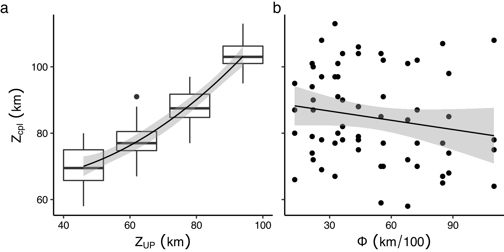

```

\clearpage

## (De)hydration Model {#deHydration}

The material properties used in the numerical experiments are listed in Table \@ref(tab:materials) and Table \@ref(tab:melts). For details about the sedimentation and erosion, melting and extraction, and rheological models, please refer to @sizova2010. Here we discuss only the hydrodynamic model, because it is the most relevant aspect of the numerical experiments.

Hydrodynamics in the numerical models control the timing and magnitude of mantle wedge hydration. The main sources of water delivered to the mantle are altered basaltic crust and seafloor sediments, which we assumed to contain up to 5 $wt.\% H_{2}O$. We assumed a gradual expulsion of water from pore space and through quasi-continuous dehydration reactions occurring within the slab. Water content is computed using the following equation:
\begin{equation}
  \chi_{H_{2}O} = \chi_{H_{2}O_{init}}\times\left(1-\frac{\Delta z}{150\times 10^{3}}\right)
\end{equation}
where $\chi_{H_{2}O_{init}}$ = 5 $wt.\%$ and $\Delta z$ is a marker's depth below the topographical surface.

If a rock marker dehydrates, an independent water particle is instantaneously generated at the same location with the respective $H_{2}O$ content. The new water particle is moved in accordance to the local velocity field, described by the following equation:
\begin{equation}
  \begin{aligned}
    \vec{v}_{\text{water}} & = (\vec{v}_x,\ \vec{v}_z) \\
    \vec{v}_z & = \vec{v}_z - \vec{v}_{z(\text{percolation})} \\
  \end{aligned}
\end{equation}
where $\vec{v}_{water}$ is the velocity vector of the water particle, $\vec{v}_{x}$ and $\vec{v}_{z}$ are the local velocity vectors of the solid state mantle or crust, and $\vec{v}_{z(percolation)}$ is a imposed constant upward percolation velocity (10 $cm/year$). We implicitly neglect kinetics of reactions, as material properties of markers change instantaneously at equilibrium reactions.

```{r melts}
readr::read_csv('assets/r/chpt2/melt_curves.csv', show_col_types = F) %>%
dplyr::rename(Material = material) %>%
dplyr::mutate(
  c = scientific(c),
  e = scientific(e),
  g = scientific(g),
  h = scientific(h)
) %>%
kable(
  caption = 'Melting curves used in numerical experiments',
  linesep = '',
  escape = F,
  booktabs = T,
  format = 'latex'
) %>%
kable_styling(latex_options = c('striped')) %>%
kable_classic() %>%
footnote(
  general_title = '',
  general = c(
    '\\\\uline{\\\\textit{solidus curve}}: $T(P)=[b+\\\\frac{c}{(P+d)}+\\\\frac{e}{(P+d)^2}]$ at $P<a$ and $[f+gP+hP^2]$ at $P\\\\geq a$',
    '\\\\uline{\\\\textit{liquidus curve}}: $T(P) = i+jP$ with $T$ in $[K]$ and $P$ in $[MPa]$',
    '\\\\uline{\\\\textit{reference}}: Schmidt \\\\& Poli (1998)'
  ),
  escape = F,
  threeparttable = T
) %>%
landscape()
```

## Rheologic Sensitivity Tests on Plate Coupling {#rheologicSensitivity}

Numerical modelling practitioners simulating subduction zones approach mechanical coupling between plates differently. A simple, but highly effective approach, is prescribing a layer of arbitrary strength extending from the surface to an arbitrary depth or temperature along the plate interface. This approach effectively inhibits transfer of shear stress between plates and is analogous to controlling a no-slip condition at the interface (plates move with the same velocity vector beyond the coupling point). Numerous models use this method [e.g., @peacock1996; @peacock1999b; @wada2009; @syracuse2010] in part because it allows fine-tuning to specific subduction zone configurations. Serpentine-or talc-rich horizons are typically invoked to justify implementing such a condition at shallow interface depths.

The experiments outlined in Section \@ref(numMethods) do not explicitly define coupling, but rather use a rheologic model that explicitly follows experimentally determined flow laws and mineral stability fields. This approach conceptually follows and extends petrologic explanations for a weak interface [@hyndman2003; @peacock1999a]. As a corollary, dehydration of serpentine, or possibly talc, at higher temperatures must strengthen the interface [@agard2016]. Noting that talc is unstable at P $>$ 2.0 $GPa$ in an ultramafic rock [@schmidt1998], a serpentine rheology is arguably the most relevant candidate responsible for a strength increase, and thus coupling, at \gls{pt} conditions inferred for coupling in active subduction zones [@wada2009; @syracuse2010].

Sensitivity tests of the rheologic model presented in Section \@ref(rheologicModel) were run using diverse experiments adjusting the rheology of serpentine (compared to Table \@ref(tab:materials)), the shape and position of the antigorite-out reaction (compared to \@ref(eq:antstab)), and certain hydrodynamic parameters. For brevity, these results are not presented here. The experiments included:

1. antigorite $\leftarrow$ wet olivine flow law
2. antigorite and wet olivine $\leftarrow$ dry olivine flow law
3. isothermal antigorite reaction at 690 $^{\circ}C$
4. antigorite reaction isothermal Clapeyron slope at 715 $^{\circ}C$
5. antigorite reaction with positive linear Clapeyron slope
6. linear release of $H_{2}O$ with depth
7. no fluid-induced weakening

Only experiments 5 and 7 listed above were inconsistent with the results presented Section \@ref(chpt2Results). Experiment 5 results in transient coupling depths and discontinuous antigorite stability in the upper-plate mantle, whereas experiment 7 results in two-sided subduction [e.g., @gerya2008]. These sensitivity experiments imply numerical coupling mechanisms are mostly contingent on fluid flux to the upper-plate mantle and the implementation of serpentine stability. The experiments also show coupling is relatively insensitive to the exact flow law parameters.

## Surface Heat Flow

Below is surface heat flow calculated at 2 $km$ beneath the topographic surface at approximately 10 $Ma$ for all numerical experiments presented in Chapter \@ref(chpt2).

```{r hf, fig.cap='Surface heat flow calculated at approximately 10 $Ma$ for all numerical experiments. Normalized distance is the distance from the left boundary to the trench, divided by the distance between the trench and arc. Grayscale corresponds to $\\Phi$. High amplitude fluctuations near the arc region (normalized distance = 1.0) correspond to vertical migration of fluids and melts. In the backarc region (normalized distance $\\geq$ 1.0), these fluctuations correspond to lithospheric extension. Backarc extension is most apparent for high-$\\Phi$ experiments (lighter gray lines). Experiments with no extension show a tight distribution of surface heat flow in the backarc region (darker gray lines).', fig.scap='Surface heat flow for all numerical experiments'}

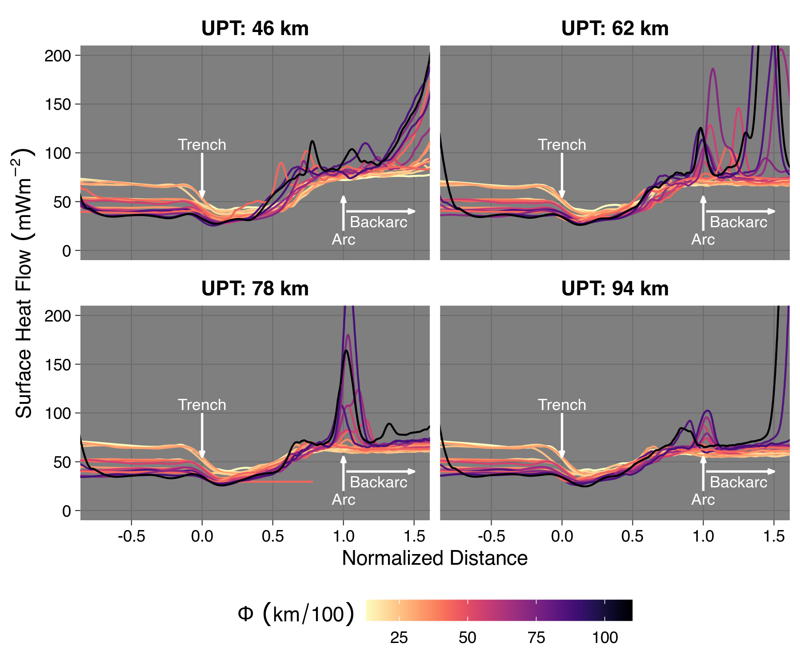

```

\cleardoublepage

\markboth{Appendix: Chapter 3}{Appendix: Chapter 3}

#

## Kriging System and Optimization {#krigeOpt}

### Ordinary Kriging

This study applies isotropic ordinary Kriging methods under the following general assumptions:

- $\hat{\gamma}(h)$ is directionally invariant (isotropic)
- $\hat{\gamma}(h)$ is evaluated in two-dimensions and neglects elevation
- The first and second moments of $Z(u)$ are assumed to follow the conditions:

\begin{equation}
  \begin{aligned}
    &E[Z(u)] = \hat{Z}(u) = constant \\
    &E[(Z(u + h) - \hat{Z}(u))(Z(u) - \hat{Z}(u))] = C(h)
  \end{aligned}
  (\#eq:krigeAssumptions)
\end{equation}
where $h$ is the lag distance, $C(h)$ is the covariance function, $E[Z(u)]$ is the expected value of the random variable $Z(u)$, and $\hat{Z}(u)$ is the arithmetic mean of $Z(u)$.

Equation \@ref(eq:krigeAssumptions) is known as "weak second-order stationarity". It assumes the underlying probability distribution of the observations $Z(u)$ does not change in space and the covariance $C(h)$ only depends on the distance $h$ between two observations. These assumptions are expected to be valid in cases where the underlying natural process is stochastic, spatially continuous, and has the property of additivity such that $\frac{1}{n}\sum_{i=1}^n Z(u_i)$ has the same meaning as $Z(u)$ [@bardossy1997].

The following are two illustrative cases where Equation \@ref(eq:krigeAssumptions) is likely valid:

> The thickness of a sedimentary unit with a homogeneous concentration of radioactive elements can be approximated by $q_s = q_b + \int A \,dz$, where $q_b$ is a constant heat flux entering the bottom of the layer and $A$ is the heat production within the layer with thickness $z$ [@furlong2013]. If one has two samples, $Z(u_1) = 31~mW/m^2$ and $Z(u_2) = 30.5~mW/m^2$, their corresponding thicknesses would be $Z'(u_1) = 1000~m$ and $Z'(u_2) = 500~m$ for $A = 0.001~mW/m^3$ and $q_b = 30~mW/m^2$. The variable, $Z(u)$, in this case is additive because the arithmetic mean of the samples is a good approximation of the average sedimentary layer thickness, $(Z(u_1) + Z(u_2)) / 2 = 750~m$.

> The age of young oceanic lithosphere can be approximated by $q_s(t) = kT_b(\pi\kappa t)^{-1/2}$, where $q_s(t)$ is surface heat flow of a plate with age, $t$, $T_b$ is the temperature at the base of the plate, $k$ is thermal conductivity, and $\kappa = k/\rho C_p$ is thermal diffusivity [@stein1992]. Using reasonable values for $k = 3.138~W/mK$, $\rho = 3330~kg/m^3$, $C_p = 1171~J/kgK$, $T_b = 1350^{\circ}C$, two samples, $Z(u_1) = 180~mW/m^2$ and $Z(u_2) = 190~mW/m^2$, would correspond to plates with ages of $Z'(u_1) = 10~Ma$, and $Z'(u_2) = 9~Ma$, respectively. Since $Z(u_1) + Z(u_2) / 2 = 185~mW/m^2$ and $Z'(185~mW/m^2) = 9.5~Ma = Z'(u_1) + Z'(u_2) / 2$, the variable $Z(u)$ in this case is also additive.

Equation \@ref(eq:krigeAssumptions) is likely invalid in regions that transition among two or more tectonic regimes, however. For example, the expected (mean) heat flow $E[Z(u)]$ will change when moving from a spreading center to a subduction zone and thus $E[Z(u)] \neq constant$ over the region of interest. In other words, stationarity is violated and Kriging estimates will become spurious.

The second step is fitting a variogram model $\gamma(h)$ to the experimental variogram. This study fits six popular variogram models with sills (or theoretical sills) to the experimental variogram. The models are defined as [@pebesma2004]:
\begin{equation}
  \begin{aligned}
    Bes &\leftarrow \gamma(h) = 1 - \frac{h}{a}\ K_1\left(\frac{h}{a}\right) \quad \text{for } \  h \geq 0 \\
    Cir &\leftarrow \gamma(h) =
    \begin{cases}
      \frac{2}{\pi}\frac{h}{a}\ \sqrt{1-\left(\frac{h}{a}\right)^2} + \frac{2}{\pi}\ arcsin\left(\frac{h}{a}\right) \quad \text{for } \  0 \leq h \leq a \\
      n + s \quad \text{for } \  h > a
    \end{cases} \\
    Exp &\leftarrow \gamma(h) = 1 - exp\left(\frac{-h}{a}\right) \quad \text{for } \  h \geq 0 \\
    Gau &\leftarrow \gamma(h) = 1 - exp\left(\left[\frac{-h}{a}\right]^2\right) \quad \text{for } \  h \geq 0 \\
    Lin &\leftarrow \gamma(h) =
    \begin{cases}
      \frac{h}{a} \quad \text{for } \  0 \leq h \leq a \\
      n + s \quad \text{for } \  h > a
    \end{cases} \\
    Sph &\leftarrow \gamma(h) =
    \begin{cases}
      \frac{3}{2}\frac{h}{a} - \frac{1}{2}\left(\frac{h}{a}\right)^3 \quad \text{for } \  0 \leq h \leq a \\
      n + s \quad \text{for } \  h > a
    \end{cases} \\
  \end{aligned}
  (\#eq:varMods)
\end{equation}
where $n$ is the nugget, $s$ is the sill, $a$ is the effective range, $K_1$ is a modified Bessel function. The models are Bessel, Circular, Exponential, Gaussian, Linear, and Spherical. For models without explicit sills (Bes, Exp, Gau), the effective range $a$ is the distance where the variogram reaches 95% of its maximum defined as 4$a$, 3$a$, and $\sqrt{3}a$ for Bes, Exp, and Gau, respectively [@graler2016; @pebesma2004]. The function `fit.variogram` in `gstat` is used to try all variogram models. The best model is selected by the minimum weighted least squares [@pebesma2004] error with weights proportional to the number of points in each lag divided by the squared lag distance $wt = N(h)_k/h_k^2)$.

Ordinary Kriging is used for interpolation, which estimates unknown observations $\hat{Z}(u)$ as a linear combination of all known observations [@bardossy1997]:
\begin{equation}
  \hat{Z}(u) = \sum_{i=1}^n \lambda_i Z(u_i)
  (\#eq:linEstimate)
\end{equation}

The conditions in Equation \@ref(eq:krigeAssumptions) set up a constrained minimization problem that can be solved with a system of linear equations. The expected value of $Z(u)$ is assumed to be the mean according to \@ref(eq:krigeAssumptions), so the weights must be:
\begin{equation}
  \begin{aligned}
    E[\hat{Z}(u)] &= \sum_{i=1}^n \lambda_i E[Z(u_i)] \\
    \sum_{i=1}^n \lambda_i &= 1
  \end{aligned}
  (\#eq:unbiased)
\end{equation}

This constraint is known as the unbiased condition, which states that the sum of the weights must equal one. However, there is an infinite set of real numbers one could use for the weights, $\lambda_i$. The goal is to find the set of weights in Equation \@ref(eq:linEstimate) that minimizes the estimation variance. This can be solved by minimizing the covariance function, $C(h)$ from Equation \@ref(eq:krigeAssumptions):
\begin{equation}
  \begin{aligned}
    & \sigma^2(u) = Var[Z(u) - \hat{Z}(u)] = \\
    & E\left[(Z(u) - \sum_{i=1}^n \lambda_i Z(u_i))^2\right] = \\
    & E\left[Z(u)^2 + \sum_{j=1}^n \sum_{i=1}^n \lambda_j \lambda_i Z(u_j)Z(u_i) - 2 \sum_{i=1}^n \lambda_i Z(u_i)Z(u)\right] = \\
    & C(0) + \sum_{j=1}^n \sum_{i=1}^n \lambda_j \lambda_i C(u_i - u_j) - 2 \sum_{i=1}^n \lambda_i C(u_i - u)
  \end{aligned}
  (\#eq:minVar)
\end{equation}

Minimizing Equation \@ref(eq:minVar) with respect to the unbiased condition (Equation \@ref(eq:unbiased)), yields the best linear unbiased estimator [BLUE, @bardossy1997] for Equation \@ref(eq:linEstimate) and together comprise the Kriging system of equations. The functions `krige` and `krige.cv` in `gstat` are used for surface heat flow interpolation and error estimation by k-fold cross-validation [@pebesma2004].

### Optimization with `nloptr` {#nloptr}

Achieving accurate Kriging results depends on one's choice of many Kriging parameters, $\Theta$. In this study, we investigate a set of parameters:
\begin{equation} 
  \Theta = \{model,\ n,\ c,\ n_{max},\ l\}
  (\#eq:params)
\end{equation}
where $model$ is one of the variogram models defined in Equation \@ref(eq:varMods), $n$ is the number of lags, $c$ is a lag cutoff proportionality constant, $n_{max}$ is the maximum point-pairs for local Kriging, and $l$ is a horizontal lag shift constant. The lag cutoff constant $c$ controls the maximum separation distance between pairs of points used to calculate the experimental variogram (i.e. the x-axis range or "width" of the experimental variogram). The horizontal lag shift constant $l$ removes the first few lags from being evaluated by effectively shifting all lags to the left proportionally by $l$. This is necessary to avoid negative ranges when fitting experimental variograms with anomalously high variances at small lag distances.

The goal is to find $\Theta$ such that the Kriging function $f(x_i;\ \Theta)$ gives the minimum error defined by a cost function $C(\Theta)$, which represents the overall goodness of fit of the interpolation. This study defines a cost function that simultaneously considers errors between the experimental variogram $\hat{\gamma}(h)$ and modelled variogram $\gamma(h)$, and between surface heat flow observations $Z(u_i)$ and Kriging estimates $\hat{Z}(u)$ [after @li2018]:
\begin{equation}
  \begin{aligned}
    C(\Theta) &= w_{vgrm}\ C_{vgrm}(\Theta) + w_{interp}\ C_{interp}(\Theta) \\
    &w_{vgrm} + w_{interp} = 1
  \end{aligned}
  (\#eq:cost)
\end{equation}
where $C_{vgrm}(\Theta)$ is the normalized \glsfirst{rmse} evaluated during variogram fitting and $C_{interp}(\Theta)$ is the normalized \gls{rmse} evaluated during Kriging. Weighted ordinary least squares is used to evaluate $C_{vgrm}(\Theta)$, whereas k-fold cross-validation is used to evaluate $C_{interp}(\Theta)$. K-fold splits the dataset $|Z(u_i)|$ into $k$ equal intervals, removes observations from an interval, and then estimates the removed observations by fitting a variogram model to data in the remaining $k-1$ intervals. This process is repeated over all $k$ intervals so that the whole dataset has been cross-validated. The final expression to minimize becomes:
\begin{equation}
  \begin{aligned}
    &C(\Theta) = \\
    &\frac{w_{vgrm}}{\sigma_{vgrm}}\ \left(\frac{1}{N(h)}\ \sum_{k=1}^{N}\ w(h_k)\ [\hat{\gamma}(h_k)-\gamma(h_k;\ \Theta)]^2\right)^{1/4} + \\
    &\frac{w_{interp}}{\sigma_{interp}}\ \left(\frac{1}{M}\ \sum_{i=1}^{M}\ [Z(u_i)-\hat{Z}(u_i;\ \Theta)]^2\right)^{1/2}
  \end{aligned}
  (\#eq:costExp)
\end{equation}
where $N(h)$ is the number of point-pairs used to evaluate the experimental variogram and $w(h_k) = N(h)_k/h_k^2$ are weights defining the importance of the $kth$ lag on the variogram model fit.  $Z(u_i)$ and $\hat{Z}(u_i;\ \Theta)$ are the observed and estimated values, respectively, and $M$ is the number of measurements in $|Z(u_i)|$. The \glspl{rmse} are normalized by dividing by $\sigma_{vgrm}$ and $\sigma_{interp}$, which represent the standard deviation of the experimental variogram $\hat{\gamma}(h)$ and surface heat flow observations $Z(u_i)$, respectively. The weights $w_{vgrm}$ and $w_{interp}$ were varied between 0 and 1 to test the effects on $C(\Theta)$. Preferred weights of $w_{vgrm}$ = $w_{interp}$ = 0.5 are selected to balance the effects of $C_{vgrm}(\Theta)$ and $C_{interp}(\Theta)$ on the cost function.

```{r nloptrBounds}
bounds<-
  tibble(
    cutoff.prop = c(1, 20),
    n.lags = c(15, 50),
    lag.start = c(1, 10),
    n.max = c(10, 50)
  ) %>%
  rename(
    'Lag cutoff (c)' = cutoff.prop,
    'Lag number (n)' = n.lags,
    'Lag shift (l)' = lag.start,
    'Max local pairs ($n_{max}$)' = n.max
  )
as_tibble(cbind(Parameter = names(bounds), t(bounds))) %>%
rename(Lower = V2, Upper = V3) %>%
kable(
  caption = 'Search bounds for nloptr minimization',
  linesep = '',
  escape = F,
  booktabs = T,
  format = 'latex'
) %>%
kable_styling(latex_options = c('striped')) %>%
kable_classic()
```

```{r vgrmSummaryPlot, fig.cap='Summary of optimized Kriging parameters. Cost does not correlate with Kriging parameters (with a possible exception of variogram sills), indicating the optimization procedure is successfully generalizeable across subduction zone segments.', fig.scap='Summary of optimized variogram models'}

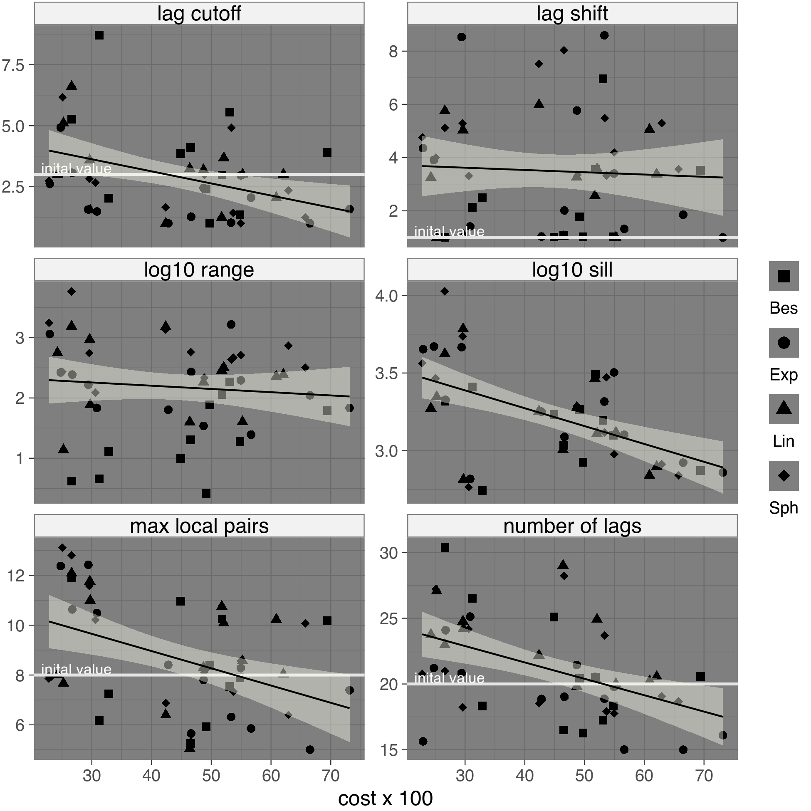

```

Minimization of $C(\Theta)$ is achieved by non-linear constrained optimization using algorithms defined in the `R` package `nloptr` [@ypma2014] with bounds in Table \@ref(tab:nloptrBounds). Both global and local search methods were applied with similar success. Please see [the official documentation](https://nlopt.readthedocs.io/en/latest/NLopt_Introduction/) for more information on `nloptr` and available optimization algorithms. The run used to produce the visualizations in Chapter \@ref(chpt3) uses the `NLOPT_LN_BOBYQA` option with 50 max iterations, leave-one-out cross-validation (k-fold $=$ the number of observations) in the evaluated segment, and cost function weights of $w_{vgrm}$ = $w_{interp}$ = 0.5 (Figure \@ref(fig:optTrace)). All data, code, and instructions to reproduce results in this chapter can be found at \url{https://github.com/buchanankerswell/kerswell_kohn_backarc}.

(ref:optTraceCap) Cost function minimization for Kriging interpolations presented in Chapter \@ref(chpt3). Most variogram models (panels) converge on a local optimum for most Kriging domains (lines) after 15-20 iterations. Each line represents one of thirteen subduction zone segments. Gaussian models are the least stable and produce spurious results. See text for bound constraints and other options.

```{r optTrace, fig.cap='(ref:optTraceCap)', fig.scap='Cost function minimization for Kriging interpolations'}

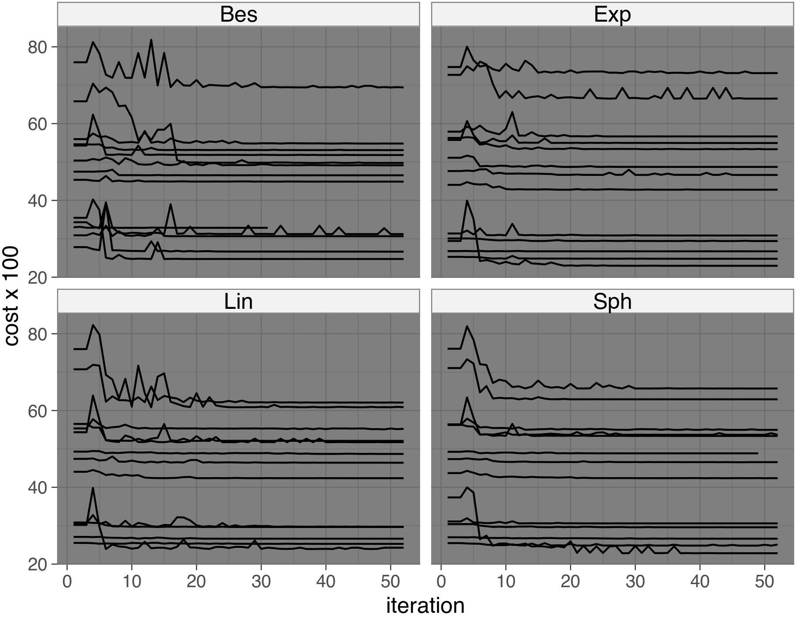

```

\clearpage

## ThermoGlobe Summary

(ref:hfSummaryPlotCap) Distribution of ThermoGlobe observations from @lucazeau2019 cropped within 1000 $km$-radius circular buffers around 13 active subduction zone segments. Heat flow distributions are centered between `r min(hf.summary$median)` and `r max(hf.summary$median)` $mWm^{-2}$ and highly right-skewed. Skewness represents near-surface perturbations from geothermal systems and tectonic regions with high thermal activity. Complex heat exchange between tectonic and near-surface processes is apparent from the broad, irregular surface heat flow distributions. Distributions are colored by quartiles (25%, 50%, 75%).

```{r hfSummaryPlot, fig.cap='(ref:hfSummaryPlotCap)', fig.scap='Distributions of ThermoGlobe observations near 13 active subduction zone segments'}

knitr::include_graphics('assets/figs/chpt3/hfSummary.png')

```

\clearpage

## Variogram Models {#vgrmModelsAppendix}

Below are all fitted variogram models for each subduction zone segment. Please refer to Table \@ref(tab:vgrmSummaryTableLong) for variogram parameters.

\begingroup
\renewcommand{\arraystretch}{0.5}

```{r vgrmSummaryTableLong}
v %>%
select(-c(cv.rmse, rmse)) %>%
mutate(
  'cutoff.prop' = round(cutoff.prop, 1),
  'n.lags' = round(n.lags, 1),
  'lag.start' = round(lag.start, 1),
  'n.max' = round(n.max, 1),
  'sill' = round(sill),
  'range' = round(range/1000),
  'cost' = round(cost, 3)
) %>% 
kable(
  col.names = c('Segment', 'Model', 'Cutoff', 'Lags', 'Shift', '$n_{max}$', 'Sill', 'Range', 'Cost'),
  caption = 'Optimum variogram models by segment',
  linesep = '',
  escape = F,
  booktabs = T,
  longtable = T,
  format = 'latex'
) %>%
kable_styling(full_width = F, latex_options = c('striped', 'repeat_header'), font_size = 11) %>%
kable_classic() %>%
footnote(
  general_title = '',
  general = c('\\\\uline{\\\\textit{key}}: $n_{max}$: max point-pairs, Sill $[(mWm^{-2})^2]$, Range $[km]$, Cost $[mWm^{-2}]$'),
  threeparttable = T,
  escape = F
)
```

\endgroup

```{r loopVgrms, results = "asis"}
walk(
  c(
    'Alaska Aleutians',
    'Andes',
    'Central America',
    'Kamchatka Marianas',
    'Kyushu Ryukyu',
    'Lesser Antilles',
    'N Philippines',
    'New Britain Solomon',
    'S Philippines',
    'Scotia',
    'Sumatra Banda Sea',
    'Tonga New Zealand',
    'Vanuatu'
  ), ~{
    cat(', 'Vgrms.png "Fitted variograms for ', .x, '")', '\n\n', sep = '')
})
```

\clearpage

## Interpolation Comparisons {#interpDiffAppendix}

Below are summaries and visualizations of all Similarity and Kriging interpolations not presented in the main text of Chapter \@ref(chpt3).

(ref:diffSummaryPlotCap) Differences between Similarity and Kriging interpolations by segment, computed as [Similarity$-$Krige]. Differences are centered near zero with medians ranging from `r min(interp.diff$median)` to `r max(interp.diff$median)` $mWm^{-2}$, but broadly distributed with interquartile ranges from `r min(interp.diff$IQR)` to `r max(interp.diff$IQR)` $mWm^{-2}$ and long tails extending from `r min(interp.diff$min)` to `r max(interp.diff$max)` $mWm^{-2}$. Positive medians and right skew indicate a general tendency towards higher surface heat flow predictions by Similarity compared to Kriging. The broadest distributions (Andes and Central America) reflect less subtle differences between methods. Distributions are colored by quartiles (25%, 50%, 75%). Similarity interpolation from @lucazeau2019.

```{r diffSummaryPlot, fig.cap='(ref:diffSummaryPlotCap)', fig.scap='Differences between Similarity and Kriging interpolations'}

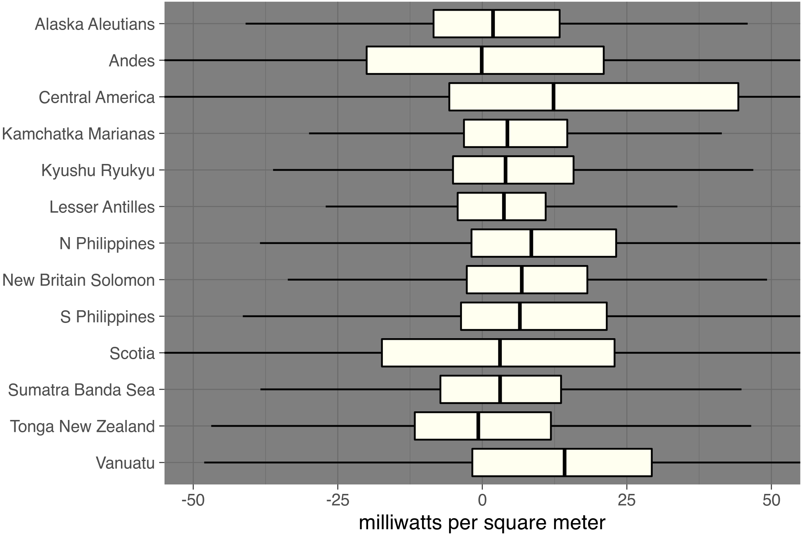

```

```{r sigmaDiffSummaryTable}
solns %>%
pmap_df(
  ~st_set_geometry(..6, NULL) %>%
  mutate(segment = ..1, v.mod = ..2, cost = ..7, .before = est.sim)
) %>%
group_by(segment, v.mod, cost) %>%
drop_na() %>%
summarise(
  min = round(min(sigma.diff, na.rm = T)),
  max = round(max(sigma.diff, na.rm = T)),
  median = round(median(sigma.diff, na.rm = T)),
  IQR = round(IQR(sigma.diff, na.rm = T)),
  mean = round(mean(sigma.diff, na.rm = T)),
  sigma = round(sd(sigma.diff, na.rm = T)),
  n = n(),
  .groups = 'drop'
) %>%
group_by(segment) %>%
filter(v.mod != 'Gau') %>%
slice_min(cost) %>%
relocate(cost, .after = n) %>%
mutate('cost' = round(cost, 3)) %>%
kable(
  col.names = c('Segment', 'Model', 'Min', 'Max', 'Median', 'IQR', 'Mean', '$\\sigma$', 'n', 'Cost'),
  caption = '[Similarity $-$ Krige] uncertainty differences by segment',
  linesep = '',
  escape = F,
  digits = 3,
  booktabs = T,
  format = 'latex'
) %>%
kable_styling(latex_options = c('striped', 'scale_down')) %>%
kable_classic() %>%
footnote(
  general_title = '',
  general = c('\\\\uline{\\\\textit{note}}: Showing optimal Krige models only, difference is calculated as [Similarity $-$ Krige]', '\\\\uline{\\\\textit{key}}: Cost: [$mWm^{-2}$], n: number of target locations (grid size), all other units are $mWm^{-2}$'),
  threeparttable = T,
  escape = F
)
```

(ref:sigmaDiffSummaryPlotCap) Summary of differences between Similarity and Kriging uncertainties. Note that differences are computed as [Similarity $-$ Krige]. Differences are centered at slightly negative values with median differences ranging from `r min(sigma.diff$median)` to `r max(sigma.diff$median)` $mWm^{-2}$, and broadly distributed with interquartile ranges from `r min(sigma.diff$IQR)` to `r max(sigma.diff$IQR)` $mWm^{-2}$ and long tails extending from `r min(sigma.diff$min)` to `r max(sigma.diff$max)` $mWm^{-2}$. Distributions are asymmetric and irregular, indicating regional differences in uncertainty across interpolation domains. Negative medians indicate greater uncertainties by Kriging compared to Similarity. Distributions are colored by quantiles (25%, 50%, 75%). Similarity data from @lucazeau2019. Please refer to Figure \@ref(fig:diffSummaryPlot) for estimate differences.

```{r sigmaDiffSummaryPlot, fig.cap='(ref:sigmaDiffSummaryPlotCap)', fig.scap='Summary of differences between Similarity and Kriging uncertainties'}

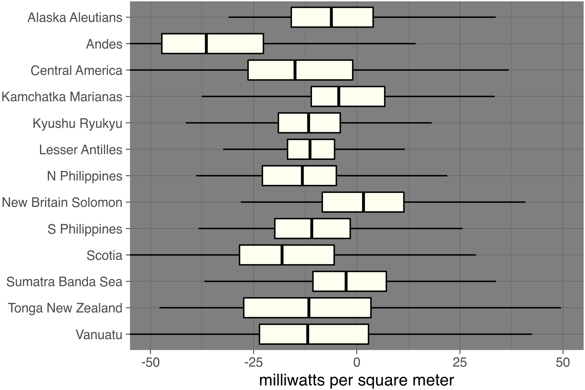

```

```{r alaskaAleutiansDiff, fig.cap='Similarity (a) and Kriging (b) interpolations for Alaska Aleutians. Please refer to the main text for explanation of panels and colors.', fig.scap='Similarityand Kriging interpolations for Alaska Aleutians'}

knitr::include_graphics('assets/figs/chpt3/AlaskaAleutiansDiffComp.png')

```

```{r andesDiff, fig.cap='Similarity (a) and Kriging (b) interpolations for Andes. Please refer to the main text for explanation of panels and colors.', fig.scap='Similarityand Kriging interpolations for Andes'}

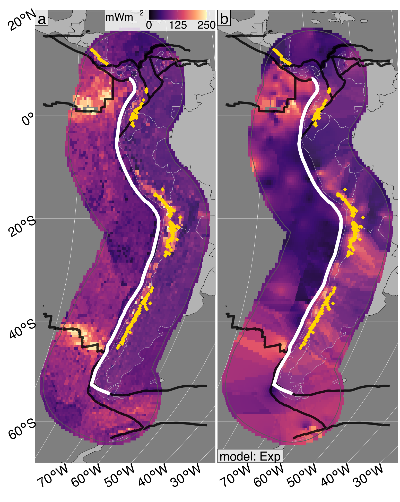

```

```{r kamchatkaMarianasDiff, fig.cap='Similarity (a) and Kriging (b) interpolations for Kamchatka Marianas. Please refer to the main text for explanation of panels and colors.', fig.scap='Similarityand Kriging interpolations for Kamchatka Marianas'}

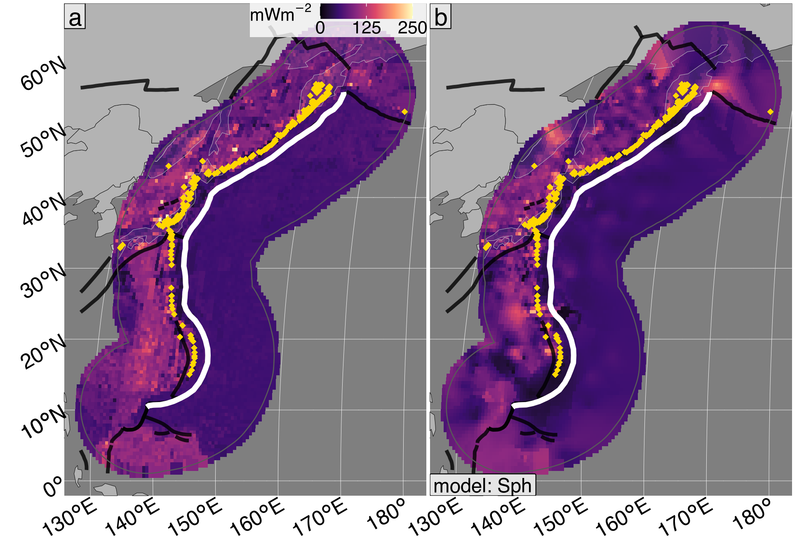

```

```{r lesserAntillesDiff, fig.cap='Similarity (a) and Kriging (b) interpolations for Lesser Antilles. Please refer to the main text for explanation of panels and colors.', fig.scap='Similarityand Kriging interpolations for Lesser Antilles'}

knitr::include_graphics('assets/figs/chpt3/LesserAntillesDiffComp.png')

```

```{r nPhilippinesDiff, fig.cap='Similarity (a) and Kriging (b) interpolations for N Philippines. Please refer to the main text for explanation of panels and colors.', fig.scap='Similarityand Kriging interpolations for N Philippines'}

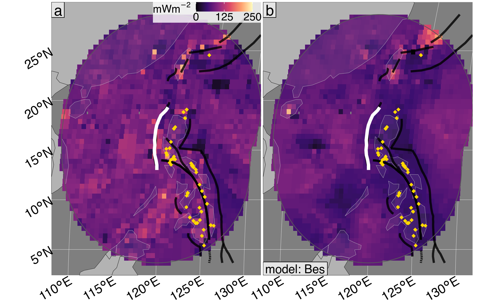

```

```{r newBritainSolomonDiff, fig.cap='Similarity (a) and Kriging (b) interpolations for New Britain Solomon. Please refer to the main text for explanation of panels and colors.', fig.scap='Similarityand Kriging interpolations for New Britain Solomon'}

knitr::include_graphics('assets/figs/chpt3/NewBritainSolomonDiffComp.png')

```

```{r sPhilippinesDiff, fig.cap='Similarity (a) and Kriging (b) interpolations for S Philippines. Please refer to the main text for explanation of panels and colors.', fig.scap='Similarityand Kriging interpolations for S Philippines'}

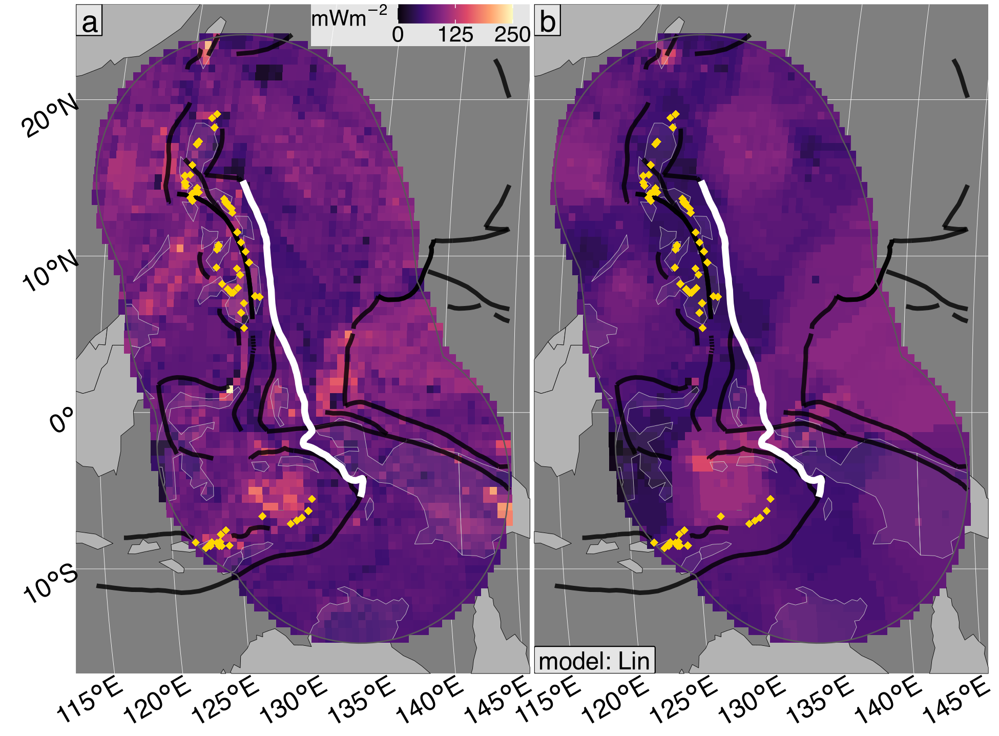

```

```{r sumatraBandaSeaDiff, fig.cap='Similarity (a) and Kriging (b) interpolations for Sumatra Banda Sea. Please refer to the main text for explanation of panels and colors.', fig.scap='Similarityand Kriging interpolations for Sumatra Banda Sea'}

knitr::include_graphics('assets/figs/chpt3/SumatraBandaSeaDiffComp.png')

```

```{r tongaNewZealandDiff, fig.cap='Similarity (a) and Kriging (b) interpolations for Tonga New Zealand. Please refer to the main text for explanation of panels and colors.', fig.scap='Similarityand Kriging interpolations for Tonga New Zealand'}

knitr::include_graphics('assets/figs/chpt3/TongaNewZealandDiffComp.png')

```

```{r vanuatuDiff, fig.cap='Similarity (a) and Kriging (b) interpolations for Vanuatu. Please refer to the main text for explanation of panels and colors.', fig.scap='Similarityand Kriging interpolations for Vanuatu'}

knitr::include_graphics('assets/figs/chpt3/VanuatuDiffComp.png')

```

\clearpage

## Upper-plate Surface Heat Flow {#lateralDiffAppendix}

Below are all upper-plate variability figures not presented in the main text of Chapter \@ref(chpt3).

```{r alaskaAleutiansUpper, fig.cap='Surface heat flow profiles for Alaska Aleutians upper-plate sectors. Please refer to the main text for explanation of panels and colors.', fig.scap='Surface heat flow profiles for Alaska Aleutians upper-plate sectors'}

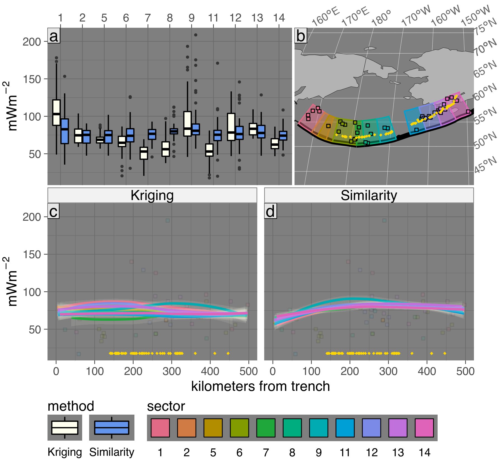

```

```{r andesUpper, fig.cap='Surface heat flow profiles for Andes upper-plate sectors. Please refer to the main text for explanation of panels and colors.', fig.scap='Surface heat flow profiles for Andes upper-plate sectors'}

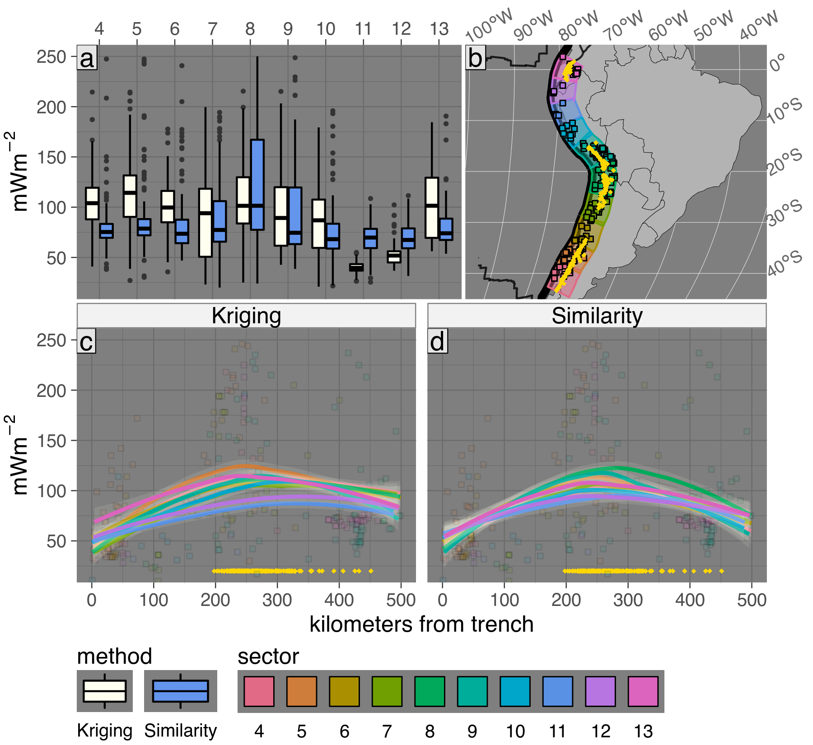

```

```{r kamchatkaMarianasUpper, fig.cap='Surface heat flow profiles for Kamchatka Marianas upper-plate sectors. Please refer to the main text for explanation of panels and colors.', fig.scap='Surface heat flow profiles for Kamchatka Marianas upper-plate sectors'}

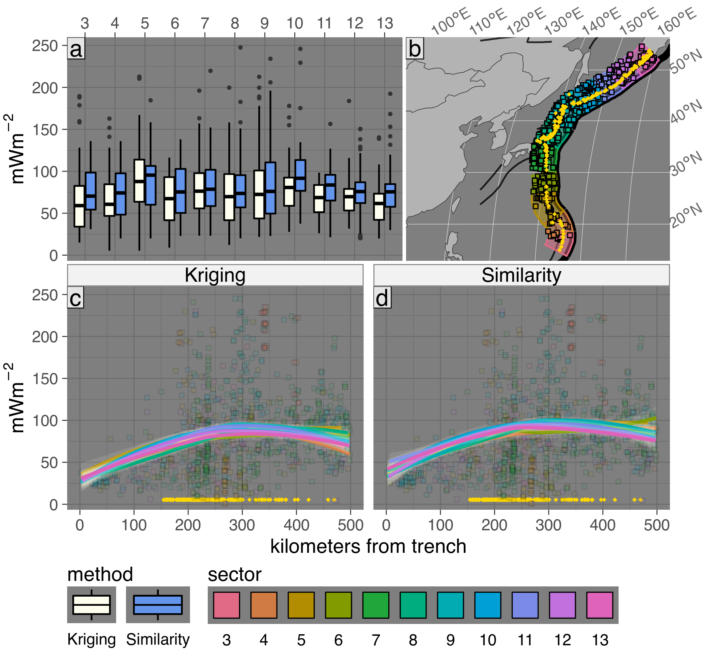

```

```{r kyushuRyukyuUpper, fig.cap='Surface heat flow profiles for Kyushu Ryukyu upper-plate sectors. Please refer to the main text for explanation of panels and colors.', fig.scap='Surface heat flow profiles for Kyushu Ryukyu upper-plate sectors'}

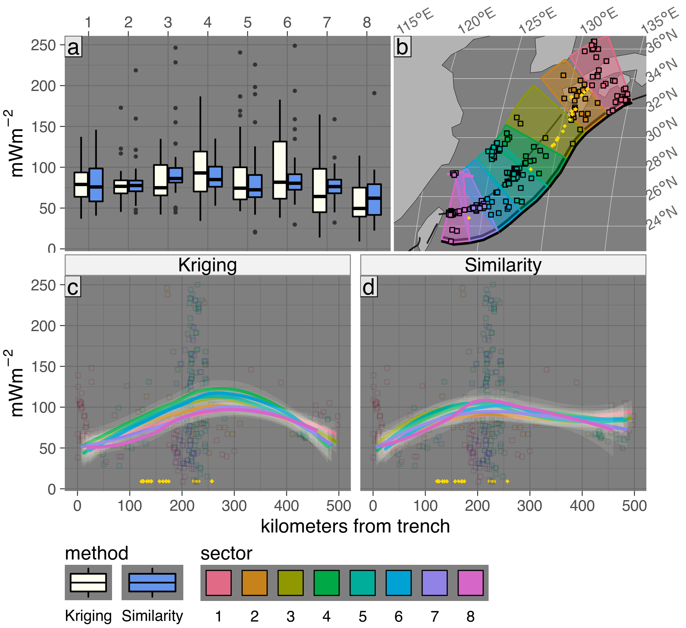

```

```{r lesserAntillesUpper, fig.cap='Surface heat flow profiles for Lesser Antilles upper-plate sectors. Please refer to the main text for explanation of panels and colors.', fig.scap='Surface heat flow profiles for Lesser Antilles upper-plate sectors'}

knitr::include_graphics('assets/figs/chpt3/LesserAntillesUpperPlate.png')

```

```{r nPhilippinesUpper, fig.cap='Surface heat flow profiles for N Philippines upper-plate sectors. Please refer to the main text for explanation of panels and colors.', fig.scap='Surface heat flow profiles for N Philippines upper-plate sectors'}

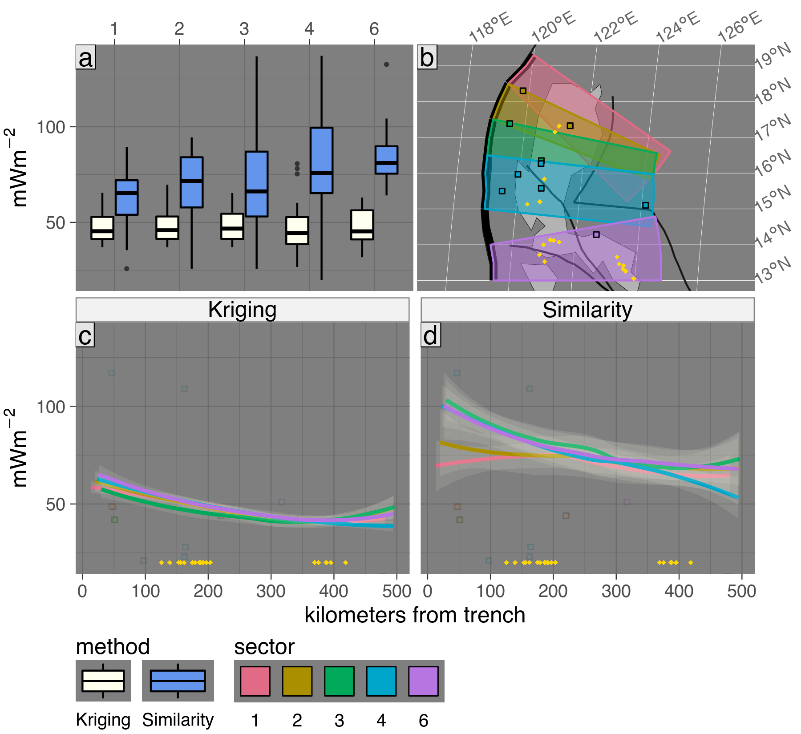

```

```{r newBritainSolomonUpper, fig.cap='Surface heat flow profiles for New Britain Solomon upper-plate sectors. Please refer to the main text for explanation of panels and colors.', fig.scap='Surface heat flow profiles for New Britain Solomon upper-plate sectors'}

knitr::include_graphics('assets/figs/chpt3/NewBritainSolomonUpperPlate.png')

```

```{r sPhilippinesUpper, fig.cap='Surface heat flow profiles for S Philippines upper-plate sectors. Please refer to the main text for explanation of panels and colors.', fig.scap='Surface heat flow profiles for S Philippines upper-plate sectors'}

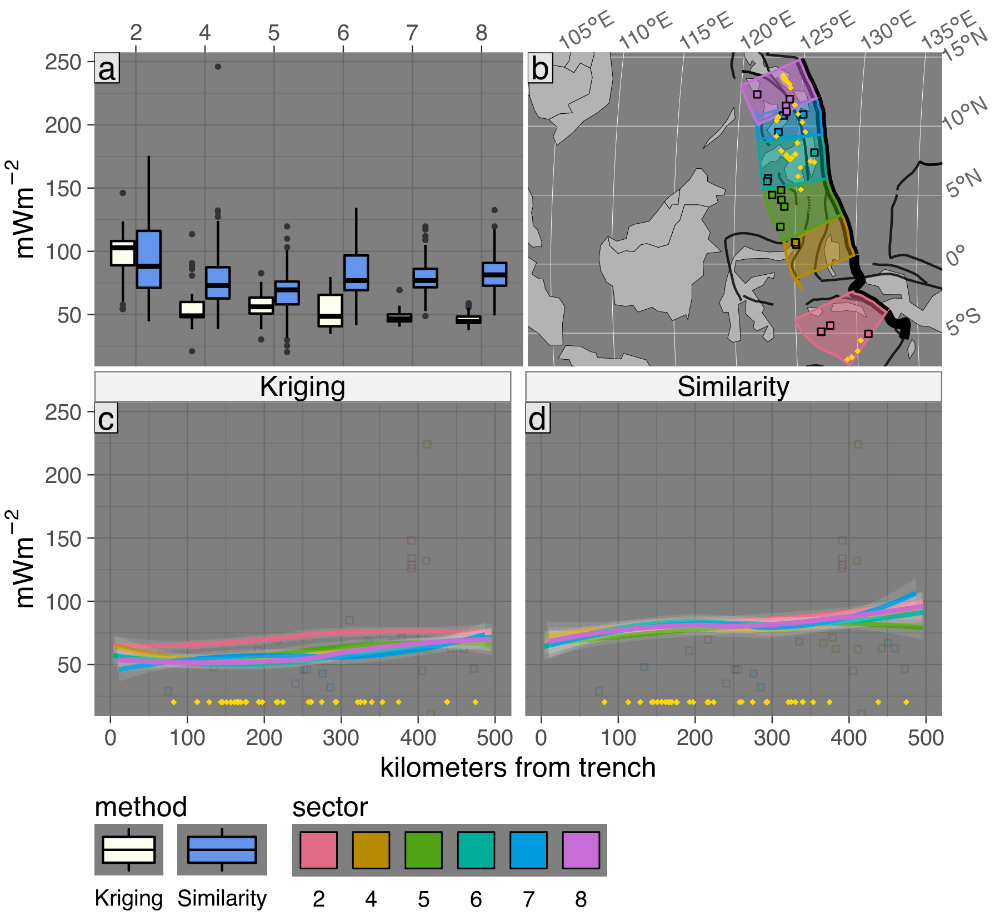

```

```{r scotiaUpper, fig.cap='Surface heat flow profiles for Scotia upper-plate sectors. Please refer to the main text for explanation of panels and colors.', fig.scap='Surface heat flow profiles for Scotia upper-plate sectors'}

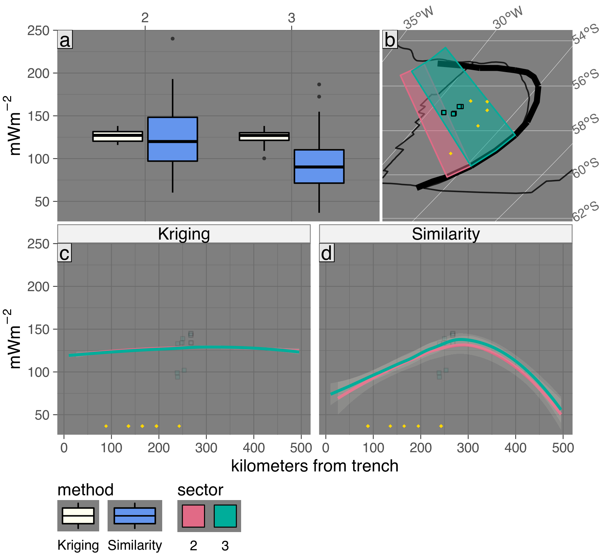

```

```{r tongaNewZealandUpper, fig.cap='Surface heat flow profiles for Tonga New Zealand upper-plate sectors. Please refer to the main text for explanation of panels and colors.', fig.scap='Surface heat flow profiles for Tonga New Zealand upper-plate sectors'}

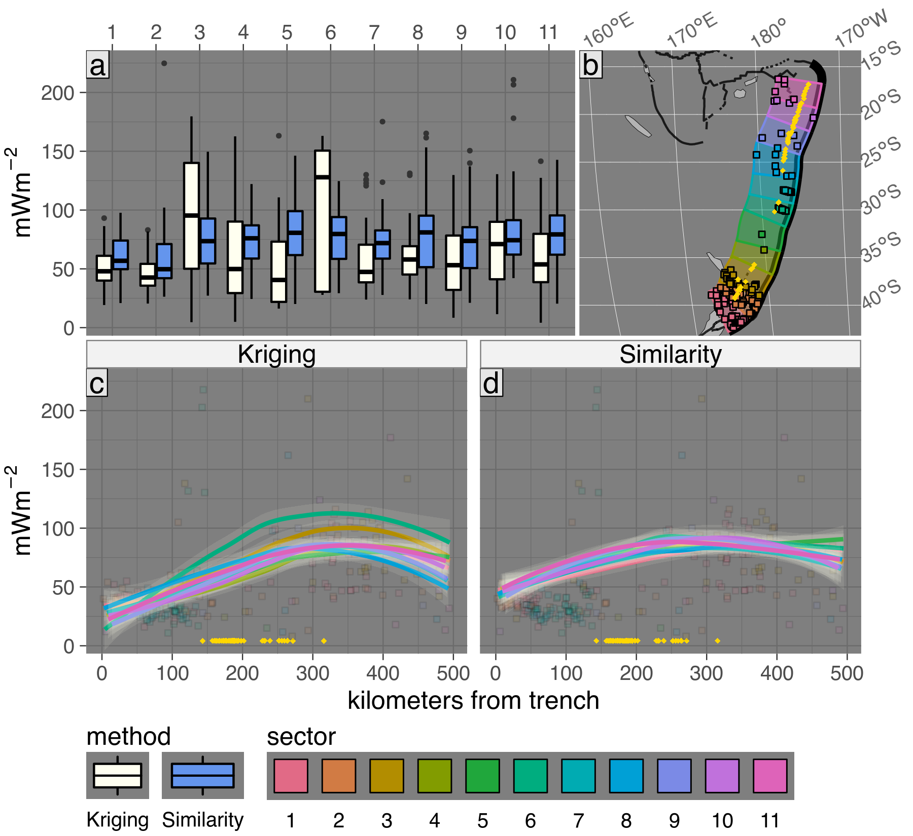

```

```{r vanuatuUpper, fig.cap='Surface heat flow profiles for Vanuatu upper-plate sectors. Please refer to the main text for explanation of panels and colors.', fig.scap='Surface heat flow profiles for Vanuatu upper-plate sectors'}

knitr::include_graphics('assets/figs/chpt3/VanuatuUpperPlate.png')

```

\cleardoublepage

\markboth{Appendix: Chapter 4}{Appendix: Chapter 4}

#

## Gaussian Mixture Models {#gmm}

Let the traced markers represent a $d$-dimensional array of $n$ random independent variables $x_i \in \mathbb{R}^{n \times d}$. Assume markers $x_i$ were drawn from $k$ discrete probability distributions with parameters $\Phi$. The probability distribution of markers $x_i$ can be modeled with a mixture of $k$ components:
\begin{equation}
  p(x_i | \Phi) = \sum_{j=1}^k \pi_j p(x_i | \Theta_j)
  (\#eq:gmix)
\end{equation}
where $p(x_i | \Theta_j)$ is the probability of $x_i$ under the $j^{th}$ mixture component and $\pi_j$ is the mixture proportion representing the probability that $x_i$ belongs to the $j^{th}$ component $(\pi_j \geq 0; \sum_{j=1}^k \pi_j = 1)$.

Assuming $\Theta_j$ describes a Gaussian probability distributions with mean $\mu_j$ and covariance $\Sigma_j$, Equation \@ref(eq:gmix) becomes:
\begin{equation}
  p(x_i | \Phi) = \sum_{j=1}^k \pi_j \mathcal{N}(x_i | \mu_j, \Sigma_j)
  (\#eq:mix)
\end{equation}
where
\begin{equation}
  \mathcal{N}(x_i | \mu_j, \Sigma_j) = \frac{exp\{ -\frac{1}{2}(x_i - \mu_j)(x_i - \mu_j)^T \Sigma_j^{-1}\}}{\sqrt{det(2 \pi \Sigma_j)}}
  (\#eq:gauss)
\end{equation}

The parameters $\mu_j$ and $\Sigma_j$, representing the center and shape of each cluster, are estimated by maximizing the log of the likelihood function, $L(x_i | \Phi) = \prod_{i=1}^n p(x_i | \Phi)$:
\begin{equation}
  log~L(x_i | \Phi) = log \prod_{i=1}^n p(x_i | \Phi) = \sum_{i=1}^n log \left[ \sum_{j=1}^k \pi_j p(x_i | \Theta_j) \right]
  (\#eq:loglik)
\end{equation}

Taking the derivative of Equation \@ref(eq:loglik) with respect to each parameter, $\pi$, $\mu$, $\Sigma$, setting the equation to zero, and solving for each parameter gives the maximum likelihood estimators:
\begin{equation}
  \begin{aligned}
    N_j &= \sum_{i=1}^n \omega_{i} \\
    \pi_j &= \frac{N_j}{n} \\
    \mu_j &= \frac{1}{N_j} \sum_{i=1}^n \omega_{i} x_i \\
    \Sigma_j &= \frac{1}{N_j} \sum_{i=1}^n \omega_{i} (x_i - \mu_j)(x_i - \mu_j)^T
  \end{aligned}
  (\#eq:mle)
\end{equation}
where $\omega_{i}$ ($\omega_{i} \geq 0; \sum_{j=1}^k \omega_{i} = 1$) are membership weights representing the probability of an observation $x_i$ belonging to the $j^{th}$ Gaussian and $N_j$ represents the number of observations belonging to the $j^{th}$ Gaussian. Please note that $\omega_{i}$ is unknown for markers so maximum likelihood estimator cannot be computed with Equation \@ref(eq:mle). The solution to this problem is the Expectation-Maximization algorithm, which is defined below.

General purpose functions in the `R` package `Mclust` [@scrucca2016] are used to fit Gaussian mixture models. "Fitting" refers to adjusting all $k$ Gaussian parameters $\mu_j$ and $\Sigma_j$ until the data and Gaussian ellipsoids achieve maximum likelihood defined by Equation \@ref(eq:loglik). After @banfield1993, covariance matrices $\Sigma$ in `Mclust` are parameterized to be flexible in their shape, volume, and orientation [@scrucca2016]:
\begin{equation}
  \Sigma_j = \lambda_j D_j A_j D_j^T
  (\#eq:eigen)
\end{equation}
where $D_j$ is the orthogonal eigenvector matrix, $A_j$ and $\lambda_j$ are diagonal matrices of values proportional to the eigenvalues. This implementation allows fixing one, two, or three geometric elements of the covariance matrices. That is, the volume $\lambda_j$, shape $A_j$, and orientation $D_j$ of Gaussian clusters can change or be fixed among all $k$ clusters [e.g., @celeux1995; @fraley2002]. Fourteen parameterizations of Equation \@ref(eq:eigen) are tried, representing different geometric combinations of the covariance matrices $\Sigma$ [see @scrucca2016] and the Bayesian information criterion is computed [@schwarz1978]. The parameterization for Equation \@ref(eq:eigen) is chosen by Bayesian information criterion.

## Expectation-Maximization

The Expectation-Maximization algorithm estimates Gaussian mixture model parameters by initializing $k$ Gaussians with parameters $(\pi_j, \mu_j, \Sigma_j)$, then iteratively computing membership weights with Equation \@ref(eq:posterior) and updating Gaussian parameters with Equation \@ref(eq:mle) until reaching a convergence threshold [@dempster1977].

The *expectation* (E-)step involves a "latent" multinomial variable $z_{i} \in \{1, 2, \dots, k\}$ representing the unknown classifications of $x_i$ with a joint distribution $p(x_i,z_{i}) = p(x_i | z_{i})p(z_{j})$. Membership weights $\omega_{i}$ are equivalent to the conditional probability $p(z_{i} | x_i)$, which represents the probability of observation $x_i$ belonging to the $j^{th}$ Gaussian. Given initial guesses for Gaussian parameters $\pi_j$, $\mu_j$, $\Sigma_j$, membership weights are computed using Bayes Theorem (E-step):
\begin{equation}
  p(z_{i} | x_i) = \frac{p(x_i | z_{i})p(z_{j})}{p(x_i)} = \frac{\pi_j \mathcal{N}(\mu_j, \Sigma_j)}{\sum_{j=1}^k \pi_j \mathcal{N}(\mu_j, \Sigma_j)} = \omega_{i}
  (\#eq:posterior)
\end{equation}
and Gaussian estimates are updated during the *maximization* (M-)step by applying $\omega_{i}$ to Equation \@ref(eq:mle). This step gives markers $x_i$ class labels $z_i \in \{1, \dots, k\}$ representing assignment to one of $k$ clusters (Figure \@ref(fig:class)).

## Thermal Parameter Effects

(ref:phiDensityCap) Marker PT distribution by thermal parameter $\Phi$. Changing patterns to the probability density of recovered markers (filled gray contours) with respect to thermal parameter appear non-systematic. A general change in morphology towards flatter, more segregated bimodal distributions is observed with increasing thermal parameter. The more continuous distributions for $\Phi$ of 13, 22, 34, and 44 stand out because these models correspond to the slowest-converging simulations (see Figure \@ref(fig:recRate)).

```{r phiDensity, fig.cap='', fig.scap='Marker PT distribution by thermal parameter $\\Phi$'}

include_graphics('assets/figs/chpt4/phiDensity.png')

```

\cleardoublepage

## Marker Classifications {#vis}

The following pages contain visualizations of marker classifications, marker PT distributions, and summary geodynamic snapshots for all 64 subduction zone simulations presented in Chapter \@ref(chpt4). All data and visualizations are available online at \url{https://github.com/buchanankerswell/kerswell_et_al_marx}.

<!--
```{r loopClass, results = "asis"}
walk(models, ~{
    cat('', '\n\n', sep = '')
    cat('', '\n\n', sep = '')
    cat('', '\n\n', sep = '')
    cat('\\clearpage')
})
```
-->
